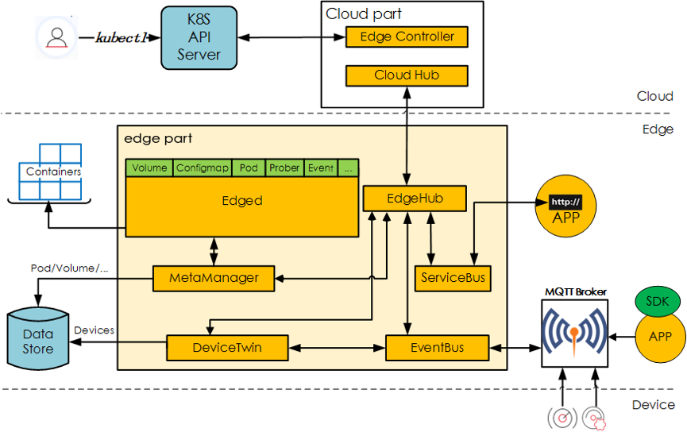

# [KubeEdge](https://github.com/kubeedge/kubeedge)

> 将容器化应用程序编排功能扩展到Edge的主机。(CNCF incubating project.)

## 架构

云端、边缘和设备层。

### 云端进程

- cloudhub部署在云端，接收edgehub同步到云端的信息；

- edgecontroller部署在云端，用于控制Kubernetes API Server与边缘的节点、应用和配置的状态同步。

Kubernetes maser运行在云端，用户可以直接通过kubectl命令行在云端管理边缘节点、设备和应用，使用习惯与Kubernetes原生的完全一致，无需重新适应。

### 边缘进程

- edged是个重新开发的轻量化Kubelet，实现Pod，Volume，Node等Kubernetes资源对象的生命周期管理；

- metamanager负责本地元数据的持久化，是边缘节点自治能力的关键；

- edgehub是多路复用的消息通道，提供可靠和高效的云边信息同步；

- devicetwin用于抽象物理设备并在云端生成一个设备状态的映射；

- eventbus订阅来自于MQTT Broker的设备数据。

## 功能

### 云边协同

- KubeEdge通过Kubernetes标准API在云端管理边缘节点、设备和工作负载的增删改查；

- 边缘节点的系统升级和应用程序更新都可以直接从云端下发，提升边缘的运维效率；
- KubeEdge底层优化的多路复用消息通道相对于Kubernetes基于HTTP长连接的list/watch机制扩展性更好，允许海量边缘节点和设备的接入；

### 边缘节点离线自治

- 边缘节点需要在完全断开连接的模式下自主工作，并不会定期进行状态同步，只有在重连时才会与控制面通信；

- KubeEdge通过消息总线和元数据本地存储实现了节点的离线自治。用户期望的控制面配置和设备实时状态更新都通过消息同步到本地存储，这样节点在离线情况下即使重启也不会丢失管理元数据，并保持对本节点设备和应用的管理能力。

### 设备管理

- 可插拔式的设备统一管理框架，允许用户在此框架上根据不同的协议或实际需求开发设备接入驱动
  - 目前支持的协议有：MQTT，BlueTooth，OPC UA，Modbus

- 通过device twins/digital twins实现设备状态的更新和同步，并在云端提供Kubernetes的扩展API抽象设备对象，用户可以在云端使用kubectl操作Kubernetes资源对象的方式管理边缘设备

## [与K3s对比](https://zhuanlan.zhihu.com/p/61940924)

> K3S专为在资源有限的环境中运行Kubernetes的研发和运维人员设计，目的是在x86、ARM64和ARMv7D架构的边缘节点上运行小型的Kubernetes集群。

对 K8s 的修改：

- 删除旧的、非必须的代码，以及非默认的Admission Controller，in-tree的cloud provider和存储插件；
- 引入**SQLite代替etcd作为管理面数据存储**，并用SQLite实现了list/watch接口，即Tunnel Proxy；
- 整合打包进程，将原本以多进程方式运行的Kubernetes管理面和数据面的多个进程分别合并成一个来运行；
- 使用containderd替换Docker，显著减少运行时占用空间；

K3S的所有**组件（包括Server和Agent）都运行在边缘**，因此**不涉及云边协同**。

如果K3S要落到生产，在K3S之上应该还有一个**集群管理方案负责跨集群的应用管理、监控、告警、日志、安全和策略**等，遗憾的是Rancher尚未开源这部分能力。