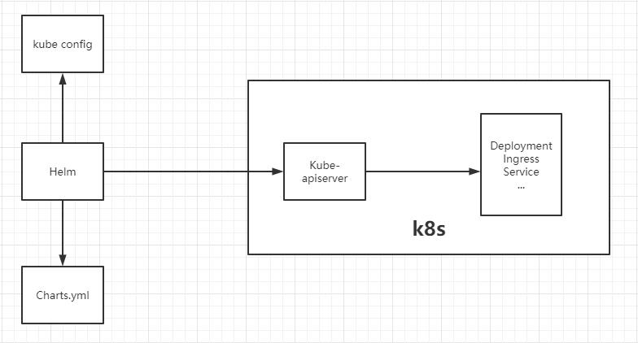

# Helm

> **The package manager for Kubernetes**.
>
> Helm Charts help you define, install, and upgrade even the most complex Kubernetes application.

## 概念



简化Kubernetes应用的部署和管理，等价于CentOS的yum；

- **Chart**: 是Helm管理的安装包，里面包含需要部署的安装包资源。可以把Chart比作CentOS yum使用的rpm文件。每个Chart包含下面两部分：
  - **包的基本描述文件Chart.yaml**
  - 放在**templates目录**中的一个或多个**Kubernetes manifest文件模板**
- **Release**：是chart的部署实例，一个chart在一个Kubernetes集群上可以有多个release，即这个chart可以被安装多次；
- **Repository：chart**的仓库，用于发布和存储chart

v3 版本仅有客户端 ***helm*** ：

- helm是一个命令行工具，可在本地运行，一般运行在CI/CD Server上。

***templates*** 目录

- Kubernetes 资源的配置模板，Helm 会将 `values.yaml` 中的参数值注入到模板中生成标准的 YAML 配置文件


## 组成

### Chart模板

参考 https://helm.sh/docs/chart_template_guide/

```shell
$ helm create nginx
$ tree .
.
├── charts
├── Chart.yaml
├── templates
│   ├── deployment.yaml
│   ├── _helpers.tpl
│   ├── hpa.yaml
│   ├── ingress.yaml
│   ├── NOTES.txt
│   ├── serviceaccount.yaml
│   ├── service.yaml
│   └── tests
│       └── test-connection.yaml
└── values.yaml

3 directories, 10 files
```


### 资源安装顺序

Helm installs resources in the following order:

- Namespace
- NetworkPolicy
- ResourceQuota
- LimitRange
- PodSecurityPolicy
- PodDisruptionBudget
- ServiceAccount
- Secret
- SecretList
- ConfigMap
- StorageClass
- PersistentVolume
- PersistentVolumeClaim
- CustomResourceDefinition
- ClusterRole
- ClusterRoleList
- ClusterRoleBinding
- ClusterRoleBindingList
- Role
- RoleList
- RoleBinding
- RoleBindingList
- Service
- DaemonSet
- Pod
- ReplicationController
- ReplicaSet
- Deployment
- HorizontalPodAutoscaler
- StatefulSet
- Job
- CronJob
- Ingress
- APIService


## 原理

### 升级Patch

**Helm 3 three-way 合并策略**

考虑 old manifest，live state 和 new manifest 三者，生成 patch。

- **如果 manifest 前后不变，helm 3 会将新的 mainfest 覆盖，此时外部的改动会丢失**；

可以通过 lookup 函数，将原先的配置查出来作为配置内容，如下所示

```yaml
apiVersion: v1
kind: ConfigMap
metadata:
  name: upgrade-test
  namespace: default
data:
  content: |
# 查找 config map 的当前内容，并应用  
{{ (lookup "v1" "ConfigMap" "default"  "upgrade-test").data.content | indent 4 }}

```


## 安装

官方针对多种平台有[预编译好的安装包](https://github.com/helm/helm/releases)：

```shell
$ tar -zxvf helm-v3.2.1-linux-amd64.tar.gz
$ cp linux-amd64/helm /usr/local/bin/
$ helm version
#　version.BuildInfo{Version:"v3.2.1", GitCommit:"fe51cd1e31e6a202cba7dead9552a6d418ded79a", GitTreeState:"clean", GoVersion:"go1.13.10"}
```


## 配置

配置国内Chart仓库

- 微软仓库（http://mirror.azure.cn/kubernetes/charts/）
- 阿里云仓库（https://kubernetes.oss-cn-hangzhou.aliyuncs.com/charts ）
- 官方仓库（https://hub.kubeapps.com/charts/incubator）

```shell
$ helm repo add stable http://mirror.azure.cn/kubernetes/charts
$ helm repo add aliyun https://kubernetes.oss-cn-hangzhou.aliyuncs.com/charts 
$ helm repo update
# 删除存储库
$ helm repo remove aliyun
```


## 命令

### search

- `helm search repo mysql` ：搜索charts

### install

- `helm install aliyun aliyun/mysql`：安装chart

### 覆盖默认值

```bash
$ echo '{mariadb.auth.database: user0db, mariadb.auth.username: user0}' > values.yaml
$ helm install -f values.yaml bitnami/wordpress --generate-name
```

### status

- `helm status happy-panda`：查看状态

### show

- `helm show values bitnami/wordpress `：查看默认的配置值；

### create

- ``：创建应用模板

### lint

- `helm lint promocouponsvc/`
  - 会检测 chart 的语法，报告错误以及给出建议；

### package

- `helm package promocouponsvc/`
  - 打包后生成一个 tgz文件


## 语法

### lookup Function


```yaml
data:
  content: |
# 查找 config map 的当前内容，并应用  
{{ (lookup "v1" "ConfigMap" "default"  "upgrade-test").data.content | indent 4 }}

```

### 'include' Function

> template is an action，无法将输出通过管道给其它操作，可以完全使用 include 而不是 template.
>
> 返回是个被渲染的字符串，即使`mytpl`定义的时候是 bool，也会被转为字符串。

```yaml
# includes a template called mytpl, then lowercases the result, then wraps that in double quotes.
value: {{ include "mytpl" . | lower | quote }}
```

### ‘required' Function

```yaml
# required function declares an entry for .Values.who is required, and will print an error message when that entry is missing
value: {{ required "A valid .Values.who entry required!" .Values.who }}
```

### 'tpl' Function

**evaluate strings as templates inside a template**

```yaml
# values
template: "{{ .Values.name }}"
name: "Tom"

# template
{{ tpl .Values.template . }}

# output
Tom
```


#### 控制结构

#### if/else 

创建条件块，结束用end

```yaml
# -代表删除空格，前面的删除前面的空格
{{- if values.drink "ccc" }}
{{- end }}
```

#### range

