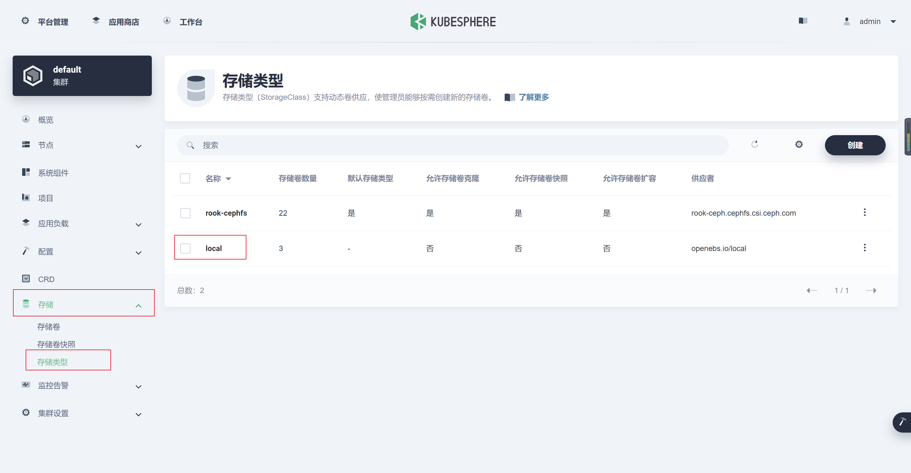

# 基于K8S的Rook-Ceph搭建

> [Rook](https://rook.io/): CNCF Open-Source, Cloud-Native Storage for Kubernetes.
>
> TODO: 更新版本和内容。

# 1. 先决条件

## 1.1 K8S集群

| 主机    | IP           | 角色                 | version  | 磁盘(裸盘,建议最少三块,构建三副本) |
| ------- | ------------ | -------------------- | -------- | ---------------------------------- |
| node131 | 172.16.2.131 | control-plane,master | v1.20.10 | /                                  |
| node132 | 172.16.2.132 | woker                | v1.20.10 | sda                                |
| node133 | 172.16.2.133 | woker                | v1.20.10 | sda                                |
| node134 | 172.16.2.134 | woker                | v1.20.10 | sda                                |

## 1.2 Rook v1.8.1对应ceph版本号

```bash
[rook@rook-ceph-tools-74bb778c5-qf8f8 /]$ ceph versions
{
    "mon": {
        "ceph version 16.2.7 (dd0603118f56ab514f133c8d2e3adfc983942503) pacific (stable)": 3
    },
    "mgr": {
        "ceph version 16.2.7 (dd0603118f56ab514f133c8d2e3adfc983942503) pacific (stable)": 1
    },
    "osd": {
        "ceph version 16.2.7 (dd0603118f56ab514f133c8d2e3adfc983942503) pacific (stable)": 1
    },
    "mds": {
        "ceph version 16.2.7 (dd0603118f56ab514f133c8d2e3adfc983942503) pacific (stable)": 2
    },
    "overall": {
        "ceph version 16.2.7 (dd0603118f56ab514f133c8d2e3adfc983942503) pacific (stable)": 7
    }
}
```

# 2. 安装

## 2.1 拉取项目,并进入ceph配置目录

```bash
git clone --single-branch --branch v1.8.1 https://github.com/rook/rook.git

cd rook/deploy/examples
```

## 2.2 配置operator.yaml的镜像源

- 由于国内环境无法Pull官方镜像，所以要修改默认镜像地址，改为阿里云镜像仓库
  - `registry.aliyuncs.com/it00021hot`是网友的镜像地址，利用github action每天定时同步官方镜像，所有版本的镜像都有


```yaml
  ROOK_CSI_CEPH_IMAGE: "registry.aliyuncs.com/it00021hot/cephcsi:v3.4.0"
  ROOK_CSI_REGISTRAR_IMAGE: "registry.aliyuncs.com/it00021hot/csi-node-driver-registrar:v2.3.0"
  ROOK_CSI_RESIZER_IMAGE: "registry.aliyuncs.com/it00021hot/csi-resizer:v1.3.0"
  ROOK_CSI_PROVISIONER_IMAGE: "registry.aliyuncs.com/it00021hot/csi-provisioner:v3.0.0"
  ROOK_CSI_SNAPSHOTTER_IMAGE: "registry.aliyuncs.com/it00021hot/csi-snapshotter:v4.2.0"
  ROOK_CSI_ATTACHER_IMAGE: "registry.aliyuncs.com/it00021hot/csi-attacher:v3.3.0"
```

## 2.3 部署operator

```bash
kubectl create -f crds.yaml -f common.yaml -f operator.yaml
```

## 2.4 给OSD节点打标签

设置存储节点，即ceph只部署在对应的打标签的节点上

```bash
kubectl label nodes node132 ceph-osd=enabled
kubectl label nodes node133 ceph-osd=enabled
kubectl label nodes node134 ceph-osd=enabled

kubectl get node --show-labels
```

## 2.5 配置cluser

- `vim cluster.yaml`
  - 开启`provider: host`；
  - 修改 dashboard 的 ssl为false；
  - 使用特定的节点和磁盘：

    - 配置`placement`，选择打`ceph-osd=enabled`的节点；
    - 将storage的useAllNodes属性改为false
    - 在storage的nodes下增加需要使用osd的节点及对应硬盘
  - 将storage下的config的`osdsPerDevice`注释打开并设为1
    - 要在每个设备上创建的 OSD 数。NVMe等高性能设备可以处理运行多个OSD。如果需要，可以为每个节点和每个设备覆盖此内容。本次环境为机械硬盘，故采用参数设置为1

```yaml
#################################################################################################################
# Define the settings for the rook-ceph cluster with common settings for a production cluster.
# All nodes with available raw devices will be used for the Ceph cluster. At least three nodes are required
# in this example. See the documentation for more details on storage settings available.

# For example, to create the cluster:
#   kubectl create -f crds.yaml -f common.yaml -f operator.yaml
#   kubectl create -f cluster.yaml
#################################################################################################################

apiVersion: ceph.rook.io/v1
kind: CephCluster
metadata:
  name: rook-ceph
  namespace: rook-ceph # namespace:cluster
spec:
  cephVersion:
    # The container image used to launch the Ceph daemon pods (mon, mgr, osd, mds, rgw).
    # v15 is octopus, and v16 is pacific.
    # RECOMMENDATION: In production, use a specific version tag instead of the general v14 flag, which pulls the latest release and could result in different
    # versions running within the cluster. See tags available at https://hub.docker.com/r/ceph/ceph/tags/.
    # If you want to be more precise, you can always use a timestamp tag such quay.io/ceph/ceph:v16.2.7-20211208
    # This tag might not contain a new Ceph version, just security fixes from the underlying operating system, which will reduce vulnerabilities
    image: quay.io/ceph/ceph:v16.2.7
    # Whether to allow unsupported versions of Ceph. Currently `octopus` and `pacific` are supported.
    # Future versions such as `pacific` would require this to be set to `true`.
    # Do not set to true in production.
    allowUnsupported: false
  # The path on the host where configuration files will be persisted. Must be specified.
  # Important: if you reinstall the cluster, make sure you delete this directory from each host or else the mons will fail to start on the new cluster.
  # In Minikube, the '/data' directory is configured to persist across reboots. Use "/data/rook" in Minikube environment.
  dataDirHostPath: /var/lib/rook
  # Whether or not upgrade should continue even if a check fails
  # This means Ceph's status could be degraded and we don't recommend upgrading but you might decide otherwise
  # Use at your OWN risk
  # To understand Rook's upgrade process of Ceph, read https://rook.io/docs/rook/latest/ceph-upgrade.html#ceph-version-upgrades
  skipUpgradeChecks: false
  # Whether or not continue if PGs are not clean during an upgrade
  continueUpgradeAfterChecksEvenIfNotHealthy: false
  # WaitTimeoutForHealthyOSDInMinutes defines the time (in minutes) the operator would wait before an OSD can be stopped for upgrade or restart.
  # If the timeout exceeds and OSD is not ok to stop, then the operator would skip upgrade for the current OSD and proceed with the next one
  # if `continueUpgradeAfterChecksEvenIfNotHealthy` is `false`. If `continueUpgradeAfterChecksEvenIfNotHealthy` is `true`, then opertor would
  # continue with the upgrade of an OSD even if its not ok to stop after the timeout. This timeout won't be applied if `skipUpgradeChecks` is `true`.
  # The default wait timeout is 10 minutes.
  waitTimeoutForHealthyOSDInMinutes: 10
  mon:
    # Set the number of mons to be started. Generally recommended to be 3.
    # For highest availability, an odd number of mons should be specified.
    count: 3
    # The mons should be on unique nodes. For production, at least 3 nodes are recommended for this reason.
    # Mons should only be allowed on the same node for test environments where data loss is acceptable.
    allowMultiplePerNode: false
  mgr:
    # When higher availability of the mgr is needed, increase the count to 2.
    # In that case, one mgr will be active and one in standby. When Ceph updates which
    # mgr is active, Rook will update the mgr services to match the active mgr.
    count: 1
    modules:
      # Several modules should not need to be included in this list. The "dashboard" and "monitoring" modules
      # are already enabled by other settings in the cluster CR.
      - name: pg_autoscaler
        enabled: true
  # enable the ceph dashboard for viewing cluster status
  dashboard:
    enabled: true
    # serve the dashboard under a subpath (useful when you are accessing the dashboard via a reverse proxy)
    # urlPrefix: /ceph-dashboard
    # serve the dashboard at the given port.
    # port: 8443
    # serve the dashboard using SSL
    ssl: false
  # enable prometheus alerting for cluster
  monitoring:
    # requires Prometheus to be pre-installed
    enabled: false
    # namespace to deploy prometheusRule in. If empty, namespace of the cluster will be used.
    # Recommended:
    # If you have a single rook-ceph cluster, set the rulesNamespace to the same namespace as the cluster or keep it empty.
    # If you have multiple rook-ceph clusters in the same k8s cluster, choose the same namespace (ideally, namespace with prometheus
    # deployed) to set rulesNamespace for all the clusters. Otherwise, you will get duplicate alerts with multiple alert definitions.
    rulesNamespace: rook-ceph
  network:
    # enable host networking
    provider: host
    # enable the Multus network provider
    #provider: multus
    #selectors:
      # The selector keys are required to be `public` and `cluster`.
      # Based on the configuration, the operator will do the following:
      #   1. if only the `public` selector key is specified both public_network and cluster_network Ceph settings will listen on that interface
      #   2. if both `public` and `cluster` selector keys are specified the first one will point to 'public_network' flag and the second one to 'cluster_network'
      #
      # In order to work, each selector value must match a NetworkAttachmentDefinition object in Multus
      #
      #public: public-conf --> NetworkAttachmentDefinition object name in Multus
      #cluster: cluster-conf --> NetworkAttachmentDefinition object name in Multus
    # Provide internet protocol version. IPv6, IPv4 or empty string are valid options. Empty string would mean IPv4
    #ipFamily: "IPv6"
    # Ceph daemons to listen on both IPv4 and Ipv6 networks
    #dualStack: false
  # enable the crash collector for ceph daemon crash collection
  crashCollector:
    disable: false
    # Uncomment daysToRetain to prune ceph crash entries older than the
    # specified number of days.
    #daysToRetain: 30
  # enable log collector, daemons will log on files and rotate
  # logCollector:
  #   enabled: true
  #   periodicity: 24h # SUFFIX may be 'h' for hours or 'd' for days.
  # automate [data cleanup process](https://github.com/rook/rook/blob/master/Documentation/ceph-teardown.md#delete-the-data-on-hosts) in cluster destruction.
  cleanupPolicy:
    # Since cluster cleanup is destructive to data, confirmation is required.
    # To destroy all Rook data on hosts during uninstall, confirmation must be set to "yes-really-destroy-data".
    # This value should only be set when the cluster is about to be deleted. After the confirmation is set,
    # Rook will immediately stop configuring the cluster and only wait for the delete command.
    # If the empty string is set, Rook will not destroy any data on hosts during uninstall.
    confirmation: ""
    # sanitizeDisks represents settings for sanitizing OSD disks on cluster deletion
    sanitizeDisks:
      # method indicates if the entire disk should be sanitized or simply ceph's metadata
      # in both case, re-install is possible
      # possible choices are 'complete' or 'quick' (default)
      method: quick
      # dataSource indicate where to get random bytes from to write on the disk
      # possible choices are 'zero' (default) or 'random'
      # using random sources will consume entropy from the system and will take much more time then the zero source
      dataSource: zero
      # iteration overwrite N times instead of the default (1)
      # takes an integer value
      iteration: 1
    # allowUninstallWithVolumes defines how the uninstall should be performed
    # If set to true, cephCluster deletion does not wait for the PVs to be deleted.
    allowUninstallWithVolumes: false
  # To control where various services will be scheduled by kubernetes, use the placement configuration sections below.
  # The example under 'all' would have all services scheduled on kubernetes nodes labeled with 'role=storage-node' and
  # tolerate taints with a key of 'storage-node'.
   # placement:
   #   #  osd:
   #      #   nodeAffinity:
   #          #    requiredDuringSchedulingIgnoredDuringExecution:
   #           #         nodeSelectorTerms:
   #             #        - matchExpressions:
   #                #         - key: ceph-osd
   #                    #          operator: In
   #                         #         values:
   #                               #        - enabled
  placement:
    osd:
      nodeAffinity:
        requiredDuringSchedulingIgnoredDuringExecution:
          nodeSelectorTerms:
          - matchExpressions:
            - key: ceph-osd
              operator: In
              values:
              - enabled
#      podAffinity:
#      podAntiAffinity:
#      topologySpreadConstraints:
#      tolerations:
#      - key: storage-node
#        operator: Exists
# The above placement information can also be specified for mon, osd, and mgr components
#    mon:
# Monitor deployments may contain an anti-affinity rule for avoiding monitor
# collocation on the same node. This is a required rule when host network is used
# or when AllowMultiplePerNode is false. Otherwise this anti-affinity rule is a
# preferred rule with weight: 50.
#    osd:
#    mgr:
#    cleanup:
  annotations:
#    all:
#    mon:
#    osd:
#    cleanup:
#    prepareosd:
# If no mgr annotations are set, prometheus scrape annotations will be set by default.
#    mgr:
  labels:
#    all:
#    mon:
#    osd:
#    cleanup:
#    mgr:
#    prepareosd:
# monitoring is a list of key-value pairs. It is injected into all the monitoring resources created by operator.
# These labels can be passed as LabelSelector to Prometheus
#    monitoring:
#    crashcollector:
  resources:
# The requests and limits set here, allow the mgr pod to use half of one CPU core and 1 gigabyte of memory
#    mgr:
#      limits:
#        cpu: "500m"
#        memory: "1024Mi"
#      requests:
#        cpu: "500m"
#        memory: "1024Mi"
# The above example requests/limits can also be added to the other components
#    mon:
#    osd:
# For OSD it also is a possible to specify requests/limits based on device class
#    osd-hdd:
#    osd-ssd:
#    osd-nvme:
#    prepareosd:
#    mgr-sidecar:
#    crashcollector:
#    logcollector:
#    cleanup:
  # The option to automatically remove OSDs that are out and are safe to destroy.
  removeOSDsIfOutAndSafeToRemove: false
#  priorityClassNames:
#    all: rook-ceph-default-priority-class
#    mon: rook-ceph-mon-priority-class
#    osd: rook-ceph-osd-priority-class
#    mgr: rook-ceph-mgr-priority-class
  storage: # cluster level storage configuration and selection
    useAllNodes: false
    useAllDevices: false 
    nodes:
    - name: "node132"
      devices: # specific devices to use for storage can be specified for each node
      - name: "sda"  #k8s-node02鏂板姞鐨勮８鐩?    #deviceFilter:
    - name: "node133"
      devices: 
      - name: "sda" 
    - name: "node134"
      devices: 
      - name: "sda"  
    config:
      # crushRoot: "custom-root" # specify a non-default root label for the CRUSH map
      # metadataDevice: "md0" # specify a non-rotational storage so ceph-volume will use it as block db device of bluestore.
      # databaseSizeMB: "1024" # uncomment if the disks are smaller than 100 GB
      # journalSizeMB: "1024"  # uncomment if the disks are 20 GB or smaller
      osdsPerDevice: "1" # this value can be overridden at the node or device level
      # encryptedDevice: "true" # the default value for this option is "false"
# Individual nodes and their config can be specified as well, but 'useAllNodes' above must be set to false. Then, only the named
# nodes below will be used as storage resources.  Each node's 'name' field should match their 'kubernetes.io/hostname' label.
    # nodes:
    #   - name: "172.17.4.201"
    #     devices: # specific devices to use for storage can be specified for each node
    #       - name: "sdb"
    #       - name: "nvme01" # multiple osds can be created on high performance devices
    #         config:
    #           osdsPerDevice: "5"
    #       - name: "/dev/disk/by-id/ata-ST4000DM004-XXXX" # devices can be specified using full udev paths
    #     config: # configuration can be specified at the node level which overrides the cluster level config
    #   - name: "172.17.4.301"
    #     deviceFilter: "^sd."
    # when onlyApplyOSDPlacement is false, will merge both placement.All() and placement.osd
    onlyApplyOSDPlacement: false
  # The section for configuring management of daemon disruptions during upgrade or fencing.
  disruptionManagement:
    # If true, the operator will create and manage PodDisruptionBudgets for OSD, Mon, RGW, and MDS daemons. OSD PDBs are managed dynamically
    # via the strategy outlined in the [design](https://github.com/rook/rook/blob/master/design/ceph/ceph-managed-disruptionbudgets.md). The operator will
    # block eviction of OSDs by default and unblock them safely when drains are detected.
    managePodBudgets: true
    # A duration in minutes that determines how long an entire failureDomain like `region/zone/host` will be held in `noout` (in addition to the
    # default DOWN/OUT interval) when it is draining. This is only relevant when  `managePodBudgets` is `true`. The default value is `30` minutes.
    osdMaintenanceTimeout: 30
    # A duration in minutes that the operator will wait for the placement groups to become healthy (active+clean) after a drain was completed and OSDs came back up.
    # Operator will continue with the next drain if the timeout exceeds. It only works if `managePodBudgets` is `true`.
    # No values or 0 means that the operator will wait until the placement groups are healthy before unblocking the next drain.
    pgHealthCheckTimeout: 0
    # If true, the operator will create and manage MachineDisruptionBudgets to ensure OSDs are only fenced when the cluster is healthy.
    # Only available on OpenShift.
    manageMachineDisruptionBudgets: false
    # Namespace in which to watch for the MachineDisruptionBudgets.
    machineDisruptionBudgetNamespace: openshift-machine-api

  # healthChecks
  # Valid values for daemons are 'mon', 'osd', 'status'
  healthCheck:
    daemonHealth:
      mon:
        disabled: false
        interval: 45s
      osd:
        disabled: false
        interval: 60s
      status:
        disabled: false
        interval: 60s
    # Change pod liveness probe, it works for all mon,mgr,osd daemons
    livenessProbe:
      mon:
        disabled: false
      mgr:
        disabled: false
      osd:
        disabled: false
```

## 2.6 设置secret

rook-ceph安装时需要一个secret

```bash
kubectl -n rook-ceph create secret generic rook-ceph-crash-collector-keyring
```

## 2.7 创建cluster

```bash
kubectl apply -f cluster.yaml
```

## 2.8 删除secret（Rook-ceph 1.8.1 BUG）

当前版本ceph bug，需先设置secret完成cluster创建后再删除保证后续操作成功

```bash
kubectl -n rook-ceph delete secret  rook-ceph-crash-collector-keyring
```

## 2.9 安装工具箱Toolbox

- Rook工具箱是一个容器，其中包含用于rook调试和测试的常用工具。 该工具箱基于CentOS，因此yum可以轻松安装您选择的更多工具。

```bash
kubectl apply -f toolbox.yaml
```

## 2.10 测试Rook

- 一旦 toolbox 的 Pod 运行成功后，我们就可以使用下面的命令进入到工具箱内部进行操作：

```bash
kubectl -n rook-ceph exec -it $(kubectl -n rook-ceph get pod -l "app=rook-ceph-tools" -o jsonpath='{.items[0].metadata.name}') /bin/bash
```

查看集群的状态：

```bash
# 需要满足下面的条件才认为是健康的
# 所有 mons 应该达到法定数量
# mgr 应该是激活状态
# 至少有一个 OSD 处于激活状态
# 如果不是 HEALTH_OK 状态，则应该查看告警或者错误信息

$ ceph status

cluster:
    id:     feeaeb98-5cce-4a4c-9300-3c784c48f6e4
    health: HEALTH_OK

  services:
    mon: 3 daemons, quorum a,b,c (age 9w)
    mgr: a(active, since 9w)
    mds: 1/1 daemons up, 1 hot standby
    osd: 3 osds: 3 up (since 9w), 3 in (since 9w)

  data:
    volumes: 1/1 healthy
    pools:   3 pools, 65 pgs
    objects: 26.32k objects, 41 GiB
    usage:   127 GiB used, 11 TiB / 11 TiB avail
    pgs:     65 active+clean

  io:
    client:   9.2 KiB/s rd, 14 KiB/s wr, 2 op/s rd, 3 op/s wr
```

- osd状态查看

```bash
ceph osd status
```

## 2.11 集群安装状态监控

- 直到MESSAGE显示Cluster created successfully即表示安装成功,但不保证所有组件均成功

```bash
kubectl -n rook-ceph get cephcluster
```

- 如监控时发现长时间卡在某一步,可通过describe查看相应bug

```bash
kubectl -n rook-ceph describe cephcluster
```

## 2.12 配置ceph-dashboard

```bash
kubectl apply -f dashboard-external-http.yaml

# 查看端口号
kubectl get svc -n rook-ceph

# 获取密码: 用户名: admin
kubectl -n rook-ceph get secret rook-ceph-dashboard-password -o jsonpath="{['data']['password']}" | base64 --decode && echo
```

## 2.13 ceph运维：格式化osd硬盘重新挂载

> 当osd出现无法修复的问题时，格式化osd硬盘重新挂载（当前集群OSD出现故障时操作，需备份相关数据）

### 2.13.1 删除osd

进入rook ceph toolbox 

```bash
kubectl -n rook-ceph exec -it $(kubectl -n rook-ceph get pod -l "app=rook-ceph-tools" -o jsonpath='{.items[0].metadata.name}') bash
```

用ceph命令查询并删除osd

```bash
#查询状态，找到要移除的osd id
ceph osd status
#标记移除的osd
ceph osd out osd.1
ceph osd purge 1 --yes-i-really-mean-it
ceph osd crush remove osd.1
ceph auth rm osd.1
ceph osd rm osd.1 
```

### 2.13.3 删除相关osd节点的deployment

```bash
kubectl delete deploy rook-ceph-osd-1 -n rook-ceph
```

### 2.13.4 登录要删除osd所在的服务器，格式化osd硬盘

```bash
#检查硬盘路径
fdisk -l
#删除硬盘分区信息
DISK="/dev/sda"
sgdisk --zap-all $DISK
#清理硬盘数据（hdd硬盘使用dd，ssd硬盘使用blkdiscard，二选一）
dd if=/dev/zero of="$DISK" bs=1M count=100 oflag=direct,dsync
blkdiscard $DISK
#删除原osd的lvm信息（如果单个节点有多个osd，那么就不能用*拼配模糊删除，而根据lsblk -f查询出明确的lv映射信息再具体删除，参照第5项操作）
ls /dev/mapper/ceph-* | xargs -I% -- dmsetup remove %
rm -rf /dev/ceph-*
#重启，sgdisk –zzap-all需要重启后才生效
reboot
```

### 2.13.5 手动查看并删除原osd创建的lvm信息（可选，根据第4步执行情况决定），否则格式化时会报 cannot open /dev/sdb: Device or resource busy 异常

- 报错错误：cannot open /dev/sdb: Device or resource busy

```bash
#查看lvm设备信息
dmsetup ls;
#删除ceph osd lvm映射关系
dmsetup remove ceph--5a4cb4bb--70b3--40bd--9da7--09d4f264a513-osd-xxxxxxxxx
#移动lv
lvremove /dev/mapper/ceph--5a4cb4bb--70b3--40bd--9da7--09d4f264a513-osd—xxxxxxxxx
#删除相关文件
rm –rf /dev/ceph--5a4cb4bb--70b3--40bd--9da7--09d4f264a513
```

### 2.13.6 重启ceph operator调度，使检测到格式化后的osd硬盘，osd启动后ceph集群会自动平衡数据

```bash
kubectl rollout restart deploy rook-ceph-operator -n rook-ceph
```

### 2.13.7 如果新osd pod无法执行起来可以通过查询osd prepare日志找问题

```bash
kubectl -n rook-ceph logs rook-ceph-osd-prepare-node1-fvmrp provision
```

# 3. 踩坑注意

## 3.1 删除ceph集群卡住时, 先执行如下命令,再删除ceph集群

```bash
kubectl -n rook-ceph patch cephclusters.ceph.rook.io rook-ceph -p '{"metadata":{"finalizers": []}}' --type=merge
```

## 3.2 删除集群后,发现pod均处于Terminating状态,执行如下命令强制删除pod

```bash
kubectl delete --force --grace-period=0 -n rook-ceph  pod  csi-cephfsplugin-9gjhb
```

## 3.3 删除cephfs的yaml时,发现卡住,执行如下命令修改myfs状态后,再次删除

- 进入edit模式后，删除finalizer那一行以及下一行

```bash
kubectl edit CephFileSyetem myfs -n rook-ceph
```

## 3.4 删除集群时,会遇到相关服务卡住,查看error日志,执行以下命令强制删除

```bash
kubectl -n rook-ceph patch CustomResourceDefinition cephblockpools.ceph.rook.io   -p '{"metadata":{"finalizers": []}}' --type=merge
```

## 3.5 删除namespace状态为Terminating

```bash
1.导出配置
kubectl get ns rook-ceph -o json > tmp.json

2.删除tmp.json中spec及status部分的内容

3.启动代理
kubectl proxy

4.调用接口删除
curl -k -H "Content-Type: application/json" -X PUT --data-binary @tmp.json http://127.0.0.1:8001/api/v1/namespaces/rook-ceph/finalize
```


# 4. 使用

## 4.1 文件存储CephFS使用

### 4.1.1 创建cephfs及mds

- 配置: filesystem-test.yaml

```yaml
#################################################################################################################
# Create a filesystem with settings for a test environment where only a single OSD is required.
#  kubectl create -f filesystem-test.yaml
#################################################################################################################

apiVersion: ceph.rook.io/v1
kind: CephFilesystem
metadata:
  name: myfs
  namespace: rook-ceph # namespace:cluster
spec:
  metadataPool:
    replicated:
      size: 1
      requireSafeReplicaSize: false
  dataPools:
    - name: replicated
      failureDomain: osd
      replicated:
        size: 1
        requireSafeReplicaSize: false
  preserveFilesystemOnDelete: false
  metadataServer:
    activeCount: 1
    activeStandby: true
```

- 部署

```bash
kubectl create -f filesystem-test.yaml
```

### 4.1.2 创建动态存储storageclass

- 配置: `csi/cephfs/storageclass.yaml`
- 如需设置本storageclass为**默认storageclass**，则需将`storageclass.beta.kubernetes.io/is-default-class`的值从"false"设置为"true"

```yaml
apiVersion: storage.k8s.io/v1
kind: StorageClass
metadata:
  name: rook-cephfs
  annotations:
     storageclass.beta.kubernetes.io/is-default-class: "false"
# Change "rook-ceph" provisioner prefix to match the operator namespace if needed
provisioner: rook-ceph.cephfs.csi.ceph.com # driver:namespace:operator
parameters:
  # clusterID is the namespace where the rook cluster is running
  # If you change this namespace, also change the namespace below where the secret namespaces are defined
  clusterID: rook-ceph # namespace:cluster

  # CephFS filesystem name into which the volume shall be created
  fsName: myfs

  # Ceph pool into which the volume shall be created
  # Required for provisionVolume: "true"
  pool: myfs-replicated

  # The secrets contain Ceph admin credentials. These are generated automatically by the operator
  # in the same namespace as the cluster.
  csi.storage.k8s.io/provisioner-secret-name: rook-csi-cephfs-provisioner
  csi.storage.k8s.io/provisioner-secret-namespace: rook-ceph # namespace:cluster
  csi.storage.k8s.io/controller-expand-secret-name: rook-csi-cephfs-provisioner
  csi.storage.k8s.io/controller-expand-secret-namespace: rook-ceph # namespace:cluster
  csi.storage.k8s.io/node-stage-secret-name: rook-csi-cephfs-node
  csi.storage.k8s.io/node-stage-secret-namespace: rook-ceph # namespace:cluster

  # (optional) The driver can use either ceph-fuse (fuse) or ceph kernel client (kernel)
  # If omitted, default volume mounter will be used - this is determined by probing for ceph-fuse
  # or by setting the default mounter explicitly via --volumemounter command-line argument.
  # mounter: kernel
reclaimPolicy: Delete
allowVolumeExpansion: true
mountOptions:
  # uncomment the following line for debugging
  #- debug
```

- 部署

```bash
kubectl create -f storageclass.yaml
```

### 4.1.3 测试

- 部署pvc(此步骤会自动生成pv): `kubectl -f pvc-test.yaml`

```yaml
apiVersion: v1
kind: PersistentVolumeClaim
metadata:
  name: cephfs-pvc
  namespace: ai-education
spec:
  accessModes:
  - ReadWriteMany
  resources:
    requests:
      storage: 1Gi
  storageClassName: rook-cephfs
```

- pod挂载pv: kubectl -f pod-test.yaml

```yaml
apiVersion: v1
kind: Pod
metadata:
  name: civilnet-demo-pod
  namespace: ai-education
spec:
  containers:
   - name: gemfield-server
     image: nginx
     volumeMounts:
       - name: mypvc
         mountPath: /var/lib/www/html
  volumes:
   - name: mypvc
     persistentVolumeClaim:
       claimName: cephfs-pvc
       readOnly: false
```

## 4.2 块存储RBD使用

```bash
不推荐使用
```

## 4.3 将k8s默认存储设为cephfs

### 4.3.1 创建cephfs及mds（若4.1.1操作过，则此步骤略过）

- 配置: filesystem-test.yaml
- 部署: kubectl create -f filesystem-test.yaml

```bash
apiVersion: ceph.rook.io/v1
kind: CephFilesystem
metadata:
  name: myfs
  namespace: rook-ceph # namespace:cluster
spec:
  metadataPool:
    replicated:
      size: 3
      requireSafeReplicaSize: false
  dataPools:
    - name: replicated
      failureDomain: osd
      replicated:
        size: 3
        requireSafeReplicaSize: false
  preserveFilesystemOnDelete: false
  metadataServer:
    activeCount: 1
    activeStandby: true
```

### 4.3.2 创建动态存储storageclass并设置为k8s默认storageclass

- 配置: `storageclass.yaml`
- 部署: `kubectl create -f storageclass.yaml`

注：如果使用KubeSphere，记得将`kubesphere`默认`storageclas`s: "local"对应行去掉- `storageclass.beta.kubernetes.io/is-default-class: "true"`

```yaml
apiVersion: storage.k8s.io/v1
kind: StorageClass
metadata:
  name: rook-cephfs
  annotations:
     storageclass.beta.kubernetes.io/is-default-class: "true"
# Change "rook-ceph" provisioner prefix to match the operator namespace if needed
provisioner: rook-ceph.cephfs.csi.ceph.com # driver:namespace:operator
parameters:
  # clusterID is the namespace where the rook cluster is running
  # If you change this namespace, also change the namespace below where the secret namespaces are defined
  clusterID: rook-ceph # namespace:cluster

  # CephFS filesystem name into which the volume shall be created
  fsName: myfs

  # Ceph pool into which the volume shall be created
  # Required for provisionVolume: "true"
  pool: myfs-replicated

  # The secrets contain Ceph admin credentials. These are generated automatically by the operator
  # in the same namespace as the cluster.
  csi.storage.k8s.io/provisioner-secret-name: rook-csi-cephfs-provisioner
  csi.storage.k8s.io/provisioner-secret-namespace: rook-ceph # namespace:cluster
  csi.storage.k8s.io/controller-expand-secret-name: rook-csi-cephfs-provisioner
  csi.storage.k8s.io/controller-expand-secret-namespace: rook-ceph # namespace:cluster
  csi.storage.k8s.io/node-stage-secret-name: rook-csi-cephfs-node
  csi.storage.k8s.io/node-stage-secret-namespace: rook-ceph # namespace:cluster

  # (optional) The driver can use either ceph-fuse (fuse) or ceph kernel client (kernel)
  # If omitted, default volume mounter will be used - this is determined by probing for ceph-fuse
  # or by setting the default mounter explicitly via --volumemounter command-line argument.
  # mounter: kernel
reclaimPolicy: Retain
allowVolumeExpansion: true
mountOptions:
  # uncomment the following line for debugging
  #- debug
```

### 4.3.3 KubeSphere默认动态存储修改

- 若k8s集群采用kubesphere部署，则记得将kubesphere对应行改为- storageclass.beta.kubernetes.io/is-default-class: "false"




# 5. 卸载

## 5.1 卸载Ceph集群前,请先清除相关pod

- 删除块存储和文件存储

```bash
kubectl delete -n rook-ceph cephblockpool replicapool
kubectl delete storageclass rook-ceph-block
kubectl delete -f filesystem-test.yaml
kubectl delete storageclass csi-cephfs rook-ceph-block
kubectl -n rook-ceph delete cephcluster rook-ceph
```

## 5.2 主节点删除operator和相关crd

```bash
kubectl delete -f cluster.yaml
kubectl delete -f operator.yaml
kubectl delete -f common.yaml
kubectl delete -f crds.yaml
```

## 5.3 清除集群主机相关ceph数据

```bash
rm -rf /dev/ceph-*
rm -rf /run/ceph  /etc/bash_completion.d/ceph /var/lib/ceph  /var/log/ceph  /usr/bin/ceph /usr/lib64/ceph /usr/share/ceph
rm -rf /var/lib/rook/* /var/lib/kubelet/plugins/ceph* /var/lib/kubelet/plugins_registry/ceph* /usr/share/doc/ceph
rm -rf /var/lib/kubelet/plugins/rook* /var/lib/kubelet/plugins_registry/rook*
rm -rf /var/lib/kubelet/plugins/csi* /var/lib/kubelet/plugins_registry/csi*
```

## 5.4 清除device

- dd if=/dev/zero of="$DISK" bs=1M count=100 oflag=direct,dsync
  - if：输入文件名，缺省为标准输入
  - of=file：输出文件名，缺省为标准输出
  - bs：同时设置读入/输出的块大小为1M个字节
  - count：仅拷贝100 个块，块大小等于bs指定的字节数
  - oflag：指定写的方式FLAGS，FLAGS参数说明：
    - append -append  mode  (makes  sense  only  for output; conv=notrunc sug-gested)
    - direct：读写数据采用直接IO方式；
    - directory：读写失败除非是directory；
    - dsync：读写数据采用同步IO；
    - sync：同上，但是针对是元数据
    - fullblock：堆积满block（accumulate full blocks of input ）(iflag only)；
    - nonblock：读写数据采用非阻塞IO方式
    - noatime：读写数据不更新访问时间

```bash
yum install gdisk -y
export DISK="/dev/sdc"
sgdisk --zap-all $DISK
dd if=/dev/zero of="$DISK" bs=1M count=100 oflag=direct,dsync
blkdiscard $DISK
ls /dev/mapper/ceph-* | xargs -I% -- dmsetup remove %
rm -rf /dev/ceph-*
```

- 此步骤完成后,使用命令: lsblk -f 查看磁盘是否回归到无系统裸盘状态，如无则需reboot相应主机