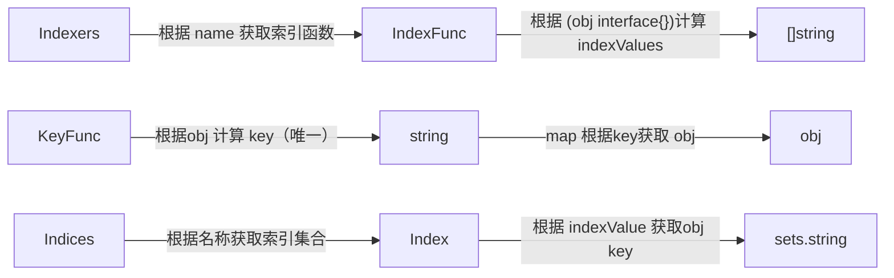

# K8s

> 参考：
>
> 1. [k8s-club/articles/Informer机制 - 概述](https://github.com/k8s-club/k8s-club/blob/main/articles/Informer机制 - 概述.md#k8s-informer机制概述)


## k8s.io/client-go

> **client-go 的 ListWatch/informer 接口**， 默认已经设置了 `ResourceVersion=0`，走 apiserver 的缓存，否则会走 etcd 获取；


### Informer

> `Informer`被设计实现为一个依赖`Kubernetes List/Watch API`、`可监听事件并触发回调函数`的`二级缓存`工具包。
>
> - 更快地返回`List/Get`请求的结果、减少对`Kubenetes API`的直接调用

Informer`实例的`Lister()`方法，`List/Get Kubernetes`中的`Object`时，`Informer`不会去请求`Kubernetes API，直接查找`缓存`在本地内存中的数据。

封装`list-watch API`，用户只需要指定资源，编写事件处理函数，`AddFunc`,`UpdateFunc`和`DeleteFunc`等。

- 针对 Update 场景，可以拿到 old 和 new 的对象；
- list-watch 如果出错后，会再次调用 list-watch；

二级缓存`DeltaFIFO`和`Indexer(LocalStore)`

- `DeltaFIFO`用来存储`Watch API`返回的各种事件 
- `LocalStore`只会被`Lister`的`List/Get`方法访问


#### sharedIndexInformer 

> 实现了 SharedIndexInformer 接口。

**一个资源只实例化一个Informer**，后续所有的Listener都共享这一个Informer实例，通过 **工厂模式+map+lock** 实现。


### Reflector

远端（APiServer）和本地（DeltaFIFO、Indexer、Listener）之间数据同步逻辑的核心，通过[ListAndWatch方法](#List-Watch机制)来实现。

流程 `sharedIndexInformer->controller->reflector`，因此一个informer就有一个Reflector。

- ListWatcher
- store(DeltaFIFO)

#### List-Watch机制

> Etcd存储集群的数据信息，apiserver作为统一入口，任何对数据的操作都必须经过apiserver。
>
> - api server 对外提供 HTTP 服务；
> - 客户端（kubelet/scheduler/controller-manager）通过`list-watch`监听资源的`create, update, delete`事件；

List：全量数据

Watch：增量数据，同时存在 HTTP 1.1 和 Websocket 的实现

- Http Transfer-Encoding: chunked，通过 `curl` 进行 watch；

如何保证同一个资源的变化事件的顺序性？

- TODO：基于 etcd 的 watch 机制，由 etcd 保证？


#### DeltaFIFO

> 字段 knownObjects 为 Indexer 实例（cache 结构体）

Reflector中存储待处理obj(确切说是Delta)的地方，存储本地**最新的**数据，提供数据 **Add、Delete、Update**方法，以及执行 relist 的[Replace方法](#Replace方法)

- 每一个Delta包含一个操作类型（"Added"/"Updated"/"Deleted"/"Replaced"/"Sync"）和操作对象


### Indexer

> **存储类型**的接口Store 和 **索引类型**的接口，其实现类为 `cache`。

本地**最全的**数据存储，提供数据存储和**数据索引**功能。

索引原理解析：

```go
Indexers: type Indexers map[string]IndexFunc
IndexFunc: type IndexFunc func(obj interface{}) ([]string, error)
Indices: type Indices map[string]Index
Index: type Index map[string]sets.String

// cache struct 中根据 obj 计算 key，一般采用 namespaced/name（对于同一种Resource，其唯一）
keyFunc: type KeyFunc func(obj interface{}) (string, error)
```





### Listener

`AddEventHandler` 或 `AddEventHandlerWithResyncPeriod` 注册 listener，`sharedIndexInfomer`中的`sharedProcessor`会将其添加到`listeners`和`syncingListeners`。DeltaType`和`syncingListeners` 列表中，当 HandleDeltas 处理DeltaFIFO中的Delta时，进行事件派发：

- 派发给`listeners`：DeltaType为`Added`、`Updated`、`Deleted`、新旧资源版本号不一致的`Replaced`
- 派发给`syncingListeners`：DeltaType为`Sync`、**新旧资源版本号一致的`Replaced`**


### Controller

#### workqueue

Listener通过回调函数接收到对应的event之后，需要将对应的obj-key放入workqueue中，从而方便多个worker去消费。

- `queue、dirty、processing`三个结构，其中queue为slice类型保证有序性，dirty 与 processing 为 map，提供去重属性。

优势：

- 并发：支持多生产者、多消费者
- 去重：由dirty保证一段时间内的一个元素只会被处理一次
- 有序：FIFO特性，保证处理顺序，由queue来提供
- 标记：标示元素是否正在被处理，由processing来提供
- 延迟：支持延迟队列，延迟将元素放入队列
- 限速：支持限速队列，对放入的元素进行速率限制
- 通知：ShutDown告知该workqueue不再接收新的元素


### Informer 中的数据流向

**Apiserver侧为最权威的数据、DeltaFIFO为本地最新的数据、Indexer为本地最全的数据、Listener为用户侧做逻辑用的数据。**

#### 远端通路

> 远端(ApiServer) ⇔ 本地(DeltaFIFO、Indexer、Listener)

Reflector的`ListAndWatch`方法将 ApiServer 侧的 obj 同步到本地 DeltaFIFO 中

- 通过`List`行为产生的同步行为，这类event的 DeltaType 为`Replaced`，同时只有在 Reflector 初始启动时才会产生；
- 通过`Watch`行为产生的同步行为，对于watch到的`Added、Modified、Deleted`类型的event，对应的DeltaType为`Added、Updated、Deleted`。

当对应event的Delta放入DeltaFIFO之后，就**通过`HandleDeltas` 方法，将对应的 Delta 更新到 Indexer 和 Listener **上。

#### 本地通路

> 本地(DeltaFIFO、Indexer、SyncingListener）之间同步

通过Reflector的`ListAndWatch`方法中运行一个goroutine来执行**定期的`Resync`**操作。

- 通过 `ShouldResync`函数计算出`syncingListener`，之后其中的 store.Resync 从 Indexer 拉一遍所有objs到 DeltaFIFO，其中的Delta为`Sync`状态；
- 如果 DeltaFIFO 的items中存在该obj，就不会添加该obj的 sync delta。

之后`HandleDeltas`就会同步DeltaFIFO中的**Sync Delta**给 `syncingListeners`和 `Indexer`。

当然这个过程中，别的状态的delta会被通知给所有的listener和Indexer。


### Informer中的resync

> [k8s-club/articles/Informer机制 - Resync.md at main · k8s-club/k8s-club (github.com)](https://github.com/k8s-club/k8s-club/blob/main/articles/Informer机制 - Resync.md)

`Informer`和`Kubernetes`之间没有`resync`机制，但`Informer`内部的这两级缓存之间存在`resync`机制。

- `resync`将 `Indexer(LocalStore)` 中的对象，全部发送到 `DeltaFIFO` 的队列中；

几种 resync 时间参数设置：

- `NewSharedInformerFactory` 中的 `defaultResync` 参数
- `NewSharedInformerFactoryWithOptions`中针对不同的 Resource 的 Resync 时间
- 不同的 Listener（eventHandler）自定义如下所示的 resyncPeriod

```go
// 1. defaultResync -> 200 ms
factory := informers.NewSharedInformerFactory(kubeClient, 200 * time.Millisecond)

// 2. Pod Resync -> 1 s
sharedInformerFactory := informers.NewSharedInformerFactoryWithOptions(kubeClient, 200*time.Millisecond,
	informers.WithCustomResyncConfig(map[metav1.Object]time.Duration{
		&v1.Pod{}: 1 * time.Second,
	}))

// 3. event handler resync period
podInformer.Informer().AddEventHandlerWithResyncPeriod(cache.ResourceEventHandlerFuncs{
	AddFunc:    nil,
	UpdateFunc: nil,
	DeleteFunc: nil,
}, 3 * time.Second)
```


#### Resync 流程

下图展示了整个 informer 机制的流程，对于 ShardIndexInformer 而言，主要涉及 3 个组件：

1. **Controller**：一方面使用  Reflector中的ListerWatcher 从 ApiServer 拿取最新的事件（对象），并放入 DeltaFIFO 中，另一方面不停的 POP DeltaFIFO 中的对象。所有 POP 出来的 Deltas 事件都会被 ShardIndexInformer 内的 HandleDeltas 处理。
2. **Indexer**：本地带索引的存储，通过 list & watch 机制实时同步 ApiServer 测更新的数据。通过访问 Indexer 而不是直接访问 ApiServer，一方面能够极大的减轻 ApiServer 的访问压力，另一方面能够加快数据访问速度。
3. **sharedProcessor**：维护该 Infromer 上所有添加的 Listener，并负责将从 DeltaFIFO 中 POP 出的事件通知给所有的 Listener。这里有 2 种事件通知方式，对于 Sync 类型的事件只通知给需要 syncing 的 Listener。对于其余类型的事件，通知给所有的 Listener。（NOTE：这里的 Sync 事件是指 old 和 new 对象的 resourceVersion一致，包括 Sync/Replaced Delta 类型）


整个 resync 的流程，从逻辑上来说分为如上图所示的2层循环，其中第二层循环通过第一层循环来驱动，具体如下：

**第一层循环**

在 Controller（Reflector）的 ListAndWatch 内部周期性执行，具体的执行周期 **`resyncCheckPeriod`** 通过 NewSharedInformerFactory 为所有资源的 informer 设置默认值，可选的通过 NewSharedInformerFactoryWithOptions 来为某个资源设置特定的值。

- 定期遍历所有 listener 来查看是否需要真正启动 resync 流程，驱动第二层循环（只要一个 listener 需要 resync，则驱动）；
  - 每个 listener 都有自己的 `resyncPeriod`时间（默认不填等于`NewSharedInformerFactory `的defaultResync）；

**第二层循环**


- 从 Indexer 中遍历所有的 Obj，并将当前**没在DeltaFIFO** 中出现的 Obj 放入 DeltaFIFO 中
- HandleDeltas 不停的处理从 DeltaFIFO 中 POP 出 Deltas
- 使用 OnUpdate 方式，更新至 Indexer （需要说明，这个OnUpdate是没有副作用的，所以可以无限重入，符合 resync 的场景）
- 将 Sync 事件分发给对应需要同步的 Listener。这部分由 sharedProcessor 来负责完成，其内部会维护所有 listener 当前是否需要同步的状态（这个状态计算在第一层循环中完成）。如图中的 Listener-1，Listener-2。（说明：Sync 事件最终反应到 Listener 的 `OnUpdate` eventHandler 中）

#### 不同 resync 时间说明

resyncCheckPeriod ：reflector 定期检查是否需要同步的时间间隔；

resyncPeriod ：每个 listener 用于判断自己是否需要同步的时间间隔；

约束：

- **resyncPeriod 不能小于 1s**；
- resyncPeriod 最终的结果 >= resyncCheckPeriod；


#### resync 的用途

> 针对场景：请求外围系统，并将外围系统的状态推动到目标状态
>
> - 外围系统的变更，K8s不会感知，只能通过轮询（Resync）对象，并查看外围系统的状态保证一致；
> - 例如定义CRD描述云磁盘，但被用户无意删掉，通过 Resync 机制，保证再查看对象时，发现其对应磁盘不在；

- 让 listener 能够定期 reconcile Indexer 内的所有事件，来保证对应事件关心的对象（可能是系统内，也可能是系统外）状态都是预期状态；
- 对于外围系统的人为修改，定时 resync 可以保证**外围系统状态**能够一直保持与 listener 内的预期状态一致；


## k8s.io/apimachinery

[apimachinery](https://github.com/kubernetes/apimachinery)  解决的是 kubernetes 的 API Object 的 Scheme, typing, encoding, decoding, and conversion问题。

This library is **a shared dependency for servers and clients** to work with Kubernetes API infrastructure without direct type dependencies. Its first consumers are `k8s.io/kubernetes`, `k8s.io/client-go`, and `k8s.io/apiserver`.


## [sigs.k8s.io/controller-runtime](https://github.com/kubernetes-sigs/controller-runtime)

> Repo for the controller-runtime subproject of kubebuilder (sig-apimachinery)
>
> a set of **go libraries for building Controllers**,  leveraged by [Kubebuilder](https://book.kubebuilder.io/) and [Operator SDK](https://github.com/operator-framework/operator-sdk).


-  Controller 会先向 Informer 注册特定资源的 eventHandler；
-  Cache 会启动 Informer，Informer 向 ApiServer 发出请求，建立连接；
-  Informer 检测到有资源变动后，使用 Controller 注册进来的 eventHandler 判断是否推入队列中；
-  当队列中有元素被推入时，Controller 会将元素取出，并执行用户侧的 Reconciler；

```go
ctrl.NewManager(controllers.GetConfigOrDieWithQPSAndBurst(kubeClientQPS, kubeClientBurst), ctrl.Options{
    Scheme:                  scheme,
    MetricsBindAddress:      metricsAddr,
    LeaderElection:          enableLeaderElection,
    LeaderElectionNamespace: leaderElectionNamespace,
    LeaderElectionID:        "dataset.data.fluid.io",
    Port:                    9443,
    NewCache:                cache.BuilderWithOptions(cache.Options{
		Scheme:            scheme,
        // 针对 CronJob ，只list-watch 特定 label的 CronJob
		SelectorsByObject: cache.SelectorsByObject{
			&batchv1.CronJob{}: cache.ObjectSelector{Label: labels.SelectorFromSet(labels.Set{
				common.JobPolicy: common.CronPolicy,
			})},
	}),
    NewClient:               controllers.NewFluidControllerClient,
})
```


### Cache

负责在 Controller 进程里面根据 Scheme 同步 Api Server 中所有该 Controller 关心 GVKs 的 GVRs，其核心是 GVK -> Informer 的映射，Informer 会负责监听对应 GVK 的 GVRs 的创建/删除/更新操作，以触发 Controller 的 Reconcile 逻辑。

### Controller

脚手架文件，我们只需要实现 Reconcile 方法即可。

### Clients

通过该 Clients 对某些资源类型进行创建/删除/更新，**查询功能实际查询是本地的 Cache，写操作直接访问 Api Server**。

### Index

由于 Controller 经常要对 Cache 进行查询，Kubebuilder 提供 Index utility 给 Cache 加索引提升查询效率。

### OwnerReference

K8s GC 在删除一个对象时，任何 ownerReference 是该对象的对象都会被清除，与此同时，Kubebuidler 支持**所有对象的变更都会触发 Owner 对象 controller** 的 Reconcile 方法。

