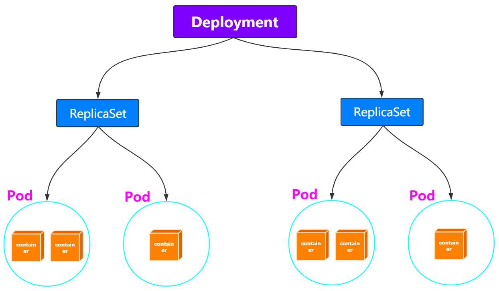

# 资源对象

## 关系


- Pod：容器间紧密协作；
- Deployment：依次启动多个应用的实例；
- Service：固定的IP地址和端口以负载均衡的形式访问；
- Secret：授权信息，以键值对数据保存在etcd；
- Job：一次性运行的Pod；
- DaemonSet：宿主机必须且只能运行一个副本的守护进程服务；
- CronJob：定时任务；

## Pod

> 解决容器间紧密协作关系的问题。

### 基础容器（Pause）

Pod里的容器**共享同一个Network Namespace、同一组Volume**，实现高效的信息交换。

**容器的“单进程”模型不是指容器里只能运行“一个”进程，而是指容器无法管理多个进程。**

- 用户编写的正常的应用不是操作系统里的init进程或者systemmd具有进程管理的功能，无法解决多进程间状态一致性的管理问题；

Pod中有基础容器，称为 `pause`容器或者`infra`容器，**pause容器主要为每个业务容器提供以下功能：**

- **PID命名空间**：Pod中的不同应用程序可以看到其他应用程序的进程ID；
  - 默认`shareProcessNamespace`**默认false，不共享进程命名空间**；
  - pause进程作为每个`pod`的`PID 1`进程（根进程），并回收僵尸进程。

- **网络命名空间**：Pod中的多个容器能够访问同一个IP和端口范围；
- **IPC命名空间**：Pod中的多个容器能够使用SystemV IPC或POSIX消息队列进行通信；
- **UTS命名空间**：Pod中的多个容器共享一个主机名；
- **存储空间**：Pod中的各个容器可以访问在Pod级别定义的Volumes。


Pause容器的源码

```c
/*
Copyright 2016 The Kubernetes Authors.
Licensed under the Apache License, Version 2.0 (the "License");
you may not use this file except in compliance with the License.
You may obtain a copy of the License at
    http://www.apache.org/licenses/LICENSE-2.0
Unless required by applicable law or agreed to in writing, software
distributed under the License is distributed on an "AS IS" BASIS,
WITHOUT WARRANTIES OR CONDITIONS OF ANY KIND, either express or implied.
See the License for the specific language governing permissions and
limitations under the License.
*/

#include <signal.h>
#include <stdio.h>
#include <stdlib.h>
#include <sys/types.h>
#include <sys/wait.h>
#include <unistd.h>

static void sigdown(int signo) {
  psignal(signo, "Shutting down, got signal");
  exit(0);
}

static void sigreap(int signo) {
  while (waitpid(-1, NULL, WNOHANG) > 0);
}

int main() {
  if (getpid() != 1)
    /* Not an error because pause sees use outside of infra containers. */
    fprintf(stderr, "Warning: pause should be the first process\n");

  if (sigaction(SIGINT, &(struct sigaction){.sa_handler = sigdown}, NULL) < 0)
    return 1;
  if (sigaction(SIGTERM, &(struct sigaction){.sa_handler = sigdown}, NULL) < 0)
    return 2;
  if (sigaction(SIGCHLD, &(struct sigaction){.sa_handler = sigreap,
                                             .sa_flags = SA_NOCLDSTOP},
                NULL) < 0)
    return 3;

  for (;;)
    pause();
  fprintf(stderr, "Error: infinite loop terminated\n");
  return 42;
}
```

`pause`容器不仅仅调用`pause()`使进程休眠，并假定自己为`PID 1`的角色，当僵尸进程被其父进程孤立时，通过调用`wait`来获取僵尸进程(见`sigreap`)。 这样一来就不会在`Kubernetes pod`的`PID`命名空间中堆积僵尸进程。


### Init容器（initContainers）

Init 容器是一种特殊容器，在 **Pod 内的应用容器启动之前**运行。Init 容器可以包括一些应用镜像中**不存在的实用工具和安装脚本**。

Init 容器与普通的容器非常像（包括重启策略），除了如下两点：

- 它们总是运行**到完成**。
- 每个都必须**在下一个启动之前成功完成**。

```yaml
apiVersion: apps/v1
kind: Deployment
metadata:
  labels:
    app: test-init
  name: test-init
  namespace: kube-public
spec:
  replicas: 1
  selector:
    matchLabels:
      app: test-init
  template:
    metadata:
      labels:
        app: test-init
    spec:
      volumes:
      - name: data
        emptyDir: {}
      initContainers:
      - name: fix-permissions
        image: busybox
        command: ["sh", "-c", "chown -R 1000:1000 /usr/share/elasticsearch/data"]
        securityContext:
        privileged: true
        volumeMounts:
    	  - name: data
       	  mountPath: /usr/share/elasticsearch/data
      - name: increase-vm-max-map
        image: busybox
      	command: ["sysctl", "-w", "vm.max_map_count=262144"]
      	securityContext:
      	privileged: true
      containers:
      - image: nginx
        imagePullPolicy: IfNotPresent
        name: test-init
        volumeMounts:
        - name: data
          mountPath: /mnt
```

### 边车容器（sidecar）

容器设计模式中的组合操作，在一个Pod启动一个辅助容器（InitContainer），来完成一些独立于主进程（主容器）的工作。

- 应用服务war包容器 + tomcat容器；
- 日志收集容器 + 主应用容器；
- Istio微服务治理；


### 生命周期和重启策略

#### Pod阶段和状态

Pod的阶段( phase ）：`pod.status.phase`

- **Pending**：Pod 定义正确，但Pod内还有至少一个容器的镜像没有创建；
- **Running**：Pod内容器均已创建，且至少一个容器处于运行状态、正在启动状态或正在重启状态；
- **Succeeded**：Pod内容器均成功执行后退出，**且不会再重启**；
- **Failed**：Pod内容器均已退出，但至少一个容器为退出失败状态；
- **Unknown**：某种原因无法获取Pod状态，如网络通信不畅；

Pod的状况（condition）：`pod.status.conditions`

- `Unschedulable`：调度器不能正常调度容器，例如缺乏资源或其他限制；

- `PodScheduled`：Pod 已被调度到一个节点；
- `Initialized`：所有 init containers 成功启动；
- `ContainersReady`：Pod 中所有容器全部就绪；
- `Ready`：Pod 能够提供请求( readiness probe 完成)；

Pod 的状态（RUNNING）跟`kubectl get pods`显示的Status（CrashLoopBackOff）为什么不一致？

- 对于异常情况，kubectl看到的状态就是`containerStatuses`的 容器里的`state.waiting.reason`；
- 源码见`pkg/kubectl/resource_printer.go`；

#### 容器的状态

Waiting：容器并不处在 `Running` 或 `Terminated` 状态之一，它就处在 `Waiting` 状态

Running：容器正在执行状态并且没有问题发生

Terminated：已经开始执行并且或者正常结束或者因为某些原因失败

#### 容器生命周期回调

**PostStart**：在容器被创建之后立即被执行（异步）。 但**不能保证回调会在容器入口点（ENTRYPOINT）之前执行**。 

**PreStop**：因 **API 请求或者管理事件（诸如存活态探针、启动探针失败、资源抢占、资源竞争等） 而被终止**之前

- `Job`类型的Pod完成时，不会触发 PreStop；


#### 重启策略(Container restart policy)

> 与 Pod 驱逐不同，如果容器被 OOM 杀死， `kubelet` 可以根据其 `restartPolicy` 重新启动它

应用于**Pod内的所有容器**，`pod.spec.restartPolicy`

- **Always**：**默认**，任何情况下，**只要容器不在运行状态，就自动重启容器**；
- **OnFailure**：容器以非 0 状态退出或者被系统终止；（比如对于FAAS等短时间应用）
- **Never**：从不重启容器。（需要保留容器退出后的日志、文件、目录等信息）

简言之：

- Always和OnFailure：容器异常，Pod会**保持Running的状态**并重启容器；
- Never：包含多个容器的Pod，只有其中**所有容器都进入异常状态**后，Pod才会进入Failed状态。在此之前，Pod都是Running状态，其**Ready字段显示正常的容器个数**。


#### 容器的健康检查

Pod里的**容器的健康检查**：支持`exec`执行命令（返回0表示健康），或者`httpGet`，`tcpsocket`请求；

- `livenessProbe`：指示容器是否正在运行。
  - 存活态探测失败，则 kubelet 会杀死容器， 并且容器将**根据其重启策略决定**；
  - 如果容器不提供存活探针， 则默认状态为 Success。
- `readinessProbe`：指示容器是否准备好为请求提供服务（用于 Service做负载均衡）
  - 就绪态探测失败（Pod的状态为 NotReady）， 端点控制器将从与 Pod 匹配的**所有Services的端点列表中删除该 Pod 的 IP 地址**；
  - 容器不提供就绪态探针，则默认状态为 `Success`。
- `startupProbe`：指示容器中的应用是否已经启动，只执行一次。
  - 提供了启动探针，则**所有其他探针都会被禁用**，直到此探针成功为止；
  - 启动探测失败，`kubelet` 将杀死容器，而容器依其重启策略进行重启；
  - 如果容器没有提供启动探测，则默认状态为 `Success`。

注意：

- 如果**不使用Deployment这样的控制器，Pod的恢复（重启）永远发生在当前节点上**而不会迁移。


```yaml
spec:
  containers:
  - name: liveness
    image: busybox
    args:
    - /bin/sh
    - -c
    - touch /tmp/healthy; sleep 30; rm -rf /tmp/healthy; sleep 600
    # 存活探针
    livenessProbe:
      exec:
        command:
        - cat
        - /tmp/healthy
      initialDelaySeconds: 5
      periodSeconds: 5
    # 启动探针
    startupProbe:
      httpGet:
        path: /healthz
        port: liveness-port
      failureThreshold: 30
      periodSeconds: 10
```


### Cmd/Args

> 建议在 K8s 中定义 command 和 args，忽略 Dockerfile 中的 ENTRYPOINT 和 CMD。
>
> - K8s 中 command 使用 exec 模式启动（1号进程）

在kubernetes中的 yaml 文件中写了`command`和`args`的时候，默认是会覆盖`DockerFile`中的命令行（ENTRYPOINT ）和参数（CMD），完整的情况分类如下：

- 如果command 和 args 都没有写，那么用`DockerFile`默认的配置；
- 如果command 写了，但 args 没有写，那么 Docker 默认的配置会被忽略而且仅仅执行`.yaml`文件的command（不带任何参数的）；
- 如果command没写，但args写了，那么Docker默认配置的ENTRYPOINT的命令行会被执行，但是调用的参数是`.yaml`中的args；
- 如果command和args都写了，那么Docker默认的配置被忽略，使用`.yaml`的配置；

### 卷挂载传播

挂载传播提供**共享卷挂载**的能力, 它允许在同一个 Pod，甚至同一个节点内，在多个容器之间共享卷的挂载。即在容器或 `host` 内的挂载目录中 再 `mount` 一个别的挂载。

由 `Container.volumeMounts` 的 `mountPropagation` 字段控制：

- `None:` 容器内和 `host` 的后续挂载完全隔离，这种卷挂载将不会收到任何后续由 `host` 创建的在这个卷上或其子目录上的挂载。同样的, 由容器创建的挂载在 `host` 上也是不可见。
- `HostToContainer:` - 这种卷挂载将会收到之后所有的由 `host` 创建在该卷上或其子目录上的挂载。换句话说, 如果 `host` 在卷挂载内挂载的任何内容, 在容器中都是可见的。同样, 如果任何具有 `Bidirectional` 的 Pod 挂载传播到该卷挂载上, 具有 `HostToContainer` 的挂载传播都可以看见。
- `Bidirectional:` - 这种挂载机制和 `HostToContainer` 类似。此外, 任何在容器中创建的挂载都会传播到 `host`, 然后传播到使用相同卷的所有 Pod 的所有容器。注意: `Bidirectional` 挂载传播是很危险的。可能会危害到 `host` 的操作系统。因此只有特权 `securityContext: privileged: true` 容器在允许使用它。

### Lifecycle

`postStart`：在容器启动后立刻执行一个指定操作，跟`ENTRYPOINT`是**异步执行**的；

`preStop`：容器结束前执行操作，同步执行即会阻塞当前的容器结束流程。


### 配置

通常不需要直接创建 Pod，甚至单实例 Pod。 相反使用诸如 Deployment或 Job这类工作负载资源来创建 Pod。

```yaml
apiVersion: v1
kind: Pod
metadata:
  name: nginx
  labels:
    env: test
spec:
  # 将pod调度到kube-01节点上运行（调度优先级最高）
  nodeName: kube-01
  # 将pod调度到具有disktype=ssd标签的节点上（预被废弃）
  nodeSelector:
    disktype: ssd
  # 亲和性
  affinity:
    # 节点
    nodeAffinity:
    # 在每次调度时考虑，执行期间标签不满足时，不会重新调度
      requiredDuringSchedulingIgnoredDuringExecution:
        nodeSelectorTerms:
        - matchExpressions:
          - key: kubernetes.io/e2e-az-name
            operator: In
            values:
            - e2e-az1
            - e2e-az2
  # 在/ect/hosts中添加域名到ip的映射
  hostAliases:
    - ip: "10.2.1.2"
      host.names:
        - "foo.remote"
        - "bar.remote"
  # Pod里的容器共享PID Namespace（默认是开启）
  shareProcessNamespace: true
  # 容器重启策略（Always，Never，OnFailure），默认为Always
  restartPolicy: Always
  # 节点容忍性（能够在k8s master节点上运行）
  tolerations:
  - key: node-role.kubernetes.io/master
    operator: Exists
    effect: NoSchedule
  # init容器的配置（依次执行并退出）
  initContainers:
  - image: geektime/sample:v2
    name: war
    command: ["cp", "/sample.war", "/app"]
    volumeMounts:
    - mountPath: /app
      name: app-volume
  containers:
  - name: cat-hosts
    image: nginx
    lifecycle:
      # postStart启动时，ENTRYPOINT可能尚未结束
      postStart:
        exec:
          command: ["/bin/bash", "-c", "echo Hello from the postStart handler > /usr/share/message"]
      # 优雅退出
      preStop:
        exec:
          command: ["/usr/bin/nginx", "-s", "quit"]
    command:
    - cat
    args:
    - "/etc/hosts"
    ports:
    - containerPort: 80
      name: web
      # 主机的端口号（一般不用，而是通过Service进行负载均衡）
      hostPort: 2039
    # 容器的健康检查
    livenessProbe:
      exec:
        command:
        - cat
        - /tmp/healthy
      initialDelaySeconds: 5
      periodSeconds: 5
    # 就绪检测超过2s后，kubelet不会重新启动Pod，而是将流量路由到其他健康的Pod上。
    # 等到Pod不再过载后，kubelet会将Pod重新加回到原来的Service中。
    readinessProbe:
      httpGet:
        path: /
        port: 8080
      timeoutSeconds: 2
```


## Deployment

### ReplicaSet

`Deployment`管理是`ReplicaSet`，`ReplicaSet`管理的是`Pod`。



**只允许`restartPolicy=Always`**

- ReplicaSet通过控制器模式保证系统中的Pod的个数永远等于指定个数(replica的值)；

### 滚动更新

修改Deployment的Pod模板后，自动触发“滚动更新”：**服务多实例部署时在线升级**

- 根据新的Pod模板，创建**新的ReplicaSet**，初始副本数为0；
- 新的ReplicaSet副本数逐渐增多，旧的ReplicaSet副本数逐渐减少；

`spec.strategy,type`定义升级策略，滚动升级对应`RollingUpdate`，配置：

- 确保在任何时间窗口，只有指定比例Pod处于离线状态，同时只有指定比例的新Pod被创建出来
  - 默认为 DESIRED 的 25%，如3Pod副本，滚动更新时至少2副本可用，4副本同时存在；
- `maxSurge`：除配置的Pod副本数量外，一次滚动更新中Deployment控制器创建多少新Pod；
- `maxUnavailable`：一次滚动更新中Deployment控制器删除多少旧Pod；

ReplicaSet的历史版本保留配置：

- 每次Deployment的更新，都会生成新的ReplicaSet；
- `spec.revisionHistoryLimit`字段，限制保留的历史版本的个数，设置为0，就不能回滚。

```shell
# 查看所有的版本历史
kubectl rollout history deployment/nginx-deployment
# 回滚到指定版本
kubectl rollout undo deployment/nginx-deployment --revision=2
```


### 配置

`template`字段是PodTemplate，定义Pod的相关内容（跟Pod的定义一致）

```yaml
apiVersion: v1
kind: Depolyment
metadata:
  name: nginx-deployment
spec:
  # 应用到 app:nginx 标签的Pod对象中
  selector:
    matchLabels:
      app: nginx
  replicas: 2
  # 滚动升级配置
  stragegy:
    type: RollingUpdate
    rollingUpdate:
      maxSurge: 1
      maxUnavaliable: 1
  # 以下内容是Pod的标准定义
  template:
    metadata:
      labels:
        app: nginx
    spec:
      container:
      ...
```


## StatefulSet

**有状态应用：实例之间关系不对等，或者实例对外部数据有依赖的应用。**（如主从复制的mysql集群）

- StatefulSet控制器直接管理的是Pod，对每个Pod的hostname、名字等都**携带编号**，加以区分；
- 通过headless service为有编号的Pod，在DNS中生成带有相同编号的DNS记录；
- 为Pod分配以额相同编号的PVC（Persistent Volume Claim），保证重启后，重新匹配到相同的PVC；

### 示例（TODO）

见示例[MySQL集群yaml](./)

## DaemonSet

Pod在K8s的每个节点上运行，且只运行一个实例，且随着新节点加入会自动创建：

- 用于网络插件，存储插件，监控和日志组件；

DaemonSet Controller从etcd获取所有节点列表，遍历判断每个节点上是否有特定标签的Pod运行。

- 多则删，调用K8s的API；
- 无则加，通过`nodeAffinity`，只在该节点上运行；
- 通过`toleration`保证在节点上可以运行Pod（如网络插件容忍`network-unavailable`污点）；

### 更新

像Deployment一样可以将DaemonSet进行滚动更新，和回滚到历史版本。

- `ControllerRevision`：专门记录Controller对象的版本，通用的版本管理对象（包括StatefulSet等）。

### 配置

```yaml
apiVersion: apps/v1
kind: DaemonSet
metadata:
  name: fluentd-elasticsearch
  # 名空间
  namespace: kube-system
  labels:
    k8s-app: fluentd-logging
spec:
  selector:
    matchLabels:
      name: fluentd-elasticsearch
  # Pod的定义
  template:
    metadata:
      labels:
        name: fluentd-elasticsearch
    spec:
    ... 
```


## Job

**Job 完成时不会再创建新的 Pod，不过已有的 Pod 也不会被删除，Job对象也会保留。** 

- 保留这些 Pod 使得你可以查看已完成的 Pod 的日志输出，以便检查错误、警告 或者其它诊断性输出。

### 配置

**不需要定义`spec.selector`描述需要控制哪些Pods**。

- Job Controller会自动为Pod模板加上`controller-uid=<随机字符串>`的标签，并在Job对象本身添加该标签对应的selector。
- pod 和 job 的metadata 都会自动添加 `jobname`的标签；

重启策略： [`RestartPolicy`](https://kubernetes.io/zh/docs/concepts/workloads/pods/pod-lifecycle/#restart-policy) 只能设置为 `Never` 或 `OnFailure` 

- `Never`：失败，则重试重新创建Pod（`spec.backoffLimit`	定义最大次数，指数时间递增）；
- `OnFailure`：失败不会新建Pod，而是不停尝试重启Pod里的容器；

最大运行时间：默认为0，不限制；

- `spec.activeDeadlineSeconds`：限制运行时长，看到Pod终止原因（`reason: DeadlineExceeded`）；

并行batch：

- `spec.parallelism`：一个Job在任意时间最多可以启动多少个Pod同时运行；
- `spec.completions`：Job至少要完成的Pod数目，即Job的最小完成数；

```yaml
apiVersion: batch/v1
kind: Job
metadata:
  name: pi
spec:
  # Pods的配置
  template:
    spec:
      containers:
      - name: pi
        image: perl
        command: ["perl",  "-Mbignum=bpi", "-wle", "print bpi(2000)"]
      restartPolicy: Never
  # 作业失败的重试次数
  backoffLimit: 4
  # 同时运行的Pod的最大数量（默认1）
  parallelism: 4
  # 最少要完成的Pod的数量（默认1）
  completions:
  # 限制运行时长
  activeDeadlineSeconds: 100
```


## CronJob

定时Job，管理Job对象的控制器。

在某些情况下，可能会创建两个 Job，或者不会创建任何 Job。 我们试图使这些情况尽量少发生，但不能完全杜绝。因此，**Job 应该是 *幂等的***。

`spec.concurrencyPolicy`：解决某个job还未运行完，另一个job就产生的场景

- **Allow**：Job可以同时存在；
- **Forbid**：不会创建新Job，该创建周期被跳过；
- **Replace**：产生新的Job替换旧的、未执行完的Job。

未能在调度时间内创建 CronJob（即创建失败）当作一次miss，**（指定的时间内）连续miss的数目超过100时，CronJob会停止创建该Job**。

- `spec.startingDeadlineSeconds`：（指定的时间内）

```sh
# ┌───────────── 分钟 (0 - 59)
# │ ┌───────────── 小时 (0 - 23)
# │ │ ┌───────────── 月的某天 (1 - 31)
# │ │ │ ┌───────────── 月份 (1 - 12)
# │ │ │ │ ┌───────────── 周的某天 (0 - 6) （周日到周一；在某些系统上，7 也是星期日）
# │ │ │ │ │                                   
# │ │ │ │ │
# │ │ │ │ │
# * * * * *
```

### 配置

```yaml
apiVersion: batch/v1
kind: CronJob
metadata:
  name: hello
spec:
  schedule: "*/1 * * * *"
  # 并行执行的配置
  concurrencyPolicy: Forbid
  # job的模板
  jobTemplate:
    spec:
      template:
        spec:
          containers:
          - name: hello
            image: busybox
            imagePullPolicy: IfNotPresent
            command:
            - /bin/sh
            - -c
            - date; echo Hello from the Kubernetes cluster
          restartPolicy: OnFailure
```


## Service

**Service用于为一组提供服务的Pod抽象一个稳定的网络访问地址**；

- 服务注册、服务发现、服务负载均衡等；

Pod 绑定Service服务，**Service服务声明的IP地址等信息是固定不变的，Service作为Pod的代理入口**（Portal）。

### 负载均衡原理

通过**kube-proxy配置iptables或者通过ipvs**进行转发处理。

#### 会话保持机制

支持通过`sessionAffinity`实现基于客户端IP的会话保持机制，并且可以配置**会话保持的最长时间**：

```yaml
# ....
spec:
  sessionAffinity: CientIP
  sessionAffinityConfig:
    clientIP:
      timeoutSeconds: 10800
  prots:
  - protocol: TCP
    port: 8080
    targetPort: 8080
  selector:
    app: webapp
```

### 外部服务定义为Service

常见应用场景：

- 已部署的集群外服务，如数据库服务、缓存服务等；
- 其它K8s集群的某个服务等；

创建Service时候不设置Label Selector（后端Pod也不存在），同时在定义一个与Service关联的Endpoint对象，在Endpoint中设置外部服务的IP和Port：

```yaml
apiVersion: v1
kind: Endpoint
metadata:
  name: my-service
subsets:
- addresses:
  - IP: 1.2.3.4
  ports:
  - port: 80
```


### Service类型

为一组Pod抽象一个稳定的网络访问地址，提供**服务注册、服务发现、服务负载均衡**等。

- `port`和`nodePort`都是service的端口，前者暴露给k8s集群内部服务访问，后者暴露给k8s集群外部流量访问。

- 从上两个端口过来的数据都需要经过反向代理kube-proxy，流入后端pod的`targetPort`上，最后到达pod内的容器。

#### ClusterIP模式

默认，分配一个**集群内部**可以访问的虚拟IP（VIP）

- Services的**VIP**（Virtual IP）方式：vip将请求转发到某一个Pod上；
- Service的**DNS**方式：通过域名解析成对应ip
  - **Normal Service**：解析后的ip就是Service的**vip**；
  - **Headless Service**：没有ClusterIP（None），解析出的是所有的Pod的 ip:port 地址列表；
  - dns记录域名为：`<pod-name>.<svc-name>.<namespace>.svc.cluster.local`

#### NodePort模式

> /etc/kubernetes/manifests/kube-apiserver.yaml

在每个Node上分配一个端口作为外部访问入口，**默认kube-proxy会在全部网卡(0.0.0.0)绑定NodePort的端口号**。

- **不指定，可以自动分配**；

#### LoadBalancer模式

工作在特定的Cloud Provider上，例如Google Cloud，AWS，OpenStack

#### ExternalName模式

将Service映射为一个外部域名地址，通过exeternalName字段进行设置


### 配置

正常情况下，**service的port和pod镜像开放的端口一致**。比如nginx的镜像是开放80端口，service的port指定的是80端口，那么pod和pod直接就可以进行访问，**不用指定targetPort端口**

```yaml
apiVersion: v1
kind: Service
metadata:
  name: nginx-svc
  labels:
    app: nginx
spec:
  ports:
  - protocol: tcp
    # service暴露在cluster ip上的端口，服务间内部使用
    port: 80
    # 节点上的端口，给外部直接通过节点ip:port访问（NodePort模式使用）
    nodePort: 8090
    # 容器里的端口
    targetPort: 8081
    name: web
  # ClusterIP模式（默认）：不指定时，自动分配
  # 指定为None时，属于Headless模式
  clusterIP: None
  # 指定为 NodePort模式，默认ClusterIP
  type: NodePort      
  # 选择pod(根据对应的label: app=nginx)
  selector:
    app: nginx
```


## Ingress

**HTTP/HTTPS** 根据 url 进行转发，作为Edge Router，将集群外的客户端请求路由到集群内部的服务上；

- `ingress controller`基于`Ingress`规则将客户端请求直接转发到`Service`对应的后端`Endpoint(Pod)`上。

### 实现

#### [NGINX Ingress](https://github.com/kubernetes/ingress-nginx)

默认的 Ingress 是基于 NGINX 实现的。NGINX Ingress Controller 帮助维护了 Kubernetes 集群与 NGINX 的状态同步，并且提供了基本的反向代理能力。

- 默认`controller-class=k8s.io/ingress-nginx`，`--ingress-class=nginx`

nginx 配置的upstream，是通过lua脚本动态处理，需要通过相应的 [nginx kubectl plugin](https://kubernetes.github.io/ingress-nginx/kubectl-plugin) 查看

`kubectl ingress-nginx backends`

配置修改：

- 通过对`Ingress`的`annotation`进行操作，实现配置修改

`nginx.ingress.kubernetes.io/proxy-body-size: "50m"`

#### [Apache APISIX Ingress](https://apisix.apache.org/docs/ingress-controller/getting-started/)


### IngressClass

> 默认的 IngressClass，需要加上注解
>
> - `ingressclass.kubernetes.io/is-default-class: "true"`

用于在集群内有多个ingress controller时候，**区分ingress由谁处理**。

- 如`nginx-controller`，其启动命令中，有2个配置在此时有用(`--ingress-class`和`--controller-class`)；

#### 无default ingressclass

```yaml
apiVersion: networking.k8s.io/v1
kind: IngressClass
metadata:
  name: nginx-example
spec:
  controller: k8s.io/ingress-nginx
```

针对不同场景，Ingress 的处理策略不一样：

- ingress未设置ingressClassName，会被忽略；
- ingress设置`ingressClassName`，对应`IngressClass`的`metadata.name`：
  - 对应的 ingressclass 的 spec.controller字段所对应的 ingress-controller 处理（即等于 controller-class 字段值 ）；

#### 有default ingressclas

```yaml
apiVersion: networking.k8s.io/v1
kind: IngressClass
metadata:
  annotations:
    ingressclass.kubernetes.io/is-default-class: "true"
  name: nginx
spec:
  controller: k8s.io/ingress-nginx
```

针对不同场景，Ingress 的处理策略不一样：

- ingress未设置ingressClassName，被default ingressclass 的 spec.controller 指定的 ingress-controller 处理；
- ingress设置`ingressClassName`，对应`IngressClass`的`metadata.name`：
  - 对应的 ingressclass 的 spec.controller字段所对应的 ingress-controller 处理（即等于 controller-class 字段值 ）；

## Gateway

> Ingress提供了某些字段配置，通过annotations进行配置也很有挑战性。
>
> 使用Ingress，集群运维人员和应用开发人员在同一个Ingress对象上操作，却不知道彼此的角色，可能会导致设置错误。

`GatewayClass`、`Gateway`、`HTTPRoute`、`TCPRoute`、`Service`等，旨在通过表达性的、可扩展的、面向角色的接口来定义Kubernetes服务网络。

在Ingress API的基础上增加了更多特性，例如HTTP头匹配、加权流量分割、多协议支持(如HTTP、gRpc)以及其他各种后端功能(如桶、函数)。

## Project Volumes

> 为容器提供预先定义好的数据，被k8s注入到容器中。

Secret、ConfigMap、Downward API三种信息，可以通过**环境变量的方式出现再容器里，但是不具备自动更新的能力**。

### Secret

> - 通过卷挂载时或者通过 go client 获取 secret 时，其数据已经进行 base64 解码。
>
> - Pod 默认可以挂载同名空间的任意 Secret，但也可以[限制Pod访问哪些secret](./k8s_security.md#Service Account)。

把Pod想要访问的加密数据存储到etcd中，通过Pod的容器**挂载Volume**的形式访问Secret里的信息。

- **Secrent的加密是插件，需要单独配置。**

在容器中会生成`${container_mount_path}/${secret_name}`文件，文件内容为对应的值，且etcd中值更新时，**文件内容也会更新**。

- 对于以 [subPath](https://kubernetes.io/zh-cn/docs/concepts/storage/volumes#using-subpath) 形式挂载 Secret 卷的容器而言， 它们无法收到自动的 Secret 更新。

#### kubernetes.io/dockerconfigjson

作为 docker 私有镜像的认证配置，通过

```yaml
apiVersion: v1
kind: Secret
type: kubernetes.io/dockerconfigjson
# 私有镜像的
metadata:
  name: hubsecret-go
  namespace: test
data:
  .dockerconfigjson: eyJhdXRocyI6eyJ1YXQuc2YuZG9ja2VyaHViLnN0Z3dlYmFuayI6eyJ1c2VybmFtZSI6ImJkcCIsInBhc3N3b3JkIjoiYmRwQHdlaHViIiwiZW1haWwiOiJsdWNrbGl1QHdlYmFuay5jb20iLCJhdXRoIjoiWW1Sd09tSmtjRUIzWldoMVlnPT0ifX19
```

Pod中使用时`imagePullSecrets`：

```yaml
apiVersion: apps/v1
kind: Deployment
metadata:
  name: deployment_service
  namespace: test
spec:
  imagePullSecrets:
  - name: hubsecret-go
```

### ConfigMap

> 作为**卷整体挂载**时，每个 key 是以软链接的形式。
>
> ```shell
> Oct 31 10:25 ..2023_10_31_10_25_13.340959843
> Oct 31 10:25 ..data -> ..2023_10_31_10_25_13.340959843
> Oct 31 10:25 aa -> ..data/aa
> ```

与Secret的区别是，**ConfigMap存储无需加密、应用所需的配置信息**：

- `data` 下的每个键的名称都必须由字母数字字符或者 `-`、`_` 或 `.` 组成；
- `immutable` 字段到 ConfigMap 定义中， 创建[不可变更的 ConfigMap](https://kubernetes.io/zh-cn/docs/concepts/configuration/configmap/#configmap-immutable) (只能删除并重建 ConfigMap)

```yaml
apiVersion: v1
kind: ConfigMap
metadata:
  # 配置名称为cc-go-config 
  name: cc-go-config
  namespace: test
# 保存 UTF-8 字符串
data
  application-name: Test
# 不可变，v1.21 stable
immutable: true
```

#### 使用

Pod的使用方式：

- 将ConfigMap中的数据设置为**容器的环境变量**
- 将ConfigMap中的数据设置为**命令行参数**
- 使用Volume将ConfigMap**作为文件或目录挂载**（可[自动更新](https://kubernetes.io/zh-cn/docs/tasks/configure-pod-container/configure-pod-configmap/#mounted-configMaps-are-updated-automatically)，使用subpath则不行）
  - configmap 的更新延迟，可以通过对Pod 添加注解立即触发configmap更新；

- 编写代码在 Pod 中运行，使用 **Kubernetes API** 来读取 ConfigMap


### Downward API

Pod里的容器能够**直接获取这个Pod API对象本身的信息**（**容器进程启动之前就确定的信息**）。

- `fieldRef`：`metadata`的`name`, `namespace`, `label`等；
- `resourceFieldRef`：cpu, memory等；

示例：将Pod Labels字段的值挂载到容器的`/etc/podinfo/labels`文件

```yaml
...
spec:
  containers:
  - name: client
    volumeMounts:
    - name: podinfo
      mountPath: /etc/podinfo
  volumes:
  - name: podinfo
    projected:
      sources:
      - downwardAPI:
        items:
        - path: "labels"
        	fieldRef:
        	  fieldPath: metadata.labels
```


### ServiceAccountToken

> token 文件中存储的 k8s api server 地址是 https://kubernetes.default.svc（不会变）
>
> - kubectl cluster-info 显式的域名跟这个不需要一致，两者之间无关联
> - apiserver 的 pod 启动参数定义 `- --service-account-issuer=https://kubernetes.default.svc.cluster.local`

Service Account对象的作用是Kubernetes内置的一种“服务账户”，是K8s进行权限分配的对象。

`InClusterConfig`：将**K8s客户端以容器方式运行，使用默认的Service Account自动授权**

- Pods会自动挂载一个类型为Secret，名为`default-token-***`的Volume。

- Service Account的授权信息和文件作为特殊的Secret，存在容器里的`/var/run/secrets/kubernetes.io/serviceaccount`目录，包含`ca.crt`, `token`等；


## PV

持久化卷， 支持本地存储和网络存储，支持两个属性， capacity和accessModes：

- `accessModes`：**ReadWriteOnce**（被单个node读写）， **ReadOnlyMany**（被多个nodes读）， **ReadWriteMany**（被多个nodes读写）；**ReadWriteOncePod**（单个Pod读写，仅 K8s 1.22+ 的CSI Volume支持）
- k8s的存储的支持程度见 https://kubernetes.io/docs/concepts/storage/persistent-volumes/#access-modes

**重声明策略**(reclaim policy)：用户删除PVC释放对PV的占用后，系统根据PV的"reclaim policy"决定对PV执行何种回收操作

- **Retain** ：手动重新使用
- **Recycle** ： 基本的数据擦除 (`rm -rf /thevolume/*`)
- **Delete** ： 默认，移除PV对象和相关联的后端存储卷删除， 后端存储比如`AWS EBS, GCE PD, Azure Disk, or OpenStack Cinder`

节点亲和性（NodeAffinity）

- 限制哪些节点能够访问该PV

需要特别注意的是只有本地盘和nfs支持数据盘Recycle 擦除回收

```yaml
apiVersion: v1
kind: PersistentVolume
metadata:
  name: pv0003
spec:
  capacity:
    storage: 10Gi
  accessModes:
    - ReadWriteOnce
  persistentVolumeReclaimPolicy: Recycle
  storageClassName: slow
  nfs:
    path: /tmp
    server: 172.17.0.2
```

### StorageClass(Dynamic Provisioning)

自动创建PV的机制，`StorageClass`对象的作用就是创建PV的模板：

- `storageclass.kubernetes.io/is-default-class: "true"` 注解表明使用这个StorageClass作为默认的持久化存储提供者；
- 有两个或多个被标记为默认，Kubernetes 将忽略这个注解， 也就是它将表现为没有默认 StorageClass。

示例：`cephfs `

```yaml
apiVersion: storage.k8s.io/v1
kind: StorageClass
metadata:
  name: rook-cephfs
  annotations:
    storageclass.kubernetes.io/is-default-class: "true"
provisioner: rook-ceph.cephfs.csi.ceph.com
parameters:
  clusterID: rook-ceph
  csi.storage.k8s.io/controller-expand-secret-name: rook-csi-cephfs-provisioner
  csi.storage.k8s.io/controller-expand-secret-namespace: rook-ceph
  csi.storage.k8s.io/node-stage-secret-name: rook-csi-cephfs-node
  csi.storage.k8s.io/node-stage-secret-namespace: rook-ceph
  csi.storage.k8s.io/provisioner-secret-name: rook-csi-cephfs-provisioner
  csi.storage.k8s.io/provisioner-secret-namespace: rook-ceph
  fsName: myfs
  pool: myfs-replicated
```

### Local PV

应用于分布式数据存储如 MongoDB，分布式文件系统如 Ceph 等，以及需要在本地磁盘缓存大量数据的分布式应用。

- 不应该将宿主机上的目录用作PV。会对宿主机造成影响，且不同本地目录之间缺乏哪怕最基础的I/O隔离机制；
- Local PV对应的存储介质，一定是一块额外挂载在宿主机上的磁盘或者块设备（即不是宿主机根目录使用的主硬盘）；
- 不支持`Dynamic Provisioning`；

```yaml
apiVersion: v1
kind: PersistentVolume
metadata:
  name: example-pv
spec:
  capacity:
    storage: 5Gi
  accessModes:
    - ReadWriteOnce
  volumeMode: FileSystem
  persistentVolumeReclaimPolicy: Delete
  storageClassName: local-storage
  local:
    path: /mnt/disk/vol1
  nodeAffinity:
    required:
      nodeSelectorTerms:
      - matchExpresssions:
        - key: kubernetes.io/hostname
          operator: In
          values:
          - node-1
--------------------------------------
apiVersion: storage.k8s.io/v1
kind: StorageClass
metadata:
  name: local-storage
provisioner: kubernetes.io/no-provisioner
volumeBindingMode: WaitForFirstConsumer
-----------------------------------
apiVersion: v1
kind: PersistentVolumeClaim
metadata:
  name: example-local-claim
spec:
  resources:
    requests:
      storage: 5Gi
  accessModes:
    - ReadWriteOnce
  # 看到该storageClass，发现是延迟绑定
  storageClassName: local-storage
```

**volumeBindingMode**：延迟绑定，因为`PV`对节点有要求，`Pod`对节点也有要求，在创建PVC时，如果PVC绑定PV，则会出现不匹配的情况

- 将绑定推迟到调度的时候，根据Pod对节点的要求，绑定相应的PVC；


### emptyDir

在node上自动分配 一个目录，因此无需指定宿主机node上对应的目录文件。这个目录的初始内容为空，当Pod从node上移除时，emptyDir中的数据会被删除。

- 主要用于某些应用程序无需永久保存的临时目录，多个容器的共享目录等


### 设备类型

`VolumeMode`字段支持：

- Block（原始的块设备）：Pod 使用时在 container 中设置 `VolumeDevices`

- FileSystem（格式化的文件系统）：Pod 使用时在 container 中设置 `VolumeMounts`

## PVC

> **PV和PVC是一一对应的**。

pvc － 对 pv 资源的请求

- `resources.requests.storage`的作用：？？

```yaml
kind: PersistentVolumeClaim
apiVersion: v1
metadata:
  name: myclaim
spec:
  accessModes:
    - ReadWriteOnce
  resources:
    requests:
      storage: 8Gi
  storageClassName: slow
  selector:
    matchLabels:
      release: "stable"
    matchExpressions:
      - {key: environment, operator: In, values: [dev]}
```

在PVC中绑定一个PV，可以根据下面几种条件组合选择

- `Access Modes`：按照访问模式选择pv
- `Resources`：按照资源属性选择， 比如说请求存储大小为8个G的pv
- `Selector`：按照pv的label选择
- `Class`：根据StorageClass的class名称选择, 通过annotation指定了Storage Class的名字, 来绑定特定类型的后端存储


### PVC保护(partition)

有用户删除了仍处于某pod资源使用中的PVC时，Kubernetes不会立即予以移除，而是**推迟到不再被任何pod资源使用后方**才执行删除操作；

处于此种阶段的PVC资源的**status字段为`termination`**并且其`Finalizers`字段中包含`kubernetes.io/pvc-protection`


## VolumeAttachment 


## Operator

> 更灵活、更编程友好的管理“有状态应用”的解决方案。

利用K8s的CRD描述我们想要部署的“有状态应用”，在自定义控制器里根据自定义API对象的变化，完成具体的部署和运维工作。

