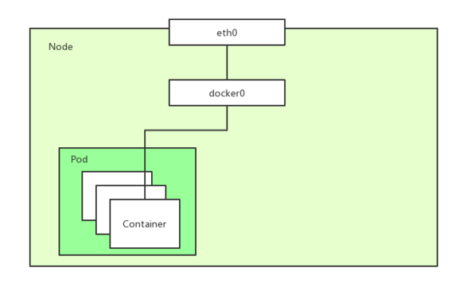
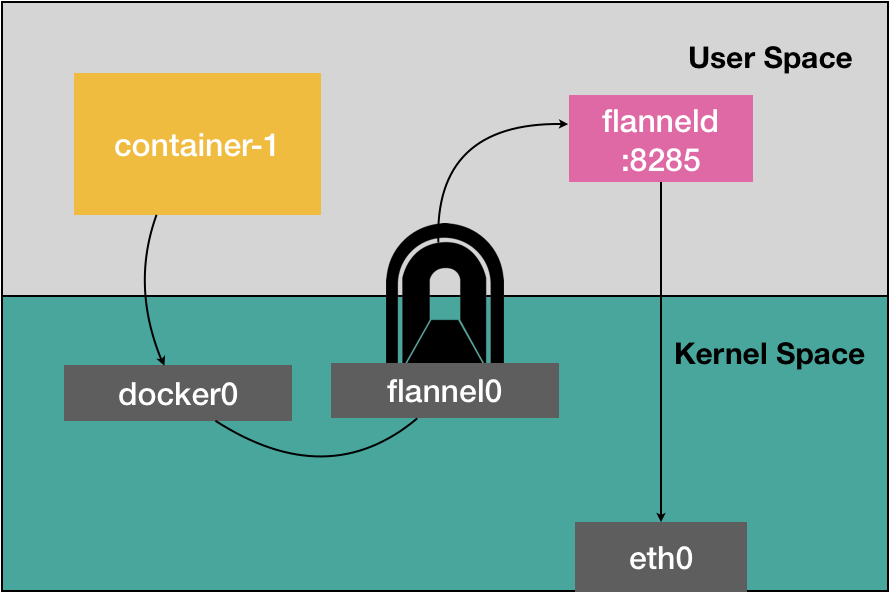
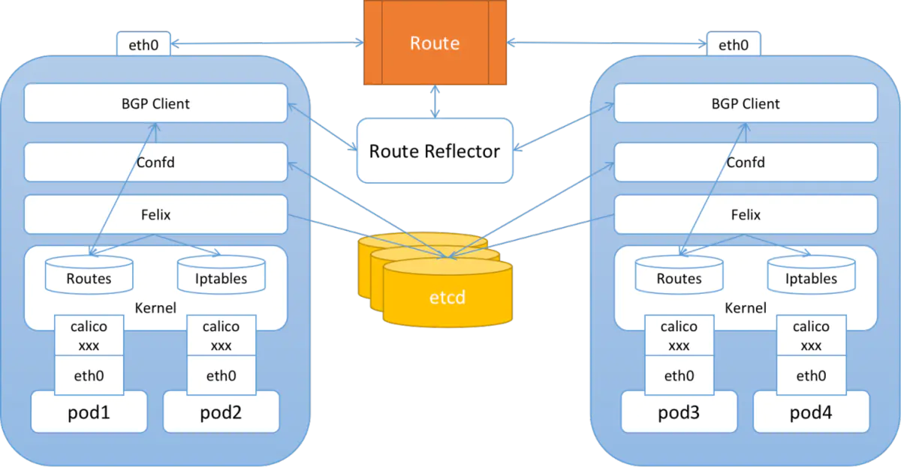

# k8s 网络模型

"网络栈"包括**网卡**，**回环设备**，**路由表**，**iptables**规则。

**二层网络**：根据 **MAC地址**表进行数据包的转发；

**三层网络**：通过 **IP 路由**实现跨网段的通讯；


网络系统的的四个主要问题：

1. 高度耦合的容器间通信：这个已经被 Pod 和 `localhost` 通信解决了。
2. **Pod 间通信**：这是本文档讲述的重点。
3. Pod 与 Service 间通信：涵盖在 Service 中。
4. 外部与 Service 间通信：也涵盖在 Service 中。


## CNI

> Container Network Interface
>
> - Weave、Calico、Flannel、Canal、Romana、kube-router 等实现。
> - K8s 1.24 版本及以后， CNI 的管理不再是 kubelet 的工作。

CNI 网桥：接管K8s创建的Pod

- 基础可执行文件在`/opt/cni/bin`目录下；

CNI插件：

- **ADD**操作：将容器添加到 CNI 网络里；
- **DEL**操作：从 CNI 网络里移除容器；

每一个Pod都拥有一个扁平化共享网络命名空间的「PodIP」。

- 通过PodIP跨越网络与其他物理机和Pod进行通信。
- IP-Per-Pod 模型创建了一个干净的、反向兼容的模型。

该模型中，从端口分配、网络、域名解析、服务发现、负载均衡、应用配置和迁移等角度，Pod都能被看作是虚拟机或者物理机，应用可以平滑地从非容环境迁移到同一个Pod内的容器环境。

## Pod内通信 

Pod：Pod是容器的集合；

- **Pod包含的容器都运行在同一个宿主机**，拥有相同网络空间，容器之间可以互相通信；
- Pod运行的容器中包含业务容器和网络容器 「pause」；
  - 「pause」**全称infrastucture container（又叫infra）基础容器。**
  - 网络容器只用来接管Pod的网络，业务容器通过加入网络容器的网络实现网络共享

Pod内容器类似使用以下命令运行：

```shell
docker run -p 80:80 -p 8080:8080 --name network-container -d gcr.io/google_container/pause:3.1
docker run --net container:network-container -d jonlangemak/docker:web_container_8080
```

Pod中的容器网络拓扑



## Pod间通信

k8s网络模型是一个扁平化的网络平面，Pod作为一个网络单元同k8s Node网络处于一个层级

示例：最小的k8s网络拓扑

- Pod间通信：Pod1和Pod2（同主机）， Pod1和Pod3（跨主机通信）
- Node与Pod间通信：Node1与Pod1/Pod2（同主机），Pod3（跨主机能够通信）


问题：

1. 如何保证Pod的PodIP是全局唯一的？
   - **Pod的PodIP是Docker网桥分配**的，所以将不同 k8s Node的Docker网桥配置成不同的IP网段即可。
2. 同一个k8s Node上的Pod/容器原生能通信，不通Node之间的Pod如何通信？
   - 对Docker进行增强，在容器集群中创建一个覆盖网络（Overlay Network），联通各节点，如Flannel ，Calico；
   - Overlay Network 本身，可以由每台宿主机上的一个“特殊网桥”共同组成 或者 通过配置宿主机的路由表实现；


### Flannel 网络模型

Flannel 是由 CoreOS 团队设计的覆盖网络工具

- **UDP**模式：性能最差，已废弃；
- **VXLAN**模式：
- **HOST_GW**模式：

#### UDP

- Flannel为主机设定一个子网，通过**隧道协议封装容器之间的通信报文**，实现容器的跨主机通信。
- Flannel会为每一台宿主机分配一个“子网”，一台宿主机上的所有容器，都属于这个“子网”，即都属于同一个网段，子网与宿主机的对应关系，保存在 Etcd

```shell
$ etcdctl ls /coreos.com/network/subnets
/coreos.com/network/subnets/100.96.1.0-24
/coreos.com/network/subnets/100.96.2.0-24
/coreos.com/network/subnets/100.96.3.0-24 
# 子网对应的宿主机的 IP 地址
$ etcdctl get /coreos.com/network/subnets/100.96.2.0-24
{"PublicIP":"10.168.0.3"}
```

- 配置完成，每个上运行`flanneld`进程，创建一个叫做flannel0的设备，添加一系列的路由规则，用来指定数据包的下一跳

  - flannel0 设备是一个TUN 设备（Tunnel 设备），TUN 设备是一种工作在三层的虚拟网络设备；
  - TUN设备：在操作系统内核和用户应用程序之间传递 IP 包。而添加的路由规则则包含了流入flannel0 设备和流出flannel0 设备的路由。

网络流转：

- 当 IP 包从容器经过 docker0 出现在宿主机后，就会根据路由表进入 flannel0 设备；
- 宿主机上的 flanneld 进程就会收到这个 IP 包，根据这个 IP 包的目的地址，匹配到对应的子网，从 Etcd 中找到这个子网对应的宿主机的 IP 地址；
- flanneld将这个IP包直接封装在一个 UDP 包里，通过物理网络发送给目的宿主机的 flanneld（监听8285 端口）；
- 目的宿主机的flanneld 就可以从这个 UDP 包里解析出封装在里面的源容器发来的原 IP 包，直接把这个 IP 包发送给它所管理的 TUN 设备；
- Linux内核会根据路由规则，把这个 IP 包转发给 docker0 网桥（作为二层交换机），将数据包发送给正确的端口，进而通过 Veth Pair 设备进入到目的容器里


 

总结：

- 工作在三层的overlay网络；

- 在发出 IP 包的过程，需要三次用户态与内核态之间的数据拷贝；

  

#### VXLAN

VXLAN即Virtual Extensible LAN（虚拟可扩展局域网），是 Linux 内核本身就支持的一种网络虚似化技术。

- 在现有的三层网络之上，“覆盖”一层虚拟的、由内核 VXLAN 模块负责维护的**二层网络**，使得连接在这个 VXLAN 二层网络上的“主机”（虚拟机或者容器都可以）之间，像在同一个局域网（LAN）里那样自由通信；
- 在宿主机上设置一个**特殊的网络设备 VTEP**，即：VXLAN Tunnel End Point（虚拟隧道端点）
  - 内核里完成对二层数据帧进行封装和解封装；

Flannel 的流程：

- 在各节点上添加相应的路由规则，用来指定数据包的下一跳；
- 维护一个**ARP表**，存储各节点的VTEP设备的MAC地址；
- 维护一个**FDP转发数据库**，存储各VTEP设备所在的宿主机ip；


通信流程：每台设备上已经有了VTEP设备（即上图中的flannel.1 的设备）和相应的路由规则

- 源容器发出请求后，数据包包含了源容器ip和目的容器ip；
- 数据包通过虚拟网卡对出现在docker0网桥上，然后根据路由规则到达VTEP设备，要发往的网关地址为目的VTEP设备的ip；
- VTEP会从ARP表里获取到对应的MAC地址，并进行二层封包，得到一个二层数据帧，称为“内部数据帧”；
- Linux 内核会在“内部数据帧”前面，加上一个特殊的 VXLAN 头；
- Linux 内核会从FDB数据库里读取到对应的目的宿主机ip，把“内部数据帧”和目的宿主机ip封装进一个 UDP 包里，称为“外部数据帧”；
- Linux内核会在这个“外部数据帧”前面加上目的宿主机的MAC地址；
- 源宿主机上的 flannel.1 设备就可以把这个数据帧从源宿主机的 eth0 网卡发出去，到目的宿主机的 eth0 网卡；
- 目的宿主机的内核网络栈会发现这个数据帧里有 VXLAN Header，并且 VNI=1；
- 目的宿主机的Linux 内核会对它进行拆包，拿到里面的内部数据帧，然后根据 VNI 的值，把它交给 flannel.1 设备；
- flannel.1 设备则会进一步拆包，取出“原始 IP 包”，然后根据路由规则，将它交给docker0网桥。

#### HOST_GW

将每个 Flannel 子网的“下一跳”，设置成了该子网对应的宿主机的 IP 地址。

- 主机”（Host）会充当这条容器通信路径里的“网关”（Gateway）;
- flanneld会在宿主机上创建相应的路由规则，设置到某一目的网段的的数据包，应该经过本机的 eth0 设备发出去，且下一跳地址是目的主机ip。
- Flannel 子网和主机的信息，都是保存在 Etcd 当中，flanneld 只需要 WACTH 这些数据的变化，然后实时更新路由表即可；


容器通信的过程就**免除了额外的封包和解包**带来的性能损耗。

- 根据实际的测试，host-gw 的性能损失大约在 10% 左右，而其他所有基于 VXLAN“隧道”机制的网络方案，性能损失都在 20%~30% 左右。

### [Calico 网络模型](https://projectcalico.docs.tigera.io/about/about-calico)

其解决方案跟 Flannel 的 host-gw 模式几乎完全一样：

- 每台宿主机添加一条格式如下的路由规则：网关的ip地址是目的容器所在的ip地址；

  ```shell
  <目的容器IP地址段> via <网关的IP地址> dev eth0
  ```

- 不会在宿主机创建任何网桥设备；

- 但采用 BGP 自动在集群中分发路由消息，而不是采用 etcd + flanneld 维护路由信息；

BGP（border gateway protocol）：边界网关协议，Linux 内核原生支持、专门用于**大规模数据中心维护不同“自治系统”之间路由信息的无中心的路由协议**。

Calico 组成：

- `calico/node`（作为DaemonSet）是一个由两个容器组成的Pod

  - Felix（守护进程）：负责在宿主机插入路由规则（写入Linux内核的FIB转发信息库），维护Calico所需的网络设备；
  - BIRD（守护进程）：BGP的客户端，负责在集群总分发路由规则信息；

  - CNI 插件：与 K8s 对接；


- 使用 Kubernetes API 服务器作为分布式数据存储，消除了构建和维护etcd数据存储的需要。

#### BGP 模式

> 修改 calico.yaml 部署文件中的`CALICO_IPV4POOL_IPIP`和`CALICO_IPV4POOL_VXLAN` 值修改成`Never`，则切换到BGP网络。
>
> - 确保所有物理节点在同一个二层网络；

Calico的CNI插件为每个容器设置一个 Veth Pair 设备，一端放在宿主机上（以cali为前缀）：

- 在宿主机上**为每个容器的Veth Pair设置配置一条路由规则**（未采用网桥），用于接收传入的IP包；

  - 发往 10.233.2.3 的 IP 包应该进入cali5863f3 设备

  ```shell
  10.233.2.3  dev cali5863f3 scope link
  ```

全互联模式：一个 BGP Speaker 需要与其它所有的 BGP Speaker 建立 bgp 连接（形成一个bgp mesh），复杂度 O(N^2)

- 用于少于 100 个节点的集群；

**RR 模式**：选择一部分节点（一个或者多个）作为 Global BGP Peer，它们和所有的其他节点互联来交换路由信息，其他的节点只和 Global BGP Peer 相连。

- 复杂度 O(N)




#### IPIP模式（默认）

> IPIP的包头非常小，而且也是内置在内核中，因此理论上它的速度要比VxLAN快一点，但安全性更差。
>
> Calico 3.x的默认配置使用的是 IPIP 类型的传输方案而非BGP。
>
> CALICO_IPV4POOL_IPIP 的值，可用值如下：(CALICO_IPV4POOL_VXLAN 可替代 IPIP 模式)
>
> - Always：只使用 IPIP 隧道网络，默认值
> - Never：不使用 IPIP 隧道网络
> - CrossSubnet：启用混合网络模式

假设两台处于不同子网的宿主机 Node 1 和 Node 2，对应 IP 分别为 102.168.1.1 和 192.168.2.1，通过路由器实现三层转发（可互相通信）：

- Calico 尝试在 Node 1 添加如下一条规则：

  - Node 2 和 Node 1 不在一个子网里，无法通过二层网络将 IP 包发送给下一跳地址；

  ```shell
  10.233.2.0/16 via 192.168.2.2 eth0
  ```

- 开启 IPIP 模式，路由规则变更如下

  - **tunl0 设备是 IP 隧道 设备**，需要额外的封包/解包，三层转发，性能与 Flannel VXLAN 相当；
  - IPIP隧道网络也是**依赖BGP来维护节点的路由信息**（`ip r`可查看相关的信息）；

  ```shell
  10.233.2.0/16 via 192.168.2.2 dev tunl0 proto bird onlink
  ```


- 或设法将宿主机网关也加入 BGP Mesh 从而避免使用 IPIP
  - 使用一个或多个独立组件负责搜集整个集群里的所有路由信息，然后通过 BGP 协议同步给网关；


### [kube-router](https://www.kube-router.io/)

> 等价于 calico + kube-proxy。

采用了三层路由（Layer 3 Routing）的方式，以实现Kubernetes集群中的网络通信。


## Service到Pod的通信

Service在Pod之间起「服务代理」的作用，对外表现为一个单一访问接口，将请求转发给Pod。

```shell
$ kubectl decsribe service myservice
Name: myservice
Namespace: default
Lables: <none>
Selector: name=mypod
Type: ClusterIP
IP: 10.254.206.220
Port: http 80/TCP
Endpoints: 10.0.62.87:80,10.0.62.88:80,10.0.62.89:80

Session Affinity: None
No evevts.
```

解读如下：

- Service的虚拟IP是 10.254.206.220
- 端口80/TCP对应3个后端：10.0.62.87:80,10.0.62.88:80,10.0.62.89:80
- 请求 10.254.206.220:80 时会转发到这些后端之一
- 虚拟IP是K8s创建的，虚拟网段是API server启动参数 `--service-cluster-ip-range=10.254.0.0/16` 配置的

### br_netfilter

`br_netfilter`作用：`br_netfilter`模块可以**使 iptables 规则可以在 Linux Bridges** 上面工作，用于将桥接的流量转发至iptables链。

- **如果没加载，影响同node内的pod之间通过service来通信；**

- 因为**iptables是在三层**的，而**linux bridge是在二层**的。当pod发出的流量经过service来转发后是到同一个node上的pod，那么此时**两个pod都是桥接在cni网桥上**的，那么就会**直接通过网桥**来传递流量，但是此时**流量的处理就不会up call到三层的iptables规则**，从而导致转发异常；

启用 `bridge-nf-call-iptables` 这个内核参数 (置为 1)，表示 bridge 设备在二层转发时也去调用 iptables 配置的三层规则 (包含 conntrack)

- 每个 Pod 的网卡都是 veth 设备，veth pair 的**另一端连上宿主机上的网桥**；

- 由于网桥是虚拟的二层设备，**同节点的 Pod 之间通信直接走二层转发**，跨节点通信才会经过宿主机 eth0；

不管是 iptables 还是 ipvs 转发模式，Kubernetes 中访问 Service 都会进行 **DNAT，将原本访问 ClusterIP:Port 的数据包 DNAT 成 Service 的某个 Endpoint (PodIP:Port)**，然后内核将**连接信息插入 conntrack 表**以记录连接，目的端回包的时候内核从 conntrack 表匹配连接并**反向 NAT**，这样原路返回形成一个完整的连接链路:


导致问题：（常见的问题现象就是**偶现 DNS 解析失败**）

1、Pod 访问 Service，**目的 IP 是 Cluster IP，不是网桥内的地址，走三层转发**，会被 DNAT 成 PodIP:Port；
2、如果 DNAT 后是转发到了同节点上的 Pod，**目的 Pod 回包时发现目的 IP 在同一网桥上，就直接走二层转发**，没有调用 conntrack，导致**回包时没有原路返回**，客户端与服务端的通信就不在一个 “频道” 上，**不认为处在同一个连接**，也就无法正常通信。


### kube-proxy

**kube-proxy组件负责虚拟IP路由和转发**，在容器覆盖网络之上实现的虚拟转发网络，功能如下：

- 监控Service和Endpoints的变化，实现刷新转发规则
- 提供负载均衡能力

kube-proxy的代理模式：~~userspace模式不再推荐~~

- **`iptables`**模式：设置iptables规则，效率高，但失败响应不友好，可以通过Pod的readinessprobe控制只有ready状态的pod可以响应；
  - 大量Pod时在宿主机设置相当多的 iptables 规则，大量占用宿主机 CPU 资源；

- **`ipvs`**模式：通过Linux kernel的`netlink`接口设置**IPVS**规则，**转发效率和吞吐量都是最高**；
  - 要求**Linux Kernel启用 IPVS 模块**，未启用会自动切换到iptables模式；
  - 不需要设置 iptables 规则，而是将规则的处理放在内核态；
  - 支持更多负载均衡模式：rr（轮询），lc（最小连接数），dh（目标地址hash），sh（源地址hash），sed（最短期望延迟），nq（永不排队）
- **`kernelspace`**模式：Windows Server的代理模式；

#### iptables

完全通过创建iptables规则，直接重定向访问Service的虚拟IP的请求到endpoints;当Endpoints发生变化的时候，kube-proxy会刷新相关的iptables规则，在此模式下，kube-proxy只负责监控Service和Endpoints，更新iptables规则，报文的转发依赖于Linux内核，默认的负载均衡方式是随机方式。


查询关于Service myservice的iptables规则

```
iptables-save | grep myservice
```

kube-proxy会为Service创建一系列iptables规则，其中包含iptables自定义链：

- KUBE-SERVICES: 绑定在NAT表PREROUTING链和OUTPUT链
- KUBE-SVC-*: 代表一个Service , 绑定在KUBE-SERVICES
- KUBE-SEP-*: 代表Endpoints的每一个后端，绑定在KUBE-SVC-*

查询转发规则

```
iptables -t nat -L -n
```


## 网络隔离（NetworkPolicy）

> calico 默认支持， flannel 不支持。
>
> - 通过 iptables 实现隔离

配置：（白名单机制）

- `spec.PodSelector`：作用于的Pod，如果为`{}`，则表示为所有pod；
- `spec.policyTypes`：Ingress(入所选 Pod 的入口流量)，Egress（来自所选 Pod的出口流量）；
- `spec.ingress`：允许的白名单
  - `from`：允许的访问所选Pod的来源，支持 IP，Namespace 和 Pod；
  - `ports`：允许访问所选Pod的端口；
- `spec.egress`：允许的白名单
  - `to`：允许所选Pod所访问的目标，支持 IP，Namespace 和 Pod；
  - `ports`：允许访问目标的端口

```yaml
apiVersion: networking.k8s.io/v1
kind: NetworkPolicy
metadata:
  name: test-network-policy
  namespace: default
spec:
  podSelector:
    matchLabels:
      role: db
  policyTypes:
 - Ingress
 - Egress
  ingress:
 - from:
    - ipBlock:
        cidr: 172.17.0.0/16
        except:
        - 172.17.1.0/24
    - namespaceSelector:
        matchLabels:
          project: myproject
    - podSelector:
        matchLabels:
          role: frontend
    ports:
    - protocol: TCP
      port: 6379
  egress:
 - to:
    - ipBlock:
        cidr: 10.0.0.0/24
    ports:
    - protocol: TCP
      port: 5978
```


## 多容器多网络方案

当一个应用或服务既需要对外提供 API 调用服务，也需要满足自身基于分布式特性产生的数据同步（一些业务场景的控制面和数据面的分离场景），那么这时候一张网卡的性能显然很难达到生产级别的要求，网络流量延时、阻塞便成为此应用的一项瓶颈。

### **[multus-cni](https://github.com/k8snetworkplumbingwg/multus-cni)**

> Multus CNI enables attaching multiple network interfaces to pods in Kubernetes.

Multus CNI 本身不提供网络配置功能，它是通过用其他满足 CNI 规范的插件进行容器的网络配置。