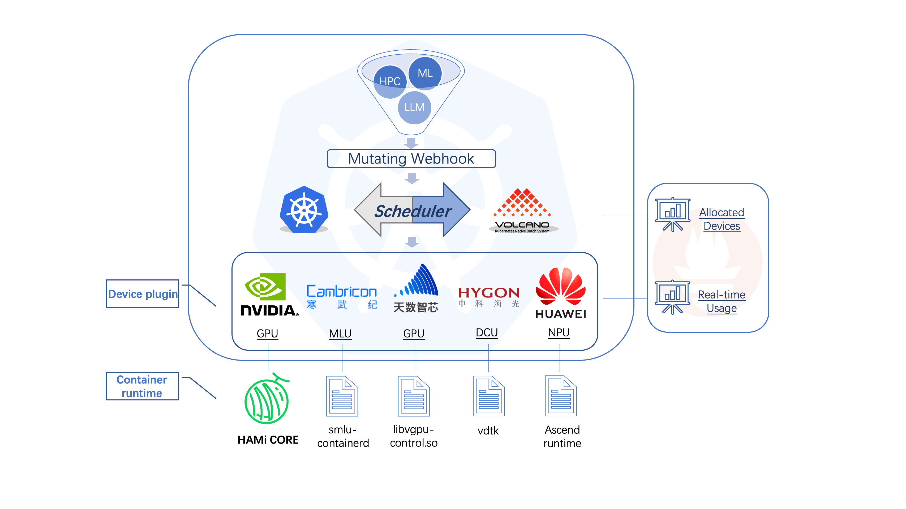
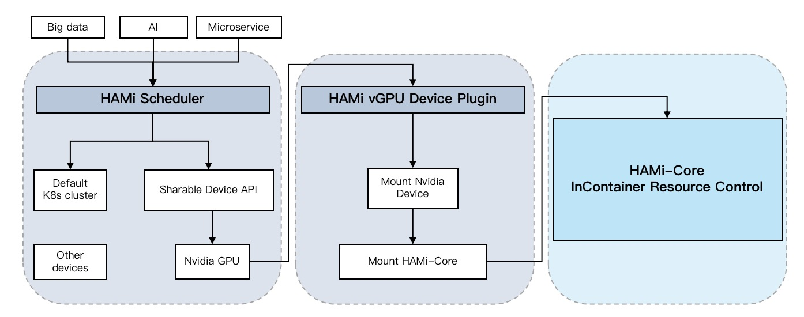
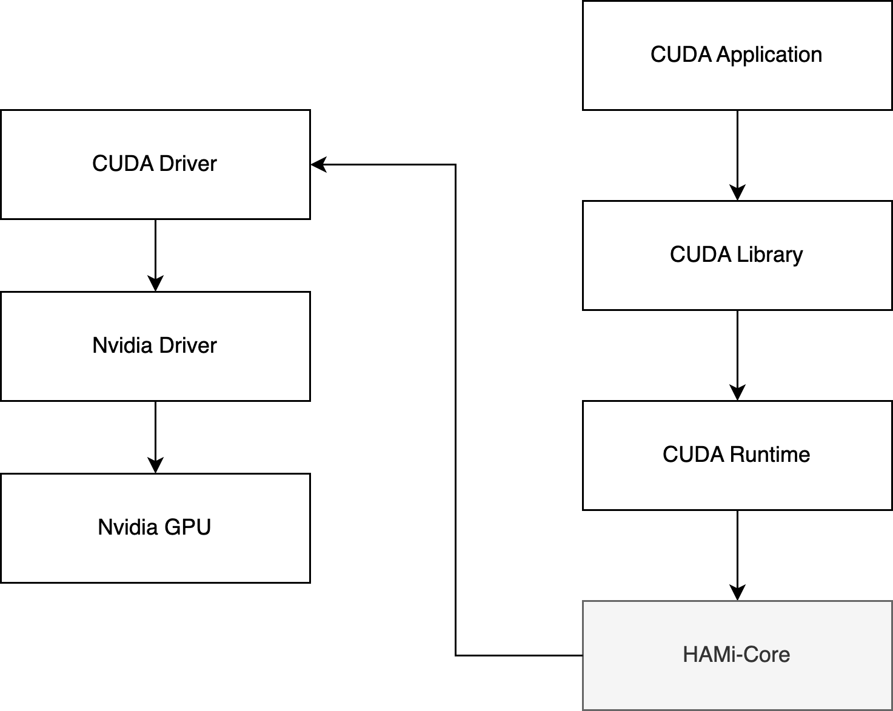

# [HAMI](https://project-hami.io/)

> Open, Device Virtualization, VGPU, Heterogeneous AI Computing

异构AI计算虚拟化中间件



## 架构

有三部分组成：

- HAMi Scheduler：调度器扩展
- HAMi vGPU Device Plugin：设备插件
- HAMi Core：容器内资源控制



### HAMi Scheduler

`MutatingWebhook`识别由 HAMi 处理的Pod，将 pod的`scheduelrName`设置为`HAMi-scheduler`。

`HAMi Scheduler`负责将任务分配给适当的节点和设备。同时，调度器需要维护异构计算设备的全局视图以进行监视。

### HAMic Device Plugin

设备插件层从任务的注释字段中获取调度结果，并将相应的设备映射到容器。

### HAMi Core

HAMi 实现 **GPU core 和 memory 隔离、限制**是使用的 vCUDA 方案（Cuda API 劫持），流程如下：

- 检测到 Pod 中使用的内存超过了 Resource 中的申请量就直接返回 OOM，从而实现资源的一个限制；
-  nvidia-smi 命令查看 GPU 信息时，也只返回 Pod Resource 中申请的资源，这样在查看时也进行隔离。




## 使用

### 示例

```yaml
apiVersion: v1
kind: Pod
metadata:
  name: gpu-pod
spec:
  containers:
    - name: ubuntu-container
      image: ubuntu:18.04
      command: ["bash", "-c", "sleep 86400"]
      resources:
        limits:
          nvidia.com/gpu: 1 # 请求1个vGPUs
          nvidia.com/gpumem: 3000 # 每个vGPU申请3000m显存 （可选，整数类型）
          nvidia.com/gpucores: 30 # 每个vGPU的算力为30%实际显卡的算力 （可选，整数类型）
```


### 跟 Volcano 集成

> [How to use volcano vgpu | HAMi](https://project-hami.io/zh/docs/userguide/volcano-vgpu/NVIDIA GPU/how-to-use-volcano-vgpu)

使用volcano-vgpu时*不*需要安装HAMi，只需使用 [Volcano vgpu device-plugin](https://github.com/Project-HAMi/volcano-vgpu-device-plugin) 。它可以为Volcano管理的NVIDIA设备提供设备共享机制。