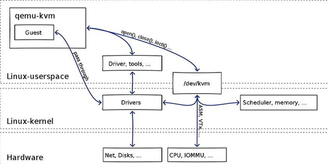
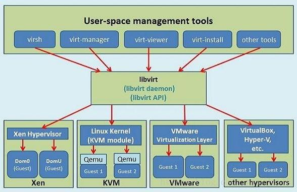

# 虚拟化

## KVM

KVM是linux内核的模块，它需要CPU的支持，采用硬件辅助虚拟化技术Intel-VT，AMD-V， 内存的相关如Intel的EPT和AMD的RVI技术，Guest OS的CPU指令不用再经过Qemu转译，直接运行，大大提高了速度， KVM通过/dev/kvm暴露接口，用户态程序可以通过ioctl函数来访问这个接口。

- 只能提供CPU和内存的虚拟化，必须结合QEMU才能构成一个完成的虚拟化技术；
- 简单直接的理解就是：QEMU是个计算机模拟器，而KVM为计算机的模拟提供加速功能。

## Qemu

> A generic and open source machine emulator and virtualizer.

Qemu 是纯软件实现的虚拟化模拟器，几乎可以模拟任何硬件设备。

- 所有的指令都要经 Qemu 过一手，性能非常低；

- 生产环境中配合 KVM 来完成虚拟化（硬件辅助的虚拟化，负责 比较繁琐的 CPU 和内存虚拟化），而 Qemu 则负责 I/O 虚拟化；

### 架构

从本质上看，虚拟出的每个**虚拟机对应 host 上的一个 Qemu 进程**，而虚拟机的**执行线程（如 CPU 线程、I/O 线程等）对应 Qemu 进程的一个线程**。

思路是采用二进制指令翻译技术，主要是提取 guest 代码，然后将其翻译成 TCG 中间代码，最后再将中间代码翻译成 host 指定架构的代码。

### Qemu-kvm

Qemu将KVM整合进来，通过ioctl调用/dev/kvm接口，将有关CPU指令的部分交由内核模块来做。

Qemu模拟其他的硬件，如Network, Disk，同样会影响这些设备的性能， 于是又产生了pass through半虚拟化设备virtio_blk, virtio_net，提高设备性能。

## Libvirt

libvirt是目前使用最为广泛的**对KVM虚拟机进行管理的工具和API**。Libvirtd是一个daemon进程， 可以被本地的virsh调用，也可以被远程的virsh调用，Libvirtd调用qemu-kvm操作虚拟机。

- libvirt 管理诸如QEMU/KVM，Xen,VMWare、Microsoft Hyper-V、IBM PowerVM等平台的hypervisor。也可以管理LXC、OpenVZ容器等

## OCI

Open Container Initiative即开放容器计划。目前主要有两个标准文档：`容器运行时标准(runtime spec)`和`容器镜像标准(image spec)`

-  `Runtime spec`：`容器运行时标准`，定义了容器状态和配置文件格式，容器生命周期管理命令格式和参数等。
- `image spec`：`镜像标准包`，定义了容器镜像的文件系统、config 文件、manifest 文件、index 文件等。

## 容器生态

容器镜像标准（image spec）。

### 容器运行时标准

容器运行时标准 （runtime spec）的实现：

- Low-Level 容器运行时：负责为容器建立namespaces和cgroups
  - runc：容器运行时，如runc
  - runv：基于虚拟机的运行时，通过虚拟化 guest kernel，将容器和主机隔离开来，如 kata, Firecracker
  - runsc：runc + safety，如gvisor，通过拦截应用程序的所有系统调用，提供安全隔离的轻量级容器运行时沙箱。
- High-Level容器运行时：除了LowLevel，还需**镜像格式、镜像管理和共享镜像**相关的API接口和特性
  - dockershim
  - containerd
  - cri-o

Kubernetes 只需支持 containerd 等high-level container runtime即可。

**Docker Vs ContainerD Vs crio**

#### [Runc](https://github.com/opencontainers/runc)

> CLI tool for spawning and running containers according to the OCI specification.
>
> Please note that runc is **a low level tool not designed with an end user** in mind. 

- runc fully supports cgroup v2 (unified mode) since v1.0.0-rc93

> In order to enable seccomp support you will need to install libseccomp on your platform.
>
> —runc需要seccomp的支持，seccomp是一个Linux系统调用的“管理过滤”工具，可以认为它限制应用的权限

 **容器运行时标准**的参考实现：

- 从 Docker 的 libcontainer 中迁移而来的，实现了容器启停、资源隔离等功能。

#### [Containerd](./containerd.md)

> [An open and reliable container runtime. ](https://github.com/containerd/containerd)CNCF gradulated project.

containerd 是一个工业级标准的容器运行时，它强调**简单性**、**健壮性**和**可移植性**，其功能包括：

- 管理容器的生命周期（从创建容器到销毁容器）
- 拉取/推送容器镜像
- 存储管理（管理镜像及容器数据的存储）
- 调用 runc 运行容器（与 runc 等容器运行时交互）
- 管理容器网络接口及网络

#### [cri-o](https://github.com/cri-o/cri-o)

> Open Container Initiative-based implementation of Kubernetes Container Runtime Interface.

#### [Kata](https://github.com/kata-containers/kata-containers)

> Kata Containers is an open source project and community working to build a standard implementation of **lightweight Virtual Machines (VMs)** that feel and perform like containers, but provide the workload isolation and security advantages of VMs.

#### [Gvisor](https://github.com/google/gvisor)

> Application Kernel for Containers.
>
> gVisor is an application kernel, written in Go, that implements a substantial portion of the [Linux system call interface](https://en.wikipedia.org/wiki/Linux_kernel_interfaces). It provides an additional layer of isolation between running applications and the host operating system.
>
> gVisor includes an [Open Container Initiative (OCI)](https://www.opencontainers.org/) runtime called `runsc` that makes it easy to work with existing container tooling. The `runsc` runtime integrates with Docker and Kubernetes, making it simple to run sandboxed containers.

### 其它

#### [Podman](https://podman.io/)

Podman 可以**管理和运行**任何符合 OCI（Open Container Initiative）规范的容器和容器镜像。Podman 提供了一个与 Docker 兼容的命令行前端来管理 Docker 镜像。

- 不需要在你的系统上运行任何守护进程，并且它也可以在没有 root 权限的情况下运行。