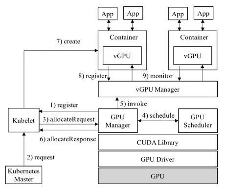

# GPU 虚拟化和共享

docker 原生可以通过 ``--device /dev/nvidia0:/dev/nvidia0`的方式，支持GPU使用和隔离，但是无法**对GPU 可用性做判断**。

## 虚拟化

### Nvidia GPU

#### 安装使用

[Installing the NVIDIA Container Toolkit — NVIDIA Container Toolkit 1.17.0 documentation](https://docs.nvidia.com/datacenter/cloud-native/container-toolkit/latest/install-guide.html)

#### 原理

[libnvidia-container](https://github.com/NVIDIA/libnvidia-container)

- 提供一个库和简单的CLI工具，以**实现在容器当中支持使用GPU设备的目标**。

[nvidia-container-toolkit](https://github.com/NVIDIA/nvidia-container-toolkit)

- 包含 [nvidia-container-runtime](https://github.com/NVIDIA/nvidia-container-runtime) 和 [nvidia-docker](https://github.com/NVIDIA/nvidia-docker)；
- 实现`runC prestart hook`接口的脚本：该脚本在runC创建一个容器之后，启动该容器之前调用，其主要作用就是修改与容器相关联的config.json，注入一些在容器中使用NVIDIA GPU设备所需要的一些信息（比如：需要挂载哪些GPU设备到容器当中）；
- 将容器runC spec作为输入，然后将`nvidia-container-toolkit`脚本作为一个`prestart hook`注入到runC spec中，将修改后的runC spec交给runC处理。
- CUDA Runtime API和CUDA Libraries通常跟应用程序一起打包到镜像里，而**CUDA Driver API是在宿主机里，需要将其挂载到容器里**才能被使用。


正常创建一个容器的流程：

> docker --> dockerd --> containerd–> containerd-shim -->runc --> container-process

创建一个使用GPU的容器

> docker–> dockerd --> containerd --> containerd-shim–> nvidia-container-runtime --> nvidia-container-runtime-hook --> libnvidia-container --> runc – > container-process


### AMD GPU

[ROCm/ROCm-docker: Dockerfiles for the various software layers defined in the ROCm software platform](https://github.com/ROCm/ROCm-docker)


## 共享

GPU 天然适合向量计算。常用场景及 API：

| 场景         | API                    |
| ------------ | ---------------------- |
| 游戏渲染     | OpenGL，DirectX，Metal |
| 媒体编解码   | VAAPI，VDPAU           |
| 深度学习计算 | Cuda，OpenCL           |

基本痛点：

- 容器的GPU利用率不够高，特别是推理任务；
- 为了提高GPU的利用率、避免算力浪费，需要在单个GPU上运行多个容器；


### Nvidia 方案


#### 分时共享

> [Time-Slicing GPUs in Kubernetes — NVIDIA GPU Operator 23.9.1 documentation](https://docs.nvidia.com/datacenter/cloud-native/gpu-operator/latest/gpu-sharing.html)
>
> [NVIDIA/k8s-device-plugin: NVIDIA device plugin for Kubernetes (github.com)](https://github.com/NVIDIA/k8s-device-plugin?tab=readme-ov-file#shared-access-to-gpus-with-cuda-time-slicing)

时间片利用 GPU 时间片调度程序，它通过**时间共享并发**执行多个 CUDA 进程。

- 基本上每个 GPU 架构都支持时间分片；
- 进程之间的不断切换会产生计算时间开销；
- 共享 GPU 的进程之间**不提供任何级别的内存隔离**，也不会**提供任何内存分配限制**，导致OOM。

部署 nvidia gpu plugin 时，将 gpu 划分为 100 份

```yaml
apiVersion: v1
kind: ConfigMap
metadata:
  name: nvidia-config
  namespace: kube-system
data:
  config: |
    {
       "version": "v1",
       "sharing": {
         "timeSlicing": {
           "resources": [
             {
               "name": "nvidia.com/gpu",
               "replicas": 10,
             }
           ]
         }
       }
    }
```

#### 多实例 GPU

> NVIDIA Ampere和Hopper架构上可用的一项技术，它允许将 GPU 安全地划分为最多七个独立的 GPU 实例，每个实例都完全隔离，具有自己的高带宽内存、缓存和计算核心。

孤立的 GPU 切片称为 MIG 设备，它们的命名采用指示设备的计算和内存资源的格式

- `2g.20gb` 对应具有 20 GB 内存的 GPU 切片；
- 缺乏灵活性，并且仅与少数 GPU 架构（Ampere 和 Hopper）兼容；

#### 多进程服务MPS

将多个进程的 CUDA Context，合并到一个 CUDA Context 中：

- 省去 Context Switch 的开销；
- Context 内部实现了算力隔离；
- 无显存隔离，导致额外的故障传播；

#### vGPU（不开源）

> 不支持容器。

具有**完全输入输出内存管理单元（ IOMMU ）保护的虚拟机**能够同时直接访问单个物理 GPU 。


### 内核等劫持方案

分为：CUDA API 层劫持 和 GPU 驱动层（Nvidia Driver）劫持

- cGPU（阿里云）：内核劫持（在Nvidia Driver层），不开源；
- qGPU（腾讯）：内核劫持，GPU共享和算力隔离，不开源；
- vCUDA（腾讯TKE）：CUDA劫持，GPU共享和算力隔离；
- vGPU（第四范式）：CUDA劫持，GPU共享和算力隔离；
- [AliyunContainerService/*gpushare*-scheduler-extender](https://github.com/AliyunContainerService/gpushare-scheduler-extender)：GPU共享，不支持算力隔离；
- [elastic-ai](https://github.com/elastic-ai)/**[elastic-gpu](https://github.com/elastic-ai/elastic-gpu)**：统一的虚拟化gpu调度方式，支持 qGPU，vCuda等；


#### 腾讯TKE的vCUDA（开源）

> https://github.com/tkestack/vcuda-controller
>
> https://github.com/tkestack/gpu-manager
>
> https://github.com/tkestack/gpu-admission

##### 资源隔离

在Cuda driver API之上，它通过劫持对Cuda driver API的调用来做到资源隔离。

1）对于显存，一旦该任务申请显存后占用的显存大小大于config中的设置，就报错。

2）对于计算资源，存在硬隔离和软隔离两种方式，共同点是当任务使用的GPU SM利用率超出资源上限，则暂缓下发API调用。不同点是如果有资源空闲，软隔离允许任务超过设置，动态计算资源上限。而硬隔离则不允许超出设置量。



##### 并行模式

分时复用的模式，单个任务完成时间（JCT）都会受到较大的影响。


#### [HAMi 第4范式vGPU（开源）](https://github.com/4paradigm/k8s-device-plugin/)

> 包含 vgpu-device-plugin 和 vgpu-scheduler。
>
> 现已改名 [HAMi](https://github.com/Project-HAMi/HAMi) 同时也将核心的 vCUDA 库 libvgpu.so开源。

vgpu-device-plugin：基于NVIDIA官方插件(NVIDIA/k8s-device-plugin)，在保留官方功能的基础上，实现了对物理GPU进行切分，并对显存和计算单元进行限制，从而模拟出多张小的vGPU卡。

- **显存隔离使用的是经典CUDA劫持方法，通过预估获得context大小；使用监控隔离的方案隔离算力**

vgpu-scheduler：在原有显卡分配方式的基础上，可以进一步根据显存和算力来切分显卡，**并实现多个GPU节点间的负载均衡**。

在k8s集群中，基于这些切分后的vGPU进行调度，使不同的容器可以安全的共享同一张物理GPU，提高GPU的利用率。

此外，插件还可以对显存做虚拟化处理（使用到的显存可以超过物理上的显存），运行一些超大显存需求的任务，或提高共享的任务数，可参考性能测试报告。

##### 使用场景

1. 显存、计算单元利用率低的情况，如在一张GPU卡上运行10个tf-serving；
2. 需要大量小显卡的情况，如教学场景把一张GPU提供给多个学生使用、云平台提供小GPU实例；
3. 物理显存不足的情况，可以开启虚拟显存（超过的部分会放到内存里，对性能有一定的影响），如大batch、大模型的训练；
4. 需要定制GPU申请的场合，如申请特定大小的vGPU，每个vGPU使用特定比例的算力。
5. 在多个GPU节点组成的集群中，任务需要根据自身的显卡需求分配到合适的节点执行。

##### 功能

- 指定每张物理GPU切分的最大vGPU的数量
- 限制vGPU的显存
- 允许通过指定显存来申请GPU
- 限制vGPU的计算单元
- 允许通过指定vGPU使用比例来申请GPU
- 对已有程序零改动

##### 已知问题

- 目前仅支持计算任务，不支持视频编解码处理。
- 暂时仅支持MIG的"none"和"mixed"模式，暂时不支持single模式
- 当任务有字段“nodeName“时会出现无法调度的情况，有类似需求的请使用"nodeSelector"代替

