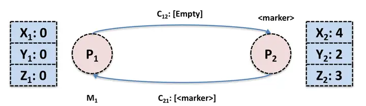
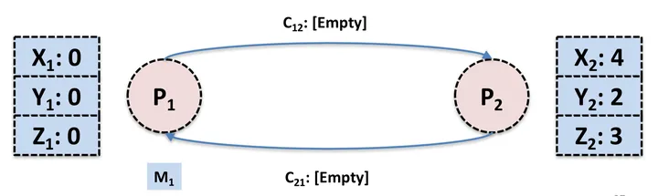

# [分布式快照 Chandy-Lamport 算法](https://www.alipan.com/s/ULnkBrMdWXK)

## 1. Overview

> A snapshot algorithm is used to create a consistent snapshot of the global state of a distributed system. Due to the lack of globally shared memory and a global clock, this isn't trivially possible.

分布式快照算法用来在**缺乏类似全局时钟或者全局时钟不可靠**的分布式系统中来确定一种全局状态。

分布式快照算法应用到流式系统中就是确定一个 Global 的 Snapshot，错误处理的时候各个节点根据上一次的 Global Snapshot 来恢复。

## 2. Global Snapshot

Global Snapshot，即 Global State（全局状态），常用于在系统做 Failure Recovery 的时候。

分布式系统的全局状态的定义：先将分布式系统简化成**有限个进程和进程之间的 channel 组成**，也就是一个有向图

- 节点是进程，边是 channel（分为 input channel 和 output channel）；
- 一个分布式系统的全局状态就是由**进程的状态和 channel 中的 message **组成；

> channel 表示的是发送消息的通道（可以等价于TCP连接），并不是发送消息和接受响应消息是两个channel。

## 3. Chandy-Lamport 算法

> 可以处理环形的图。

> 算法假定：
>
> - Channel 是一个容量无限大的 FIFO 队列
> - 收到的 message 都是有序且无重复的

局部快照：每个进程的 local state 和它的 input channel 中有序的 message。

全局快照：所有的进程的局部快照合并起来。

- 唯一的问题是**如何确定同一时刻的局部快照**；

算法流程分为以下三部分：

- **Initiating a snapshot**: 也就是开始创建 snapshot，可以由系统中的任意一个进程发起
- **Propagating a snapshot**: 系统中其他进程开始逐个创建 snapshot 的过程
- **Terminating a snapshot**: 算法结束条件

### 初始化快照

进程 $P_i$ 发起：记录自己的进程状态，同时生产一个标识信息 marker，marker 和进程通信的 message 不同

- 将 marker 信息通过 **ouput channel** 发送给系统里面的其他进程
- 开始**记录所有 input channel 接收到的 message**

###  传播快照

> marker 当作一个分隔符，分割进程做 local snapshot（记录进程状态）的message；

进程 $P_j$：从 input channel $C_{kj}$（来自于进程$P_k$）接收到 marker 信息

- 如果，$P_j$还没有记录自己的进程状态

  - Pj 记录自己的进程状态，同时将 input channel $C_{kj}$ 置为空
  - 向 output channel 发送 marker 信息

- 否则
  - 更新 input channel $C_{kj}$的状态为：从$P_j$记录自己的状态后收到的第一条消息，到收到marker之前的最后一条 message

### 结束快照

**所有的进程都收到 marker 信息并且记录下自己的状态和 channel 的状态**（包含的 message）。

- 每个进程可以将状态存储在 DB/FS 上。

### 疑问

1. 有向图，快照是从哪一个节点发起？
   - 无环的图：从根节点发送（DAG拓扑序）；
   - 有环的图：任意一个节点，都可以发起，因为图是连通的；
2. 如果$P_j$从多个链路收到了同样的marker，应该如何处理自身的状态？
   - 收到第一个marker时，就记录自身的状态（且将接受到第一个marker的input channel-x的channel snapshot记为空)；

## 4. 示例

假设系统中包含两个进程 $P_1$ 和 $P_2$，初始状态如下：

- $P_1$ 进程状态包括三个变量 $X_1,Y_1,Z_1$； $P_2$ 进程包括三个变量 $X_2,Y_2,Z_2$；

由 $P_1$ 发起全局 Snapshot 记录，$P_1$ 先记录本身的进程状态，然后向  $P_2$ 发送 marker 信息。在 marker 信息到达  $P_2$ 之前， $P_2$ 向 $P_1$ 发送 message: M。

 $P_2$ 收到 $P_1$ 发送过来的 marker 信息

- 记录自己的状态。

$P_1$ 收到  $P_2$ 之前发送过来的 message: M

- 对于$P_1$ 来说，从  $P_2$ channel 发送过来的信息相当于是 [M, marker]，由于  $P_1$ 已经做了 local snapshot，所以 $P_1$ 需要记录 message M。

那么全局 Snapshot 就相当于下图中的蓝色部分。

## 5. 参考文献

1. *Distributed Snapshots: Determining Global States of a Distributed System*, https://lamport.azurewebsites.net/pubs/chandy.pdf
2. 分布式快照算法 Chandy-Lamport：https://github.com/legendtkl/paper_reading/blob/main/realtime-compute/Chandy-Lamport.md