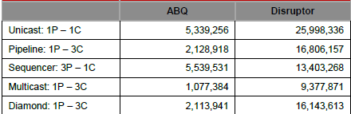

# 队列


## 并发队列

单个生产-消费者队列，可以通过内存屏障（Java volatile）实现，而不需要CAS和锁。

### 锁的代价

自增 64-bit 位计数器 500,000,000 次，不同实现的性能。

| Method                                | Time (ms) |
| ------------------------------------- | --------- |
| **Single thread**                     | 32        |
| Single thread with lock               | 8200      |
| Two threads with lock                 | 44,000    |
| **Single thread with CAS**            | 2,700     |
| Two threads with CAS                  | 11,000    |
| **Single thread with volatile write** | 2,700     |

### CAS代价

CAS方法比锁有效得多，因为它**不需要切换到内核**进行仲裁。锁定它的指令管道以确保原子性，并使用**内存屏障使更改对其他线程可见**。

如果程序的关键部分比计数器的简单增量更复杂，则可能需要使用使用多个CAS操作的复杂状态机来编排争用。

### 内存屏障

现代处理器执行指令的乱序执行以及内存和执行单元之间的乱序加载和数据存储，处理器只需要保证不管执行顺序如何，程序逻辑都会产生相同的结果。

cpu使用复杂的高速缓存系统，缓存通过消息传递协议与其他处理器缓存系统保持一致。处理器有“存储缓冲区”来卸载对这些缓存的写操作，并“使队列失效”。

**对于数据来说，这意味着任何值的最新版本，在写入后的任何阶段，都可以在寄存器、存储缓冲区、多层缓存中的一个或主存中。**

**如果线程要共享这个值，就需要以有序的方式使其可见，这可以通过缓存一致性消息的协调交换来实现。这些消息的及时生成可以通过内存屏障来控制。**

A **read memory barrier orders** load instructions on the CPU that executes it by marking a point in the invalidate queue for changes coming into its cache. This gives it a consistent view of the world for **write operations ordered before the read barrier**.

A **write barrier orders** store instructions on the CPU that executes it by marking a point in the store buffer, thus flushing writes out via its cache. This barrier gives an ordered view to the world of what **store operations happen before the write barrier**.

A **full memory barrier orders** both loads and stores but only on the CPU that executes it.

在Java内存模型中(从Java 5开始)，volatile字段的读和写分别实现了读和写屏障。

### 缓存行

#### 伪共享

为了提高效率，缓存被组织成大小通常为32-256字节的缓存行，最常见的缓存行是64字节。这是缓存一致性协议操作的粒度级别。

**如果两个变量在同一缓存行中，并且它们被不同的线程写入，那么它们就会像单个变量一样出现写争用的问题。**

**如果要尽量减少争用，确保独立但并发写入的变量不共享相同的缓存行是很重要的。**

在jdk1.8中，有专门的注解**@Contended来避免伪共享**，更优雅地解决问题。

### 队列的问题

一般来说，**队列是被限制为有限队列**，防止出现灾难性的异常。

队列实现往往在**头部（head）、尾部（tail）和大小变量（size）上存在写争用**。

队列在使用的时候，往往是空的或者满的，很少在生产和消费速度相等的平衡中间地带运作。

**即使使用不同的并发对象(如锁或CAS变量)将头部和尾部机制分离，它们通常也会占用相同的缓存行。**


## Java内置队列

| 队列                  | 有界性             | 锁          | 数据结构   |
| :-------------------- | :----------------- | :---------- | :--------- |
| ArrayBlockingQueue    | bounded            | 加锁        | arraylist  |
| LinkedBlockingQueue   | optionally-bounded | 加锁        | linkedlist |
| ConcurrentLinkedQueue | unbounded          | 无锁（CAS） | linkedlist |
| LinkedTransferQueue   | unbounded          | 无锁（CAS） | linkedlist |
| PriorityBlockingQueue | unbounded          | 加锁        | heap       |
| DelayQueue            | unbounded          | 加锁        | heap       |


## [LAMX Disruptor](https://github.com/lmax-exchange/disruptor)

> High Performance Inter-Thread Messaging Library.

设计目标：maximize the efficiency of **memory allocation**, and operate in a **cache-friendly** manner.

核心实现：**pre-allocated bounded** data structure in the form of a **ring-buffer**.

### 内存分配

所有用于环缓冲区（ring-buffer）的内存都是在**启动时预先分配**。

- 这种**预分配条目**消除了支持垃圾收集的语言中的问题，因为**条目将被重用**，并且在Disruptor实例的持续时间内存在；
- 条目的内存是同时分配的，很有可能在主存中连续分布，从而支持cache striding；
- **value types**: Java引入，支持arrays of tuples，保证内存可以持续分配，避免间接指针。

### 优化方法

在大多数处理器上，对序列号进行取余计算的成本非常高：

- 通过设置**ring-size为2的幂次**，可以通过位操作计算取余；
- 下标采取递增的形式。不用担心index溢出的问题。**index是long类型**，即使100万QPS的处理速度，也需要30万年才能用完。

每个**生产者或者消费者线程，会先申请可以操作的元素在数组中的位置**，申请到之后，直接在该位置写入或者读取数据。

生产者**将相互竞争来声明环缓冲区中的下一个条目**：

- 通过 CAS 操作来管理声明下一个可用条目的争用。

消费者在读取该条目之前，要等待一个序列在环缓冲区中可用，在等待的过程中可以使用各种策略：

- 如果CPU资源很宝贵，它们可以等待一个锁内的条件变量，这个锁由生产者发出信号；
- 可以循环检查表示环缓冲区中当前可用序列的游标。

没有锁的多生产者-多消费者队列确实存在，但它们需要对头部、尾部和大小计数器进行多个CAS操作，Disruptor并没有使用。

### 实现

#### 多个生产者

遇到“**如何防止多个线程重复写同一个元素**”的问题

- **每个线程获取不同的一段数组空间进行操作**。在分配元素的时候，通过CAS判断一下这段空间是否已经分配出去即可。

如何防止读取的时候，读到还未写的元素。

- 引入一个与Ring Buffer大小相同的buffer：Available Buffer。当某个位置写入成功的时候，便把Available Buffer相应的位置置位，标记为写入成功。读取的时候，会遍历available Buffer，来判断元素是否已经就绪。

#### 读数据

生产者多线程写入的情况会复杂很多：

1. 申请读取到序号n；
2. 若writer cursor >= n，这时仍然无法确定连续可读的最大下标。从reader cursor开始读取available Buffer，一直查到第一个不可用的元素，然后返回最大连续可读元素的位置；
3. 消费者读取元素。

如下图所示，读线程读到下标为2的元素，三个线程Writer1/Writer2/Writer3正在向RingBuffer相应位置写数据，写线程被分配到的最大元素下标是11。

读线程申请读取到下标从3到11的元素，判断writer cursor>=11。然后开始读取availableBuffer，从3开始，往后读取，发现下标为7的元素没有生产成功，于是WaitFor(11)返回6。

然后，消费者读取下标从3到6共计4个元素。


#### 写数据

多个生产者写入的时候：

1. 申请写入m个元素；
2. 若是有m个元素可以写入，则返回最大的序列号。每个生产者会被分配一段独享的空间；
3. 生产者写入元素，写入元素的同时设置available Buffer里面相应的位置，以标记自己哪些位置是已经写入成功的。

如下图所示，Writer1和Writer2两个线程写入数组，都申请可写的数组空间。Writer1被分配了下标3到下表5的空间，Writer2被分配了下标6到下标9的空间。

Writer1写入下标3位置的元素，同时把available Buffer相应位置置位，标记已经写入成功，往后移一位，开始写下标4位置的元素。Writer2同样的方式。最终都写入完成。


### 等待策略

#### 生产者的等待策略

暂时只有休眠1ns。

```java
LockSupport.parkNanos(1);
```

#### 消费者的等待策略

| 名称                        | 措施                      | 适用场景                                                     |
| :-------------------------- | :------------------------ | :----------------------------------------------------------- |
| BlockingWaitStrategy        | 加锁                      | CPU资源紧缺，吞吐量和延迟并不重要的场景                      |
| BusySpinWaitStrategy        | 自旋                      | 通过不断重试，减少切换线程导致的系统调用，而降低延迟。推荐在线程绑定到固定的CPU的场景下使用 |
| PhasedBackoffWaitStrategy   | 自旋 + yield + 自定义策略 | CPU资源紧缺，吞吐量和延迟并不重要的场景                      |
| SleepingWaitStrategy        | 自旋 + yield + sleep      | 性能和CPU资源之间有很好的折中。延迟不均匀                    |
| TimeoutBlockingWaitStrategy | 加锁，有超时限制          | CPU资源紧缺，吞吐量和延迟并不重要的场景                      |
| YieldingWaitStrategy        | 自旋 + yield + 自旋       | 性能和CPU资源之间有很好的折中。延迟比较均匀                  |

### 案例

`Log4j 2`相对于`Log4j 1`最大的优势在于多线程并发场景下性能更优。该特性源自于`Log4j 2`的异步模式采用了Disruptor来处理。 在`Log4j 2`的配置文件中可以配置WaitStrategy，默认是Timeout策略。

### 示例

```xml
<dependency>
    <groupId>com.lmax</groupId>
    <artifactId>disruptor</artifactId>
    <version>3.4.4</version>
</dependency>
```


单生产者和单消费者示例：

```java
// Callback handler which can be implemented by consumers
final BatchHandler<ValueEntry> batchHandler = new BatchHandler<ValueEntry>() {
    public void onAvailable(final ValueEntry entry) throws Exception {
        // process a new entry as it becomes available.
    }
    public void onEndOfBatch() throws Exception {
        // useful for flushing results to an IO device if necessary.
    }
    public void onCompletion() {
        // do any necessary clean up before shutdown
    }
};
RingBuffer<ValueEntry> ringBuffer = new RingBuffer<ValueEntry>(ValueEntry.ENTRY_FACTORY, SIZE, ClaimStrategy.Option.SINGLE_THREADED, WaitStrategy.Option.YIELDING);
ConsumerBarrier<ValueEntry> consumerBarrier = ringBuffer.createConsumerBarrier();
BatchConsumer<ValueEntry> batchConsumer = new BatchConsumer<ValueEntry>(consumerBarrier, batchHandler);
ProducerBarrier<ValueEntry> producerBarrier = ringBuffer.createProducerBarrier(batchConsumer);
// Each consumer can run on a separate thread
EXECUTOR.submit(batchConsumer);
// Producers claim entries in sequence
ValueEntry entry = producerBarrier.nextEntry();
// copy data into the entry container
// make the entry available to consumers
producerBarrier.commit(entry);
```

### 性能

吞吐量



延迟


loggers all async采用的是Disruptor，而Async Appender采用的是ArrayBlockingQueue队列。

由图可见，单线程情况下，loggers all async与Async Appender吞吐量相差不大，但是在64个线程的时候，loggers all async的吞吐量比Async Appender增加了12倍，是Sync模式的68倍。


