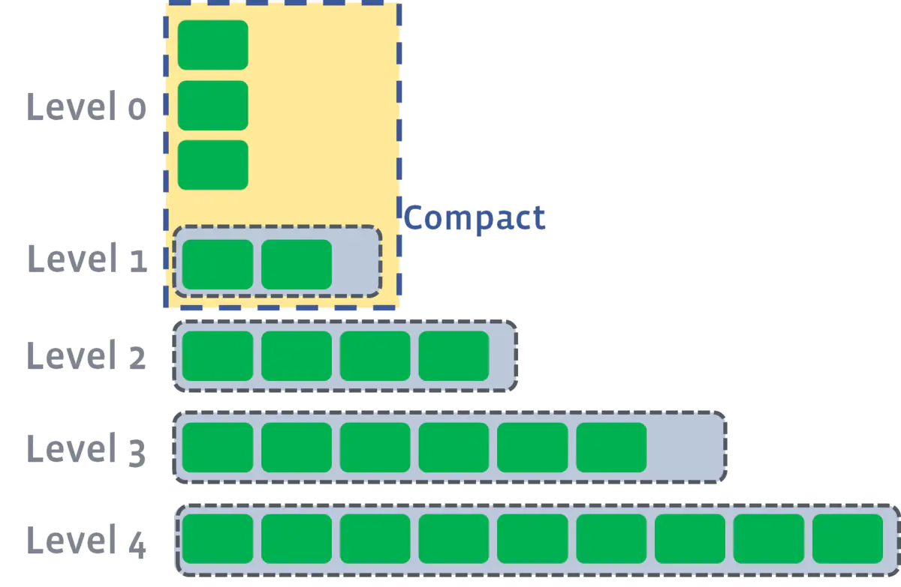
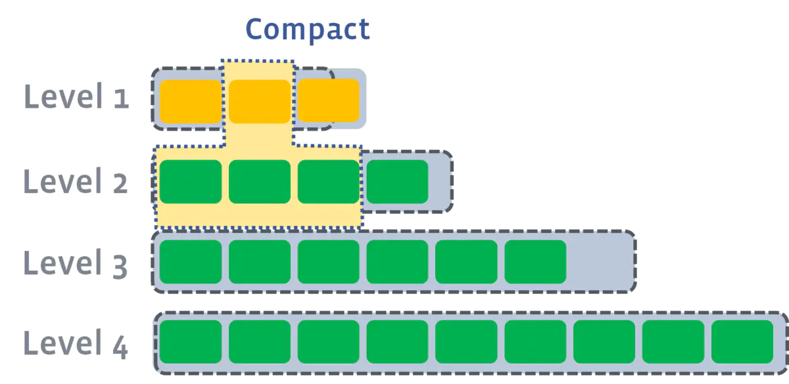
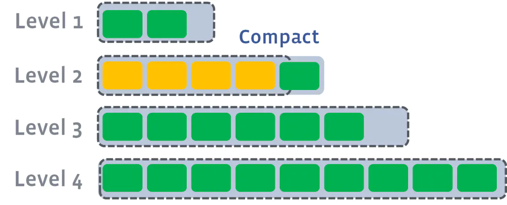

# 树结构

> 所有代码实现见 [Java数据结构与算法](https://gitee.com/oscsc/data-structure-and-algorithm)

## 二叉树

> 二叉树：每个节点最多只有左、右两个子节点。
>
> 完全二叉树：只有最后一层的也在

树的遍历：

- 前序：根 -> 左 -> 右
- 中序：左 -> 根 -> 右
- 后序：左 -> 根 -> 右

### AVL树

### Huffman树

给定n个权值作为n个叶子结点，构造一棵二叉树，若该树的带权路径长度达到最小，称这样的二叉树为最优二叉树，也称为哈夫曼树(Huffman Tree)。哈夫曼树是带权路径长度最短的树，权值较大的结点离根较近。

每次选取权值最小的两个节点，构造树（左节点 < 右节点）

Huffman编码

### 红黑树

定义：

- 节点是红色或黑色；
- 根节点是黑色；
- 每个叶节点（NIL节点，空节点）是黑色的；
- 每个红色节点的两个子节点都是黑色。(从每个叶子到根的所有路径上不能有两个连续的红色节点)；
- 从任一节点到其每个叶子的所有路径都包含相同数目的黑色节点。

### 线段树

> 能用树状数组解决的，线段树都可以；反之不然。树状数组节省空间开销，树状数组相当于线段树中每个节点去掉右儿子。

用于维护**区间信息**（要求满足结合律）。与树状数组相比，它可以实现 Olg(n) 的**区间修改**，还可以同时支持**多种操作**（加、乘)，更具通用性。线段树是一棵**平衡二叉树**：

- **母结点代表整个区间的和**，越往下区间越小；
- 线段树的每个**节点**都对应一条**线段（区间）**，但并不保证所有的线段（区间）都是线段树的节点
- 对于线段树中的每一个**非叶子节点[a,b]**，它的左儿子表示的区间为**[a,(a+b)/2]**，右儿子表示的区间为**[(a+b)/2+1,b]**

#### 原理

> 空间换时间，参考：https://zhuanlan.zhihu.com/p/106118909

就是**将[1,n]分解成若干特定的子区间（数量不超过4*n）**，然后，将每个区间[L,R]都分解为少量特定的子区间，通过对这些少量子区间的修改或者统计，来实现快速对[L,R]的修改或者统计。

用线段树统计的东西，必须**符合区间加法**，否则，不可能通过分成的子区间来得到[L,R]的统计结果。

符合区间加法的例子：

- 数字之和——总数字之和 = 左区间数字之和 + 右区间数字之和

- 最大公因数(GCD)——总GCD = gcd(左区间GCD , 右区间GCD);

- 最大值——总最大值=max(左区间最大值，右区间最大值)

不符合区间加法的例子：

-  众数——只知道左右区间的众数，没法求总区间的众数
-  01序列的最长连续零——只知道左右区间的最长连续零，没法知道总的最长连续零

“**懒标记**”（或延迟标记）：区间修改

- 朴素的想法是用**递归**的方式一层层修改（类似于线段树的建立），但这样的时间复杂度比较高；
- 使用懒标记，对于那些正好是线段树节点的区间，我们不继续递归下去，而是打上一个**标记**，将来要用到它的**子区间**的时候，再向下**传递**；
  - 向下延迟修改，但是向上显示的信息是修改以后的信息

标记有**相对标记**和**绝对标记**之分：**非递归线段树**只能维护相对标记。

**相对标记**是将区间的所有数+a之类的操作，标记之间可以共存，跟打标记的**顺序无关**（跟顺序无关才是重点）。

所以，可以在区间修改的时候不下推标记，留到查询的时候再下推。

**绝对标记**是将区间的所有数变成a之类的操作，打标记的顺序直接影响结果，

所以这种标记在区间修改的时候必须下推旧标记，不然会出错。

## B/B+/B*树

> 查找磁盘的过程中减少IO的次数。**每个节点对应一个Page**，数据以Page为单位在内存和磁盘间进行调度。

### B树(B-tree)

> 注意:之前有看到有很多文章把B树和B-tree理解成了两种不同类别的树，其实这两个是同一种树;

平衡多路查找树，**m阶的B树**满足下列条件：

- 树中每个结点至多有m个孩子；
- 除根结点和叶子结点外，其它每个结点至少有m/2个孩子；
- 若根结点不是叶子结点，则至少有2个孩子；
- 所有叶子结点(失败节点)都出现在同一层，叶子结点不包含任何关键字信息；
- 非叶子结点的指针：P[1], P[2], …, P[M]；其中P[1]指向关键字小于K[1]的子树，P[M]指向关键字大于K[M-1]的子树，其它P[i]指向关键字属于(K[i-1], K[i])的子树；

B树**每个节点都存储数据**，所有节点组成这棵树。

### B+树

B+树只有**叶子节点存储数据**。

所有**关键字都出现在叶子结点的链表**中（稠密索引），且链表中的关键字是有序的。

**非叶子结点的子树指针P[i]，指向关键字值属于 [K[i], K[i+1]) 的子树**（B-树是开区间）；

更适合文件索引系统？

- B+**树的层级更少**：相较于B树B+每个**非叶子**节点存储的关键字数更多，树的层级更少所以查询数据更快；
- B+**树查询速度更稳定**：B+所有关键字数据地址都存在**叶子**节点上，所以每次查找的次数都相同所以查询速度要比B树更稳定;
- B+**树天然具备排序功能：**B+树所有的**叶子**节点数据构成了一个有序链表，在查询大小区间的数据时候更方便，数据紧密性很高，缓存的命中率也会比B树高。
- B+**树全节点遍历更快：**B+树遍历整棵树只需要遍历所有的**叶子**节点即可，而不需要像B树一样需要对每一层进行遍历，这有利于数据库做全表扫描。

### B*树

B*树定义了非叶子结点关键字个数至少为(2/3)*M，即块的最低使用率为2/3（代替B+树的1/2）；

在B+树的非根和非叶子结点再**增加指向兄弟的指针**；

- B+树节点满时就会分裂，而B*树节点满时会检查兄弟节点是否满（因为每个节点都有指向兄弟的指针），如果兄弟节点未满则向兄弟节点转移关键字。

在B+树的基础上因其初始化的容量变大，使得节点空间使用率更高，而又存有兄弟节点的指针，可以向兄弟节点转移关键字的特性使得B*树额外分解次数变得更少；

## LSM树

- 将读写分离，**读操作先内存后磁盘、数据写操作（包括插入、修改、删除也是写）都在内存中**进行。到达**一定阈值的时候才会刷新到磁盘**上。在大规模情况下，寻道明显比传输低效。
- LSM树原理把一棵大树拆分成N棵小树，它首先写入内存中，随着小树越来越大，内存中的小树会flush到磁盘中，**磁盘中的树定期可以做merge操作**，合并成一棵大树，以优化读性能。
- LSM树（Log-Structured Merge Tree）存储引擎同样支持增、删、读、改、顺序扫描操作。而且通过批量存储技术**规避磁盘随机写入**问题。当然凡事有利有弊，LSM树和B+树相比，**LSM树牺牲了部分读性能，用来大幅提高写性能**。

### 内存

可以使用平衡二叉树（如红黑树）、跳表（skiplist）等维护有序的数据结构，考虑到并发性能，HBase使用跳表。

### 磁盘

多个内部KeyValue有序的文件组成

### Compaction

compaction的两个极端：

- 第一种极端（左上log方案），根本不做compaction，所有的数据全部写到Log然后灌入SStable，
  - update cost最低，不需compaction，直接Disk；
  - 查询一个K/V，线性查，效率非常低，且没有compaction的话数据会随着写入线性增长；
- 第二种极端（右下sorted array方案）, 每次写新的，立马就去做compaction，永远维持整个数据更新到最新值并且sorted状态，
  - 查询固然效率最高，直接按照index就行；
  - 每次写入整个数据都去调整、sort，update的花销太大。写入KPS一高，机器撑不住。

##### tiering compaction

- 每层允许的SST文件最大数量都有个相同的阈值；
- memtables 首先会不停flush 到第一层很小的sstables，等到sstable数量够了（图里4个），compaction成一个sstable写到下一层，下一层sstable写满4个，再compact，如此以往；
- ***能够保证每个sstable是sorted，但是同一层 sstable 的 key 会互相覆盖***（*overlapping*） 

##### Level compaction

在Disk 里面维持了多级level的SStable，而且每层维持“**唯一一个**”Run。

> Each run contains data ***sorted*** by the index key. A run can be represented on disk as a single file, or alternatively as a collection of files with ***non-overlapping*** key ranges.

compaction的过程可以简化成：**in memory的table写满了，那么就flush到第一级的Disk SStable并且做compaction，要是第一级又满了，就又开始flush到第二级做compaction，以此类推直到max level**

- **写满**的定义：sstables的大小基本固定，限制每一层的sstables的个数，***超过阈值后，选择一个sstable与下一层进行合并***（L1的一个sstable大致对应L2的10个sstable)；

**tiering跟leveling的compaction的对比：**

|                     | 优点                                                         | 缺点                                                         |
| ------------------- | ------------------------------------------------------------ | ------------------------------------------------------------ |
| tiering compaction  | 简单且易于实现； SST数目少，定位到文件的速度快 写放大较小  | 需要查询多个文件 单个SST的大小有可能会很大，空间放大严重 读放大严重 |
| leveling compaction | 空间放大较小 读放大较小                                 | 写放大严重                                                   |

**空间放大**（space amplification）:

- 指存储引擎中的数据实际占用的磁盘空间比数据的真正大小偏多的情况；

  - 例如，数据的真正大小是10MB，但实际存储时耗掉了25MB空间，那么空间放大因子（space amplification factor）就是2.5。

- tiering compaction 因为大的SSTable，需要更多的临时空间去合并；

- leveling compaction，不必再选取一层内所有的数据，并且每层中SST的key区间都是不相交的

**写放大（write amplification）**

- 指实际写入磁盘的记录数跟写入记录的比例，即同一个记录需要被多次写入Disk；
- 耗费磁盘带宽；存储介质的寿命降低；
- leveling compaction写放大严重：Ln层SST在合并到Ln+1层时是一对多的，故重复写入的次数会更多；

**读放大**

每次读请求带来的读盘次数

##### RocksDB的混合compaction策略（leveled compaction）

当L0层的文件数目达到`level0_file_num_compaction_trigger`阈值时，就会触发L0层SST合并到L1。

L1层及以后的compaction过程完全符合前文所述的leveled compaction逻辑，如下图所示，很容易理解。

多个compaction过程是可以并行进行。

## Fractal Tree(分形树)

索引结构来解决随机IO的问题，能让随机IO变成顺序IO。

## 跳表

> 高效实现插入、删除、查找的内存数据结构。复杂度期望为O(logN)

- 实现简单，并发场景下加锁的粒度更小；（HBase、Redis、LevelDB）

### 增

### 删

### 改/查