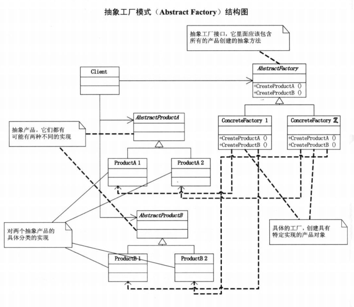

# 抽象工厂模式

## 意图

提供一个**接口以创建一系列相关或相互依赖的对象**，而无须执行他们具体的类（**围绕一个超级工厂创建其他工厂**）。

## 动机

针对产品C（如一套衣服搭配，包括帽子、上衣、裤子、鞋等），有多种实现（商务风、运动风、古风等），如：

*A系列：A_C1，A_C2，...；*

*B系列：B_C1，B_C2，...；*

A系列和B系列不可组合，必须全部用A，或者全部用B：

- 定义抽象的工厂，定义其A和B系列的实现工厂类，用户只操作这些工厂类；

## 类图

产品 A，B。

## 适用场景

- 一个系统独立于它的产品的创建、组合和表示；
- 一个系统由**多个产品系列中的一个**来配置；
- 强调一系列相关的产品对象的设计以便进行联合使用；
- 提供一个产品类库，但只想显示它们的接口而不是实现；
  - 系统的产品有多于一个的产品族，而系统只消费其中某一族的产品。

## 优缺点

**优点**：

- 具有工厂方法的可扩展性；
- 具有创建一组相关对象的能力。

**缺点：**

- 产品族扩展(纵向扩展）困难，要增加一个系列的某一产品，在抽象的工厂/具体的工厂加代码。

## 实例

1. QQ 换皮肤，一整套一起换；

2. 生成不同操作系统的程序。