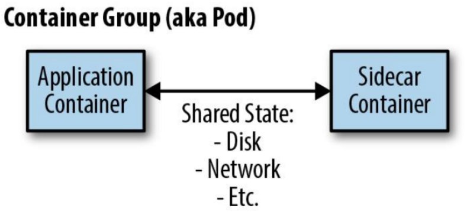
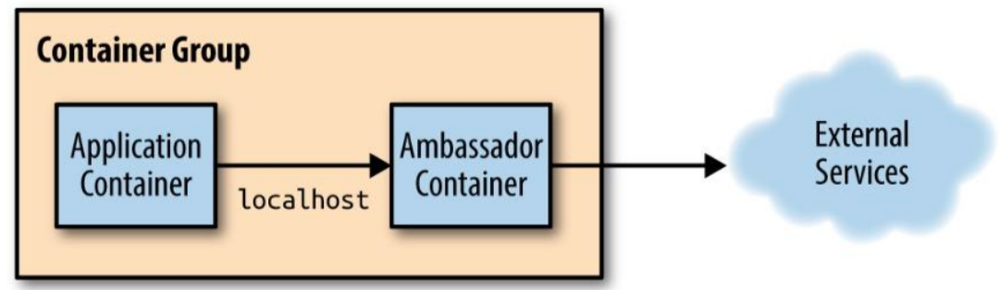

# 分布式系统应用设计（容器设计模式）

## 单节点模式

容器化的目标是围绕特定资源建立**边界（关注点的分离）**：**将一台机器运行的组件分解为不同的容器运行**；

- **资源隔离**：区分应用服务和配置服务，不同的资源配置和响应要求；
- **模块复用**：组件可复用，减少耦合；

由两个容器（应用程序+辅助程序）组成的单节点模式。

### 边车模式

> **扩展和增强**已存在的容器（入）。

边车容器的作用是增加和改进应用程序容器，通常**无需知道应用程序容器的相关信息**。

- 应用容器和边车容器**共享包括部分文件系统、主机名、网络**等资源；

应用场景，如：**遗留系统的改造和模块化**和**可重用组件封装**等

- 网络：入口（向传统服务添加HTTPS）；
- 文件系统：初始化配置，配置同步 ；

边车容器的设计：

- **参数化容器**：被复用的基础，通过**环境变量**进行传递 ；
- 创建容器的对外API：**容器与外部交互的所有方面的都是可重用容器定义的API**的一部分；
- 文档化容器：通过Dockerfile 中的 LABEL 指令维护镜像（补充：GIT 工程说明用法）；

### 适配器模式

> 修改应用容器的接口，符合第三方应用所需的格式定义。

应用场景，如：监控、日志等跟第三方系统对接时

- 应用容器暴露统一的Prometheus监控接口；
  - 将**由应用程序容器公开的监视接口转换为通用监视系统期望的接口**工具

- 应用容器日志流标准化为标准事件集；
  - 不同的日志记录库之间差异很大（例如，Java的内置日志记录与Go的glog软件包），适配器转成单一结构；
  - 应用程序容器可能会记录日志到文件，但适配器容器可以将该文件重定向到stdout

为什么不简单地修改应用程序容器本身？

- 在很多情况下，我们正在**重复使用另一方生产的容器**，修改（派生）比适配的代价要昂贵；

### 大使模式

> 代理**应用容器与外部之间**（出）的交互。

应用场景，如：（将依赖从**包引入变成本地网路调用**，关注点分离）

- 外出流量的负载均衡（如Redis 分片）；
- 外出流量的服务代理（解耦服务发现）；
- 外出流量的拆分（蓝绿部署，请求重放等）；

## 服务（多节点）模式

**微服务**的优点：

- 将应用程序分解为更小的模块，每个小模块专注于提供特定的服务；
- 不同的微服务间引入正式API使团队彼此负责，同时提供可靠的约定；
- 实现更高的扩展性，不同的组件服务其扩展性速率要求不一样；

微服务的缺点：

- 系统松耦合，故障时的调试要更困难；
- 基于微服务的系统也很难设计和架构；

### 复制服务

基于副本的**负载均衡**，提高每秒的请求数量。

> **无状态服务**（Serverless）：不需要保存状态即可正常运行的服务。
>
> **会话跟踪服务**：确保用户的所有请求都固定映射到同一部分。

开发和部署**就绪探测器**以协调负载均衡很重要：

- 确定服务部分是否准备好为用户请求提供服务；

会话跟踪：集群内会话可采用 IP Hash，**外部会话（存在NAT）采用应用级跟踪**（如通过Cookie）：

- **基于一致性Hash**，服务增/减时最大限度减少需要重新设计的请求数；
- nginx的负载均衡 upstream 支持 一致性 hash；

### 分片服务

> 设计分片函数的键对于设计分片系统至关重要。
>
> 支撑更大的数据。

分片服务多用于构建于**有状态服务**，每个分片只能为特定的一部分请求提供服务。

- 数据量太大，单节点无法处理，如 Redis 集群；

分片缓存服务：

- 缓存未命中不是本质问题，系统会重新计算得到数据，但会造成性能影响；
- 支持**多副本的缓存分片**；
- 热分片：某个特定的分片承担异常庞大的负载，**为每个分片设置自动伸缩**。

### 分散模式和聚集模式

> 时间角度使用复制技术提高可扩展性。

**每个副本**执行少量处理，结果返回根节点，根节点将部分结果组合形成完整响应返回给前端。

场景：如 **HBase**

- 分布式文档搜索，如多个关键字并行搜索，结果聚合；
- 复制的分散/收集系统，总数据量超过单节点内存/磁盘时，引入分片；
  - 与分片服务不同，这里所有的分片都需要进行请求响应；
- 设置合理的叶节点（分片）数，加速比收益、straggler问题、可用性问题；
- 分片的分散/聚集系统，采用**多副本保证可用性**；

### 函数与事件驱动处理

> Function as a Service, FaaS.

事件驱动的FaaS和更广泛的无服务器计算概念是有区别：

- 多租户容器编排器（container-as-a-service）是无服务器，但不是事件驱动；
- 物理集群的开源Faas是事件驱动，但不是无服务器；

优势：

- 简化代码开发到服务发布的整个流程；
- 良好的可管理性和自动伸缩能力；
- 更加模块化和结构。

挑战：

- 服务操作更加复杂，状态存储在某个存储服务中；
- 很难获得对服务全面掌控，如Faas产生循环调用；

不适用：

- 大量处理开销的场景和长时间运行的后台计算（Faas一般按请求次数计费）；
- 将大量数据加载到内存以处理用户请求；

### 所有权选举

高可用问题，主副本选举：

- 实现类似 Paxos/Raft 的分布式一致性算法；
- 基于已有的分布式键值存储，如`etcd`, `Zookeeper`，通过锁服务，实现主/副；

锁服务：

- 通过**TTL避免进程在持有锁期间失败时**无人可以释放锁的问题；
- 提供带版本信息的支持，**避免锁的TTL过期导致多进程申请锁**成功；
  - 进程1 获取锁（TTL），执行超时，释放锁；
  - 进程2 再超时后获取锁，进程1释放的是进程2获取的锁；
  - 进程3 获取进程1释放的锁，此时进程2和进程3都认为自己获取锁；

- 持续运行事件获取所有权时，通过**单独的线程每TTL/2的时间更新锁的TTL**；
- 发送请求时**附带当前的资源版本号**，避免所有权获取（此时发送请求）、丢失、再获得（此时请求才处理）的问题

## 批处理计算模式

### 工作队列系统

> 最简单的批处理形式是工作队列，工作队列系统包含一组要被执行的批处理任务。

工作队列系统的目的是**确保队列中的工作的每项任务能够在指定时间内执行完成**。

-  执行器数量可以伸缩，确保工作可被按时完成；

构建**基于容器**的可重用工作队列需要定义**通用库容器和用户定义的应用逻辑**之间的接口。

- 源容器接口：提供需要处理的工作项流（对接外部工作队列源，如Kafka/Redis）；

- 执行器容器接口：处理实际工作项；

将特定于应用的队列源逻辑（请求代理到外部）与通用队列处理逻辑（主容器）分开（大使模式）：

- 大使容器虽然特定于应用，但源API也有通用实现（如Kafka，可以重用容器简化工作）
- 工作队列管理器本身负责跟踪哪些项目已处理完毕和需要被处理；

工作队列的基本流程：(通过 K8s Job可以获取正在处理中的工作项或者成功/失败的工作项。)

1. 调用源容器接口加载可用的工作；
2. 查询工作队列状态确定已处理或目前正在处理的工作项；
3. 对于要处理的工作项，生成调用执行器容器接口处理工作项的作业；
4. 当其中一个执行器容器成功完成时，记录已完成的工作。

稳定的工作队列：

- 新工作到达的间隔时间（记录较长时间内收到的工作项数量计算）；
- 工作处理的平均时间；
- 扩容：调整资源使得，工作项处理平均时间 < 新工作到达的间隔时间
- 缩容：调整资源使得，工作项处理平均时间 = 90% × 新工作到达的间隔时间

### 事件驱动的批处理

工作流系统，包含一个**有向无环图的工作流程**，描述流程各个阶段及其相互协作。

- 如果没有关于各个事件队列如何相互关联的总体蓝图，则很难完全理解系统的运行方式；

多个不同队列的协作或修改一个/多个工作队列输出的模式：

- **复制器**：获取单个工作项流冰将其复制到两个/多个流中，如视频渲染，原视频渲染为不同分片率的格式；
- **过滤器**：过滤掉不符合特定条件的工作项；
- **分离器**：将工作项的两个不同的输入分成两个独立的队列；
- **分片器**：特殊的分离器，按照某种分片算法将单个队列划分为均匀分布的工作集合；
- **合并器**：复制器相反，将两个不同的工作队列转换为单个工作队列。

管理通过**事件驱动**工作流传递的数据流：**发布者/订阅者服务**；

### 协调批处理

将多个输出合并到一起生成某种聚合输出（Reduce），**进入工作流下一个阶段之前拥有完整的工作集**。

**连接模式**：并发过程中的栅栏同步。

- 所有工作都是并行的，但是**完成并行处理的所有工作项之前**，工作项不会从连接中释放出来；
- 可确保在执行某种聚合阶段之前没有数据丢失；

**Reduce**：不是等到所有数据都被处理，而以乐观方式将所有并行数据项合并到一个完整集合的单个综合表示中；

- 可以**并行启动reduce**，此时作为map/shard阶段的一部分仍然在进行；
- 虽然必须处理所有的数据，但是提前开始可让整体排量计算执行更快；

## 参考文献

[1] Burns B, Oppenheimer D. [Design patterns for container-based distributed systems](https://www.usenix.org/system/files/conference/hotcloud16/hotcloud16_burns.pdf).[C]//8th USENIX Workshop on Hot Topics in Cloud Computing (HotCloud 16). 2016.

[2] Burns B. [Designing distributed systems: patterns and paradigms for scalable, reliable services](https://www.alipan.com/s/eN8uPFwfCPk)[M]. " O'Reilly Media, Inc.", 2018.