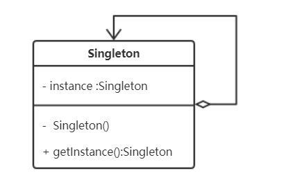

# 单例模式(Singleton)

## 意图

保证一个类只有一个实现，且提供一个访问它的全局访问点。


## 适用性

系统中有的类应该只有一份实例，比如一个全局的配置一个文件系统和窗口管理器等。


## 类图



## 优缺点

**优点**：

- **对唯一实例的受控访问**；
- 在内存里只有一个实例，减少了内存的开销，尤其是频繁的创建和销毁实例。

**缺点**：

- 单例模式中没有抽象层，因此单例类的扩展有很大的困难（单例可以优化为返回接口）；
- 不适用于变化的对象，多线程环境需要小心


## 实现（Java）

以下方案，均考虑线程安全：

### 饿汉式（推荐，静态成员变量初始化）

```java
//饿汉式
public class Singleton {
    private static Singleton instance = new Singleton();
    private Singleton() {}

    public static Singleton getInstance() {
        return instance;
    }
}
```

### 懒汉式（双重检查方式+volatile）

```java
//双重校验锁
public class Singleton {
    private volatile static Singleton instance;
    private Singleton() {}
    
    public static Singleton getInstance() {
        if (instance == null) {
            synchronized (Singleton.class) {
                if (instance == null) {
                    instance = new Singleton();
                }
            }
        }
        return instance;
    }
}
```

### 内部类（推荐）

不使用，引入Singleton不会初始化，使用时通过内部静态类的全局锁初始化，保证线程安全；

```java
//静态内部类
public class Singleton {
    private static class SingletonHolder {
        private static final Singleton INSTANCE = new Singleton();
    }
    private Singleton() {}

    public static final Singleton getInstance() {
        return SingletonHolder.INSTANCE;
    }
}
```

### 注意事项

- **线程安全**的考虑，构造器私有化；
- 当有多个可选的唯一实例时，通过子类的方式，可以通过环境变量配置或者注册表的形式，进行动态创建具体子类实现；
- **反序列化**时，可能会重新生成一个新的实例；
  - 实现`readResolve`方法，返回静态实例；
- 享有特权的客户端，通过`AccessibleObject.setAccessible`方法和反射机制可以**调用私有构造器**；
  - 方案：创建第二个实例的时候抛出异常


## 实现（C++）

以下方案，均考虑线程安全：

### 懒汉式（推荐，函数静态局部变量）

 C++11 标准是线程安全的

```java
// .h
class Single {
public:
    // 获取单实例对象
    static Single& GetInstance();
private:
    // 禁止外部构造
    Single();
    // 禁止外部析构
    ~Single();
    // 禁止外部拷贝构造
    Single(const Single &single) = delete;
    // 禁止外部赋值操作
    const Single &operator=(const Single &single) = delete;
}; 
// .cpp
Single& Single::GetInstance()
{
    /**
     * 局部静态特性的方式实现单实例。
     * 静态局部变量只在当前函数内有效，其他函数无法访问。
     * 静态局部变量只在第一次被调用的时候初始化，也存储在静态存储区，生命周期从第一次被初始化起至程序结束止。
     */
    static Single single;
    return single;
}
```

### 饿汉式

```cpp
class Singleton {
public:
    // 获取单实例
    static Singleton* GetInstance();
private:
    // 将其构造和析构成为私有的, 禁止外部构造和析构
    Singleton();
    ~Singleton();
    // 将其拷贝构造和赋值构造成为私有函数, 禁止外部拷贝和赋值
    Singleton(const Singleton &signal);
    const Singleton &operator=(const Singleton &signal);
private:
    // 唯一单实例对象指针
    static Singleton *g_pSingleton;
}

// cpp
// 代码一运行就初始化创建实例 ，本身就线程安全
Singleton* Singleton::g_pSingleton = new (std::nothrow) Singleton();

Singleton* Singleton::GetInstance() {
    return g_pSingleton;
}

```

