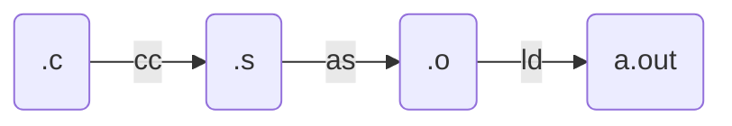

# 应用视角的操作系统

>**STFW**: Search The Friendly Website.
>
>**RTFM**: Read The Friendly Manual.
>
>应用程序与操作系统沟通的唯一桥梁是**系统调用指令** (例如 x86-64 的 syscall)。

**本讲内容**：**指令序列和高级语言的状态机模型**；回答以下问题：

- 什么是软件 (程序)？
- 如何在操作系统上构造最小/一般/图形界面应用程序？
- 什么是编译器？编译器把一段程序翻译成什么样的指令序列才算 “正确”？

## 汇编代码和最小可执行文件

### 构造最小的 Hello, World “应用程序”

```c
int main() {
  printf("Hello, World\n");
}
```

gcc 编译出来的文件一点也不小

- `objdump -d `命令可以查看对应的汇编代码；
  - `printf` 被编译器优化变成了 `puts@plt`
- `-Wl,--verbose` 可以查看gcc 编译时的所有链接选项 (真不少)；
- gcc采用`-static` 选项编译，会链接 libc (大量的代码)；

### 强行构造最小的 Hello, World？

`gcc hello.c`的编译流程



尝试以下步骤：

1. `gcc -c hello.c` 生成 `hello.o`，`ld hello.o` 报错

   - `undefined reference to 'puts'` 报错，连接时无法找到；

2. 删除 `printf`代码，`ld hello.o -e main`

   - 执行时`./a.out`，`Segmentation Fault`报错；
   - `main`代码里改成死循环， 程序可以正常执行（）；

3. 通过`a.out`汇编代码，猜测`ret`指令出现问题，验证 ret 地址为 0x1

   - gdb 调试，单步执行，在第一条指令时停下来；
   - `starti`, `layout asm`等命令，执行结果`Cannot access memory at address 0x1`；

4. 用一条特殊的指令请操作系统帮忙，`syscall`

   - 程序把控制权完全交给操作系统，操作系统可以改变程序状态甚至终止程序

   ```assembly
   movq $SYS_exit,  %rax   # exit(
   movq $1,         %rdi   #   status=1
   syscall                 # );
   ```

### 汇编代码的状态机模型

**Everything is a state machine**: 计算机 = 数字电路 = 状态机

- **状态** = 内存 *M* + 寄存器 *R*
- **初始状态** = ABI 规定 (例如有一个合法的 %rsp)
- **状态迁移** = 执行一条指令
  - gdb 同样可以观察状态和执行


操作系统上的程序

- 所有的指令都只能**计算**
  - deterministic: mov, add, sub, call, ...
  - non-deterministic: rdrand, ...
- **syscall 把 (*M*,*R*) 完全交给操作系统**


## 理解高级语言程序

“解释器” 的例子：用基础结构模拟函数调用和递归。

### 递归转非递归的转换 

> **模拟栈**执行，将非递归转为递归。

把 C 语言改写成仅包含顺序执行的简单语句和条件跳转 `if (cond) goto` 的 “简化 C 语言代码”——循环、分支和函数调用都被消灭了。

- 详细思路，可以见配套实验代码中的*汉诺塔等程序示例*

### 简单 C 程序的状态机模型 (语义)

状态

- Stack frame 的列表 + 全局变量

初始状态

- 仅有一个 frame: `main(argc, argv)` ；全局变量为初始值

状态迁移

- 执行 frames.top.PC 处的简单语句
- 函数调用 = push frame (frame.PC = 入口)
- 函数返回 = pop frame

## 理解编译器

有两种状态机

- 高级语言代码.*c*
  - 状态：栈、全局变量；状态迁移：语句执行
- 汇编指令序列.*s*
  - 状态：(M*,*R*)；状态迁移：指令执行
- **编译器是二者之间的桥梁**：$.s=compile(.c)$


### 编译器的正确性

.*c* 执行中<font color=red>**所有外部观测者可见的行为**</font>，必须在 .*s* 中保持一致

- External function calls (链接时确定)
  - 如何调用由 Application Binary Interface (ABI) 规定
  - 可能包含系统调用，因此不可更改、不可交换
- 编译器提供的 “不可优化” 标注
  - `volatile` [load | store | inline assembly]
- Termination
  - .*c* 终止当且仅当 .*s* 终止

<font color=red>在此前提下，任何翻译都是合法的</font> (例如我们期望更快或更短的代码)


## 操作系统上的软件（应用程序）

底层系统实现（通过阅读 busybox 的早期版本的源代码）


Trace

 


ToyBoy、BusyBox