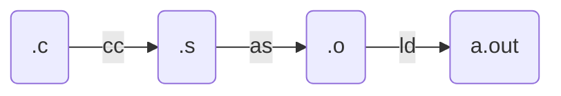

# 应用视角的操作系统

>**STFW**: Search The Friendly Website.
>
>**RTFM**: Read The Friendly Manual.
>
>应用程序与操作系统沟通的唯一桥梁是**系统调用指令** (例如 x86-64 的 syscall)。

**本讲内容**：**指令序列和高级语言的状态机模型**；回答以下问题：

- 什么是软件 (程序)？
- 如何在操作系统上构造最小/一般/图形界面应用程序？
- 什么是编译器？编译器把一段程序翻译成什么样的指令序列才算 “正确”？

## 汇编代码和最小可执行文件

### 构造最小的 Hello, World “应用程序”

```c
int main() {
  printf("Hello, World\n");
}
```

gcc 编译出来的文件一点也不小

- `objdump -d `命令可以查看对应的汇编代码；
  - `printf` 被编译器优化变成了 `puts@plt`
- `-Wl,--verbose` 可以查看gcc 编译时的所有链接选项 (真不少)；
- gcc采用`-static` 选项编译，会链接 libc (大量的代码)；

### 强行构造最小的 Hello, World？

`gcc hello.c`的编译流程



尝试以下步骤：

1. `gcc -c hello.c` 生成 `hello.o`，`ld hello.o` 报错

   - `undefined reference to 'puts'` 报错，连接时无法找到；

2. 删除 `printf`代码，`ld hello.o -e main`

   - 执行时`./a.out`，`Segmentation Fault`报错；
   - `main`代码里改成死循环， 程序可以正常执行（）；

3. 通过`a.out`汇编代码，猜测`ret`指令出现问题，验证 ret 地址为 0x1

   - gdb 调试，单步执行，在第一条指令时停下来；
   - `starti`, `layout asm`等命令，执行结果`Cannot access memory at address 0x1`；

4. 用一条特殊的指令请操作系统帮忙，`syscall`

   - 程序把控制权完全交给操作系统，操作系统可以改变程序状态甚至终止程序

   ```assembly
   movq $SYS_exit,  %rax   # exit(
   movq $1,         %rdi   #   status=1
   syscall                 # );
   ```

### 汇编代码的状态机模型

**Everything is a state machine**: 计算机 = 数字电路 = 状态机

- **状态** = 内存 *M* + 寄存器 *R*
- **初始状态** = ABI 规定 (例如有一个合法的 %rsp)
- **状态迁移** = 执行一条指令
  - gdb 同样可以观察状态和执行


操作系统上的程序

- 所有的指令都只能**计算**
  - deterministic: mov, add, sub, call, ...
  - non-deterministic: rdrand, ...
- **syscall 把 (*M*,*R*) 完全交给操作系统**


## 理解高级语言程序

“解释器” 的例子：用基础结构模拟函数调用和递归。

### 递归转非递归的转换 

> **模拟栈**执行，将非递归转为递归。

把 C 语言改写成仅包含顺序执行的简单语句和条件跳转 `if (cond) goto` 的 “简化 C 语言代码”——循环、分支和函数调用都被消灭了。

- 详细思路，可以见配套实验代码中的*汉诺塔等程序示例*

### 简单 C 程序的状态机模型 (语义)

状态

- Stack frame 的列表 + 全局变量

初始状态

- 仅有一个 frame: `main(argc, argv)` ；全局变量为初始值

状态迁移

- 执行 frames.top.PC 处的简单语句
- 函数调用 = push frame (frame.PC = 入口)
- 函数返回 = pop frame

## 理解编译器

有两种状态机

- 高级语言代码.*c*
  - 状态：栈、全局变量；状态迁移：语句执行
- 汇编指令序列.*s*
  - 状态：(M*,*R*)；状态迁移：指令执行
- **编译器是二者之间的桥梁**：$.s=compile(.c)$


### 编译器的正确性

.*c* 执行中<font color=red>**所有外部观测者可见的行为**</font>，必须在 .*s* 中保持一致

- External function calls (链接时确定)
  - 如何调用由 Application Binary Interface (ABI) 规定
  - 可能包含系统调用，因此不可更改、不可交换
- 编译器提供的 “不可优化” 标注
  - `volatile` [load | store | inline assembly]
- Termination
  - .*c* 终止当且仅当 .*s* 终止

<font color=red>在此前提下，任何翻译都是合法的</font> (例如我们期望更快或更短的代码)

- 编译优化的实际实现：(context-sensitive) rewriting rules
- 代码示例：观测编译器优化行为和 compiler barrier


## 操作系统上的软件（应用程序）

### 操作系统中的任何程序

> 任何程序 = minimal.S = 调用 syscall 的状态机

可执行文件是操作系统中的对象

- <font color="red">与大家日常使用的文件 (a.c, README.txt) 没有本质区别</font>
- 操作系统提供 API 打开、读取、改写 (都需要相应的权限)

查看可执行文件：`vim,cat,xxd`都可以直接 “查看” 可执行文件

- `vim` 中二进制的部分无法 “阅读”，但可以看到字符串常量
- 使用 `xxd` 可以看到文件以 `"\x7f" "ELF"` 开头
- Vscode 有 binary editor 插件

### 系统中常见的应用程序

Core Utilities (coreutils)

- *Standard* programs for text and file manipulation
- 系统中安装的是  [GNU Coreutils](https://www.gnu.org/software/coreutils/)
  - 有较小的替代品 [busybox](https://www.busybox.net/)
  - 底层系统实现（通过阅读 busybox 的早期版本的源代码）

系统/工具程序

- bash,[binutils](https://www.gnu.org/software/binutils/), apt, ip, ssh, vim, tmux, jdk, python, ...
  - 这些工具的原理不复杂 (例如 apt 是 dpkg 的套壳)，但琐碎
  - [Ubuntu Packages](https://packages.ubuntu.com/) (和 apt-file 工具) 支持文件名检索

其他各种应用程序

- Vscode, 浏览器、音乐播放器……

### 打开程序的执行：Trace (追踪)

`strace`：System call trace，可以观测状态机的执行过程

- 理解 strace 的输出并在你自己的操作系统里实现相当一部分系统调用 (mmap, execve, ...)
- Demo: 试一试最小的 Hello World（`strace -f gcc hello.c`）

### 操作系统中 “任何程序” 的一生

> 任何程序 = minimal.S = 调用 syscall 的状态机

- 被操作系统加载
  - 通过另一个进程执行 execve 设置为初始状态
- 状态机执行
  - 进程管理：fork, execve, exit, ...
  - 文件/设备管理：open, close, read, write, ...
  - 存储管理：mmap, brk, ...
- 调用 _exit (exit_group) 退出

(初学者对这一点会感到有一点惊讶)

- 说好的浏览器、游戏、杀毒软件、病毒呢？都是这些 API 吗？
- <font color="red">我们有 strace，就可以自己做实验了！</font>

### 动手实验：观察程序的执行

工具程序代表：编译器 (gcc)

- 主要的系统调用：`execve, read, write`
- `strace -f gcc a.c`(gcc 会启动其他进程)
  - 可以管道给编辑器 `vim -`
  - 编辑器里还可以 `%!grep` (细节/技巧)

图形界面程序代表：编辑器 (xedit)

- 主要的系统调用：`poll, recvmsg, writev`
- `strace xedit`
  - 图形界面程序和 X-Window 服务器按照 X11 协议通信
  - 虚拟机中的 xedit 将 X11 命令通过 ssh (X11 forwarding) 转发到 Host

### 各式各样的应用程序

都在<font color="red">操作系统 API (syscall) </font>.和<font color="red">操作系统中的对象上</font>构建

- 窗口管理器
  - 管理设备和屏幕 (read/write/mmap)
  - 进程间通信 (send, recv)

- 任务管理器
  - 访问操作系统提供的进程对象 (readdir/read)
  - 参考 gdb 里的 `info proc *`

- 杀毒软件
  - 文件静态扫描 (read)
  - 主动防御 (ptrace)
  - 其他更复杂的安全机制……

## 总结

无论是汇编代码还是高级语言程序，它们都可以表示成状态机：

- 高级语言代码 .c
  - 状态：栈、全局变量；状态迁移：语句执行
- 汇编指令序列 .s
  - 状态：$(M,R)$；状态迁移：指令执行
- 编译器实现了两种状态机之间的翻译

应用程序与操作系统沟通的唯一桥梁是系统调用指令 (例如 x86-64 的 syscall)。

- 理解操作系统的重要工具：gcc, binutils, gdb, strace

## 课后习题/编程作业

### 1. 阅读材料

- 浏览 [GNU Coreutils](https://www.gnu.org/software/coreutils/) 和 [GNU Binutils](https://www.gnu.org/software/binutils/) 的网站，建立 “手边有哪些可用的命令行工具” 的一些印象。
- 浏览 [gdb](https://sourceware.org/gdb/current/onlinedocs/gdb.html/) 文档的目录，找到你感兴趣的章节了解，例如——“Reverse Execution”、“TUI: GDB Text User Interface”……
- 对于你有兴趣的命令行工具，可以参考 [busybox](https://www.busybox.net/) 和 [toybox](https://landley.net/toybox/about.html) 项目中与之对应的简化实现。Toybox 现在已经成为了 Android 自带的命令行工具集。

### 2. 编程实践

在你的 Linux 中运行课堂上的代码示例，包括：

- 编译链接最小二进制文件，并使用 strace 查看执行的系统调用序列。
  - 汇编写的minimal 其系统调用很少（execve, write, exit）；
- 尝试将非递归汉诺塔扩展到 f 和 g 两个函数互相调用的情况。
- 使用 strace 查看更多程序的系统调用序列，并在好奇心的驱使下了解一部分系统调用的作用。可以借助互联网、Stackoverflow 或是 ChatGPT (但在使用时，要小心求证结果)。