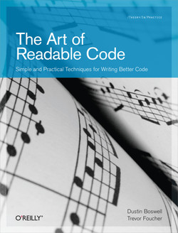

# 调试理论与实践

**背景回顾**：在快节奏的《操作系统》课中，插入一些 (重要得要命但与操作系统不完全相关的) 休闲内容。

**本讲内容**：调试理论：Fault, Error 和 Failure；GDB 使用技巧。

## 调试理论

<font color='red'>**机器永远是对的**</font>

> 不管是 crash 了，Wrong Answer 了，还是虚拟机神秘重启，都是自己背锅

<font color='red'>**未测代码永远是错的**</font>

> 你以为最不可能出 bug 的地方，往往 bug 就在那躺着

### 调试困难的根本原因

<font color='red'>**bug 的触发经历了漫长的过程**</font>

- 需求 → 设计 → 代码 (状态机) → Fault (bug) → Error (程序状态错) → Failure
  - 我们**只能观测到 failure** (可观测的结果错)
  - 我们可以检查状态的正确性 (但非常费时)
  - 无法预知 bug 在哪里 (每一行 “看起来” 都挺对的)


### 调试理论和实际调试

> 调试理论：如果我们能判定任意程序状态的正确性，那么给定一个 failure，我们可以通过二分查找定位到第一个 error 的状态，此时的代码就是 fault (bug)。

为什么我们喜欢 “单步调试”？

- 从一个假定正确的状态出发
- 每个语句的行为有限，容易判定是否是 error

为什么调试理论看起来很没用？

- 因为判定程序状态的正确性非常困难

实际中的调试：**观察状态机执行 (trace) 的某个侧面**

- 缩小错误状态 (error) 可能产生的位置
- 作出适当的假设
- 再进行细粒度的定位和诊断

最重要的两个工具

- **printf** → 自定义 log 的 trace，**用于检测状态是否正确**
  - 灵活可控、能快速定位问题大概位置、适用于大型软件
  - 无法精确定位、大量的 logs 管理起来比较麻烦
- **gdb** → 指令/语句级 trace
  - 精确、指令级定位、**任意查看程序内部状态**
  - 耗费大量时间


## 调试 “任何问题”

### 计算机世界：一切皆可调试

程序 = 计算机系统 = 状态机

- 机器永远是对的
- UNIX 世界里你做任何事情都是在编程
  - 因此配置错、make 错等，都是程序或输入/配置有 bug
  - (输入/配置可以看成是程序的一部分)

**所有问题都可以用调试理论解决**

- 你写了一个程序，现在这个程序出 bug 了 (例如 Segmentation Fault)，你是怎样排查这个问题的？
  - curl: command not found
  - `'sys/cdefs.h'`: No such file or directory
  - make: run: No such file or directory

### 使用调试理论

Debug (fault localization) 的基本理论回顾：

- Fault (程序/输入/配置错) → Error → Failure (可观测)
  - 绝大部分工具的 Failure 都有 “原因报告”
    - 因此能帮助你快速定位 fault
  - `man perror`：标准库有打印 error message 的函数

如果问题不能帮你定位到 fault/error？

- <font color="red">**出错原因报告不准确或不够详细**</font>
- <font color="red">**程序执行的过程不够详细**</font>
  - 既然我们有需求，那别人肯定也会有这个需求
    - 一定有信息能帮助我们！

正确的方法：理解程序 (状态机) 的<font color="red">**执行过程**</font>

- `ssh`：使用 `-v` 选项检查日志
- `gcc`：使用 `-v` 选项打印各种过程
- `make`：使用 `-n`选项查看完整命令
  - `make -nB | grep -ve '^\(echo\|mkdir\)'` 可以查看完整编译 nemu 的编译过程

各个工具普遍提供调试功能，帮助用户/开发者了解程序的<font color="red">**行为**</font>

### 例子：找不到 `sys/cdefs.h`

`'sys/cdefs.h': No such file or directory`，找不到文件

- `#include` = 复制粘贴，自然会经过路径解析
- (折腾20分钟) 明明 `/usr/include/x86_64-linux-gnu/sys/cdefs.h` 是存在的 (`man 1 locate`) → 极度挫败，体验极差

推理：`#include <>` 一定有一些搜索路径

- 为什么两个编译选项，一个通过，一个不通过？
  - `gcc -m32 -v` v.s. `gcc -v`

这是标准的解决问题办法：自己动手排查

- 在面对复杂/小众问题时比 STFW/ChatGPT 有效


## 使用 GDB 调试程序

### GDB: 入门

GDB: 最常用的命令在 [gdb cheat sheet](https://jyywiki.cn/pages/OS/manuals/gdb-cheat-sheet.pdf)

- 打印贴在电脑前，调试时候看一遍，很快就大致记住了

想要更好的体验？

- GDB 本身也是一个编程语言
  - 它甚至支持 Python
  - 可以执行一些初始化代码 (-x)
  - 可以反向执行（非确定性局限在局部）
- 库函数也是代码
  - **directory 命令增加源码路径**
- GDB 有许多前端
  - cgdb, pwndbg, vscode, ...
- [RTFM](https://sourceware.org/gdb/current/onlinedocs/gdb.html/) - M 比 ChatGPT 好用在于它不需要 prompt 且全面

### 🌶️ Futex: Fast Userspace muTexes

调试 POSIX 线程库中的互斥锁 (`pthread_mutex`)

- 观察线程库中的 lock/unlock 行为（GDB 调试，设置只有当前线程执行）
  1. Mutex 没有争抢的情况（当前线程执行）
     - 没有 syscall
  2. Mutex 有争抢的情况（当前线程未释放锁时，切换到另外一个竞争线程执行）
     - syscall 0xca（futex 系统调用）


## 调试理论：应用

需求 → 设计 → 代码 → Fault → Error → Failure

“Technical Debt”

> 每当你写出不好维护的代码，你都在给你未来的调试/需求变更挖坑。

### 编程基本准则：回顾

> Programs are meant to be read by humans (AIs) and only incidentally for computers to execute. — *D. E. Knuth*
>
> (程序首先是拿给人读的，其次才是被机器执行。)

好的程序



- 不言自明：能知道是做什么的 (specification)
  - 因此代码<font color="red">**风格**</font>很重要

- 不言自证：能确认代码和 specification 一致
  - 因此代码中的<font color="red">**逻辑流**</font>很重要

- 人类新纪元的评判标准
  - AI 是否能正确理解/维护你的代码

### 调试理论的最重要应用

> <font color="red">写好读、易验证的代码</font>
>
> <font color="red">在代码中添加更多的断言 (assertions)</font>

断言的意义：把代码中隐藏的 specification 写出来

- Fault → Error (靠测试)
- Error → Failure (靠断言)
  - **Error 暴露的越晚，越难调试**
  - 追溯导致 assert failure 的变量值 (slice) 通常可以快速定位到 bug

示例：维护父亲节点的平衡树


```c
// 结构约束
assert(u->parent == u ||
       u->parent->left  == u ||
       u->parent->right == u);
assert(!u->left  || u->left->parent  == u);
assert(!u->right || u->right->parent == u);

// 数值约束
assert(!u->left  || u->left->val  < u->val);
assert(!u->right || u->right->val > u->val);
```

### 更多的断言

每一次指针访问时，都增加一个断言

- `assert(obj->low <= ptr && ptr < obj->high);`

神奇的编译选项：`-fsanitize=address`

- [Address Sanitizer(asan)](https://github.com/google/sanitizers/wiki/AddressSanitizer)： “动态程序分析”，提供了内存访问 (例如数组越界) 的额外检查。