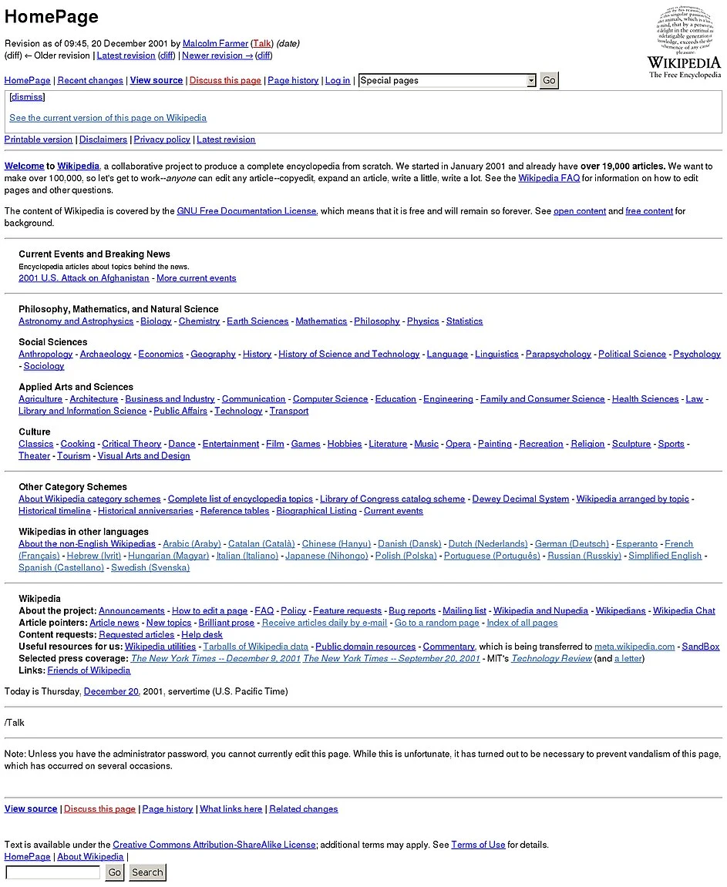

# M7: HTTP Daemon (httpd)

## 1. 背景

HTTP (Hypertext Transfer Protocol) 是互联网上最广泛使用的应用层协议之一。从简单的静态网页 (例如《操作系统》的课程网站) 到复杂的 Web 应用 (例如我们的教务系统到能在网页中直接使用的 Office 365)，它们都是由 HTTP 服务器支撑的！HTTP 服务器的基本功能接收来自客户端的请求，并返回响应，例如以下是一个典型的 HTTP 请求：

```text
GET /index.html HTTP/1.1
Host: www.example.com
User-Agent: Mozilla/5.0
```

其中 “GET 是请求的方法” 表示获取资源。除了 GET 外，还有 POST、PUT、DELETE 等，用于执行不同类型的操作。GET 后的 “/index.html” 是请求的资源路径，也就是我们在浏览器栏中输入的域名后的路径，HTTP/1.1 是 HTTP 协议版本。Host 是指定服务器主机名，例如网页的域名。很多网站都会直接拒绝使用 IP 的访问。User-Agent 是客户端软件信息——这就是为什么网页能自动 “识别” 手机和电脑，以及有些网站会拒绝你的 curl 请求。

HTTP 服务器解析请求后，会根据请求的资源路径，从本地文件系统中读取资源或调用另一个程序，也就是我们俗称的 “后端”，将结果返回给客户端。HTTP 协议本身是无状态的，因此通常需要 Cookie、Session 或 Token 等机制实现用户登录等需要状态保持的功能，浏览器会自动在 request header 中携带相应的 Cookie 信息 (Cookie 字段) 发送给服务器，以实现用户登录功能。

## 2. 实验描述

### 2.1 总览

<center><b>httpd [port]</b></center>

### 2.2 描述

实现一个支持多线程的 HTTP 服务器，监听 prot 端口 (默认为 8080)，能够处理并发的 HTTP 请求。不用担心，我们已经提供了一份 “可以运行” 的 httpd 供大家参考，你可以直接运行它，并且在浏览器中访问任何 url，都可以得到 “under construction” 的响应。没错，你的浏览器能直接访问你的 Web 服务！你走出了迈向互联网时代的第一步！

服务器需要支持以下功能：

1. GET `/cgi-bin/` 开头的 URL，调用 CGI 程序返回动态内容。如果路径非法或 CGI 脚本不存在，返回 404 错误。如果 CGI 脚本执行失败，返回 500 错误。
2. 并发到达的请求应当尽快接收并尽可能并行处理。并行执行的请求数不得超过 4 个。注意评测时，CGI 脚本执行的时间可能很长。
3. 按照请求到来的顺序输出日志到标准输出，在每次日志输出后都请确保执行 fflush。我们已经提供了 log_request 函数，请调用它。

> ⚠️**log_request**
>
> 根据 log_request 的输出：
>
> ```
> printf("[%s] [%s] [%s] [%d]\n", timestamp, method, path, status_code);
> ```
>
> 你需要输出正确的路径，例如 /cgi-bin/echo，以及正确的状态码，例如 CGI 程序返回的 403。

### 2.3 解释

CGI (Common Gateway Interface) 是一种允许 Web 服务器与外部程序通信的标准协议。当服务器收到以 `/cgi-bin/` 开头的请求时，它会：

1. 解析请求路径，确定要执行的 CGI 程序。CGI 程序可以是任何可执行文件，包括编译后的二进制程序、脚本文件（如 Python、Shell 脚本等）、其他可执行程序等。CGI 程序保存在 `cgi-bin/` 目录下，例如 `cgi-bin/echo`。
2. CGI 要求创建子进程来执行该程序，并将 HTTP 请求的信息 (如请求方法、请求头、查询字符串等) 通过环境变量传递给 CGI 程序。
3. 程序执行完毕后，将 CGI 程序的输出 (标准输出) 作为 HTTP 响应返回给客户端。

需要注意的是，CGI 程序必须输出完整的 HTTP Response，程序必须处理各种错误情况 (如文件不存在、权限不足等)，服务器需要正确处理 CGI 程序的退出状态。例如，当收到请求 `GET /cgi-bin/hello?name=world` 时：

1. 服务器会执行 `cgi-bin/hello` 程序；

2. 设置环境变量：

   - `REQUEST_METHOD=GET`, `QUERY_STRING=name=world`
   - (其他 HTTP 头信息我们不要求处理)

3. CGI 程序执行并输出 HTTP 响应，例如

   ```text
   Content-Type: text/plain
   
   Hello, world!
   ```

4. 服务器将输出发送给客户端。

我们提供了一个正确的 CGI 脚本 “echo” (bash; 当然，你可以用任何方式实现你的后端程序)，如果实现正确，可以在浏览器中访问 http://localhost:8080/cgi-bin/echo 看到请求的方法 (GET)、参数、环境变量和日期。

> ⚠️**AIGC Policy**这个实验对大语言模型来说是 “刚好适合” 的任务，甚至我们的参考实现都是由 LLM 直接一次生成正确的。但为了获得最佳的学习效果，你可以借助大语言模型查阅 CGI 的相关标准，询问任何不理解的地方，但请你不要使用大语言模型直接实现代码。

### 2.4 HTTP Request 和 Response 格式

在 HTTP/1.1 协议中，每个请求由请求行、请求头 (header)、空行以及可选的请求消息体依次组成。请求行首先指出请求方法 (如 GET、POST 等)、请求目标 (包含资源路径和可选查询字符串) 以及协议版本 (通常为 HTTP/1.1)，三者之间以空格分隔，并以 CRLF (\r\n) 结束。随后是一系列请求头，每一行由头部字段名、冒号、空格和字段值构成，同样以 CRLF 结尾。一个空行 (连续两个 CRLF) 标志着请求头的结束，如果请求方法要求在消息体中携带数据 (例如 POST 上传表单)，则在空行之后紧跟消息体内容，其字节长度由 Content-Length 头精确指明。

服务器在收到完整请求后，会返回一个 HTTP/1.1 响应，结构与请求类似，由状态行、响应头、空行和可选的响应消息体依次构成。状态行包含协议版本、三位数字状态码 (如 200、404、500 等) 以及原因短语，三者以空格分隔并以 CRLF 结束。随后是一系列响应头，例如 Content-Type 用于说明消息体的媒体类型，Content-Length 指示消息体的字节长度，Connection 控制是否保持连接等。响应头结束后以空行分隔，紧接着是响应消息体，其内容可以是 HTML、JSON、纯文本或二进制数据。消息体发送完毕后，如果 Connection 头为 close，服务器将关闭连接，否则保持连接以便复用处理后续请求。

你可以在浏览器中查看完整的 HTTP Request 和 Response。

> 💬**Prompt: 如何在浏览器中查看完整的 HTTP Request 和 Response？** 
> **claude-3.7-sonnet**: ▶️

## 3. 正确性标准

首先，你需要正确地实现 CGI 脚本的执行。我们会在 cgi-bin 目录下放置若干 CGI 脚本，并使用 curl 命令测试你的 httpd 是否能够正确地执行这些脚本。如果你的 httpd 能正确解析 URL、传递环境变量 REQUEST_METHOD 和 QUERY_STRING，并正确返回 CGI 脚本的输出，可以通过 Easy Test Cases。

对于 Hard Test Cases，我们会并发地请求你的 httpd。此时，不同请求的 CGI 脚本的处理时间可能有显著区别，但你的 httpd 应当按收到请求的顺序输出日志，日志包含 CGI 脚本返回的 HTTP response status code (例如 200, 404, 500)。

## 4. 实验指南

### 4.1 框架代码中的 httpd

实验框架代码实现了不支持 CGI、不并发的 httpd。代码的核心是 `handle_request` 函数：

```c
void handle_request(int client_socket) {
    char buffer[BUFFER_SIZE];
    int bytes_received;

    // Read request
    bytes_received = recv(client_socket, buffer, BUFFER_SIZE - 1, 0);
    if (bytes_received <= 0) {
        return;
    }
    buffer[bytes_received] = '\0';

    printf("Got a new request:\n%s\n", buffer);

    // Send "Under construction" response
    const char *response_body = "Under construction";
    int body_length = strlen(response_body);
    
    char content_length_header[64];
    sprintf(content_length_header, "Content-Length: %d\r\n", body_length);
    
    send(client_socket, "HTTP/1.1 200 OK\r\n", 17, 0);
    send(client_socket, "Content-Type: text/plain\r\n", 26, 0);
    send(client_socket, content_length_header, strlen(content_length_header), 0);
    send(client_socket, "Connection: close\r\n", 19, 0);
    send(client_socket, "\r\n", 2, 0);
    send(client_socket, response_body, body_length, 0);

    // Close the connection
    close(client_socket);
}
```

函数的参数是一个 “client_socket”，它实际上是一个文件描述符 (更精确地说，是一个 socket 描述符)，当然我们也可以使用 read 和 write 读写——只是我们用了操作系统提供的网络 API 中的 send 和 recv，你把它们理解成读取连接到 “远端” 管道的 read 和 write 即可。它首先读出一个不太长的 http request，然后构造一个 HTTP/1.1 200 OK 的 response，回复的字符串是 “Under construction”。

main 函数则在做出必要的初始化，包括 socket 的创建、绑定、监听，然后接受连接并调用 `handle_request` 处理请求。我直接在 Cursor 中打开了框架代码，然后把 “科普解释” 的任务交给了 AI。AI 提供的信息是一个很好的起点，你可以持续和 AI 对话快速理解 HTTP 服务器的工作原理。

> 💬**Prompt: ...给我用普及的口吻解释一下其中出现的和网络相关的概念。** 
> **claude-3.7-sonnet**: ▶️

### 4.2 前端和后端

今天，Web 的 “前端” 是指用户直接交互的部分，主要负责页面的展示与用户体验，常用技术有 HTML、CSS、JavaScript 等。“后端” 是指支撑前端的服务器端部分，负责数据存储、业务逻辑处理和接口提供，常用技术有 Java、Python、Node.js 等，还涉及数据库、负载均衡器等系统组件。前端注重界面与交互，后端注重数据处理与安全，两者共同协作实现完整的网站或应用。

在这里回顾一下历史会很有趣。早期的 Web 绝大多数内容都属于 “前端”，它们是静态的，由 HTML 文件组成，浏览器负责渲染。网络后端只是负责解析 url 中的路径，例如 `/wiki/index.html`，从本地的文件系统中读取文件并返回给浏览器。当然，既然负责返回页面的后端是程序，我们自然可以 “hack” 它，使我们在请求 url 的时候，根据服务器上存储的数据实现的动态的内容，例如 CGI 实现的 Web Forum: 你可以基于 UNIX 文件系统用几百行脚本实现一个 “在线讨论论坛”，允许用户浏览分区帖子、发表帖子、回复帖子等。下面是 2001 年的 Wikipedia 首页，在那时这已经是非常 “了不起” 的项目了——当时的开发人员做梦也想不到今天 Vibe Coding 半小时就能实现一个完成度高得多，部署在云平台就能上线实装的系统：



随着互联网的发展，前后端的分工变得更加明确。Web 2.0 时代引入了 AJAX 技术，使得前端可以异步地向后端请求数据，而不必刷新整个页面，大大提升了用户体验。这也促使了前端框架的蓬勃发展，如 jQuery、Angular、React 和 Vue 等，使得前端开发更加模块化和组件化。同时，后端技术也在不断演进。从早期的 CGI 脚本，到 PHP、ASP 等服务器端脚本语言，再到现代的 MVC 框架如 Ruby on Rails、Django、Spring Boot 等，后端开发变得更加结构化和高效。微服务架构的兴起进一步改变了后端的设计理念，将大型应用拆分成多个独立的服务，每个服务负责特定的功能，通过 API 相互通信。云计算的普及也极大地改变了后端部署方式。从传统的物理服务器，到虚拟机，再到现在的容器化和服务器无感知计算 (Serverless)，部署变得更加灵活和可扩展，通过底层数据库、大数据系统的支持，应用可以无缝扩展到千万级用户。


前后端分离已成为现代 Web 开发的主流模式。前端通过 RESTful API 与后端通信，后端专注于提供数据和业务逻辑，前端负责数据展示和用户交互。课程网站使用了 Next.js 统一管理前后端代码，例如你看到的这个实验描述页面，Markdown 的实验讲义是在浏览器中渲染成 DOM Tree 的，而所有页面的前端代码都是共享的，浏览器会自动缓存这些 JavaScript 脚本，使你在打开页面时只需加载很少的数据。前端技术也彻底改变了程序的开发模式，我们已经可以通过小程序，在微信和支付宝的 WebView 里完成从校园卡充值到医保挂号的 “任何事” 了。在这背后是编程语言、IDE、编程辅助等技术共同进步的杰作。


