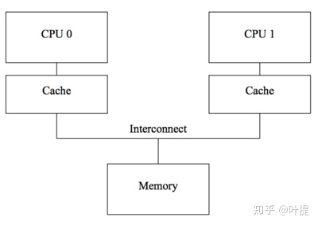
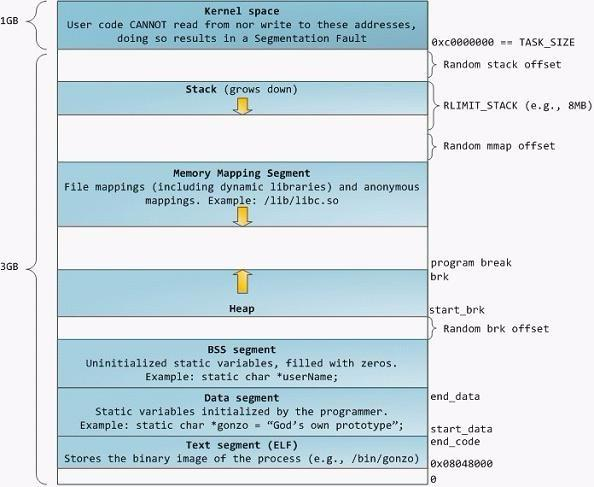
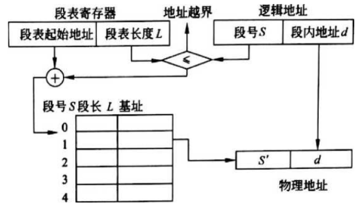

# 操作系统

## CPU 内存/缓存一致性

### cpu cache 

数据以"cache lines"的形式在cpus的cache和内存之间传输，cache line是定长的block，大小通常在16～256bytes。

- cache miss 时会加载数据，一般采用组相联模式；
- 写需要**保证所有cpu之间的一致性**，在某个cpu写数据之前需要将其它cpu cache中的相应数据移除或者"invalidated"；

### MESI

**cache一致性协议**通过管理cache-line的状态来防止不一致或者数据丢失，以下介绍只**关注四种状态的MESI**缓存一致性协议。

MESI协议，每个cache line上用2位来维护状态值"tag"，四种状态分别为：

- **Modified**：处于modified状态的cache line可以认为是被这个cpu所拥有，相应的内存确保不会出现在其它cpu的cache中。这个cache拥有这份数据的**最新副本**，因此也负责将它写回内存或者移交给其它cache。
- **Exclusive**：与modified相似，区别是这种状态下相应cpu还**未修改cache line的这份数据**，内存中的这份数据是最新的，在cache丢弃该数据前，缓存不用负责将数据写回或者移交给其它cache。
- **Shared**：处于shared状态的cache line可能被**复制到至少一个其它的cpu cache**中，因此在该cpu存储该line时，需要先询问其它cpu，与exclusive一样，相应的**内存中的值是最新**的，在cache丢弃该数据前，不用负责将数据写回或者移交给其它cache。
- **Invalid**：处于invalid状态的line是空的，**没有数据**，当新的数据进入cache时，将会优先被放入invalid状态的cache line中，替代其它状态的line可能引起将来的cache miss。

`内存重排`（由Store Buffer、CPU乱序、编译器重排等造成）带来的内存一致性memory consistency问题，MESI协议也是处理不了的。

- X86 上的LOCK前缀指令：原子性 + 禁止前后指令的重排序

### 内存重排

内存重排是指内存读写指令的重排，分为软件层面的`编译器重排` 和硬件层面的`CPU重排` 。

CPU重排：

- CPU指令重排：并行执行、延迟执行等；
- 缓存读写重排：先进行缓存读写操作，而不是直接对内存进行读写；

### 内存屏障类型

从上面来看，barrier 有四种:

- **LoadLoad** 阻止不相关的 Load 操作发生重排
- **LoadStore** 阻止 Store 被重排到 Load 之前
- **StoreLoad** 阻止 Load 被重排到 Store 之前
- **StoreStore** 阻止 Store 被重排到 Store 之前

### CPU 内存一致性模型

目前有多种内存一致性模型：

- 顺序存储模型（sequential consistency model）
- 完全存储定序（total store order）
- 部分存储定序（part store order）
- 宽松存储模型（relax memory order）

### Memory Order

C/C++ 中的  [memory order](https://en.cppreference.com/w/cpp/atomic/memory_order) 。

[Making Sense of Acquire-Release Semantics | Dave Kilian's Blog](https://davekilian.com/acquire-release.html)

## 进程

三态模型：**运行态、就绪态、阻塞态**

进程的组成部分：程序、数据集合、PCB（进程控制块）

- PCB是种数据结构，是进程存在的唯一标识；

PCB的组织方式：

- 线性方式：所有PCB无论状态，连续存放在内存区域（线性表组织），每次查找扫描全表；
- 链接方式：按照进程的状态，将进程的PCB组织成队列，形成就绪、阻塞、运行**队列**（队列头指针）等；
- 索引方式：按照进程状态，建立就绪、阻塞、运行**索引表**等；

### 进程空间

**虚拟内存机制**：每个进程都逻辑上独占拥有全部的内存。

- 内存分配是**分配虚拟内存给进程**，当进程真正访问某一虚拟内存地址时，操作系统通过触发**缺页中断**，在物理内存上分配一段相应的空间再与之建立映射关系，**虚拟内存地址会被自动转换变成有效物理内存地址**，便可以进行数据的存储与访问；

  

- 6**4位地址的虚拟内存空间为256TB** ( 2^48 )：目前的x86-64架构CPU都遵循AMD的Canonical form， 即只有虚拟地址的最低48位才会在地址转换时被使用，且任何虚拟地址的48位至63位必须与47位一致(sign extension)。

  - **内核空间占一半**（同样是高地址区域），普通进程使用另外一半。
  - 使用40位来表示物理地址空间，可以通过`cat /proc/cpuinfo`来查看；

**Kernel space：**操作系统内核地址空间；

- 每个进程的内核虚拟地址空间都是映射到相同的真实物理地址；
- 内核虚拟地址空间总是存放在虚拟内存的地址最高处。

**Stack：**栈空间。

- Random stack offset（栈随机偏移）：因为内存布局按照严格的规则摆放，因此很容易被恶意访问，通过加入随机偏移，使的每个进程的栈空间起始位置都稍有不同，使的被确定栈空间起始位置具有一定难度，**防止被恶意访问**。

**Heap与Memory Mapping Segment：**堆与内存映射段都属于堆空间

- 堆负责小额内存的管理，内存映射段负责大额内存的管理，方便的存储数据并且减少动态分配内存时系统的开销；

**Text segment：**代码段。这一块区域是用来存放进程代码；

**Data segment：**数据段。存放全局数据与静态数据；

**BBS segment**：保存的是全局/静态未初始化数据

### 死锁

两个或多个任务（线程）形成循环等待各自的共享资源释放，形成了死锁。

**Coffman条件**：死锁的充要条件

- 互斥：资源不可共享；
- 占有并等待条件：一个任务占有某个互斥资源同时且请求另一个互斥资源，且等待时不会释放任何资源；
- 不可剥夺：资源只能被那些持有它们的任务释放；
- 循环等待：拥有资源和申请资源形成了环状的循环。

解决死锁的策略：

- 死锁预防：破坏死锁条件中的任一个； 
- 死锁避免：申请资源时判断是否会发生死锁，如银行家算法；
- 死锁检测：判断当前是否处于死锁，如果是则进死锁解除；
- 死锁解除：与死锁检测配合使用，剥夺进程的资源；

一般来说，通过**预防**就可以避免死锁，比如**多资源申请的顺序要一致，且最先申请的资源最后释放**。

### 活锁

系统有两个任务，因对方的行为而改变自己的状态，则出现了活锁。最终是它们陷入状态变更的循环而无法继续向下执行。

通过对**多个资源的同顺序申请**，可以预防活锁。

## 寻址

### 虚拟地址(逻辑地址)

所有现代操作系统都使用虚拟内存，使用虚拟的地址取代物理地址，这样做的好处是：

1.  一个以上的虚拟地址可以指向同一个物理内存地址；

2.  虚拟内存空间可大于实际可用的物理地址；

利用第一条特性可以把**内核空间地址和用户空间的虚拟地址映射到同一个物理地址**，这样DMA就可以填充**对内核和用户空间进程同时可见的缓冲区**。

### 地址重定位

将程序的**虚拟地址（逻辑地址）**转为内存的**真实地址（物理地址）**的过程，由单独的硬件处理。

- **静态重定位**：
  - **绝对地址（物理地址） = 相对地址（逻辑地址） + 程序存放的内存起始地址**
  - 程序运行前确定映射关系，程序装入后不能移动，占用连续的内存空间；
- **动态重定位**：
  - **绝对地址（物理地址）= 逻辑地址寄存器的值（VR）+ 重定位寄存器的值（BR）**
  - 程序占用的内存空间可动态变化，不要求连续的内存空间，**便于多个进程共享代码**；

## 存储管理

### 分区管理

把主存的用户区划分为若干个区域（连续），每个区域分配给用户作业使用，并限定他们只能在自己的区域中运行。

- 固定分区：**每个分区用来装入一个作业**；
- 可变分区：**进程装入内存时，根据进程的大小动态地建立分区**，系统**分区的大小和数目是可变的（空闲分区会合并）**；
  - 首次适应算法：第一个区域能够满足程序的空间需求；
  - 最佳适应算法：最小剩余的区域能够满足程序的空间需求；
  - 最差适应算法：最大剩余的区域能够满足程序的空间需求；
- 可重定位分区：
  - 程序使用的空间（连续）可以整体移动，让使用的分区集中，进一步减少内存碎片；

案例：伙伴系统（buddy system）：内存是以2的幂次个字节大小的空闲块为分配单位

### 分页管理

**页**：将进程的地址空间划分为若干个大小相等的区域。

**页框**：将主存空间也划分跟页大小相等的若干个物理块，也称为块。

逻辑地址：页号+页内地址；

物理地址：页框号（物理块号）+块内地址；

通过**页表**记录 **页号** -> **页框号**，页内地址等于块内地址。

### 分段管理

为每个段分配一个连续的区域（各个段的长度可以不一样），进程中的各个段可以离散地分配到主存的不同分段中。

逻辑地址：段号+段内地址；

物理地址：段基址+段内地址；

通过**段表**记录 **段号** -> **段基址**，段内地址一样。

### 段页式管理

将主存划分成大小相等的存储块（页框），将用户程序按程序逻辑关系分为若干段，将**每个段划分为若干页**，以**页框为单位离散分配**。

逻辑地址：段号 + 段内页号 + 页内地址

物理地址：段基址 + 页框号 + 页内地址

### 虚拟存储

当主存空间不能满足作业要求时，作业无法装入主存执行。

如果一个作业只部分装入主存便可开始启动运行，其余部分暂时留在磁盘上，在需要时再装入主存，这样可以有效地利用主存空间。

从用户角度看，该系统所具有的主存容量将比实际主存容量大得多，人们把这样的存储器称为虚拟存储器。

- 根据不同的管理方式分为：**请求分页、请求分段、请求段页式**

#### 页面淘汰

请求分页管理中，淘汰页面的算法：

- 状态位在内存的页面才可以被淘汰；
- 根据访问位（0未访问，1访问），修改位（0未修改，1修改）进行淘汰：
  - 按照 00  -> 01 -> 10 -> 11 的顺序进行淘汰；

## 设备管理

**程序控制**：CPU与设备串行工作

- 无条件传送：IO端总是准备好，CPU需要时，随时使用IO端口；
- 程序查询：CPU轮询IO端是否准备好，再进行发送数据；

**中断**：

- 某个进程要启动某个设备时，CPU就向相应的设备控制器发出一条设备I/O启动指令，然后CPU又返回做原来的工作；
- 设备准备好时，可以发送中断请求，CPU响应中断请求发送数据；
- CPU与I/O设备可以并行工作（即设备准备时，CPU可以继续执行其它程序）。

**DMA**：

- 通过DMA控制器**直接进行批量数据交换**，除了在数据传输开始和结束时，整个过程无须CPU的干预；

## 文件存储管理

### 索引视图

### 位视图

该方法是在外存上建立一张位示图（Bitmap），记录文件存储器的使用情况。**每一位仅对应文件存储器上的一个物理块**，取值0 和1
分别表示空闲和占用。

## 内核态和用户态

**内核态**：控制计算机的硬件资源，并提供上层应用程序运行的环境。比如socket I/O操作或者文件的读写操作等

**用户态**：上层应用程序的活动空间，应用程序的执行必须依托于内核提供的资源。

**系统调用**：为了使上层应用能够访问到这些资源，内核为上层应用提供访问的接口。

>Intel X86 CPU 有四种不同执行级别0到3，Linux用0和3分别表示内核态和用户态。

### 缓冲区

- **用户缓冲区的目的是为了减少系统调用次数**，从而降低操作系统在用户态与核心态切换所耗费的时间；
  - 比如 Java 中的 BufferedReader，用户空间的缓存；
- **内核缓冲区**，是为了在**OS级别，提高磁盘IO效率，优化磁盘写操作**；
  - 读写文件时的内存缓冲区，等到一定时间或数据规模后，再写入磁盘。

## I/O

### 同步、异步、阻塞、非阻塞

- 同步：不管是BIO/NIO/IO多路复用，从**内核缓存写入用户缓存一定是由用户线程自行读取数据**，处理数据

- 异步：数据是内核写入的，并放在了用户线程指定的缓存区，写入完毕后**通知用户线程**
- 阻塞：数据从网口写到内核,如果没写好,线程就一直在等待
- 非阻塞：数据从网口写到内核,用一个线程轮询的去查看所有的数据是否准备好(I/O多路复用,监听多个socket)

IO分类

- BIO:同步阻塞IO,一个客户端连接，对应一个服务端线程
- BIO还有一种变种,伪异步IO,当有新的客户端接入时，将客户端的socket封装成一个task，丢到线程池中处理。优化了后续处理线程的方式
- **NIO**： **同步非阻塞**IO
- **AIO**:：**异步非阻塞**IO(异步一定是非阻塞)

### I/O多路复用

**select**：知道了有I/O事件发生了，却并不知道是哪那几个流（可能有一个，多个，甚至全部），只能**无差别轮询所有流(O(n))**，找出能读出数据或者写入数据的流，再进行操作；

**poll**：本质上和select没有区别，它将用户传入的数组拷贝到内核空间，然后查询每个fd对应的设备状态， 但是它**没有最大连接数的限制**，原因是它是基于链表来存储的

**epoll**(Linux内核所特有)：可以理解为event poll，不同于忙轮询和无差别轮询，epoll会把**哪个流发生了怎样的I/O事件通知我们（O(1)）**。epoll实际上是事件驱动（每个事件关联上fd）；

注意：表面上看epoll的性能最好，但是在**连接数少并且连接都十分活跃**的情况下，select和poll的性能可能比epoll好，毕竟epoll的通知机制需要很多函数回调；

### 锁页内存

设备可以通过**直接内存访问（direct memory access，DMA）**方式来访问主机的**锁页内存**。 

**锁页就是将内存页面标记为不可被操作系统换出的内存**。所以设备驱动程序给这些外设编程时，可以使用页面的**物理地址**直接访问内存（DMA），从而避免从外存到内存的复制操作。

- **锁页内存和GPU内存之间的拷贝可以和内核程序同时执行**，也就是异步并发执行；

