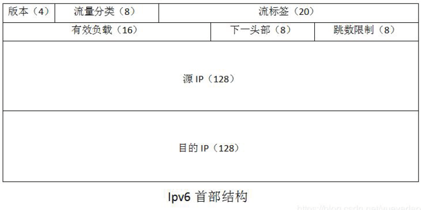

# 网络层协议

## NAT

**NAT网络地址转换（NAT，Network Address Translation）**属接入广域网(WAN)技术，是一种将私有(保留)地址转化为外网IP地址的转换技术，它被广泛应用于各种类型Internet接入方式和各种类型的网络中。

NAT不仅完美地解决了lP地址不足的问题，而且还能够有效地避免来自网络外部的攻击，隐藏并保护网络内部的计算机。

- **静态转换**：一个内网IP只转换为某个公有IP；
- **动态转换**：内部地址可以转换成外部IP集合中的任意一个；
- **端口多路复用(PAT)**：多个主机共享一个合法的公网 IP 实现对Internet的访问，每个内部IP映射到公网上的一个端口；
- **应用程序级网关技术ALG（Appliaction Level Gateway)**：传统的NAT技术只对传输层头部进行处理，支持对应用层协议中的地址信息进行转换；

**SNAT**（Source Network Address Translation）指的是源地址转换，它将源IP地址和端口号进行转换。

- 当一个内部设备向外部网络发送数据包时，SNAT会将源IP地址和端口号替换为一个公共IP地址和端口号，以隐藏内部网络的真实IP地址和端口号。这样可以避免内部网络受到攻击和侵入，并且可以实现多个内部设备共享一个公共IP地址的功能。

**DNAT**（Destination Network Address Translation）指的是目标地址转换，它将目标IP地址和端口号进行转换。

- 当外部网络向内部网络发送数据包时，DNAT会将目标IP地址和端口号替换为内部网络中的一个设备的IP地址和端口号，以实现内网穿透和访问内部网络中的设备。

### 端口多路复用 NAPT

网络地址端口转换**NAPT**（Network Address Port Translation）：

- 改变**外出数据包的源IP地址和源端口并进行端口转换**，即端口地址转换采用端口多路复用的方式；
- 内部网络的所有主机均可共享一个合法外部IP地址实现互联网的访问。

#### 对称NAT（Symmetric NAT）

从同一个内网（IP，端口）发送到同一个目的IP和端口的请求都会被映射到同一个IP和端口：

- （SourceIP, SourcePort,DestIP, DestPort）只要有**一个发生变化都会使用不同的映射条目**

#### 锥形NAT（Cone NAT）

**内网中的（IP，端口）相同的请求就会被NAT映射到同一个外网（IP，port）**

- 从相同的内部端点（私有地址）到两个不同的外部服务端S1和S2，Cone NAT只为两个会话映射了一个公网端点。

##### 全锥形NAT（Full Cone NAT）

在一个新会话建立了公网/内网端口绑定之后，全锥形NAT接下来会**接受对应公网端口的所有数据**，无论是来自哪个（公网）终端。


##### 地址受限锥形NAT（Restricted Cone NAT）

只转发符合某个条件的输入数据包。条件为：**外部（源）IP地址匹配内网主机之前发送一个或多个数据包的结点的IP地址**。

- 只有内网主机主动连接的公网IP才可以与内网中的主机通讯。


##### 端口受限锥形NAT（Port-Restricted Cone NAT）

只当**外部数据包的IP地址和端口号都匹配内网主机发送过的地址和端口号时**才进行转发。端口受限锥形NAT为内部结点提供了和对称NAT相同等级的保护，以隔离未关联的数据。


### 问题

- 不能处理**嵌入式**IP地址或端口，应用协议里的数据包含**本地地址**，无法被NAT转换；
- 不能从公网访问内部网络服务，需要**建立NAT到私有地址端口的映射**；
- 有一些应用程序虽然是用A端口发送数据的，但却要用B端口进行接收，结果NAT没有B端口的映射；
- 如果**NAT本身又位于另一个NAT**之后，则也会出现一些问题；
- 一些**P2P应用在NAT后无法进行**，NAT设备后的P2P程序在NAT设备上是不会有映射条目。


## NAT穿越技术(NAT Traversal)

解决NAT技术的问题：

- 让网络应用程序(如QQ)主动发现自己位于NAT设备之后，**主动获得NAT设备的公网IP，并为自己建立端口映射条目**；
- NAT穿越技术依赖于**UPnP**协议的支持，也就是说**NAT设备必须支持UPnP**，支持NAT穿越技术；
- **网络应用程序一样也需要支持UPnP**，支持NAT穿越技术；

对于**那种NAT设备位于另一个NAT设备之后的情况，NAT穿越技术也无能为力**。


## IPV4

### 地址与子网掩码

32位的二进制数，点分十进制，如 192.168.3.1。

IP地址构成：**网络号 + 主机号**

- A类地址：`1.0.0.0--126.255.255.255`，**1字节的网络地址和3字节主机地址**，二进制以`0`开头
  - 私有区域：`10.0.0.0～10.255.255.255`
- B类地址：`128.0.0.0--191.255.255.255`，**2个字节的网络地址和2个字节**，二进制以`10`开头
  - 私有区域：`172.16.0.0～173.31.255.255`
- C类地址：`192.0.0.0--223.255.255.255`，**3个字节的网络地址和1字节的主机地址，**二进制以`110`开头
  - 私有区域：`192.168.0.0～192.168.255.255`
- D类地址：`224.0.0.0---239.255.255.255`，二进制以`1110`开头，组播地址；
- E类地址：`240.0.0.1---255.255.255.25`，二进制以`1110`开头，用作保留地址；

特殊的地址：

- `127.X.X.X`：本地回环地址
- `0.0.0.0`：当前主机。
- `255.255.255.255`：当前子网的广播地址。

**子网掩码：**网络号 + 子网号 +  主机号

- **标准子网掩码**：A类，`255.0.0.0`；B类，`255.255.0.0`；C类，`255.255.255.0`；
- **特殊子网掩码**：用于网络划分，哪些主机是同一个子网；
- `131.1.123.23/27`：前27位是网络位，后5位是主机位；

### 数据报文


- 版本：IP协议的版本。这里版本号为4。
- **首部长度**：可表示的最大数值是15个单位（4 字节为一个单位），即首部长度最多60字节。
- **区分服务**：不同优先级服务质量不同，只有在使用区分服务（DiffServ）时有效。
- **总长度**：首部与数据之和的长度，最大长度为2^16-1=65535字节。
- 标识：唯一标识数据报的标识符。
- **标志**：中间的一位（DF）0表示分片，1表示 不分片；最低位（MF），0表示最后一个分片，1表示还有分片；最高位保留无用；
- **片偏移**：指明该段处于原来数据报中的位置，**以 8 个字节为偏移单位**。
- **生存时间**：记为TTL（Time To Live），指示数据报在网络中可**通过的路由器的最大值**。防止数据报无限循环传输
- 协议：数据报携带的协议（TCP、UDP、IGMP等）
- 首部检验和：只检验首部，不检验数据。采用16位二进制反码求和算法。
- 可选字段：可记录时间戳 ，通过路径，安全信息等。
- 填充：填充为4的倍数 。

## IPV6

### 地址

128位，16位为一段，共 8 段，如`2001:0da8:d001:0001:0000:0000:0000:0001`

- `::`表示连续的三个`0000:0000:0000`；

IPv4/IPv6的过渡技术：

- 双协议栈技术：节点同时支持IPv4/IPv6；
- 隧道技术：在IPv4网络中部署隧道，实现IPv4网络对IPv6的业务承载，如 6to4 隧道、6over4 隧道、ISATAP隧道；
- NAT-PT技术：使用网关设备连接 IPv6 和 IPv4 网络，当 IPv4 和 IPv6 节点互相访问时，NAT-PT 网关实现协议转换和地址映射；

### 报文




- 版本：IP协议的版本。这里版本号为6。
- **流量分类**：通信类型，相当于**IPV4服务类型**字段。
- **流标签**：从源点到终点的一系列数据报，同一个流上的数据报标签相同，**保证服务质量**。
- **有效负载长度**：除基本首部以外的字节数（所有扩展首部都算在有效负载内），最大值64KB
- **下一头部**：相当于IPV4的协议字段或可选字段。
- **跳数限制**：用于检测路由循环，路由器在转发数据报时对这个字段减1，变成0丢弃该数据报。

IPv6数据报的目的地址可以是以下三种基本类型地址之一∶

- **单播**（（unicast）∶传统的点对点通信；
- **多播/组播**（multicast）∶一点对多点的通信。
- <font color=red>**任播**（anycast）</font>∶这是 IPv6增加的一种类型。**任播的目的站是一组计算机**，但数据报在交付时只交付其中的一个，**通常是距离最近的一个**。


## IPSec

Internet Protocol Security：是一个协议包，通过**对 IP协议的分组进行加密和认证来保护 IP 协议的网络传输协议簇**（一些相互关联的协议的集合）。

- **认证头**：用于**数据完整性认证和数据源认证**；
- **封装安全负荷**：提供数据**保密性和完整性**认证，包括防止重放攻击的顺序号；
- Internet密钥交换协议：生成和分发在ESP和AH中使用的密钥，对远程系统进行初始认证；

IPSec 模式：

- **传输模式**：**IP头没有加密**，只是对IP数据进行加密；
- **隧道模式**：对原来的**IP数据包进行封装和加密**，加上新的IP头；


## ARP

**Address Resolution Protocol**：地址解析协议，<font color='red'>**IP地址到MAC地址**</font>

工作流程：

- 主机有ARP缓冲保存ARP列表，保存IP地址到MAC地址对应关系；
- 源主机发送数据，查看ARP列表是否有目的主机IP的MAC地址，有则直接发送；否则，向本网段所有主机发送ARP数据包，包含内容：`源主机IP，源主机MAC，目的主机IP`；
- 本网络其他主机接受ARP数据包，IP地址不匹配目的主机IP地址，忽略；匹配，则将源主机IP和MAC地址加入ARP缓存（存在则覆盖），然后将自己MAC地址写入ARP响应包中，即告诉源主机目的主机MAC地址；
- 源主机接受ARP响应包后，将目的主机IP和MAC写入ARP缓存，并发送数据；若源主机一直未收到ARP响应，则ARP查询失败；
- 广播发送ARP请求，单播发送ARP响应；


## RARP

**Reverse Address Resolution Protocol**：逆地址解析协议，***MAC地址到IP地址***

```shell
# -b 保持广播  -I 指定网卡  -s 指定源IP地址  -c 发送的数据包的数目
$ ifconfig eth0:1 10.90.143.176 netmask 255.255.255.0 up
$ /sbin/arping -b -I eth0 -s "10.90.143.176" "10.90.143.1" -c 4
```


## 隧道协议

- 隧道协议：使用一种网络协议（发送协议），将另一个不同的网络协议封装在负载部分，点对点的连接，两端都需要配置隧道协议；
  - 如 6to4 隧道、6over4 隧道、ISATAP隧道；

- VPN隧道协议：VPN Server将private ip发送的包作为负载，发送给另一个VPN server解析；


