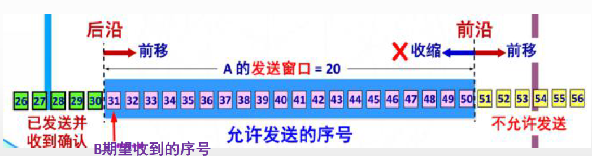
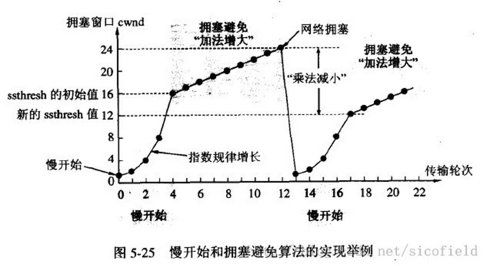

# 传输层协议

## TCP

传输控制协议（Transmission Control Protocol，TCP）是一种**可靠的、面向连接**的**字节流**服务。



### 报文


### 三次握手协议

> 不论握手多少次都不能确认一条信道一定是“可靠”的，但通过3次握手可以至少确认它是“可用”的。
>
> 握手成功只能说明握手时的通信是正常的，并不能保证握手后的通信是正常的。

两次握手的问题：

- 防止**已失效的连接请求报文段突然又传送到了服务端**，造成服务端资源的浪费。


三次握手：

- 第一次：客户端发送syn包(<font color='red'>**syn=x**</font>)到服务器，并进入SYN_SEND状态，等待服务器确认；
- 第二次：服务器收到syn包，必须确认客户的SYN（<font color='red'>**ack=x+1**</font>），同时自己也发送一个SYN包（<font color='red'>**syn=y**</font>），即SYN+ACK包，此时服务器进入SYN_RECV状态；
- 第三次：客户端收到服务器的SYN＋ACK包，向服务器发送确认包ACK(<font color='red'>**ack=y+1**</font>)，此包发送完毕，客户端和服务器进入ESTABLISHED状态，完成三次握手。

### 四次挥手


**TIME_WAIT**：主动要求关闭的机器表示收到对方的**FIN**报文，并发送出**ACK**报文；

- 等待的 **2MSL** 是报文在网络上生存的最长时间，超过阁值便将报文丢弃；
- 确保被动方会接收到 ACK，变成 **CLOSED **状态；
- <font color='red'>**TIME_WAIT 状态无法释放句柄资源**</font>，对于服务器来说，限制有效连接的创建数量，成为性能瓶颈；

**CLOSE_WAIT**：被动要求关闭的机器收到对方请求关闭连接的**FIN**报文，在第一次**ACK**应答后；


### TCP保活

保活功能主要是为服务器提供的，服务器可能会代表客户绑定一些资源，希望知道客户主机是否崩溃。

> 客户端也可以设置Socket保活，设置的一方会向对端发送Keepalive报文；

如果一个给定的连接在2个小时之内没有任何动作，则服务器就向客户发送一个探查报文段：

- 对端仍然运行正常

  客户主机依然正常运行，并且服务器可达。则客户的TCP响应正常，而服务器也知道对方是正常工作的，则服务器在2小时内以后将保活定时器复位。在这2小时以内，如果有数据流交换，则在交换数据后的未来2小时再复位。

- 对端已经崩溃

  客户主机已经崩溃，并且关闭或者正在重新启动。在任何情况下，客户的TCP都没有响应。服务器不能够收到对探查的响应，并在75秒后超时(服务器总共发送10个这样的探查，每个间隔75秒)。如果服务器没有收到一个响应，则认为客户主机已经关闭并会终止这个连接。

- 对端已经崩溃并重新启动

  客户主机崩溃并已经重新启动。这时服务器将收到一个对其保活探查的响应，然而这个响应是一个复位，使得服务器终止这个连接。

- 对端当前无法到达

  客户主机正常运行，但是服务器不可达。

#### 参数解释

SO_KEEPALIVE 用于开启或者关闭保活探测，默认情况下是关闭的。

- `net.ipv4.tcp_keepalive_intvl = 75` （发送探测包的周期，前提是当前连接一直没有数据交互，才会以该频率进行发送探测包，如果中途有数据交互，则会重新计时tcp_keepalive_time，到达规定时间没有数据交互，才会重新以该频率发送探测包）

- `net.ipv4.tcp_keepalive_probes = 9` （探测失败的重试次数，发送探测包达次数限制对方依旧没有回应，则关闭自己这端的连接）

- `net.ipv4.tcp_keepalive_time` = 7200 （空闲多长时间，则发送探测包）

#### 全局修改

在Linux中我们可以通过修改` /etc/sysctl.conf` 的全局配置：

```java
net.ipv4.tcp_keepalive_time=7200
net.ipv4.tcp_keepalive_intvl=75
net.ipv4.tcp_keepalive_probes=9
```

添加上面的配置后输入 `sysctl -p` 使其生效，可以使用命令来查看当前的默认配置

```shell
sysctl -a | grep keepalive 
```

如果应用中已经设置SO_KEEPALIVE，程序不用重启，内核直接生效。

#### 单socket修改

TCP_KEEPCNT、TCP_KEEPIDLE、TCP_KEEPINTVL

> C 可以对单个socket设置不同的keepalive参数，但是 Java Socket 只能设置keepalive是否开启。

#### 中间设备

中间设备如防火墙等，会为经过它的数据报文建立相关的连接信息表，并为其设置一个超时时间的定时器，如果超出预定时间，某连接无任何报文交互的话，中间设备会将该连接信息从表中删除，在删除后，再有应用报文过来时，中间设备将丢弃该报文，从而导致应用出现异常，这个交互的过程大致如下图所示：	


#### 实践（心跳）

但是日常更多的是在应用层加入**心跳包**机制，因为TCP的这个保活机制由几个缺陷：

- keepalive只能检测连接是否存活，**不能检测连接是否可用**。比如服务器因为负载过高导致无法响应请求但是连接仍然存在，此时keepalive无法判断连接是否可用。
- 如果TCP连接中的另一方因为停电突然断网，我们并不知道连接断开，此时发送数据失败会进行重传，由于重传包的优先级要高于keepalive的数据包，因此keepalive的数据包无法发送出去。只有在长时间的重传失败之后我们才能判断此连接断开了。


### 传输

#### 慢开始和拥塞控制

> 拥塞窗口（发送方维持）的大小取决于网络的拥塞程度，并且动态地在变化。
>
> - 网络没有出现拥塞，拥塞窗口就增大一些，以便把更多的分组发送出去。但只要网络出现拥塞，拥塞窗口就减小一些，以减少注入到网络中的分组数

cwnd发送方维持的拥塞窗口，慢开始限制阈值 **ssthresh**

**当cwnd<ssthresh时，使用慢开始算法。**

**当cwnd>ssthresh时，改用拥塞避免算法。**

**当cwnd=ssthresh时，慢开始与拥塞避免算法任意。**

**慢开始**：从1开始，指数增长直至大于阈值

**拥塞控制**：每次只增长1

**拥塞时（没有按时收到确认）**：阈值减半，重新慢开始



#### 快重传和快恢复

快重传配合使用的还有快恢复算法:

- 当发送方连续收到三个重复确认时，就执行“乘法减小”算法，把ssthresh门限减半。但是接下去并不执行慢开始算法。
- 考虑到如果网络出现拥塞的话就不会收到好几个重复的确认，所以发送方现在认为网络可能没有出现拥塞。所以此时不执行慢开始算法，而是将cwnd设置为ssthresh的大小，然后执行拥塞避免算法


## UDP

用户数据报协议（User Datagram Protocol，UDP）是一种**不可靠的、无连接**的数据报服务。源主机在传送数据前不需要和目标主机建立连接。

### 报文


### 对比

- UDP是无连接的，发送数据之前不需要建立连接，因此减少了开销和发送数据之前的时延；
- UDP使用尽最大努力交付，即不保证可靠交付，因此主机不需要维持复杂的连接状态表；
- UDP是面向报文的。UDP对应用层交下来的报文，既不合并，也不拆分，而是保留这些报文的边界。UDP一次交付一个完整的报文；
- UDP没有拥塞控制，因此网络出现的拥塞不会使源主机的发送速率降低。这对某些实时应用是很重要的。很适合多媒体通信的要求;
- UDP支持一对一、一对多、多对一和多对多的交互通信;
- UDP的首部开销小，只有8个字节，比TCP的 20个字节的首部要短。

