# SQL 系统

## Apache Calcite

> Apache Calcite : A Foundational Framework for Optimized Query Processing Over Heterogeneous Data Sources（一个用于优化异构数据源的查询处理的基础框架），源自 Hive 项目 optiq 进行基于成本模型的优化。

数据库管理系统分为以下五部分，其中前三部分是Apache Calcite负责的部分，后两部分提供适配器可集成：

- 查询语言、查询优化器、查询执行
- 数据管理、数据存储

提供了**OLAP**和**流处理**的**查询引擎**，支持**异构数据源查询**

- **SQL 解析器、验证器和 JDBC 驱动**；

- **查询优化工具**，包括关系代数API，基于规则的计划器和基于成本的查询优化器；

- **不包括数据处理、数据存储**等 DBMS 的核心功能；

- 支持多种数据模型：流式、批式数据；
- 跨平台支持，查询优化灵活、可扩展；

- 支持ANSI SQL及其扩展；

- 支持SQL解析为关系算子树，并将优化后的树翻译回SQL；

### 架构

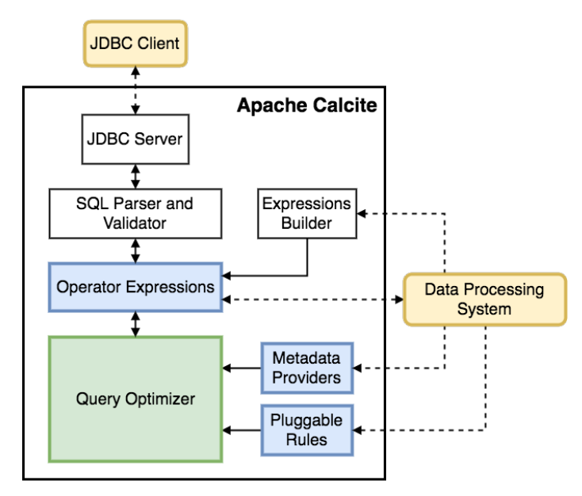

- JDBC client 表示外部的应用，访问时一般会以 SQL 语句的形式输入，通过 JDBC Client 访问 Calcite 内部的 JDBC Server；

- 接下来 JDBC Server  会把传入的 SQL 语句经过 SQL Parser and Validator 模块做 SQL 的解析和校验；

- 旁边的 Expressions Builder 用于支持 Calcite 做 SQL 解析和校验的框架对接；

- 接着是 Operator Expressions 模块来处理关系表达式；

- Metadata Providers 用来支持外部自定义元数据；

- Pluggable Rules 用来定义优化规则；

- 最核心的 Query Optimizer 则专注查询优化。

### 示例

> 其它SQL系统可以通过[Adapter](https://calcite.apache.org/docs/adapter.html)的方式，继承到Calcite中，可以参考 [example/csv](https://calcite.apache.org/docs/tutorial.html) 的 Adapter。

maven依赖

```xml
<!-- https://calcite.apache.org/downloads/ -->
<groupId>org.apache.calcite</groupId>
<artifactId>calcite-core</artifactId>
<version>1.42.0</version>
```

[Java demo](https://gitee.com/oscsc/bigdatatech/tree/master/calcite)


## 索引

### 倒排索引

索引方法，被用来存储在全文搜索下某个单词在一个文档或者一组文档中的存储位置的映射。

一般用在文档数据库，如MongoDB中。

### 树状索引

#### B树系列索引

数据库系统巧妙利用了磁盘预读原理，将一个节点的大小设为等于一个页（磁盘的一个块），这样每个节点只需要一次I/O就可以完全载入。为了达到这个目的，在实际实现B- Tree还需要使用如下技巧：

- 每次新建节点时，直接申请一个页的空间，**保证一个节点物理上也存储在一个页**里，加之计算机存储分配都是按页对齐的，就实现了一个node只需一次I/O。
- B-Tree中一次检索最多需要 h-1 次I/O（根节点常驻内存），渐进复杂度为O（h）=O（logmN）。一般实际应用中，**m是非常大的数字，通常超过100**，因此h非常小（通常不超过3）。

**InnoDB一棵B+树可以存放多少行数据**

InnoDB的主键索引：B+树的叶子节点存储了完整的数据记录。

InnoDB的辅助索引：引用主键作为data域，因此需要两次的索引检索。

文件系统块的大小是4k，InnoDB最小储存单元页（Page）的大小是16K。

单行的字节数：1KB

一页存储的行数：16KB / 1KB = 16

主键：bigInt 8字节

指针：在InnoDB源码中设置为6字节

一页的索引个数：16KB = 16384/(6+8) = 1170

**高度为3的B+树**：**1170（索引个数）\*1170（索引个数）\*16（每页行数）= 21902400（2千万）**条这样的记录


### 位图索引

> 位图索引不适合**OLTP**，比较适合**OLAP**。
>
> - **位图索引**，由于用位图反映数据，不同会话**更新相同键值的同一位图段**，insert、update、delete相互操作都会发锁定。

主要针对**大量相同值的列而创建的索引**，此时B+树索引仍然会取出大部分数据。

- 无需排序；
- 对**位图索引**列进行 `is null` 查询时,则可以使用索引；
- 当使用 `count(XX)` ,可以直接访问索引就快速得出统计数据；
- 当根据**位图索引**的列进行`and,or`或 `in(x,y,..)`查询时,直接用索引的位图进行或运算,在访问数据之前可事先过滤数据；
- **位图索引**，由于用位图反映数据,不同会话更新相同键值的同一位图段，insert、update、delete相互操作都会发锁定。

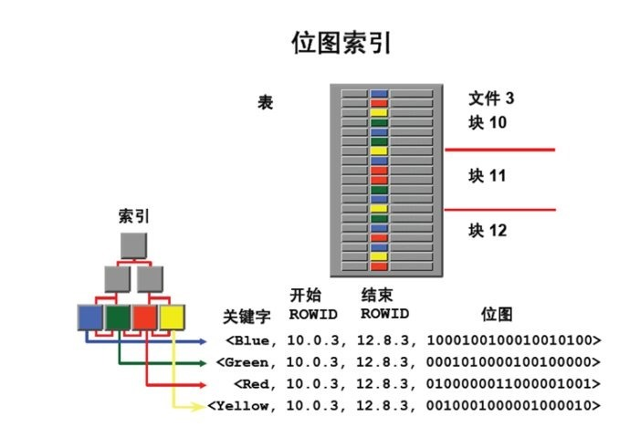

- 索引块的一个索引行中存储键值、起止Rowid,以及这些键值的位置编码；
- 位置编码中的每一位表示键值对应的数据行的有无.位数=表的总记录数；
- 所需的位图个数=索引列的不同键值多少，列的不同值越少，所需的位图就越少；
- 与B*树那样直接保存rowid的区别就在于**每次都要进行rowid的换算工作**。

## 数据类型分类

### 结构化数据

结构化数据可以通过固有键值获取相应信息，且数据的格式固定。

- 表模型。

### 半结构化数据

半结构化数据是结构化数据的一种形式，它并**不符合关系型数据库或其他数据表的形式关联起来的数据模型**结构，但包含相关标记，用来**分隔语义元素以及对记录和字段进行分层**。因此，它也被称为自描述的结构。

- json、html、xml等，树模型、图模型

### 非结构化数据

没有一个预先定义好的数据模型或者没有以一个预先定义的方式来组织。

- 文本、图像、音频、视频等。

## 读时模式和写时模式

"写时模式"：数据在写入数据库时对照表模式进行检查，数据摄入（写入）速度慢，倾向于读效率；

- 要是所有记录都具有相同的结构，那么模式是记录并强制这种结构的有效机制。

  "读时模式"：在需要查询分析的时候再为数据设置schema进行验证（失败设置为NULL），底层存储不会在数据加载时进行验证。

- 存在许多不同类型的对象，将每种类型的对象放在自己的表中是不现实的；

- 数据的结构由外部系统决定。你无法控制外部系统且它随时可能变化；

## DQL、DML、DDL、DCL的概念与区别

SQL(Structure Query Language)语言是数据库的核心语言。

SQL语言共分为四大类：数据查询语言DQL，数据操纵语言DML，数据定义语言DDL，数据控制语言DCL。

### 1. 数据查询语言DQL

数据查询语言DQL基本结构是由SELECT子句，FROM子句，WHERE
子句组成的查询块：
SELECT <字段名表>
FROM <表或视图名>
WHERE <查询条件>

### 2 .数据操纵语言DML

数据操纵语言DML主要有三种形式：

1) 插入：INSERT
2) 更新：UPDATE
3) 删除：DELETE

### 3. 数据定义语言DDL

数据定义语言DDL用来创建数据库中的各种对象-----表、视图、索引、同义词、聚簇等如：

CREATE TABLE/VIEW/INDEX/SYN/CLUSTER

DDL操作是隐性提交的！不能rollback 

### 4. 数据控制语言DCL

数据控制语言DCL用来授予或回收访问数据库的某种特权，并控制数据库操纵事务发生的时间及效果，对数据库实行监视等。如：

1. GRANT：授权。

2. ROLLBACK [WORK] TO [SAVEPOINT]：回退到某一点。

3. COMMIT [WORK]：提交。

   提交数据有三种类型：显式提交、隐式提交及自动提交。下面分别说明这三种类型。

   (1) 显式提交

   用COMMIT命令直接完成的提交为显式提交。其格式为：

   SQL>COMMIT；

   (2) 隐式提交

   用SQL命令间接完成的提交为隐式提交。这些命令是：

   ALTER，AUDIT，COMMENT，CONNECT，CREATE，DISCONNECT，DROP，EXIT，GRANT，NOAUDIT，QUIT，REVOKE，RENAME。

   (3) 自动提交

   若把AUTOCOMMIT设置为ON，则在插入、修改、删除语句执行后，系统将自动进行提交，这就是自动提交。其格式为：

   SQL>SET AUTOCOMMIT ON；

## 数仓

数据仓库中有这些概念：（通俗的讲，具体的概念可以看数据仓库的书）

**主题**：你要分析什么？如：某年某月某个地区的某种商品的销售量，这样的一个问题就是一个主体。

**维度**：从哪个角度来判断。如：时间角度（某年、某月……），地区（哪个国家、那个省……）

**层次**：维度的具体测量单位，类似于量长度时采用的哪种单位。如时间维度，年、季度、月就是不同的层次。

**事实**：就是你要分析主题的具体数字。如销售量、人均消费量、资产总数……

### 事实表与维度表

需要**行和列来定位数值的，就是二维表**；仅靠**单行就能锁定全部信息的，就是一维表**。

- 一维表称为源数据，特点是数据丰富详实，适合做流水账，方便存储，有利于做**统计分析**；

- 二维表称为展示数据，特点是明确直观，适合打印、汇报

  **事实表**：表格里存储了能体现实际数据或详细数值，一般由维度编码和事实数据组成

  **维度表**：表格里存放了具有独立属性和层次结构的数据，一般由维度编码和对应的维度说明(标签)组成

### 星型模型和雪花模型

**星型模型**：是一种多维的数据关系，它由**一个事实表（Fact Table）和一组维表（Dimension Table）**组成

- 每个**维表都有一个维作为主键，所有这些维的主键组合成事实表的主键**；

- **事实表的非主键属性称为事实（Fact）**，它们一般都是数值或其他可以进行计算的数据；

- **一种非正规化的结构**，多维数据集的每一个维度都直接与事实表相连接，所以数据有一定的**冗余**。

  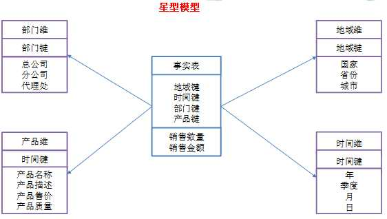

  **雪花型模型**：当有一个或多个维表没有直接连接到事实表上，而是**通过其他维表连接到事实表**上时，其图解就像多个雪花连接在一起，故称雪花模型。

- 原有的各维表可能被扩展为小的事实表，形成一些局部的 "层次 " 区域；

- 减少数据存储量以及联合较小的维表来改善查询性能，雪花型结构去除了数据冗余。

  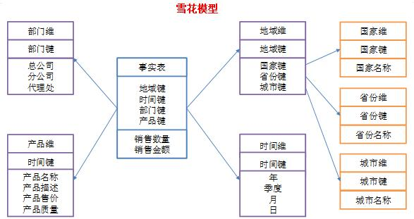

  **对比**：

- 查询性能：在OLTP-DW环节，由于雪花型要做多个表联接，性能会低于星型架构；但从DW-OLAP环节，由于雪花型架构更有利于度量值的聚合，因此性能要高于星型架构。

- 模型复杂度：星型架构更简单方便处理

- 层次结构：雪花型架构更加贴近OLTP系统的结构，比较符合业务逻辑，层次比较清晰。

- 存储角度：雪花型架构具有关系数据模型的所有优点，不会产生冗余数据，而相比之下星型架构会产生数据冗余。


**根据项目经验，一般建议使用星型模型。因为在实际项目中，往往最关注的是查询性能问题。**


### 术语

- 数据加载层：ETL（Extract-Transform-Load）
- 数据运营层：ODS（Operational Data Store）
- 数据仓库层：DW（Data Warehouse）

- 数据明细层：DWD（Data Warehouse Detail）
  - 数据中间层：DWM（Data WareHouse Middle）	
  - 数据服务层：DWS（Data WareHouse Service）
  - 数据应用层：APP（Application）
- 维表层：DIM（Dimension）

## 数据字典

> 将属性值和主体分离，主体表只保存属性的的代码，这就是一种数据字典。

### 背景

User表，User主体有很多属性，比如证件（身份证、居住证、港澳通行证...），地区（河北、河南、北京...）等，然后表建好了，数据也填进去了，项目代码也敲几万行。但是有一天，客户说这个“身份证”表述不够官方，要改成“居民身份证”比较好，作为这个项目开发人员，要把代码里和数据库中所有的“身份证”改成“居民身份证”，这工作量估计很让人抓狂。

### 两种形式

第一种：《主体表》里包含主体和属性代码，《属性表》里包含属性代码和属性Value，**不同属性分别建表**。

- 由于属性id是存储在主体表里的，**属性的数量是不变的，而属性取值的数量可以是变化**。
- 但是如果该主体的属性非常多的话，就需要建很多的属性表，在开发中还要设计很多属性类，那当想要取得一条主体的完全数据时，那将进行几十个表的联接（join）操作。性能耗损严重。
- 当属性的数量不多时，用第一种数据字典即可。

| <User表>                         | <证件表>                     | <身份表>                     |
| -------------------------------- | ---------------------------- | ---------------------------- |
| 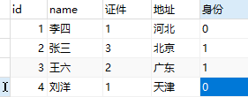 | 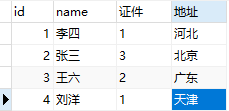 | 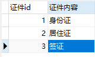 |

第二种：《主体表》里仅包含主体，《系统代码分类表》里存储属性标识和属性名称，《系统代码表》里包含所有属性代码、属性标识和属性Value，《属性表》是《主体》和《系统代码表》的关系表，包含属性id，主体id,属性代码。

- 由于这种设计方式属性和主题表是分开的，所以属性的数量是可变的，而属性取值的数量可以是变化的。
- 引入《系统代码分类表》和《系统代码表》，也解决了第一种设计方式的局限性。

| **<User表>**                 | **<系统代码分类表>**         | **<系统代码表>**             | **<属性表>**                 |
| ---------------------------- | ---------------------------- | ---------------------------- | ---------------------------- |
| 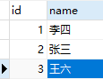 | 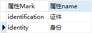 | 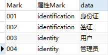 | 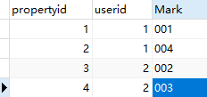 |

## 事务

### 锁机制

在写入数据库的时候需要有锁，比如同时写入数据库的时候会出现丢数据，那么就需要锁机制。

#### 乐观锁

> CAS + 版本号
>
> - CAS 保证原子性，同一时间的更改只有一个生效

适用于**写少读多**，采用**版本号**的方式，即当前版本号如果对应上了就可以写入数据，如果判断当前版本号不一致，那么就不会更新成功

```sql
# 同样的语句并发执行不会执行
update goods set num = num - 1, version = version - 1 where id = 1 and version = 0;
```

#### 悲观锁

适用于**写多读少**。

```sql
# 排它锁，其它事务不可读写
select num from goods where id = 1 for update;
update goods set num=num-1 where id = 1;
```

