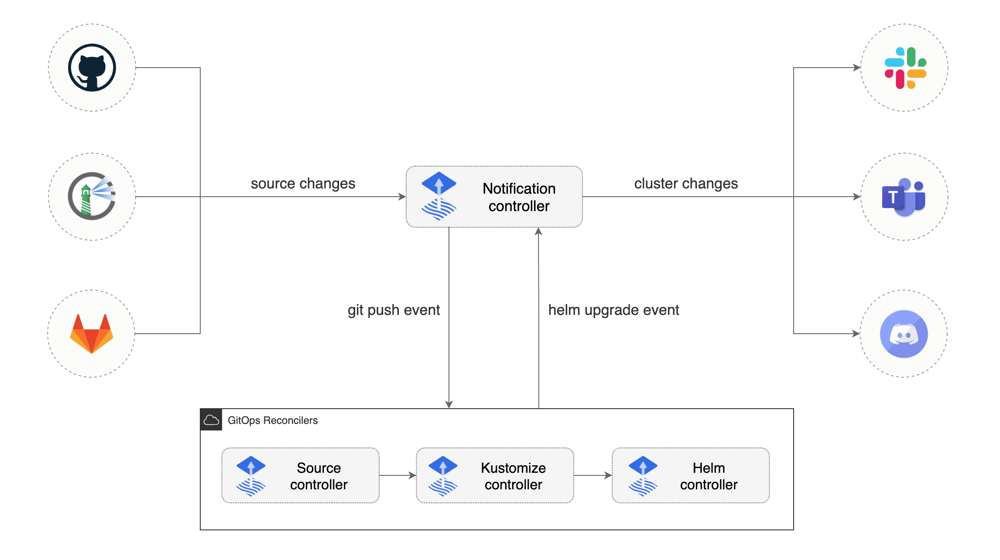
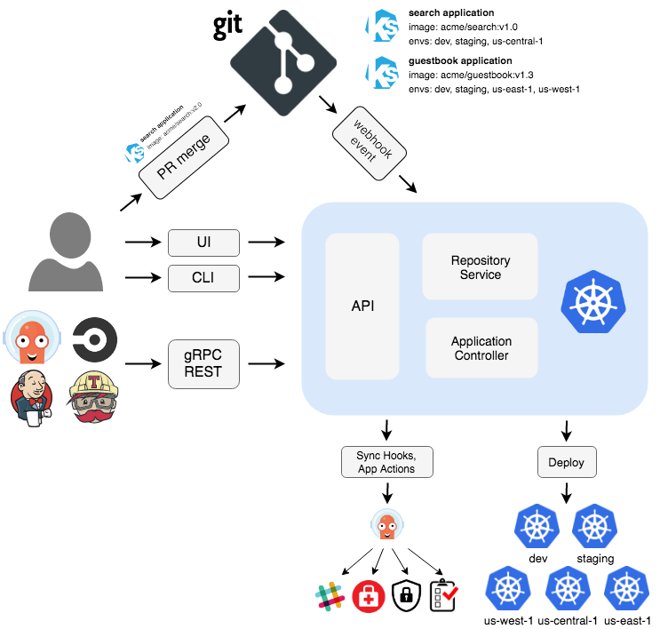

# DevOps

背景：**敏捷开发为代表的持续开发模式**

- 迭代式的 开发 -> 测试 -> 交付 -> 运维；

基础设施及代码：代码可以将基础设置的配置代码化

运维部门的任务不是确保系统稳定、快速地运行，而是**确保商业的有效性**（开发部门也一样）；

- 尊重（Respect）
- 信任（Trust）
- 正确认识失败（Healthy attitude about Failure）
- 避免指责（Avoiding Blame）

DevOps优势：

- 消除对个人的依赖；
- 降低团队间的损耗；
- 提高质量：开发和运维团队，共享发布的时机和内容，掌握发布影响的范围，一起对服务进行监控；

## 自动化

### 虚拟环境构建工具

**Vagrant**：基于Virtualbox的虚拟机，用于管理虚拟机生命周期的命令行实用程序

Vagrant 是一个基于Ruby的工具，用于创建和部署虚拟化开发环境。它 使用Oracle的开源[VirtualBox](https://baike.baidu.com/item/VirtualBox)虚拟化系统，使用 Chef创建自动化虚拟环境。

- 建立和删除虚拟机
- 配置虚拟机运行参数
- 管理虚拟机运行状态
- 自动配置和安装开发环境
- 打包和分发虚拟机运行环境

**docker**：轻量级容器技术

问题：

- 不容易理解构建步骤：shell脚本形式描述，不同人编写方式差别大，代码化不统一；
- 不能添加新的配置：难以对已创建的虚拟机添加新的配置项，强依赖shell脚本和条件语句；
- 构建步骤难以复用：不同环境可能如IP，JVM堆的参数不同，导致配置文件难以迁移和复用；

### 构建工作通用化（基础设置配置管理工具）

 **Ansible**（Python） 或者`Chef`：声明式、抽象化、收敛性、幂等性、可移植性

- 消除环境构建步骤（代码）对个人的依赖；
  - 统一格式描述
- 在不同的环境中使用相同的步骤；
  - 环境变量定义，不同环境不同配置文件

### 基础设施测试代码化

[**Serverspec（基于ruby）**](https://github.com/mizzy/serverspec)：能够**验证配置管理工具的配置结果**（Ansible、Puppet、Chef 等），可以实现**基础设施测试代码化自动化**。

- 固定格式编写测试用例列表，[支持的服务类型和断言语句](https://serverspec.org/resource_types.html#service)

- 输出测试结果报告（可以通过`coderay`的gem软件包实现 html 可视化结果）

## GitOps

> 一般用于 K8s 集群的 CD 场景，保证集群中最新版本的部署。

以**声明方式管理其Kubernetes部署**，**定期轮询存储库来将存储在源代码存储库**中的`Kubernetes manifests文件`与`Kubernetes`集群同步。

### 传统的Jenkins + K8s

#### 流程

- 开发人员创建代码并编写Dockerfile。他们还为应用程序创建Kubernetes manifests和Helm Charts。
- 他们将代码推送到源代码存储库。
- 源代码存储库使用提交后的钩子触发Jenkins构建。
- Jenkins CI流程将构建Docker映像和Helm软件包，并将其推送到依赖仓库。
- 然后，Jenkins CD程序部署helm charts到k8s cluster。

#### 问题

- Kubernetes **凭据存储**在Jenkins服务器中；
- 可以使用 Jenkins 创建和更改配置，但**无法使用它删除现有资源**；

### Gitops CD

- 资源配置文件清单：Git Repo 中；
- 源拉取组件：webhook 通知 / 定时轮询；
- 资源同步控制器：对比期望状态（清单定义）vs 集群实时状态，执行增删改；

#### [FluxCD](https://github.com/fluxcd/flux2)

`Notification Controller`通过对 `Source`（GitRepository）的修改（注解），触发实时更新。

- `Source Controller` 配置 Git 仓库轮询间隔（兜底）;

集群内只由 source-controller 统一访问外部 Git 仓库，减少对外连接，下游控制器从 source-controller 下载Git 仓库代码形成的 Artifact 压缩包。

- kustomize-controller **定时执行一次完整协调（集群自愈漂移）**，同时监听`GitRepository.status.artifact` 发生变更，立即协调；

#### Argo CD

> Argo CD 提供UI界面，以及命令行操作，支持多套集群（不同 kubeconfig 配置）。
>
> 安装：https://github.com/argoproj/argo-helm/tree/main/charts/argo-cd

***Repository Server***：an internal service which maintains **a local cache of the Git repository** holding the application manifests；

- 负责拉取渲染；Argo CD 默认每3分钟检测Git仓库中manifests的变化，可以通过**webhook event 监听变更，实时监测**：
  - 配置地址为：`https://argocd.server.url/api/webhook`

***Application Controller***：Kubernetes controller which continuously monitors running applications and compares the current, live state against the desired target state

- 定义源清单仓库地址/路径及目标集群/名空间；

## ChatOps

