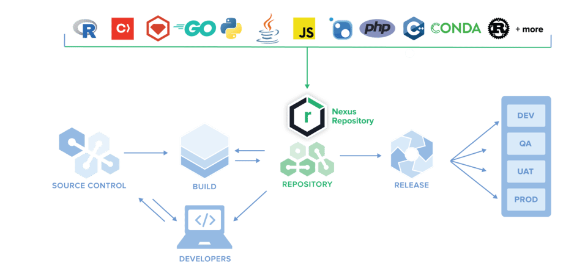

# 制品库

制品 (artifact)：编译构建产出物：jar、war、npm 包、docker 镜像、helm chart、pypi 包、rpm、raw 二进制等。

**Harbor：只专注容器镜像 Docker/OCI 制品库，K8s 生态专用，有镜像扫描、漏洞检测、项目 RBAC**。

**Nexus：大一统多格式制品库；Docker 只是它其中一种格式，同时支持 maven/npm/helm/rpm 等几乎所有包格式**。

## Nexus

> [Nexus](https://www.sonatype.com/nexus/repository-oss) ：Manage binaries and build artifacts across your software supply chain.

以下以 [Nexus 3](https://help.sonatype.com/repomanager3) 为例：

### 功能

- 支持 **apt, conda, docker, go, helm, maven, npm, pypi, r, raw, rubygem, yum** 的源管理

在Nexus 3中支持一种新的方式：**raw repositories**：

- 利用这种方式，**任何文件**都可以像Maven管理对象文件那样被管理起来，对所有的 artifacts 进行统一集成管理。

可以通过 shell，进行上传处理：

`curl -v --user 'admin:admin123' --upload-file ./nacos-server-2.0.3.zip http://172.16.1.217:8081/repository/website/a/weba-0.1.zip`

链接可以直接访问并下载。

### 安装

https://help.sonatype.com/repomanager3/product-information/download
