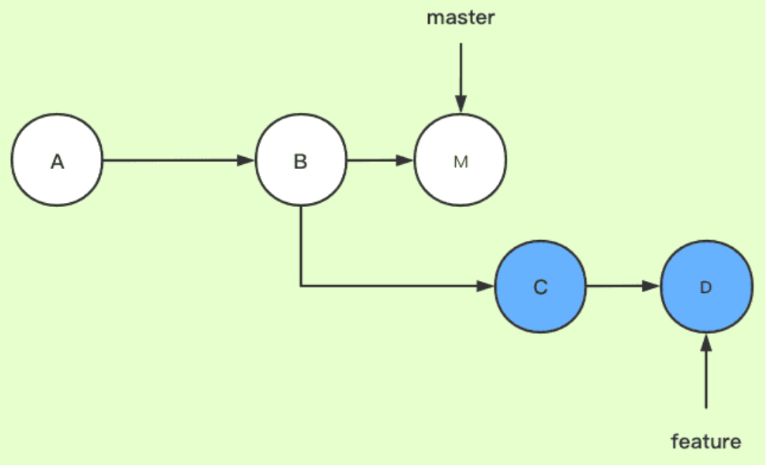
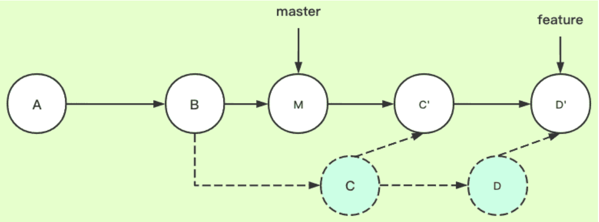
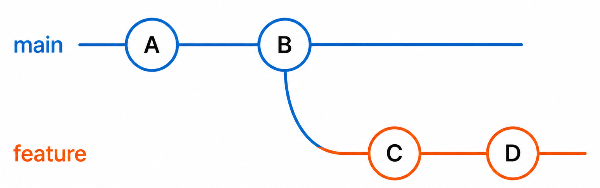
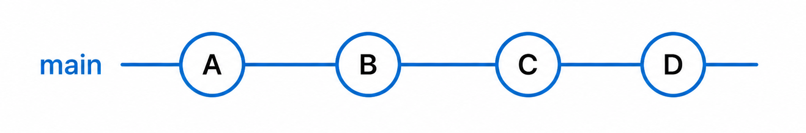
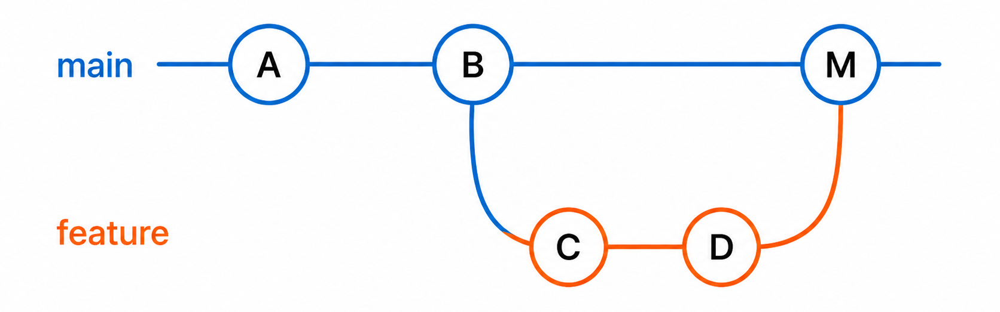
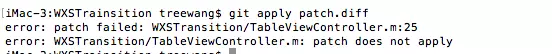

# Git（源码管理标准）

## 命令

### 基本(clone/pull/push/branch)

```bash
# 克隆<branch>分支，只包含最新的一个的commit
git clone -b <branch> <remote_repo> --depth=1

# 进入name的branch
git checkout name 

# branch
git branch name  #创建名为name的branch
git branch <new-branch-name> <tag-name> #基于tag创建branch
git branch -d name #删除本地分支name
git branch -m A B #将A分支重命名为B

# tag
git tag name -m "infos" 	#创建名为name的tag
git tag -d name             #删除本地名为name的tag

# 取回origin主机的next分支，与本地的master分支合并，需要写成下面这样。
git pull origin next:master

# push
git push origin name  #将name的tag push到远端
git push origin :name #删除远程分支name
git push origin --delete tag <tagname>  #删除远端的tag
```

### cherry-pick

将 A 分支的特定 commit 形成一个新的提交（hash会变）引入到 B 分支上。

```bash
# 当前处于分支 B 上
# 将分支 A 的 commit 012866 引入到 B 上
git cherry-pick  012866
```

### rebase

> 拉公共分支最新代码的时候使用rebase，往公共分支上合代码的时候，使用merge。

两个分支master和feature，其中feature是在提交点B处从master上拉出的分支

master上有一个新提交M，feature上有两个新提交C和D



把 master 分支合并到 feature 分支（这一步的场景就可以类比在自己的分支feature上开发了一段时间了，准备从主干master上拉一下最新改动）

```shell
# 这两条命令等价于git rebase master feature
git checkout feature
git rebase master
```

下图为变基后的提交节点图，解释一下其工作原理：



当执行rebase操作时，git会从两个分支的共同祖先开始提取**待变基分支上的修改**，然后将待变基分支指向基分支的最新提交，最后将刚才提取的修改应用到基分支的最新提交的后面。

- feature：待变基分支、当前分支

- master：基分支、目标分支

### merge

```shell
# 将所在分支和dev分支合并
# -ff/--no-ff/--squash，默认 -ff
git switch main
git merge feature
```

`git merge`时，默认是有三种选项的，分别是



- 快进合并(**fast-forward，--ff**)
  - 需满足：目标分支所有提交都在当前分支之后，没有各自新增提交
  - 不会创建任何新 commit，只是把当前分支指针直接移动到 feature 分支顶端



- 强制创建合并提交 `--no-ff`

  - 新增一条专门的合并节点`M`，记录「何时、哪个分支合并进来」；
  - 原始分支上所有 commit hash 完全不变；
  - 历史保留分叉，可以清晰看出分支生命周期、合并节点；
  - 回滚时只需删除这条 merge commit，就能整体撤销整个分支的所有改动。

  

- `squash merge`（ git merge --squash feature ）

  - 别人的多个commit记录会合并**成一个未提交的修改**，**不携带原有提交历史**；

  - Github 等PR中的Squash merge，会自动提取作者信息和PR标题，形成 commit

    信息。


说明：`rebase merge`（Github 上提供的 Rebase Merging，非 git merge 原生能力）

- `git rebase base && git merge --ff-only`；
- 每条 PR 提交单独**变基重写**（hash 全部换新），再**快进合并**，无分叉、无合并提交。


### 补丁(Patch/Diff)

#### 区别

`git diff` 生成的 UNIX 标准补丁 `.diff `文件：

- `.diff`文件只是记录文件改变的内容，不带有commit记录信息，多个commit可以合并成一个`diff`文件。

`git format-patch`生成的 Git 专用`.patch` 文件：

- `.patch`文件带有记录文件改变的内容，也带有commit记录信息，**每个commit对应一个patch文件**。

#### 生成

patch 文件生成

```shell
# 某次提交的patch
git format-patch [commit sha1 id] -1

# 某两次提交（含）之间的所有patch
git format-patch [commit sha1 id]..[commit sha1 id]
```

diff 文件生成

```shell
# -"号开头的表示 `commit-id-2` 相对 `commit-id-1` 减少了的内容。
# "+"号开头的表示 `commit-id-2` 相对 `commit-id-1` 增加了的内容。
git diff [commit id 1] [commit id 2] > [diff文件名]
```

#### 应用

`apply`不会自动将提交者信息附加到生成的提交；`am` 会完整读取头部元数据，自动生成一条带原作者的 commit，

```shell
# 检查patch/diff是否能正常打入
git apply --check [path/to/xxx.patch]
git apply --check [path/to/xxx.diff]

# 打入patch/diff
git apply/am [path/to/xxx.patch]
git apply    [path/to/xxx.diff]
```

打补丁过程中可能会出现冲突的情况，显示打入失败，如图：



解决冲突：

```shell
# 输出 Applying: xxx
# Patch failed at 0001 xxx
git am *.patch

# 带 both modified 的文件就是冲突文件
# 打开相应文件，根据内置的冲突标记 <<<<<<<<HEAD >>>>>>>>commit-id 解决冲突
git status

git add 冲突文件

# 解决完毕，继续合入下一条patch
git am --continue

# 当前补丁不要了，直接跳过
git am --skip

# 全部放弃，回滚到am之前状态
git am --abort
```


## 配置 

### 基础配置

``` shell
# git代理的配置
git config --global http.sslVerify  false
git config --global http.proxy $$ 
git config --global https.proxy $$ 
git config --global url.https://github.com/.insteadOf git://github.com/

# 保存凭据（明文）
git config --global credential.helper store
# Git Credential Manager，Git 2.28+ 内置（加密）
git config --global credential.helper manager-core
```


### 换行符

`core.autocrlf`的配置，linux 和 windows 下换行符不一致的问题：

- `git config --global core.autocrlf true`

  提交时自动地把行结束符 CRLF 转换成 LF，而在签出代码时把 LF 转换成 CRLF。

- `git config --global core.autocrlf input`

  Git在提交时把 CRLF 转换成 LF，签出时不转换

- `git config --global core.autocrlf false`

  都不进行转换

除了 windows 特定格式代码，如`cmd`、`bat`外，可以统一使用 LF。默认 `core.autocrlf input`，配置 `.gitattributes` 指定特定格式：

```bash
*.bat text eol=crlf
*.cmd text eol=crlf
```

### 长路径

GIT 拉取或者提交项目时， 遇到长路径提示 `file name too long`

- `git config --system core.longpaths true`

### 重新忽略加入文件

```shell
# git ignore不生效，因为文件之前加入了版本控制中，需要将该文件删除，先把本地缓存删除（改变成未track状态），然后再提交：
git rm -r --cached .
git add .
git commit -m 'update .gitignore'

# .gitkeep文件：因为Git会忽略空的文件夹，但是文件夹内有内容，则会纳入版本控制，.gitkeep名字只是习惯；
```

