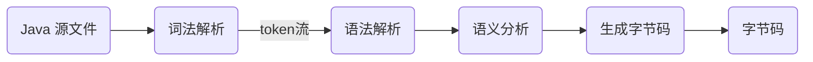
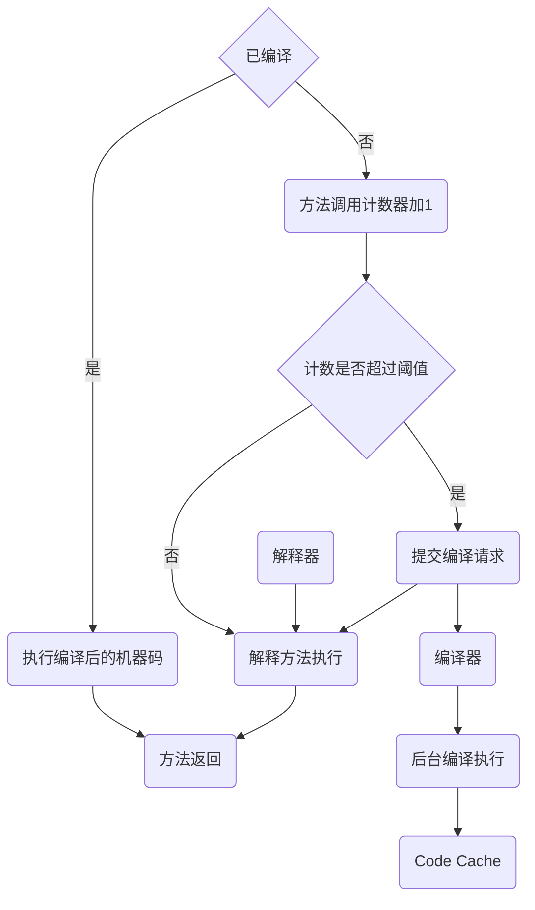

# 字节码

## 流程

### 编译过程

### 执行

> 热机的流量切换时，防止**冷机状态的服务器无法承载流量**而假死。

字节码通过类加载过程加载到 JVM环境后，才可以执行：

- 解释执行
- JIT 编译执行
- JIT 编译与解释混合执行

## 字节码增强

> [cglib](https://github.com/cglib/cglib) （基于 ASM）已经不维护，不适用于 JDK 高版本，官方推荐使用 ByteBuddy替代
>
> - Spring 自己维护了一套 [cglib](https://github.com/spring-projects/spring-framework/blob/main/spring-core/src/main/java/org/springframework/cglib/package-info.java)，可以应用于高版本的 JDK；
>
> 运行时的字节码增强，是跟 java agent 机制结合使用，两者之间正交关系；

### ASM

> [示例代码](https://gitee.com/oscsc/jvm/tree/master/bytecode/asm)

[**asm**](https://asm.ow2.io/) 实现**对java字节码**的操作（操纵的级别是底层JVM的汇编指令级别），业界的btrace 和 [arthas](https://link.zhihu.com/?target=https%3A//alibaba.github.io/arthas/)均是通过它实现了运行时trace的功能。

- 提供了ClassReader，ClassVisitor，ClassWriter分别对java字节码进行读，遍历，写的操作；
- 用户可以通过实现自己的Visitor对应的VisitXXX方法来达到对指定遍历对象的自定义操作；
- ***动态生成类或者增强既有类的功能***；

### Apache Common BCEL

> BCEL is already being used successfully in several projects such as compilers, optimizers, obsfuscators, code generators and analysis tools. **Unfortunately there hasn't been much development going on over the past few years**. 

[BCEL](https://github.com/apache/commons-bcel) 是字节码增强工具，不基于其它字节码工具。

- **分析、创建和操作（二进制）Java 类文件**（以 .class 结尾的文件）

### ByteBuddy

[bytebuddy](https://github.com/raphw/byte-buddy) （基于ASM）与 Java Agent 使用来实现动态修改和增强类的字节码

- 易于使用的 API，并支持在**运行时**生成代理对象、修改方法的行为、实现 AOP 和动态类创建等功能。
- 基于JVM的 **Java Class元数据**来进行

### Javassist

> javaassit 和 其他字节码增强框架使用时，需要放在最前面；
>
> - 从ClassPool 里面去拿Class元信息，在Javassist之前已经加载了其他字节码增强框架，通过这种方式无法获取到增强之后的Class信息；

[javaassit](https://github.com/jboss-javassist/javassist) 提供易于使用的高级 API，在运行过程中**编译源码**生成字节码：

- 增强逻辑采用的是硬编码形式，在开发过程中无法进行debug；
- 底层也是采用类似 asm 的 ClassFileWriter，进行字节码的操作；

## 反射

- 基本类型的Class，如boolean.class；

### [reflectasm](https://github.com/EsotericSoftware/reflectasm)

基于 asm 提供 a very small Java library that provides **high performance reflection by using code generation**.

## 代理

### JDK 动态代理

>  通过反射类Proxy以及InvocationHandler回调接口实现
>
>  - 进行**动态代理的类必须要实现一个接口**

- 实现`InvocationHandle`接口，`Proxy.newProxyInstance(ClassLoader, Interface, InvocationHandle)`

### Cglib 动态代理(不再维护)

> [cglib](https://github.com/cglib/cglib) （基于 ASM）已经不维护，不适用于 JDK 高版本，官方推荐使用 ByteBuddy替代
>
> - Spring 自己维护了一套 [cglib](https://github.com/spring-projects/spring-framework/blob/main/spring-core/src/main/java/org/springframework/cglib/package-info.java)，可以应用于高版本的 JDK；

使用 [ASM](./bytecode.md#ASM) 进行底层的字节码处理，动态代理的类不需要接口。

