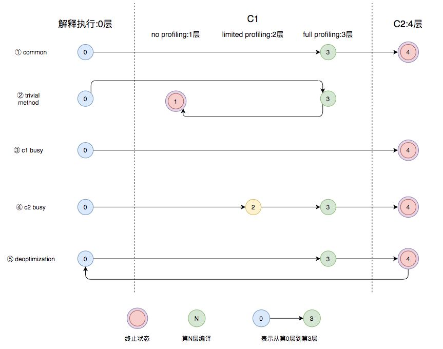

# JIT

> Just In Time 编译器。
>
> 内容来自于：[《基本功 | Java即时编译器原理解析及实践》](https://zhuanlan.zhihu.com/p/268042053)


## 原理

当方法或者代码块的在一定时间内的调用次数超过这个阈值时就会被编译，存入codeCache中。当下次执行时，再遇到这段代码，就会从codeCache中读取机器码，直接执行，以此来提升程序运行的性能。


## 编译器

JVM中集成了两种编译器，Client Compiler和Server Compiler，它们的作用也不同。Client Compiler注重启动速度和局部的优化，Server Compiler则更加关注全局的优化，性能会更好，但由于会进行更多的全局分析，所以启动速度会变慢。

### Client Compiler

- 局部简单可靠的优化，比如字节码上进行的一些基础优化，方法内联、常量传播等，放弃许多耗时较长的全局优化。
- 将字节码构造成高级中间表示（High-level Intermediate Representation，以下称为HIR），HIR与平台无关，通常采用图结构，更适合JVM对程序进行优化。
- 最后将HIR转换成低级中间表示（Low-level Intermediate Representation，以下称为LIR），在LIR的基础上会进行寄存器分配、窥孔优化（局部的优化方式，编译器在一个基本块或者多个基本块中，针对已经生成的代码，结合CPU自己指令的特点，通过一些认为可能带来性能提升的转换规则或者通过整体的分析，进行指令转换，来提升代码性能）等操作，最终生成机器码。

### Server Compiler

Server Compiler主要关注一些编译耗时较长的全局优化，甚至会还会根据程序运行的信息进行一些不可靠的激进优化。

目前，Hotspot虚拟机中使用的Server Compiler有两种：C2和Graal。

#### C2 Compiler

在Hotspot VM中，默认的Server Compiler是C2编译器。


#### Graal Compiler

从JDK 9开始，Hotspot VM中集成了一种新的Server Compiler，Graal编译器：

- 使用Java编写，对于Java语言，尤其是新特性，比如Lambda、Stream等更加友好。
- 更深层次的优化，比如虚函数的内联、部分逃逸分析等。

配置参数：`-XX:+UnlockExperimentalVMOptions -XX:+UseJVMCICompiler`

## 分层编译

从JDK 8开始，JVM默认开启分层编译，寻找当前服务的最佳平衡点。**分层编译将JVM的执行状态分为了五个层次**。五个层级分别是：

- 解释执行。
- 执行不带profiling的C1代码。
- 执行仅带方法调用次数以及循环回边执行次数profiling的C1代码。
- 执行带所有profiling的C1代码。
- 执行C2代码。



- 图中第①条路径，代表编译的一般情况，热点方法从解释执行到被3层的C1编译，最后被4层的C2编译。
- 如果方法比较小（比如Java服务中常见的getter/setter方法），3层的profiling没有收集到有价值的数据，JVM就会断定该方法对于C1代码和C2代码的执行效率相同，就会执行图中第②条路径。在这种情况下，JVM会在3层编译之后，放弃进入C2编译，直接选择用1层的C1编译运行。
- 在C1忙碌的情况下，执行图中第③条路径，在解释执行过程中对程序进行profiling ，根据信息直接由第4层的C2编译。
- 前文提到C1中的执行效率是1层>2层>3层，第3层一般要比第2层慢35%以上，所以在C2忙碌的情况下，执行图中第④条路径。这时方法会被2层的C1编译，然后再被3层的C1编译，以减少方法在3层的执行时间。
- 如果编译器做了一些比较激进的优化，比如分支预测，在实际运行时发现预测出错，这时就会进行反优化，重新进入解释执行，图中第⑤条执行路径代表的就是反优化。

## 即时编译的触发

Java虚拟机根据**方法的调用次数**以及**循环回边的执行次数**来触发即时编译。

当方法的调用次数和循环回边的次数的和，超过由参数`-XX:CompileThreshold`指定的阈值时（使用C1时，默认值为1500；使用C2时，默认值为10000），就会触发即时编译。

开启分层编译的情况下，`-XX:CompileThreshold`参数设置的阈值将会失效，触发编译会由以下的条件来判断：

- 方法调用次数大于由参数`-XX:TierXInvocationThreshold`指定的阈值乘以系数。
- 方法调用次数大于由参数`-XX:TierXMINInvocationThreshold`指定的阈值乘以系数，并且方法调用次数和循环回边次数之和大于由参数`-XX:TierXCompileThreshold`指定的阈值乘以系数时。

分层编译触发条件公式：JVM会根据当前的编译方法数以及编译线程数动态调整系数s。

```java
// i为调用次数，b是循环回边次数
i > TierXInvocationThreshold * s || (i > TierXMinInvocationThreshold * s  && i + b > TierXCompileThreshold * s) 
```

## 编译优化

### 中间表达式

在编译原理中，通常把编译器分为前端和后端，前端编译经过词法分析、语法分析、语义分析生成中间表达形式（Intermediate Representation，以下称为IR），后端会对IR进行优化，生成目标代码。

现代编译器一般采用图结构的IR，静态单赋值（Static Single Assignment，SSA）IR是目前比较常用的一种。

- 每个变量只能被赋值一次，而且只有当变量被赋值之后才能使用；
- 容易识别冗余赋值，和死代码删除；

**Phi And Region Nodes**、**Global Value Numbering（GVN）**

### 方法内联

方法内联，是指在编译过程中遇到方法调用时，将目标方法的方法体纳入编译范围之中，并取代原方法调用的优化手段。

- 减少入栈、出栈的调用开销；

#### 虚函数内联

Java中所有非私有的成员函数的调用都是虚调用，虚函数使得内联是很难的，因为在内联阶段并不知道他们会调用哪个方法。

JVM是通过保存虚函数表Virtual Method Table（以下称为VMT）存储class对象中所有的虚函数，class的实例对象保存着一个VMT的指针，程序运行时首先加载实例对象，然后通过实例对象找到VMT，通过VMT找到对应方法的地址，所以虚函数的调用比直接指向方法地址的classic call性能上会差一些。

### 逃逸分析

逃逸分析是“一种确定指针动态范围的静态分析，它可以分析在程序的哪些地方可以访问到指针”。

逃逸分析通常是在方法内联的基础上进行的，即时编译器可以根据逃逸分析的结果进行诸如**锁消除、栈上分配以及标量替换**的优化。

### Loop Transformations

循环的转换，最重要的两种转换就是循环展开和循环分离。

- 循环展开以牺牲程序二进制码大小为代价来优化程序的执行速度，是一种用**空间换时间**的优化手段；
- 循环分离把循环中一次或多次的特殊迭代分离出来，在循环外执行（减少重复性开销）。

### 窥孔优化与寄存器分配

窥孔优化就是将编译器所生成的中间代码（或目标代码）中相邻指令，将其中的**某些组合替换为效率更高的指令组**，常见的比如强度削减（如位运算替代乘法）、常数合并等；

寄存器分配也是一种编译的优化手段，在C2编译器中普遍的使用。它是通过把频繁使用的变量保存在寄存器中，CPU访问寄存器的速度比内存快得多，可以提升程序的运行速度。

## 配置

**参数**

- -XX:+TieredCompilation：开启分层编译，JDK8之后默认开启
- -XX:+CICompilerCount=N：编译线程数，设置数量后，JVM会自动分配线程数，C1:C2 = 1:2
- -XX:TierXBackEdgeThreshold：OSR编译的阈值
- -XX:TierXMinInvocationThreshold：开启分层编译后各层调用的阈值
- -XX:TierXCompileThreshold：开启分层编译后的编译阈值
- -XX:ReservedCodeCacheSize：codeCache最大大小
- -XX:InitialCodeCacheSize：codeCache初始大小

**通过JITwatch分析编译日志**

输出编译、内联、codeCache信息到文件：

`-XX:+UnlockDiagnosticVMOptions -XX:+PrintCompilation -XX:+PrintInlining -XX:+PrintCodeCache -XX:+PrintCodeCacheOnCompilation -XX:+TraceClassLoading -XX:+LogCompilation -XX:LogFile=LogPath`