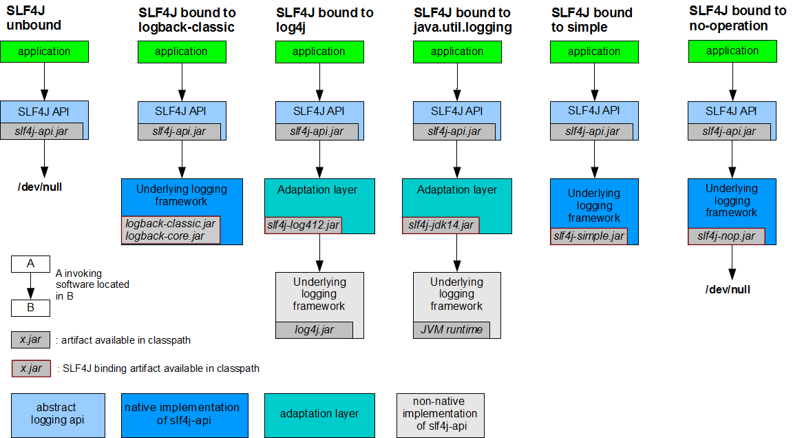
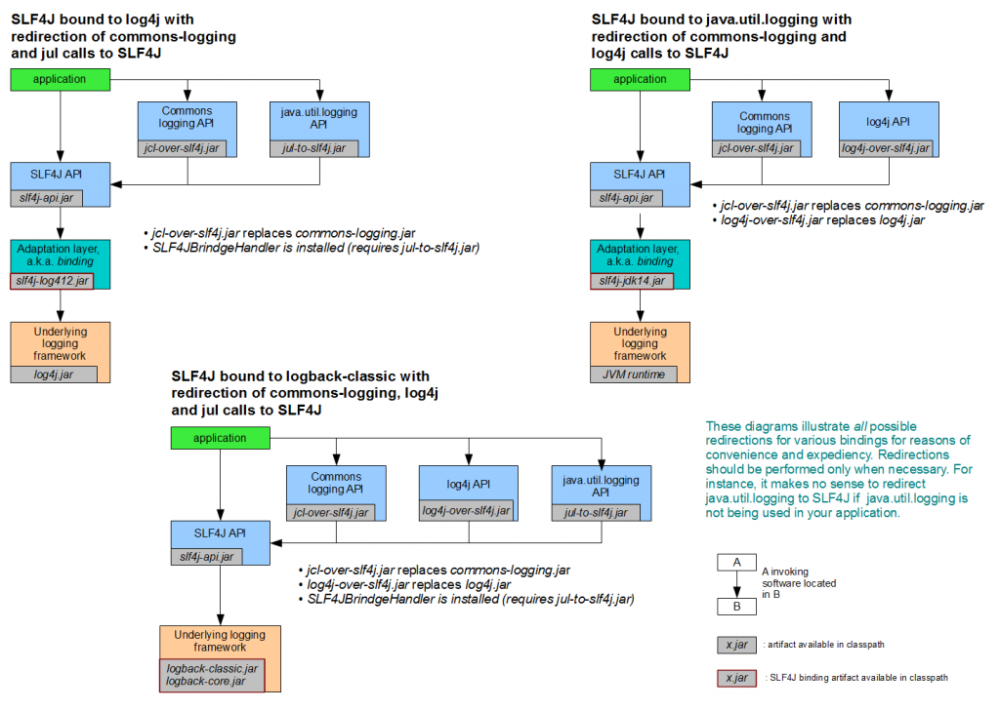

# Logging


## Adapter

日志适配器，提供抽象的接口，底层可以对接不同的日志实现，做到接口和实现的解耦。

### Apache Common Logging

网址：http://commons.apache.org/proper/commons-logging/，也称为 **JCL（Jakarta Commons Logging）**；支持 log4j2 和 slf4j。

#### 使用

```xml
<dependency>
  <groupId>commons-logging</groupId>
  <artifactId>commons-logging</artifactId>
  <version>1.4.0</version>
</dependency>
```


### Slf4j

#### 架构



#### 支持的底层日志

slf4j（Simple Logging Facade for Java）是日志框架的抽象，java.util.logging，log4j 和 logback 是具体实现。

- **logback**是直接实现`org.sl4j.Logger`接口，**没有内存和计算的额外开销**；
- **slf4j** 在**编译时静态绑定真正的Log库**，因此可以在OSGI中使用。
- **slf4j** 支持**参数化的log字符串**



#### 使用

slf4j api 调用 log4j 时需要适配层：

- log4j 1.x：*slf4j-log4j12*
- **log4j 2.x :  log4j-slf4j-imp**
  - log4j-slf4j-impl should be used with SLF4J 1.7.x releases or older.
  - log4j-slf4j18-impl should be used with SLF4J 1.8.x releases or newer.


## Apache Logging

### Log4j2

#### 特性

- log4j2 重写 1.x 版本，包含 `log4j-core`（日志实现）和`log4j-api`（日志门面）；
  - 采用 LMAX 的无锁队列 **Disruptor**（并发线程中交换数据，有界队列）；
  - 默认在**classpath**下加载log4j2.properties, log4j2.xml, log4j2.json等文件；
- Garbage-free
  - garbage-free in stand-alone applications, and low garbage in web applications；

#### [使用](https://logging.apache.org/log4j/2.x/download.html)

```xml
<dependencies>
  <dependency>
    <groupId>org.apache.logging.log4j</groupId>
    <artifactId>log4j-api</artifactId>
    <version>2.26.1</version>
  </dependency>
  <dependency>
    <groupId>org.apache.logging.log4j</groupId>
    <artifactId>log4j-core</artifactId>
    <version>2.26.1</version>
  </dependency>
</dependencies>
```

**Spring**

- 和Spring进行单元测试的时候，Junit加载spring的runner（SpringJUnit4ClassRunner）要优先于spring加载log4j，需要把log4j.properties放在resource目录下，才会默认加载；
- 运行时，web.xml配置log4j配置文件目录log4jConfigLocation和log4j监听器

```xml
<listener-class>org.springframework.web.util.Log4jConfigListener</listener-class>
```

#### 配置

> 配置文件：`log4j2.xml|json|yaml|properties`
>
> 参数指定优先级最高: `‑Dlog4j.configurationFile=classpath:config/log4j2.xml`

示例:

```xml
<?xml version="1.0" encoding="UTF-8"?>
<Configuration status="WARN">
    <!-- 全局属性 -->
    <Properties>
        <property name="log.path">./logs</property>
        <property name="log.pattern">%d{yyyy-MM-dd HH:mm:ss.SSS} [%t] %-5level %logger{36} - %msg%n</property>
    </Properties>

    <Appenders>
        <!-- 控制台输出 -->
        <Console name="Console" target="SYSTEM_OUT">
            <PatternLayout pattern="${log.pattern}"/>
        </Console>

        <!-- 文件输出，滚动文件 -->
        <RollingFile name="RollingFile" fileName="${log.path}/app.log"
                     filePattern="${log.path}/app‑%d{yyyy‑MM‑dd}.log.gz">
            <PatternLayout pattern="${log.pattern}"/>
            <Policies>
                <TimeBasedTriggeringPolicy interval="1" modulate="true"/>
            </Policies>
            <DefaultRolloverStrategy max="7"/>
        </RollingFile>
    </Appenders>

    <Loggers>
        <!-- 业务包开启DEBUG -->
        <Logger name="com.demo" level="DEBUG" additivity="false">
            <AppenderRef ref="Console"/>
            <AppenderRef ref="RollingFile"/>
        </Logger>

        <!-- 根日志 -->
        <Root level="INFO">
            <AppenderRef ref="Console"/>
            <AppenderRef ref="RollingFile"/>
        </Root>
    </Loggers>
</Configuration>
```

**灵活指定布局**

```properties
%d{yyyy-MM-dd HH:mm:ss}  [ %C.%M:%l ] - [ %p ]  %m%n
# 参数详细解释如下
%p: 输出日志信息优先级，即DEBUG，INFO，WARN，ERROR，FATAL, 

%d: 输出日志时间点的日期或时间，默认格式为ISO8601，或指定格式如 %d{yyy MMM dd HH:mm:ss,SSS}，输出类似：2002年10月18日 22:10:28,921 

%r: 输出自应用启动到输出该log信息耗费的毫秒数 

%c: 输出日志信息所属的类目，通常就是所在类的全名 （通过ClassName.class传给Logger识别）

%C: 列出调用logger的类的全名（包含包路径）

%x: 按NDC（Nested Diagnostic Context，线程堆栈）顺序输出日志

%X: 按MDC（Mapped Diagnostic Context，线程映射表）输出日志。通常用于多个客户端连接同一台服务器，方便服务器区分是那个客户端访问留下来的日志。

%t: 输出产生该日志事件的线程名 

%l: 输出日志事件的发生位置，相当于%C.%M(%F:%L)的组合,包括类名、方法名以及在代码中的行数。举例：Testlog4.main(TestLog4.java:10) 

%%: 输出一个"%"字符 

%F: 输出日志消息产生时所在的文件名称 

%L: 输出代码中的行号 

%M: 输出日志所在的函数名

%m: %msg, 输出代码中指定的消息,产生的日志具体信息 

%n: 输出一个回车换行符，Windows平台为"\r\n"，Unix平台为"\n"输出日志信息换行 
```

### log4cxx


