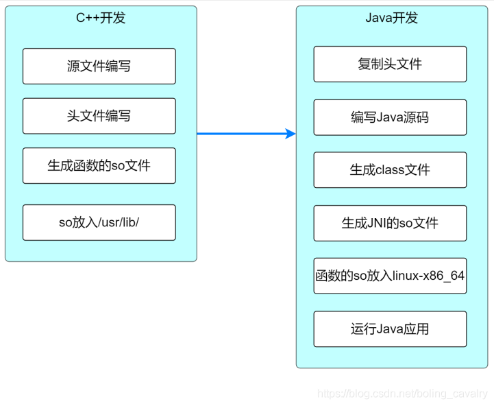

# Java Native

> JNI, JNA, JNR, Panama：
>
> - 比较：https://github.com/jnr/jnr-ffi/blob/master/docs/ComparisonToSimilarProjects.md
>
> - 性能测试：[Java 21 FFI 性能测试 —— Panama vs JNI/JNA/JNR ](https://github.com/Glavo/java-ffi-benchmark)
>
> Native Call Java：底层都是基于 JNI.
>
> - JNI, JavaCPP.


## JNI(C)

标准的 Java native通信工具，但复杂度高，需要很多**native code到java的回调**。

详见 [JNI 使用文档](./jni.md)

- 性能最好，但是使用比较复杂；


## JNA(C)

> https://github.com/java-native-access/jna

- 不需要 JNI 代码 ，只需要定义接口和函数（匹配）；
- 相较于JNR，更为成熟；

### 原理

> - 基于反射，数据转换从本地代码跳到 Java 代码非常昂贵；
> - 基于[libffi](../../libffi.md) 进行函数调用约定；

 `Native.loadLibrary("c", LibC.class)` 获取了接口实现

- 通过**动态代理（dynamic proxy）**实现，根据返回参数的不同，分派到 Native 类的，invokeXxx 本地方法：

  ```java
  /**
   * Call the native function.
   *
   * @param function  Present to prevent the GC to collect the Function object
   *                  prematurely
   * @param fp        function pointer
   * @param callFlags calling convention to be used
   * @param args      Arguments to pass to the native function
   *
   * @return The value returned by the target native function
   */
  static native int invokeInt(Function function, long fp, int callFlags, Object[] args);
  
  static native long invokeLong(Function function, long fp, int callFlags, Object[] args);
  
  static native Object invokeObject(Function function, long fp, int callFlags, Object[] args);
  ...
  ```

`invokeXxx` 本地方法的实现 [dispatch.c#L2122](https://github.com/java-native-access/jna/blob/4.5.X/native/dispatch.c#L2122)（`invokeInt` 或 `invokeLong` 实现源码类似）：

```c
/*
 * Class:     com_sun_jna_Native
 * Method:    invokeInt
 * Signature: (Lcom/sun/jna/Function;JI[Ljava/lang/Object;)I
 */
JNIEXPORT jint JNICALL
Java_com_sun_jna_Native_invokeInt(JNIEnv *env, jclass UNUSED(cls), 
                                  jobject UNUSED(function), jlong fp, jint callconv,
                                  jobjectArray arr)
{
    ffi_arg result;
    dispatch(env, L2A(fp), callconv, arr, &ffi_type_sint32, &result);
    return (jint)result;
}
```

即，全部 `invokeXxx` 本地方法统一被分派到 `dispatch` 函数 [dispatch.c#L439](https://github.com/java-native-access/jna/blob/4.5.X/native/dispatch.c#L439)：

```c
static void
dispatch(JNIEnv *env, void* func, jint flags, jobjectArray args,
ffi_type *return_type, void *presult)
```

`dispatch` 函数是，需要调用的函数指针地址、输入参数和返回参数，全部是**运行时确定**。要想完成这个函数调用逻辑，就要运行时构造栈帧，生成参数压栈和清理堆栈的工作。

- JNA 3.0 之前，实现运行时构造栈帧的逻辑的对应代码 [dispatch_i386.c](https://github.com/java-native-access/jna/blob/2.5/jnalib/native/dispatch_i386.c)、[dispatch_ppc.c](https://github.com/java-native-access/jna/blob/2.5/jnalib/native/dispatch_ppc.c) 和 [dispatch_sparc.s](https://github.com/java-native-access/jna/blob/2.5/jnalib/native/dispatch_sparc.s)，分别实现 Intel x86、PowerPC 和 Sparc 三种 CPU 架构。

- 从 [JNA 3.0](https://github.com/java-native-access/jna/tree/3.0/jnalib/native) 开始，摒弃了原先手动构造栈帧的做法，把 libffi 集成进了 JNA。


## [JNR(C)](./jnr.md)

> https://github.com/jnr/jnr-ffi

- **基于[libffi](../../libffi.md)**，但使用**字节码生成**技术而不是反射；
- 不需要JNI代码 ，只需要定义接口和函数（匹配）；


### 原理

JNA 使用动态代理生成实现类，而 JNR 使用 ASM 字节码操作库生成直接实现类，去除了每次调用本地方法时额外的动态代理的逻辑。

- 使用 ASM 生成实现类，对应的代码为 [AsmLibraryLoader.java](https://github.com/jnr/jnr-ffi/blob/master/src/main/java/jnr/ffi/provider/jffi/AsmLibraryLoader.java)。

但其调用栈，相对于直接使用 JNI，还是比较繁琐。


## Project Panama(C)

> JDK 19 ：[JEP 424: Foreign Function & Memory API (Preview) (openjdk.org)](https://openjdk.org/jeps/424)
>
> JDK 20 ：[JEP 434: Foreign Function & Memory API (Second Preview) (openjdk.org)](https://openjdk.org/jeps/434)


## JavaCPP(C++)

> JavaCPP provides efficient access to native <font color='red'>**C++**</font> inside Java， also access Java from C++.

对很多C/C++库，提供相应的封装（[bytedeco/javacpp-presets: The missing Java distribution of native C++ libraries](https://github.com/bytedeco/javacpp-presets)）。

### 原理

根据 C++ 的头文件，进行解析，自动生成 JNI 的 SO 的封装函数。

