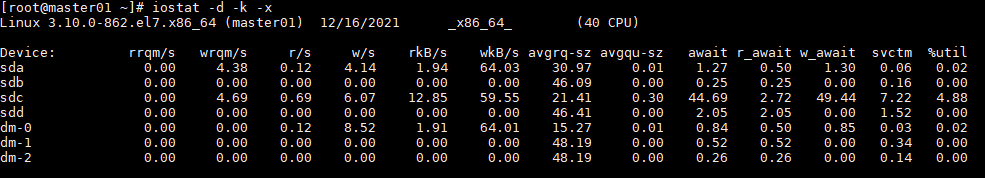

# 常见问题分析

## CPU

### 查询占用cpu高的线程

- `top` 查看占用比较高的进程，再`top -H -p pid`来找到cpu使用率比较高的一些线程；
- `printf '%x\n' pid`得到 nid，`jstack pid |grep 'nid' -C5 –color`查看对应堆栈信息；

### 频繁gc

`jstat -gc pid 1000`命令来对gc分代变化情况进行观察

- 1000表示采样间隔(ms)；
- `S0C/S1C、S0U/S1U、EC/EU、OC/OU、MC/MU`分别代表两个Survivor区、Eden区、老年代、元数据区的容量和使用量；
- `YGC/YGT、FGC/FGCT、GCT则代表YoungGc、FullGc`的耗时和次数以及总耗时。

### 上下文切换

`vmstat [sample_interval] [sample_nums]`命令：展现给定时间间隔的服务器的状态值,包括服务器的CPU使用率，内存使用，虚拟内存交换情况,IO读写情况。

- system：
  - cs（context switch）一列则代表了上下文切换的次数
  - in（interrupt）每秒中断数，包括时钟中断

`pidstat -p pid -w [interval] [samples]`对特定的pid进行监控

## 磁盘

`df -hl`来查看文件系统状态，每个盘的总量和使用量等信息。

`iostat -d -k -x`来进行分析

- 最后一列`%util`可以看到每块磁盘写入的程度，而`rrqpm/s`以及`wrqm/s`分别表示读写速度

`iotop`命令来进行定位文件读写的来源：

- `iotop`命令拿到的是tid，通过`readlink -f /proc/*/task/$tid/../..` 查看tid对应的pid；

- `iotop -botq -p $pid` 查看具体的进程的io读写；

`lsof`命令来确定具体的文件读写情况`lsof -p pid`

