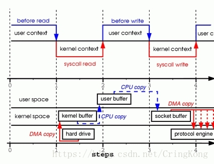

# Linux OS的零拷贝（发送文件为例）

>  Zero Copy：指的是没有从**内核空间**拷贝数据到**用户空间**


## 普通IO，4次上下文切换，2次cpu拷贝，2次dma拷贝

```c
read(file, tmp_buf, len); 
write(socket, tmp_buf, len);
```



## 内存映射方式I/O，4次上下文切换，1次cpu拷贝，2次dma拷贝

```c
// 用户缓冲区（user buffer）的内存地址和内核缓冲区（kernel buffer）的内存地址做一个映射，也就是说系统在用户态可以直接读取并操作内核空间的数据
tmp_buf = mmap(file, len);
write(socket, tmp_buf, len);
```


## 内核空间内部传输I/O，2次上下文切换，1次cpu拷贝，2次dma拷贝

```c
// 用户空间此时是无法看到或修改数据内容，也就是说这是一次完全意义上的数据传输过程
sendfile(socket, file, len);
```


注：内核支持**gather operations**的话还可以进一步优化，在用户实现层面没有发生变化，优化都是在内核实现中的，首先数据从disk拷贝到内核buffer，然后并**不需要把数据再次拷贝到socket buffer**。


## MMAP

> **mmap是一种内存映射文件**的方法，即将一个文件或者其它对象映射到进程的地址空间，实现**文件磁盘地址和进程虚拟地址空间**中一段虚拟地址的对映关系。


为内存映射服务的地址空间处在堆栈之间的空余部分。

### 原理

mmap 过程：

- 进程启动映射过程，在虚拟地址空间为映射创建虚拟映射区域；
  - 进程在用户空间调用库函数mmap；
- 调用内核空间的系统调用函数mmap（不同于用户空间函数），实现文件物理地址和进程虚拟地址的一一映射关系；
- 进程发起对这片映射空间的访问（虚拟地址），引发缺页异常，实现文件内容到物理内存（主存）的拷贝。

文件系统读写过程：

- 进程发起读文件请求；
- 内核通过查找进程文件符表，定位到内核已打开文件集上的文件信息，找到文件的inode；
- Inode在address_space上查找要请求的文件页是否已经缓存在页缓存中。存在，则直接返回文件页的内容；
- 不存在，则通过inode定位道文件磁盘地址，将数据从磁盘复制到页缓存。之后再次发起读页面过程，进而将页缓存中的数据发给用户进程。

**常规文件系统操作**，使用页缓存机制提高读写效率和保护磁盘，需要**将磁盘数据拷贝到内核空间的页缓存中**，用户访问时，再拷贝到内存对应的用户空间中，**需要两次数据拷贝过程**。

**mmap操控文件**，只需要从**磁盘到用户主存的一次数据拷贝**过程。