# 深度神经网络

## 感知机

> - 单层感知机无法分离线性空间：例如无法表示异或(XOR)关系；
> - 仅通过与非门(NAND)的组合就能实现计算机，可以参考《计算机系统要素：从零构建现代计算机》；
> - 理论上，二层感知机（严格来说是激活函数使用非线性的 sigmod 函数的感知机)可以表示任意函数。

感知机是二分类的线性分类模型，输入为实例的特征向量，输出为实例的类别，取1和0二值。
$$
y = \begin{cases} 1 & w^Tx + b > 0 \\ 0 & w^Tx + b \leq 0 \end{cases}
$$

## 神经网络

> - 朴素感知机：单层网络，激活模型使用越阶函数的模型；
> - 多层感知机：神经网络，使用**sigmoid 等平滑的激活函数的多层网络**。

### 激活函数

将输入信号的总和转换为输出信号，下式中的 h。
$$
a = w^Tx + b \\
y = h(a)
$$

神经网络的激活函数必须使用**非线性函数**：

- 线性函数的问题是：不管如何加深层数，总是存在与之等效的“无隐藏层的神经网络”；

输出层的激活函数：回归问题使用恒等函数，分类问题使用 softmax 函数；
$$
Softmax(x_i)=\frac{exp(x_i)}{\sum_j{exp(z_j)}}
$$

- softmax 在实现时，需要考虑溢出问题（即个别值太大的问题）；
- 推理的时候可以不计算 softmax：单调增函数，不影响分类的最大值的选择；

输出层的神经元个数：

- 分类问题：一般设置为类别的数量，**采用 one-hot 编码**；                   

### 损失函数

> 为什么损失函数不能以精度作为指标：如果以识别精度为指标，参数的导数在绝大多数地方都会变为0。
>
> - 微调参数，无法改善识别精度，并且即使改善，精度的值是离散的值。
> - 同样，以越阶函数作为激活函数，神经网络也无法学习，绝大多数地方导数都为0。

一般来说，分类问题使用**交叉熵（Cross-Entropy Loss）**，回归问题使用**均方误差（Mean Squared Error)**。

均方误差指的就是模型预测值 f(x) 与样本真实值 y 之间距离平方的平均值。
$$
MSE=\frac{1}{N}\sum_{i=1}^{N}{(y_i - f(x_i))^2}
$$
交叉熵：计算实际标签与预测概率之间的差异来衡量模型的性能

- $t_k$只有正确解标签的索引值为1，其它为0（one-hot表示）；
- 如果是一批数据（mini-batch），则 Loss 需要求均值；

$$
CSE = -\sum{t_klog{y_k}}
$$

### 数值微分

数值微分：利用微小的差分求导数的过程。解析性求解：基于数学式的推导求导数的过程。

中心差分：$(f(x+h)-f(x-h))/2h$，前向差分：$(f(x+h)-f(x))/h$

偏导数：将其它变量视为常数，对某个变量进行求导 
$$
f(x0, x1)=x_0^2+x_1^2  \\
\frac{\partial{f}}{\partial{x_0}}=2*x_0 \\
\frac{\partial{f}}{\partial{x_1}}=2*x_1
$$
**梯度：由全部变量的偏导数汇总而成的向量。**

梯度法：通过梯度逐渐减小函数值，寻找函数的最小值（或者尽可能小的值）的方法。

- 梯度法寻找梯度为0的地方：函数的极小值、最小值以及被称为鞍点的地方，梯度为0；

学习率（learning rate）：超参数

- 不宜设置过大，否则会发散成一个很大的值；（步子迈的太大）
- 不宜设置过小，否则没怎么更新就会结束；（走不动）

$$
x_0=x_0-\eta\frac{\partial{f}}{\partial{x_0}}   \\
x_1=x_1-\eta\frac{\partial{f}}{\partial{x_1}}   \\
$$

epoch是个单位：表示机器学习中所有训练数据均被使用过一次的更新次数。

- `mini-batch`是随机生成的，不一定每个数据都会被看到。

### 反向传播

链式法则：针对复合函数，该复合函数的导数可以用**构成复合函数的各个函数的导数的乘积**表示。 
$$
z=t^2 \\
t = x + y \\
\frac{\partial{z}}{\partial{x}} = \frac{\partial{z}}{\partial{y}}\frac{\partial{y}}{\partial{x}} 
$$
sigmoid 示例如下：
$$
f(x)=\frac{1}{1+exp(-x)} \\
\frac{\partial{f}}{\partial{x}} = -(\frac{1}{1+exp(-x)})^2 (exp(-x))(-1) \\
= f^2(\frac{1}{f}-1)=f(1-f)
$$
Affine 层的导数如下：

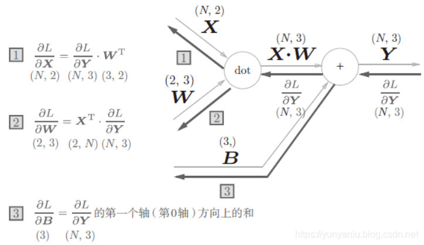

softmax with loss的示例如下：

- 为了得到$(y_1-t_1,y_2-t_2,y_3-t_3)$漂亮的结果，才设计了交叉熵的误差函数。

$$
y_i=Softmax(x_i)=\frac{exp(x_i)}{\sum_j{exp(z_j)}} \\
\frac{\partial{y_i}}{\partial{x_j}}=\begin{cases} -y_i^2+y_i & i=j \\ -y_iy_j & i \ne j  \end{cases}   \\
L(y)=CSE(y) = -\sum{t_klog{y_k}} \\
\frac{\partial{L}}{\partial{y_i}} = -\frac{t_k}{y_i} \\
\frac{\partial{L}}{\partial{x_i}}=\sum\frac{\partial{L(y)}}{\partial{y_k}}\frac{\partial{y_k}}{\partial{x_i}}=-\frac{t_i}{y_i}*y_i(1-y_i)+\sum_{i\ne k}\frac{t_k}{y_i}*y_iy_k=-t_i+t_iy_i+\sum_{i\ne k}{t_ky_k}=y_i-t_i
$$

## 学习技巧

### 优化方法

> 目前并不存在在所有问题中都表现良好的方法。一般而言，相较于SGD，其他方法收敛更快，有时精度更好。

随机梯度下降法**SGD：梯度的方向并没有指向最小值的方向**。如果函数的形状非均向（anisotropic），比如呈延申状，搜索的路径就会非常低效。
$$
\bold W \leftarrow \bold W-\eta \frac{\partial{L}}{\partial{W}}
$$

**Momentum**：$\alpha{v}$ 表示物体不受力时，承担使物体逐渐减速的任务。

- 保留之前的方向，引入了动量的概念，它会**累积之前的梯度信息**，让参数更新具有一定的惯性。

$$
\bold{v} \leftarrow \alpha{\bold{v}}-\eta\frac{\partial{L}}{\partial{W}} & \alpha=0.9\\
\bold W \leftarrow \bold W + \bold{v}
$$

**AdaGrad**：学习率衰减（学习率随迭代次数减小）仍是针对所有元素共同衰减

- 自适应地调整每个参数的学习率，对于频繁更新的参数学习率会变小；对于不常更新的参数学习率会变大
- ***h*** 保存以前的所有梯度值的平方和，意味着参数变动大的元素的学习率将变小；
- 用 RMSProp 解决学习次数多后更新量为0的问题：逐渐遗忘过去的梯度，如之前的权重0.9，现在的0.1。

$$
\bold h \leftarrow \bold h + \frac{\partial{L}}{\partial{\bold W}} \odot \frac{\partial{L}}{\partial{\bold W}} \\
\bold W \leftarrow \bold W - \eta \frac{1}{\sqrt{\bold h}} \frac{\partial{L}}{\partial{\bold W}}
$$

**Adam**：结合 Momentum 和 AdaGrad

- 一般来说，$\beta_{1}=0.9, \beta_{2}=0.999$

$$
m_{t}=\beta_{1}m_{t - 1}+(1 - \beta_{1}) \frac{\partial{L}}{\partial{\bold W}} \\
v_{t}=\beta_{2}v_{t - 1}+(1 - \beta_{2})\frac{\partial{L}}{\partial{\bold W}}\odot\frac{\partial{L}}{\partial{\bold W}} \\
\hat{m}_{t}=\frac{m_{t}}{1 - \beta_{1}^{t}} \\  
\hat{v}_{t}=\frac{v_{t}}{1 - \beta_{2}^{t}} \\
\bold W = \bold W - \frac{\eta}{\sqrt{\hat{v}_{t}}+\epsilon}\hat{m}_{t}=\bold W -\frac{\eta}{\sqrt{{v}_{t}}+\epsilon}{m}_{t}*\frac{\sqrt{1 - \beta_{2}^{t}}}{1 - \beta_{1}^{t}}
$$

以 $f=\frac{1}{20}x^2+y^2$为例，绘制不同优化方法的搜索路径，如下图

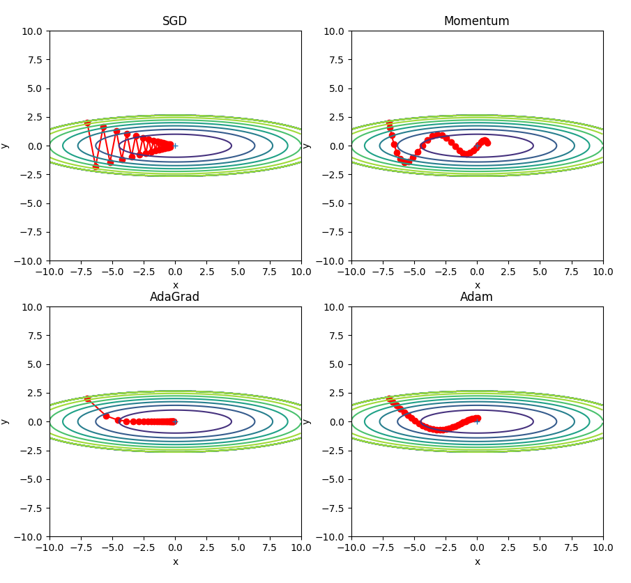

### 权重的初始值

> Xavier 初始化

将权重初始化设置为0，将无法进行正常学习。（严格的说，不能初始化为同样的值）

- 正向传播时输出是相同的值，反向传播时，权重会进行相同的更新，需要瓦解权重的对称结构；

**隐藏层的激活值的分布**：激活值在分布上有所**偏向会出现梯度消失”表现力受限”**的问题；

- 如果100个神经元都输出相同的值，那么也可以由1个神经元来表达相同的事情；
- 对于sigmoid激活函数，如果偏向0和1的分布，会导致反向传播时梯度不断变小，最后消失。

Xavier 初始值：以激活函数是线性函数为前提推导出，适用于 sigmoid 和tanh 激活函数。

- 如果前一层的节点数为 n，则初始化使用标准差为$\sqrt{1/n}$的分布。论文中是前一层和后一层的节点数均值的平方根。
- sigmoid 和tanh 激活函数左右对称，且中央附近可以视作线性函数。

Kaiming He 初始值：针对 RELU 激活函数：

- 如果前一层的节点数为 n，则初始化使用标准差为$2/\sqrt{n}$的分布。

### Batch Normalization

> 强制性调整激活值的分布，使得各层有适当的广度。
>
> - 使用方式：**Affine+BatchNorm+ReLU** 还是 **Affine+ReLU+BatchNorm**  。

2015年出现，但已广泛使用。其优势：

- 学习更快速（可以增大学习率）；
- 不那么依赖初始值；
- 抑制过拟合（降低 Dropout等的必要性）；

Batch Norm：以学习时的 mini-batch 为单位，按 mini-batch 进行正规化（均值0，方差1）。

### 正则化

> 解决过拟合的问题，一般通过 L2 范式。

权重衰减是常用抑制过拟合的方法，对值较大的权重进行惩罚，来抑制过拟合。

- 较大的权重意味着模型对输入数据的微小变化更敏感，过度拟合噪声，泛化能力下降；根据奥卡姆剃刀原理，简单模型更可能泛化到未知数据。

- 损失函数 += $\frac{1}{2}\lambda W^2$，$L1, L2, L_\infty$ 范数各有特点，都可以用作正则化项。

### Dropout

> 如果网络模型变得很复杂，只用权值衰减难以应对。（可以用 BatchNorm 替代）

Dropout 是一种在学习的过程中随机删除神经元的方法。

- 训练时：每次都随机选出隐藏层的神经元，然后将其删除，被删除的神经元不进行信号的传递；
  - 通过删除比例，构建随机的掩码值，筛选出传递的神经元。反向传播时行为跟ReLU相同。
- 测试时：传递所有的神经元的信号，但是对于各个神经元的输出，要**乘上训练时的删除比例后**再输出。

可以理解 Dropout 将集成学习的效果（模拟地）通过一个网络实现：

- 学习过程中随即删除神经元，每次让不同的模型进行学习；
- 推理时，对神经元的输出乘以删除比例（如0.5），可以取得模型的平均值。

### 超参数

调整超参数时，必须使用超参数专用的确认数据，被称为**验证数据**。

- 验证数据不是测试数据，一般从训练数据中进行分割（20%）。

超参最优化方法：网格搜索、随机采样、贝叶斯最优化

- 确定超参数，确定对数尺度（如10e-3~10e3），随机生成指数 ；
- 对每种超参数选择，运行一定的 epoch（不用太多 < 50），选择最好的前几个，确定超参数范围；
- 再次迭代，优化超参数的选择，逐渐缩小“好值”存在的范围。

## 卷积神经网络

> 使用方式：Convolution - ReLU - (Pooling)
>
> - 卷积核的参数初始化跟上一节相同，可以采用 Xavier /  He 初始化。

### 卷积层

全连接层的问题，在于形状被忽视了。图像是3维形状，形状中含有重要的空间信息。

- 如：空间上临近的像素为相似的值，RGB的各个通道之间分别有密切的关联性等。

卷积层通过**局部感知**、**参数共享**和**平移不变性**，在图像处理、语音识别等领域实现了高效的特征提取。

- 每个神经元仅连接输入的一个局部区域（如 3×3 的图像块），通过滑动窗口提取局部特征（如边缘、纹理）；
- 同一卷积核的参数在整个输入上共享，大幅减少参数量；
- 对输入中的平移模式（如物体位置变化）具有天然的鲁棒性。

卷积运算：**乘积累加运算**。**填充**（padding）是指在输入高和宽的两侧填充元素（通常是0元素）。每次滑动的行数和列数称为**步幅（**stride）。

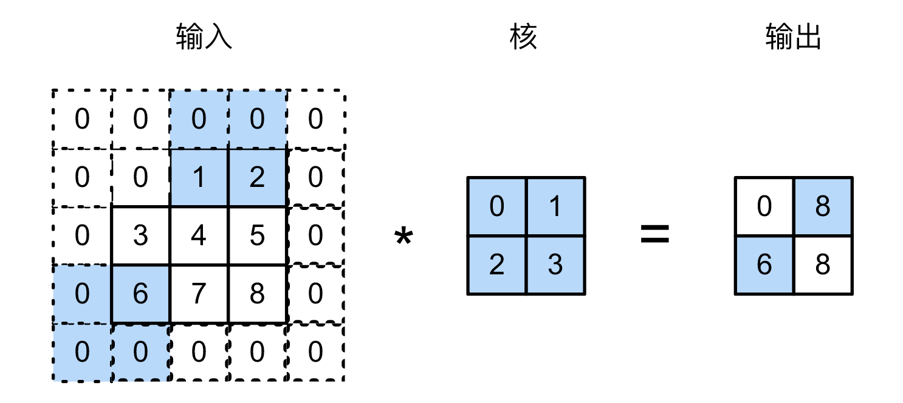

假设输入大小是(H, W)，滤波器（核）大小为(FH, FW)，输出大小为(OH, OW)，填充为P，步幅为S。
$$
OH=\frac{H+2P-FH}{S}+1 \\
OW=\frac{W+2P-FW}{S}+1
$$
3维数据的卷积中（通道），**输入数据和滤波器的通道数要为同样的值**，每个滤波器大小要一致。卷积运算中也存在**偏置**，**每个通道只有一个偏置的值**。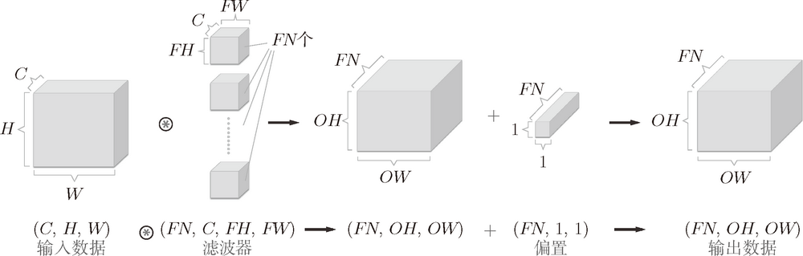

批处理(mini-batch)的支撑：

- 按 (batch_num, channel, height, width) 的顺序保存数据

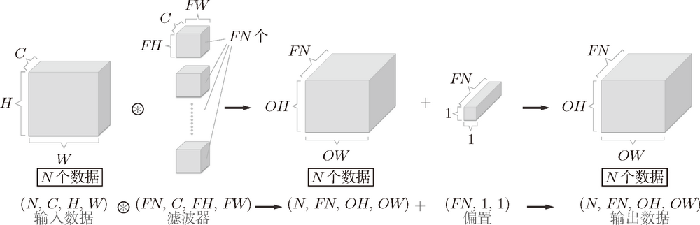

### 池化层

池化是缩小高、长方向上的空间的运算。Max 池化是从目标区域中取出最大值。Average 池化则是计算目标区域的平均值。**在图像识别领域，主要使用 Max 池化。**

- 池化层和卷积层不同，没有要学习的参数。
- 经过池化运算，输入数据和输出数据的通道数不会发生变化，是按通道独立进行。
- **对微小的位置变化具有鲁棒性（健壮）**

### 实现细节

`im2col` 会把输入数据展开以适合滤波器（权重），对于输入数据，将应用滤波器的区域（3 维方块）横向展开为 1 行。

- 内存消耗大，展开后的元素多余原方块的元素个数。

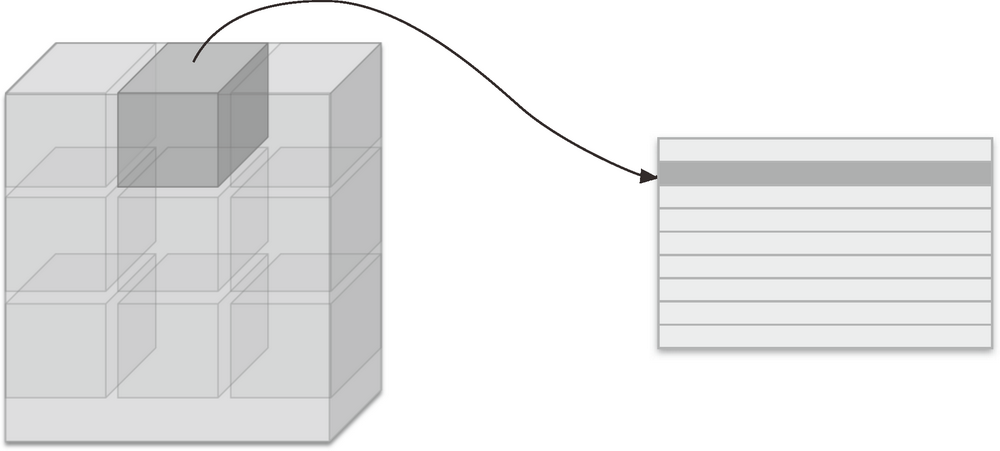

将卷积层的滤波器（权重）纵向展开为 1 列，并计算 2 个矩阵的乘积即可。

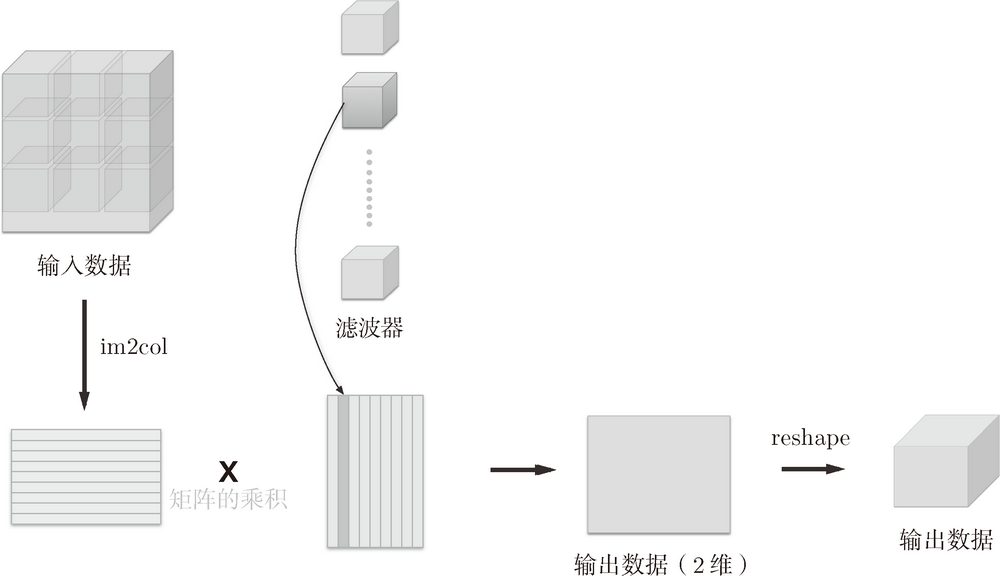

卷积层的反向传播除了需要实现col2img外，其它的跟 Affine 层一致。

池化层的数据展开，在通道方向是独立的。下面是池化层的实现流程示例：池化的应用区域内的最大值元素用灰色表示

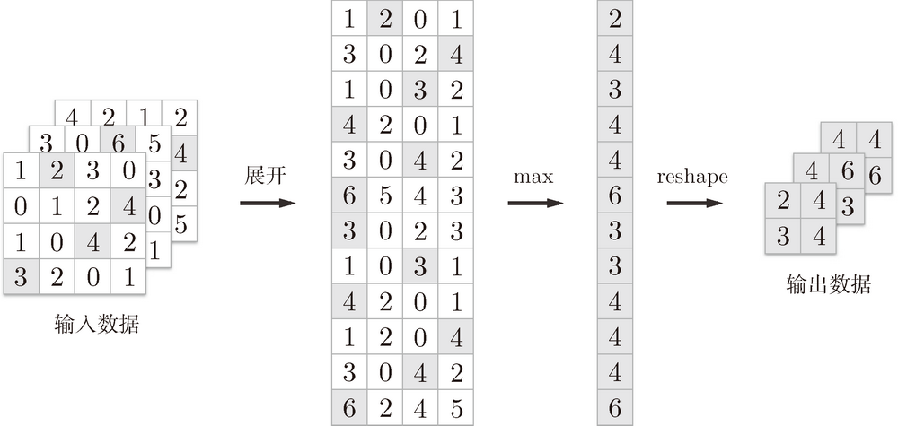

池化层的反向传播：

- **最大池化**：仅对前向传播中被选中的最大值位置分配梯度，其余位置梯度为 0。

### CNN可视化

将卷积层的滤波器显示为图像。通过学习，滤波器被更新成了有规律的滤波器，比如从白到黑渐变的滤波器、含有块状区域（称为 blob）的滤波器等。

将 mnist 的CNN 第 1 层权重的可视化如下图所示：

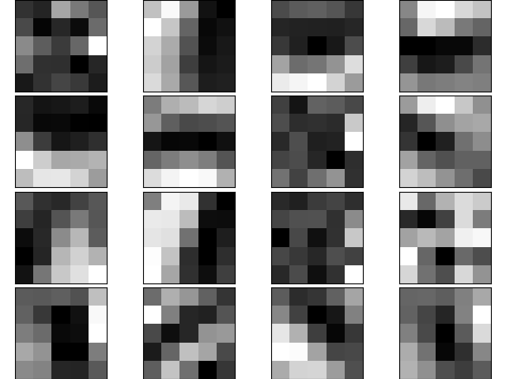

将上面滤波器应用到 lena 图像，可以看出不同的滤波器提取不同的特征。

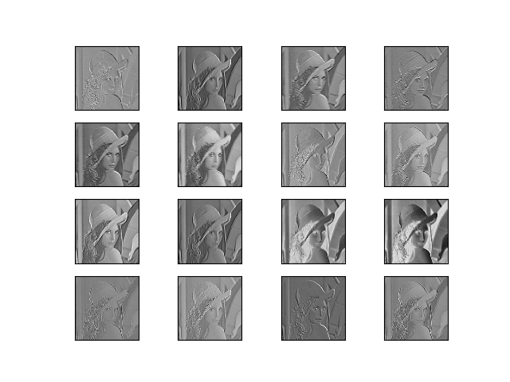

上面的结果是针对第 1 层的卷积层得出的。第 1 层的卷积层中提取了边缘或斑块等“低级”信息，那么在堆叠了多层的 CNN 中，各层中又会提取什么样的信息呢？

下图 中展示了进行一般物体识别（车或狗等）的 8 层 CNN（AlexNet）。

- **CNN 的卷积层中提取的信息。第 1 层的神经元对边缘或斑块有响应，第 3 层对纹理有响应，第 5 层对物体部件有响应，最后的全连接层对物体的类别（狗或车）有响应**。

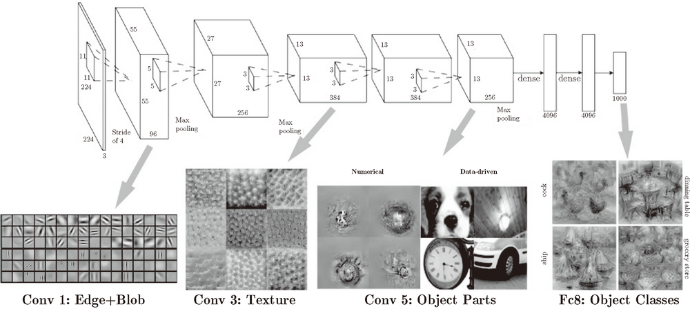

**具有代表性的 CNN**

1998 年首次被提出的 CNN 元祖 LeNet，2012 年被提出的 AlexNet。AlexNet 对比 LeNet 的区别：

- 激活函数使用 ReLU。
- 使用进行局部正规化的 LRN（Local Response Normalization）层。
- 使用 Dropout。

## 深度学习

### 加深网络

> [图像分类的 states of art](https://rodrigob.github.io/are_we_there_yet/build/classification_datasets_results.html)

进一步提高精度识别的技术：集成学习、学习率衰减、数据扩充(Data Augmentation)

- Data Augmentation：“人为地”扩充训练图像，采用**旋转、平移、裁剪、翻转、亮度变化**等方法。

加深层的重要性：理论研究尚不够透彻（截止2015年）

- 之前的研究和实验（如卷积层的可视化）可以解释；
- 基于比赛结果，层次越深，识别性能越高；

加深层的好处：

- 减少网络参数数量：如一次5 * 5的卷积运算的区域等价于两次3 * 3的卷积运算；
- 通过加深层，可以分层次地传递信息；

### 主流网络架构历史

图像识别：2012年 AlexNet，2014年 VGG / GoogleNet，2015年 ResNet。

- VGG **采用连续的几个3x3的卷积核代替AlexNet中的较大卷积核（11x11，7x7，5x5）**，步幅1，padding1，图像的长宽不变；

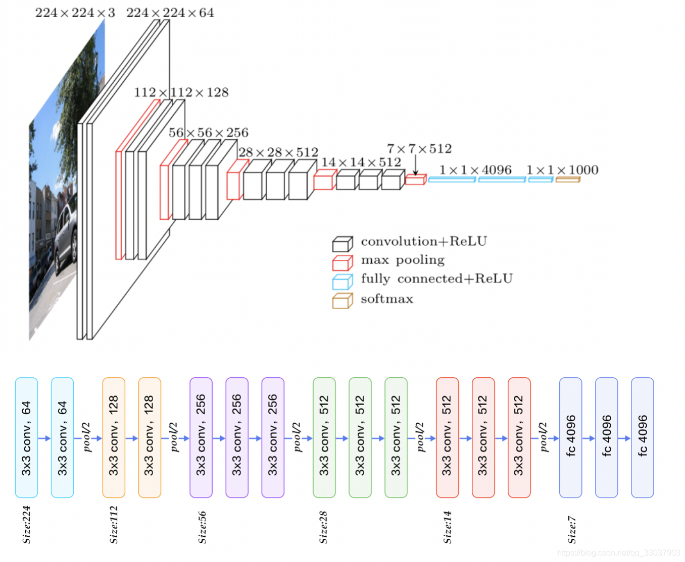

- GoogleNet：不仅在纵向上有深度，横向上也有深度（广度），采用Inception结构：

  - 1 * 1 的卷积核可以减少参数和实现高度化处理；

  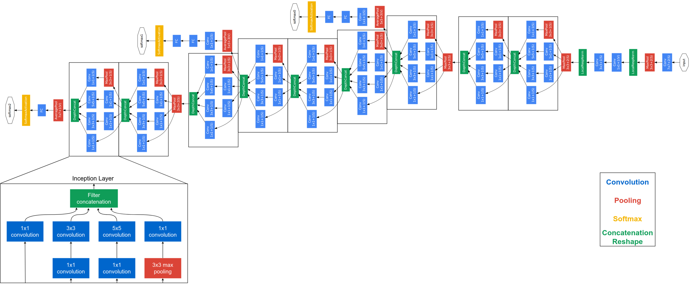

- ResNet：残差神经网络，发现了“退化现象（Degradation）”，并针对退化现象发明了 “快捷连接（Shortcut connection）”，极大的消除了深度过大的神经网络训练困难问题

  - 深层神经网络难以实现“恒等变换（*y*=*x*）”：随着网络深度的不断增大，所引入的激活函数也越来越多，数据被映射到更加离散的空间，此时已经难以让数据回到原点（恒等变换）；
  - 提出residual结构（残差结构），$y=F(x)+x$，并搭建超深的网络结构(突破1000层)；
  - 使用Batch Normalization加速训练(丢弃dropout)；

### 高速化学习

AlexNet 中，卷积层的处理时间占据GPU整体时间 95%，CPU整体时间 89%。

- 如何高速、高效地进行大量的乘积累加运算。

分布式机器学习：

- 需要解决机器间的通信、数据同步等多个难题；

运算精度的位数缩减：深度学习中使用16位的半精度浮点数也可以顺利学习。

- 深度学习不那么需要数据精度的位数，这是基于神经网络的健壮性（即便输入图像附有一些小的噪声，输出结果仍然保持不变）。

### 应用案例

**物体检测**：R-CNN、Faster R-CNN。

**图像分割**：FCN方法（Fully Convolution Network，全部由卷积层构成的网络），FNC将全连接层换成发挥相同作用的卷积层。

**图像标题生成**：NIC（Neural Image Caption），由深层的CNN和处理自然语言的RNN（Recurrent Neural Network）构成。

**图像风格变化**："A neural Algorithm f Artistic Style".

**图像生成**：**DCGAN**（Deep Convolutional Generative Adversarial Network）

**自动驾驶**：

## 多模态

组合图像和自然语言等多种信息进行的处理成为**多模态处理**。

## 生成对抗网络

## 迁移学习

迁移学习：将学习完的权重（的一部分）复制到其它神经网络，进行在学习（fine tuning）。

- 适用于手头数据集较少时，比较有效果。

## 强化学习

代理（Agent）根据环境选择行动，然后通过这个行动改变环境。

Deep Q-Network（简称：DQN），基于被称为Q学习的强化学习算法，在Q的学习中，为确定合适的行动，需要确定一个被称为最优行动价值的函数，为近似这个函数，又使用的深度学习CNN。

## 参考文献

1. 《深度学习入门：基于Python的理论与实现》. 斋藤康毅，陆宇杰 (译). 人民邮电出版社.
