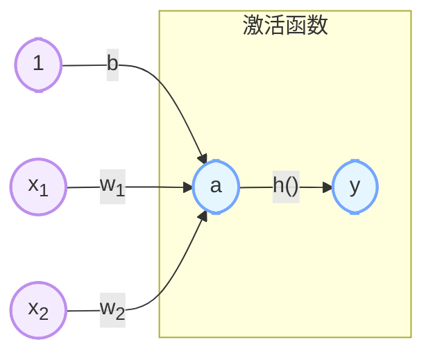

# 深度神经网络

## 感知机

> - 单层感知机无法分离线性空间：例如无法表示异或(XOR)关系；
> - 仅通过与非门(NAND)的组合就能实现计算机，可以参考《计算机系统要素：从零构建现代计算机》；
> - 理论上，二层感知机（严格来说是激活函数使用非线性的 sigmod 函数的感知机)可以表示任意函数。

感知机是二分类的线性分类模型，输入为实例的特征向量，输出为实例的类别，取1和0二值。
$$
y = \begin{cases} 1 & w^Tx + b > 0 \\ 0 & w^Tx + b \leq 0 \end{cases}
$$

## 神经网络

> - 朴素感知机：单层网络，激活模型使用越阶函数的模型；
> - 多层感知机：神经网络，使用sigmoid 等平滑的激活函数的多层网络。

**激活函数**：将输入信号的总和转换为输出信号，下式中的 h。
$$
a = w^Tx + b \\
y = h(a)
$$

