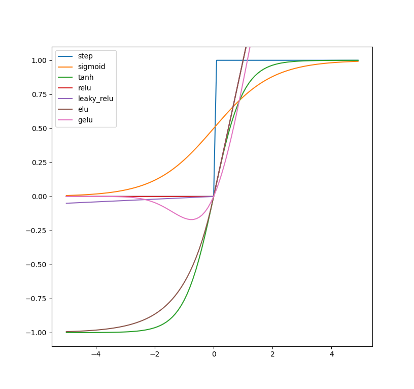

# 激活函数

> 作为决定神经网络是否传递信息的「开关」，激活函数对于神经网络而言至关重要。
>
> - 越阶函数无法进行反向传播。
> - 随着网络深度的不断增加，利用 Sigmoid 激活函数来训练证实不如非平滑、低概率性的 ReLU 有效。

常见的激活函数有：

- Sigmod、tanh、RELU、GELU

对比如下：一般使用 RELU 及其变种；

## Sigmoid

> 早期人工神经元使用二元阈值单元（Hopfield, 1982; McCulloch & Pitts, 1943）。二元决策通过 Sigmoid 激活函数进行平滑化，从而具有非常快的解码速度，并可以**利用反向传播进行训练**。

- 连续函数，便于求导；

- **容易造成梯度消失**：变量大的正值或负值时会**出现饱和现象**，对输入的微小改变会变得不敏感；
- **函数的输出不是零中心**：[每层的权重的更新方向是一样的](https://zhuanlan.zhihu.com/p/114173868)，导致Z型路线，模型收敛速度慢；
  - sigmoid 函数的导数是正的，$σ′(x)=σ(x)(1−σ(x))$

- **计算复杂度高**：指数形式；

$$
sigmoid(x) = \frac{1}{1+exp(-x)}
$$

## Tanh

以 0 为中心，在实际应用中，tanh会比sigmoid更好一些。但是在饱和神经元的情况下，tanh还是**没有解决梯度消失问题**。
$$
f(x) = \frac{e^x-e^{-x}}{e^x+e^{-x}}=2 * sigmoid(2x)-1
$$

## RELU

> RELU 整流线性单元（Rectified linear unit）是人工神经网络中最常用的激活函数（activation function），通常指代以「斜坡」函数及其变种为代表的非线性函数族。

- 可以对抗**梯度爆炸/消失**问题，计算效率也很高；
- 在x>0区域上，不会出现梯度饱和、梯度消失的问题；
- 输出**不是0均值**：跟 sigmoid 现象一致；
- **Dead ReLU Problem(神经元坏死现象)**：在x<0时，梯度为0。这个神经元及之后的神经元梯度永远为0，不再对任何数据有所响应，导致相应参数永远不会被更新。
  - 原因：参数初始化问题；learning rate太高导致在训练过程中参数更新太大
  - 解决方法：采用**Xavier初始化**方法，以及避免将learning rate设置太大或使用**adagrad等自动调节**learning rate的算法。

$$
f(x) = max(0, x)
$$

## Leaky ReLU

> 为了解决 dead ReLU 的问题。

用一个类似0.01的小值来初始化神d经元，从而使得**ReLU在负数区域更偏向于激活**而不是死掉。这里的斜率都是确定的。

- 缺点就是它有些近似线性，导致在复杂分类中效果不好。

$$
f(x)=max(\alpha{x}, x)
$$

## PRelu

> 解决 Leaky ReLU 的斜率参数是固定值的问题。

$$
f(\alpha, x) = \begin{cases} \alpha x, & x > 0 \\ x & x \leq 0 \end{cases}
$$

激活函数负半轴的斜率参数**α** 是通过学习得到的，而不是手动设置的恒定值。

## ELU

- 有负数饱和区域，从而对噪声有一些鲁棒性
- 计算量上更大

$$
f(x) = \begin{cases} x & x > 0 \\  \alpha{(e^x-1)}, & x <= 0 \end{cases}
$$

ELU激活函数的负半轴是一个指数函数而不是一条直线。

## GELU

> GELU : Gaussian Error Linear Units.
>
> BERT、RoBERTa、ALBERT 等目前业内顶尖的 NLP 模型都使用了这种激活函数。

GELU(高斯误差线性单元激活函数) 与随机正则化有关，因为它是自适应 Dropout 的修正预期（Ba & Frey, 2013）。这表明神经元输出的概率性更高。9在最近的Transformer模型（谷歌的BERT和OpenAI的GPT-2）中得到了应用

$$
f(x)=0.5x(1+tanh(\sqrt{2/\pi} * (x+0.044715x^3)))
$$
