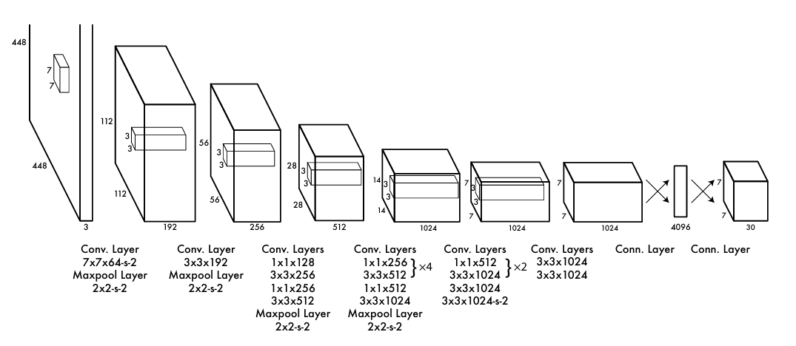
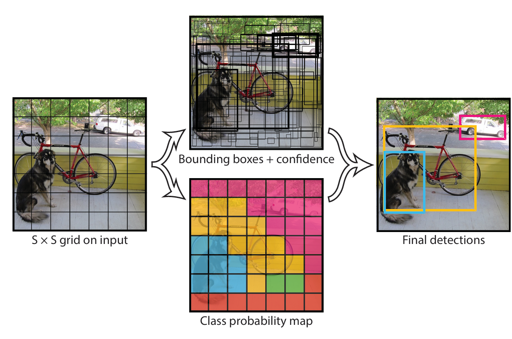

# Yolo模型

YOLO（You Only Look Once）是一组实时目标检测机器学习算法，**定位和分类图像中的物体**。

Yolo 之前R-CNN 和Fast R-CNN。这些方法使用两步流程，先预测边界框，然后使用回归对这些框中的物体进行分类。这种方法速度慢且耗资源。

Yolo v1-v3 由Joseph Redmon等开发：https://pjreddie.com/darknet/yolo/

Yolo v5/v8/v11 由Ultralytics团队研发：https://github.com/ultralytics，没有论文，有网站。

Yolo v6 美团开发：https://github.com/meituan/YOLOv6/

Yolo v4/v7/v9 由Chien-Yao Wang等研发：https://github.com/WongKinYiu

Yolo v10 清华大学：https://github.com/THU-MIG/yolov10

Yolo v12 ：https://github.com/sunsmarterjie/yolov12

## YOLO v1-v3

2016 年，**Joseph Redmon** 和 **Ali Farhadi** 两位大神开发了第一个 YOLO，它通过新的增强架构克服了传统目标检测算法的大多数问题。

最初的 YOLO 架构由 24 个卷积层和 2 个全连接层组成。同时使用了 以下优化技术：

- Leaky ReLU 激活：Leaky ReLU 有助于防止神经元在训练期间可能卡在非活动状态。
- Dropout 正则化：YOLOv1 在第一个全连接层之后应用 Dropout 正则化，以防止过拟合。
- 数据增强

YOLO 模型的本质是将**目标检测视为回归问题**。YOLO 方法是将卷积神经网络 (CNN) 应用于整个图像。该网络将**图像划分为区域并预测每个区域的边界框和概率**。

- 将输入图像划分为网格 (SxS)，每个网格单元负责预测边界框和其中对象的类别概率。每个边界框预测都包含一个置信度score，表示目标出现在框中的可能性。
- 使用交并比(IOU) 等技术计算置信度score，这些技术可用于过滤部分预测。

存在的问题：

- 很难准确检测训练中未见到的新物体；
- 每个网格单元仅预测两个框并且只能有一个类，这使得它很难处理成群出现的小物体，例如鸟群。
- 损失函数的局限性：YOLOv1 损失函数对小边界框和大边界框中的误差的处理方式相同。大边界框中的小误差通常没问题，但小误差对 IOU 的影响要大得多。
- 定位错误：YOLOv1 的一个主要问题是准确性，它经常会错误定位图像中物体的位置。

## YOLOv5

基于Pytorch构建。

## 参考文献

1. Redmon J , Divvala S , Girshick R ,et al.[You Only Look Once: Unified, Real-Time Object Detection](https://arxiv.org/pdf/1506.02640)[C]//Computer Vision & Pattern Recognition.IEEE, 2016.DOI:10.1109/CVPR.2016.91.
2. 
3. Redmon J , Farhadi A .YOLOv3: An Incremental Improvement[J].arXiv e-prints, 2018.DOI:10.48550/arXiv.1804.02767.