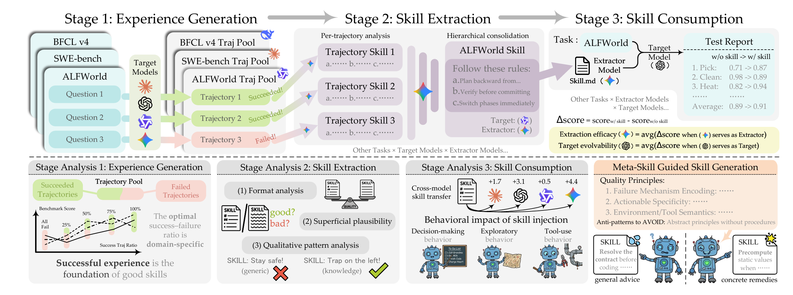

# *A Systematic Study of Model-Generated Agent Skills*

> [From Raw Experience to Skill Consumption: A Systematic Study of Model-Generated Agent Skills](https://arxiv.org/pdf/2605.23899)

领域级技能将某个领域的重复操作封装为**单个可复用组件**，或是**一组协同配套的组件**，从而使得 Agent 能够快速适应新的任务，而无需针对每个任务进行优化。

SKILL 生命周期：通过智能体与环境的交互生成执行轨迹（**经验生成**）、从轨迹中提取可复用知识与模式（**技能提取**）、在推理阶段调用已生成的技能（**技能应用**）。

现有的各类评测基准仅能反映局部特征，聚焦**技能应用阶段**，无法完整呈现整个技能生命周期。

采用三阶段实验流程：

- 目标智能体运行经验生成数据集，构建经验库；
- 提取器依托极简设计的提取框架，从经验库中凝练出单一领域级技能 —— 该设计旨在体现提取器本身的能力，而非依赖辅助技巧；
- 将得到的技能重新部署至原目标智能体，在预留测试集上开展评测，并对比**无技能基准组**的性能差异，以此作为衡量技能效用的依据。

提出两项指标以区分两类核心能力：

- **提取效能（EE）**，用于衡量**固定提取器能否为不同智能体**稳定生成有效技能；
- **目标可塑性（TE）**，用于衡量同一智能体从自身运行经验中，借助**不同提取器**生成技能后所能获得的收益幅度。

## 整体思路

从经验生成、技能提取到技能应用的整个流程，共分为三个阶段。

## 研究问题与结论

> 完成智能体技能**全生命周期（经验生成 - 提取 - 应用）** 的系统性研究，厘清了提取器、目标智能体、任务领域三者的交互规律，推翻了 “模型越强提取技能越好”“文本通顺 = 优质技能” 等固有认知。

（一）**模型生成的领域级技能是否能够真正为不同目标、不同提取器以及不同领域中的代理带来好处？**

技能整体有效，但存在显著风险与适配差异

- 模型生成技能平均可提升性能，75% 的实验组表现为正向收益，但**25% 出现负迁移**（引入技能后性能下降）；不同领域负迁移概率差异较大，具身规划领域风险最高（47%），办公软件、软件工程领域风险最低（13%）
- **提取能力与任务执行能力相互独立**：任务表现优异的模型未必是优秀的提取器，模型参数量、基础任务性能无法预判其技能提取质量。
- 技能效用高度依赖目标智能体：同一套提取器生成的技能，对不同目标智能体的收益天差地别，技能效果是**提取器、目标智能体、领域三者**共同作用的结果。

（二）结合**经验生成、技能提取、技能应用**这三大生命周期环节来看，究竟是什么因素决定了技能在后续任务中的实际效用？

经验生成 —— 经验库的成败轨迹配比是基础，直接影响技能质量，且**最优配比因领域而异**：

- 办公软件、软件工程更依赖成功轨迹；
- 具身规划领域从**失败轨迹中能提炼更多有效信息**（失败案例可暴露无效动作与死局）；
- 纯由失败轨迹构成的经验库效果始终最差，证明**成功轨迹是优质技能的核心基础**。

技能提取 —— 表层文本特征无法决定技能效用：

- 技能格式（有序列表、段落、清单等）、文本通顺度 / 表面合理性，均与实际效用无关：大模型仅凭文本观感判断技能优劣，准确率仅 46.4%，接近随机猜测；部分读起来流畅的技能，实际效果反而更差。 
- 优质技能的核心特征并非表层形式，而是包含**具体失败机制、可落地操作、领域工具语义**等深层信息。                                                                                   

技能应用 —— 目标智能体的接收与适配能力存在个体差异

- 同一技能在不同目标智能体上的收益差距极大，部分模型能大幅受益，部分模型则出现性能退化。

- 技能不会触发智能体额外的显式调用行为，而是**重塑智能体默认决策、探索、工具使用策略**：适配的智能体会优化执行逻辑，不适配的智能体则会陷入复杂流程，降低执行鲁棒性。

（三）研究中的实证结果能否转化为具体的、可实施的改进措施，以提升 SKILL 提取的效率呢？

基于结论设计 “元技能”，实现即插即用改进。

**区分两类评价规则**

- 朴素合理性规则：从文本通顺、格式、完整性等表层维度评判，接入后会**加剧负迁移、降低整体性能**；
- 经验证的有效规则：经实验筛选出三大核心维度 —— 失败机制解读、操作落地性、高危行为黑名单。

**元技能（Meta-Skill）方案**

将上述三大有效规则封装为**元技能提示词**，直接**嵌入提取器的系统提示词**（无需修改原有提取架构，属于即插即用优化）。

**优化效果**：该方案在所有实验领域与模型组合中均提升技能质量，平均性能提升 1.55 个百分点，同时大幅减少负迁移问题，验证了实证结论的工程落地价值。

## 相关工作

> 现有工作虽提出了各类有效的提取方案，但均基于各自独立的实验设定，未能从整体上厘清**经验生成 — 技能提取 — 技能应用**全生命周期的内在规律。本文通过对提取器、目标模型、应用领域开展多组对照实验，并结合分阶段分析，填补了上述两大研究空白。

**基于提示词的提炼方法**直接将执行轨迹总结为结构化技能载体，如 Trace2Skill 采用多子智能体并行处理并分层整合。AutoRefine 归纳双形态经验模式；PRAXIS 构建基于状态索引的过程记忆；MemP 则规范了智能体过程记忆的**构建 — 检索 — 更新**运行机制。

**基于优化与强化学习的方法**进一步对提取出的技能做迭代优化：ProcMem 引入非参数化近端策略优化（PPO）；CoEvoSkills 采用协同进化校验机制；还有部分研究将技能库与强化学习相结合。

**自迭代生命周期智能体**，这类方法如 EvolveR，通过闭环部署不断优化技能

## 评估框架

