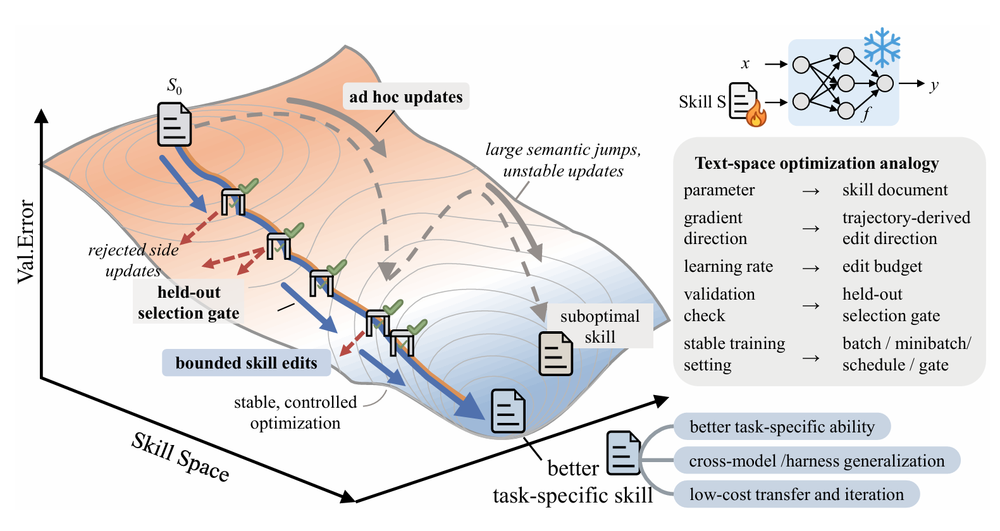
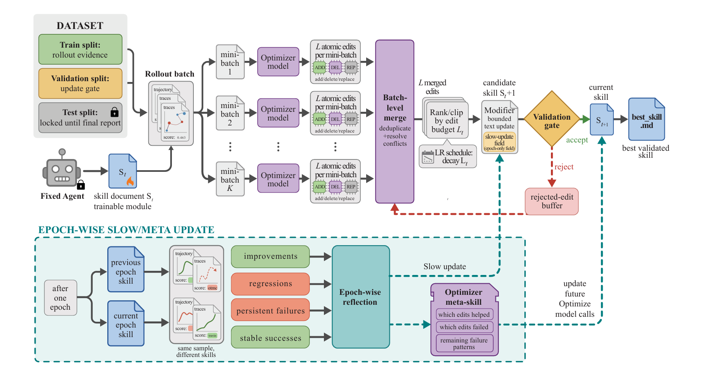

# [SkillOpt: Executive Strategy for Self-Evolving Agent Skills](https://arxiv.org/pdf/2605.23904)

> [SkillOpt/data/README.md at main · microsoft/SkillOpt](https://github.com/microsoft/SkillOpt)

**一个像深度学习优化器那样系统性地优化技能**，把这个技能文档当成神经网络的权重参数，用前向传播 + 反向传播的逻辑，在纯文本空间里对它做梯度下降式的优化。

把 DL 训练的核心概念一对一刻进了文本世界：**有界的参数更新**、**验证集把关**、**稳定的学习率调度**

| 传统 ML 概念        | SkillOpt 中的对应                                           |
| ------------------- | ----------------------------------------------------------- |
| 可训练参数          | 一个紧凑的 Markdown 技能文档（best_skill.md）               |
| 前向传播            | 目标 LLM 用当前技能执行一批任务，记录完整轨迹和得分         |
| 反向传播 / 梯度估计 | 另一个优化器 LLM 分析成功/失败轨迹，提出结构化编辑建议      |
| 学习率              | 有界编辑预算（Bounded Edits），限制每次最多改几处           |
| 验证集 + 早停       | 验证门控（Validation Gate）：只在验证集分数提升时才接受更新 |
| 动量 / 长期记忆     | Slow Update 和 Meta Skill，在 epoch 级别传递跨步经验        |

## 架构

## Pipeline

- 冻结的目标模型用当前技能执行rollout批次；
- 优化器模型对小批次进行反思，提出有界的增加/删除/替换编辑；
- 验证门]选择在验证集上表现最好的技能；
- 最终输出最佳技能文档。

## 设计与实现

### 前向传播：轨迹证据收集

在每步优化中，目标模型用当前技能在训练集上执行rollout批次。

框架记录任务元数据、消息、工具调用、观察结果、命令输出、最终答案、验证器反馈，以及基准特定的上下文（如电子表格预览、文档引用或紧凑的执行轨迹）。

批次大小影响优化特性：小批次更新快但噪声大，大批次在技能改变前暴露更多重复模式。系统支持累积模式——多个rollout批次分别反思后合并为一个更新，解耦执行吞吐量与更新频率。

### 反向传播：小批次反思

优化器模型将轨迹转换为技能编辑，遵循轨迹驱动反思和提示演进的路线。它首先将批次分为成功和失败组，识别成功轨迹中的共性、失败轨迹中的重复错误模式，然后提出编辑建议。

编辑类型包括：

- **ADD**: 添加新规则或启发式方法
- **DEL**: 删除冗余或有害的内容
- **REP**: 替换现有内容以修复问题

每个小批次最多提出 L 个原子编辑（L 是文本学习率预算），这些编辑可以合并。关键在于编辑必须**有界**——限制每次更新的幅度，避免大跨度语义跳跃。

### 验证门与拒绝编辑缓冲区

每个候选技能都在**独立的验证集**上评估，使用相同的冻结目标模型和框架。如果改善当前选择分数，则成为新的当前技能；如果还超过历史最佳分数，则保存为 `best_skill.md`。否则被拒绝。

**拒绝编辑缓冲区**是关键创新：系统记录每个epoch内观察到的失败模式，以及被拒绝步骤中尝试的编辑和导致的分数下降。后续反思调用会接收这个缓冲区，避免重复失败的编辑，专注于未解决的失败。这为训练循环提供了负反馈，且不增加推理时成本。

### Slow Update 与 Meta Skill——动量与长期记忆

每个 epoch 结束时，SkillOpt 会做两件额外的事：

- **Slow Update**：在 epoch 前后的技能下重新执行部分训练样本，对比变化（改进、退步、持续失败和稳定成功），生成一条纵向总结，写入技能文档的受保护区域。相当于给优化过程注入了动量。该候选仍需通过验证门。捕获跨epoch的长周期模式，避免技能文档无限膨胀（epoch间反馈已被压缩到慢更新字段，而非累积在主文档中）。
- **Meta Skill**：优化器 LLM 自己的“元技能”，总结本 epoch 中哪种编辑模式有效、哪种无效。它会追加到下一个 epoch 的优化器 prompt 里，但不进入最终部署的 `best_skill.md`。

## 性能

主实验：52/52全面领先，六个基准、七个目标模型、三种执行框架。

**跨模型迁移**、**跨框架迁移**、**跨基准迁移**：**一次优化、文本审计、跨场景复用**，无需更改模型权重。

案例研究显示，优化后的技能保持紧凑（仅1-4次接受的编辑后为300-2000 tokens）、可检视、程序化而非实例特定。
