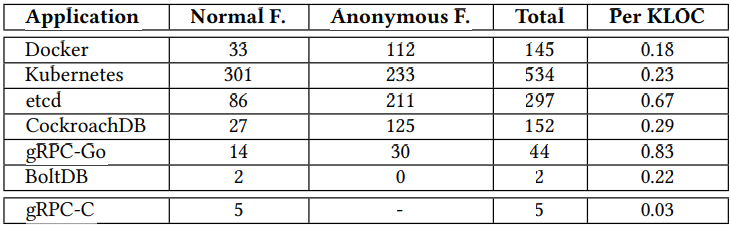
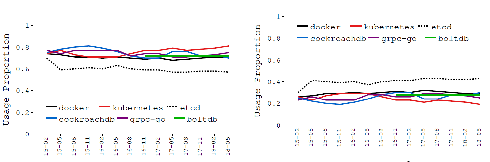
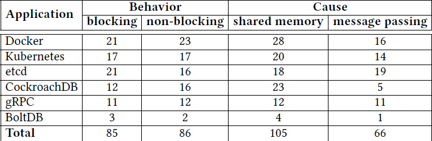
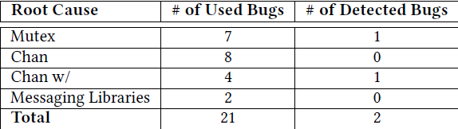

---
hide:
  - tags
tags:
  - 论文
---


# 了解真实世界的GO并发Bugs

> 论文：[2019《Understanding Real-World Concurrency Bugs in Go》](./pdfs/Understanding Real-World Concurrency Bugs in Go.pdf)

Go 推荐使用消息传递（message passing）作为线程（goroutine）间通信的手段，但是**线程间通信采用消息传递还是共享内存同步机制**，并没有真实的对比显式优劣性。

论文做了以下贡献：

- 第一个系统研究真实GO程序（如 docker/k8s/etcd等）的并发bugs：
- **消息传都跟共享内存一样，很容易出现并发bugs。**

<!-- more -->

## 1. Go 并发使用模式分析

### Goroutine 使用

> 观察结论1：**Goruntines 的生命周期更短，但是比 C（线程）创建更频繁**（无论是静态还是运行时创建）

**问题1：Do real Go programmers tend to write their code with many goroutines (static) ?**

**表2：每千行代码 goroutine 的创建数**（gRPC-C指的是线程的创建数）

- 相较于C项目，Go中的各项目中都大量的使用了协程



**问题2：Do real Go applications create a lot of goroutines during runtime (dynamic) ?**

**表3**：Google RPC Benckmarking 中的**Go和C应用的协程/线程**的值，以及相对于应用程序的协程/线程的占总应用时间

- 动态创建的 Go routine 比 C 线程多很多，但其存活时间比例小于 C线程(100%）


### 并发原语使用

> 观察结论2：尽管传统的**共享内存形式的线程间通信被重度**使用，但Go程序员也使用了**大量的消息传递原语**。
>
> 隐含结论1：随着 go routines和新型并发原语的大量使用，Go程序可能引入更多并发错误。
>

**表4：各项目中使用的并发原语的总数及各自的占比统计**

- 在实际项目中，**使用共享内存相关原语还多于通道通信的并发模式**。


图2：2015-2018 年各个项目的并发原语的使用比例的变化（左：共享内存，右消息传递）




## 2. Bug 研究方法

**表5：各项目中并发Bug的分类**（根据 commit 关键字搜索、过滤并分析得出 171 个并发 Bugs）

- 阻塞性 bug：goroutine 意外卡住，无法继续执行；
- 非阻塞性 bug：goroutine 执行完成，但是结果不对；




## 3. 阻塞性 Bugs

> 观察结论3：研究表明**阻塞bugs更多是由错误的消息传递导致**，而不是错误的共享内存保护，与人类普遍认知相反。

表6：**阻塞性Bugs的根因（消息传递错误58%，内存共享42%）**，考虑到共享内存的使用率比消息传递更频繁，消息传递并发Bugs率更高。

- `wait`包括 `Cond`和`WaitGroup`中的`Wait`函数；
- `Chan`表示 channel 操作，而`Chan w/`表示channel操作伴随着其它操作；
- `Lib`表示 Go 相关的消息传递的库；


### 阻塞性Bugs根因分析

#### 共享内存的错误保护

> 观察结论4：大多数由共享内存同步引起的阻塞错误与传统语言具有相同的原因和修复方法。但仍存在一些不同，因为Go对现有原语的新实现或新的编程语义（如读写锁/WaitGroup）。
>

Mutex ：传统的问题，可由死锁检查算法通过静态程序分析检测出来；

- 单个goroutine 重复获取锁（不支持可重入），获取锁的顺序存在冲突，忘记释放锁等；

RWMutex：在Go中**写锁比读锁有更高的优先级**， 读锁的重入可能会导致死锁；

- goroutine-A 的两个RLock（无锁释放） 间执行 goroutine-B 的 Lock（写锁），导致死锁；

Wait：一般是 Cond.Wait 时，没有其它协程调用 Cond.Signal；

#### 消息传递错误

> 观察结论5：所有由消息传递引起的阻塞错误都与Go新的消息传递语义（如channel）有关。且**很难检测**，尤其与其他同步机制一起使用时。
>
> 观察结论6：与人们普遍认为的相反，**消息传递会导致比共享内存更多的阻塞错误**。注意消息传递编程中的潜在危险，并提出该领域的错误检测研究问题。

Channel：一般和通道相关的阻塞bug是因为没有向通道发送消息（或从通道接收消息）或关闭通道，而导致正在等待从通道接收消息（或等待往通道发送消息）的协程阻塞。

Channel和其它原语：一起使用造成

- 一个协程因为通道阻塞，另一个协程因为锁或wait操作阻塞。

Go中的消息库：如 Pipe，未关闭的 Pipe 的操作（如读写）时可能会被阻塞，如果使用不当也会导致并发 bugs；

### 阻塞性Bugs的修复

> 观察结论6：研究中的大多数阻塞性bugs 可以通过**简单的方案**修复，**许多修复都与错误的原因相关**（many fixes are correlated with bug causes）。
>
> 隐式结论3：Go阻塞错误的原因和修复之间的高度相关性及其修复的简单性表明，**开发完全自动化或半自动化的工具来修复Go中的阻塞错误是有希望**的。

**共享内存对应的修复bug**的方法一般如下：

- 通过添加缺少的解锁操作
- 移动lock或unlock操作到合适的位置
- 移除多余的锁操作

**消息传递对应的修复bug**的方法一般如下：

- 添加丢失的message 或者 关闭 channel；
- 在select语句中增加default分支或在一个不同通道上的case操作；
- 将unbuffered channel替换成buffered chanel；
- channel 操作移除临界区，用共享变量替代 channel；


**表7：blocking bugs 的修复策略统计**，下标 s 表示 synchronization。


### 阻塞性 Bugs 检测

> 隐式结论4：**Go 内置的运行时死锁检测器不能有效地检测Go阻塞错误。**

Go 内置的死锁检测器针对 21 个阻塞性问题，只检测出2个死锁问题，有以下两点原因：

- 当仍然有一些goroutine在运行时，它不认为被监视的系统是阻塞的；
- 只检查goroutine是否在Go并发原语中被阻塞，而不考虑等待其他系统资源的goroutine。

**表8：deadlock detector 的检测结果**



## 4. 非阻塞性 Bugs

### 根因分析

**表9：非阻塞性问题的根因分析**


#### 共享内存保护失败

> 观察结论7：大约三分之二的共享内存未阻塞bugs是由传统原因引起的，Go的新的多线程语义和新的库为其余部分贡献了三分之一。
>
> 隐式结论5：Go为简化多线程编程引入的新的编程模型和新的库，其本身可能是导致更多并发错误的原因。
>

80% 收集的非阻塞性bugs都是由于未保护或者错误保护共享内存导致，其根因有以下三点：

- 传统的bugs：跟 C/Java 类似，如 违反原子性、违反顺序性、数据竞争等；
- 匿名函数：共享的本地变量导致的 goroutine 间的数据竞争；
- `WaitGroup`误用：`WaitGroup`要求`Add`必须在`Wait`前调用；
- 特殊的库：Go的库中的语义（如 context 等），使用被多个 goroutines隐式共享的对象；


#### 消息传递错误

20 %的收集问题由于错误使用消息传递：

- channel误用：如 close channel 多次，select 中多个 case 同时满足时执行的不确定性；
- 特定的库：比如 值为0 的Timer.C 的表现（立即signal select）；


### 非阻塞性Bugs的修复

> 观察结论9：**传统的共享内存同步技术仍然是Go中非阻塞错误的主要修复方法**，而通道不仅被广泛用于修复与通道相关的错误，还可以修复共享内存错误。
>
> 隐式结论7：虽然Go程序员继续使用传统的共享内存保护机制来修复非阻塞错误，但在某些情况下，他们更喜欢使用消息传递作为修复方法，可能是因为他们认为消息传递是跨线程通信的一种更安全的方式。

**表10：非阻塞性bugs的修复策略**（下标s表示synchronize）

- 69%的非阻塞bug可以通过严格的时间顺序进行修复（如增加Mutex之类的同步原语，或者移动相关同步原语）；
- 移除共享变量访问的指令；
- 对共享变量进行私有化；


**表11：非阻塞性bugs的修复中的同步原语数量**


### 非阻塞性Bugs的检测

> 隐式结论8：简单的传统**数据竞争检测器无法有效地检测所有类型的Go非阻塞错误**。

Go 内置 data race detector 针对收集的 20个 非阻塞性bugs 检测出 10 个bugs。

**表12：data race detector 的检测结果**


## 5. 附：并发Bugs 示例

> 论文种涉及的各个项目的bugs及修改commit信息见 [Github: go-concurrency-bugs](https://github.com/system-pclub/go-concurrency-bugs)
>
> [并发bugs复现项目](https://gitee.com/oscsc/golang#%E5%B9%B6%E5%8F%91)


### 匿名函数

本地变量共享（闭包）的问题，每个 goroutine 拿到的 `i` 的值不一定是循环时的 `i`的值，因此需要对变量拷贝并作为参数传递；

```go
	for i := 17; i <= 21; i++ { // write
- 		go func() { /* Create a new goroutine */
+ 			go func(i int) {
				apiVersion := fmt.Sprintf("v1.%d", i) // read
				...
- 			}()
+ 		}(i)
	}
```


### WaitGroup

无法保证 func1 的第 8 行的 Add 函数 happens before func2 的第 5 行的 Wait，通过将 Add 函数移至临界区中执行，保证 Add 在 Wait 前执行或者根本不执行。


### Channel

> 观察结论8：与共享内存访问相比，**由消息传递引起的非阻塞错误要少得多**。channel 的规则和将channel与其他Go特定语义和库一起使用的复杂性是发生这些非阻塞错误的原因。
>
> 隐式结论6：如果使用得当，与共享内存访问相比，消息传递不太容易出现非阻塞错误。然而，在一种语言中，**消息传递的复杂设计可能会导致这些错误在与其他特定于语言的功能相结合时特别难以找到**。

1）多个 goroutine 执行时，导致 channel 关闭多次。

```go
- 	select {
- 		case <- c.closed:
- 		default:
+			Once.Do(func() {
				close(c.closed)
+ 			})
- 	}
```

2）select 中的多个 case 执行顺序的不确定性，当 第10 和12行的 case 语句同时满足时，可能会执行第 12 行，导致 f() 多执行一次；

```go
	ticker := time.NewTicker()
	for {
+ 		select {
+ 			case <- stopCh:
+ 				return
+ 			default:
+ 		}
		f()
        select {
        	case <- stopCh:
        		return
        	case <- ticker:
        }
    }
```

3）Timer 引起的非阻塞型 Bug，目标是期望仅当 dur > 0 或者 ctx.Done() 时才返回。

- 当 dur 小于等于0 时，库中的goroutine 会立即 signal timer.C channel，导致用于从第 8 行返回，跟程序期望不一致；

```go
-	timer := time.NewTimer(0)
+	var timeout <- chan time.Time
	if dur > 0 {
-		timer = time.NewTimer(dur)
+		timeout = time.NewTimer(dur).C
	}
	select {
- 		case <- timer.C:
+ 		case <- timeout:
 		case <- ctx.Done():
			return nil
 	}
```

4）不带缓冲的channel导致goroutine 泄露

```go
	func finishReq(timeout time.Duration) r ob {
- 		ch := make(chan ob)
+ 		ch := make(chan ob, 1)
    	go func() {
    		result := fn()
    		ch <- result // if select timeout, then this will be blocked with no capacity channel
    	} ()
    	select {
    		case result = <- ch:
   				return result
   			 case <- time.After(timeout):
    			return nil
    	}
	}
```

