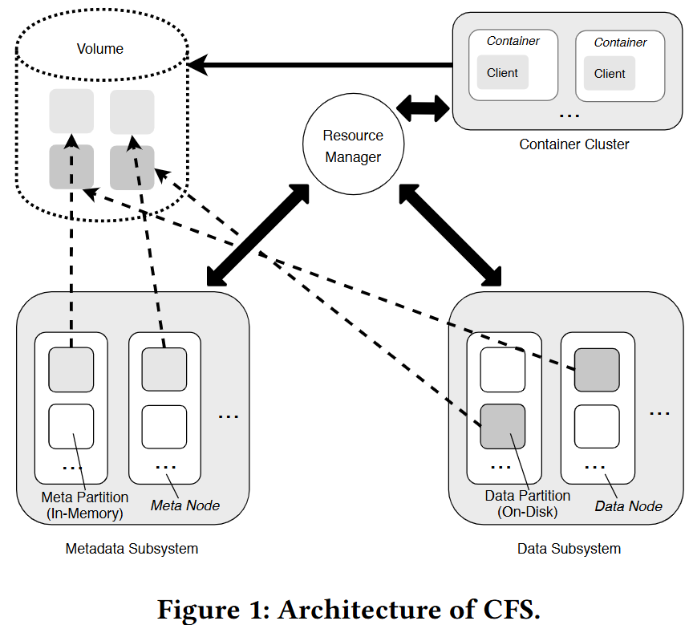
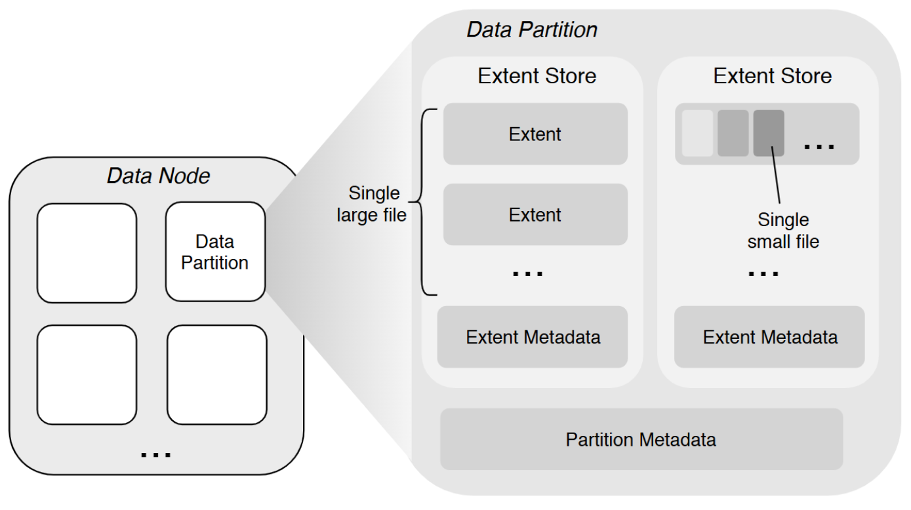

# A Distributed File System for Large Scale Container Platforms

> [论文地址](https://arxiv.org/pdf/1911.03001v1)，开源（京东）项目 [CubeFS | A Cloud Native Distributed Storage System](https://cubefs.io/zh/)，CNCF 毕业项目。

## 摘要

CFS：大规模容器平台的分布式文件系统

- 支持顺序和随机文件访问，针对大文件和小文件，采用不同的复制协议来提高复制性能；
- 元数据子系统，避免了在容量扩展期间数据重新平衡的需求；
- POSIX 标准的 API，具有 relaxed 语义和元数据原子性；

## 挑战

容器通常通过容器存储接口（CSI）将现有的分布式文件系统带到云原生环境中，或者通过一些存储协调器（例如Rook 支撑 Ceph），但性能和可扩展性不足。

- 现有文件系统很少同时支持大文件和小文件的存储；
- 现有文件系统采用相同的复制协议，无法为不同写入场景提供优化的复制性能；
- 存储所有文件元数据的单个节点很容易成为性能或存储瓶颈，单独的集群来存储元数据需要在容量扩展期间重新平衡存储节点，这可能会显著降低读/写性能；
- POSIX I/O标准中定义的强一致语义会极大地影响性能，同一文件的inode和dentry之间的原子性要求仍然会限制它们在元数据操作上的性能。

## 工作

Chubao文件系统（CFS），用于大型容器平台的分布式文件系统：

- 通用和高性能存储引擎。在不同的文件访问模式下以优化的性能高效地存储大小文件。
  - 利用Linux中的`punch hole`接口异步释放被删除的小文件占用的磁盘空间，简化小文件的删除工作；
- 场景感知复制。基于不同的写入场景（即附加和覆盖）采用了两种强一致的复制协议来提高复制性能。
- 基于利用率的元数据放置。单独的集群来根据内存使用情况在不同的存储节点上存储和分发文件元数据，在容量扩展过程中不需要任何元数据再平衡。
- 宽松的POSIX语义和元数据原子性。提供符合POSIX的API，放松POSIX一致性语义以及同一文件的inode和dentry之间的原子性要求。

## 架构



卷是 CFS 中的一个逻辑概念，由**一组元分区和数据分区**组成。每个分区只能分配给单个卷。从客户端的角度来看，卷可以被视为一个包含容器可访问数据的文件系统实例。从对象存储的角度来看，一个卷对应着一个 bucket。

资源管理器跟踪集群中元节点和数据节点的状态，如内存和磁盘利用率以及活跃状态。有多个副本，使用Raft共识维护强一致性，并持久化到 RocksDB 等键值存储中用于备份和恢复。

## 元数据存储

元数据子系统是一个以内存为中心的分布式数据结构，由一组元数据节点组成，每个元数据节点可以有数百个元分区。

- 每个元分区将来自同一卷的文件的 inode 和 dentry 存储在内存中；
- 使用两个名为 inodeTree 和 dentryTree 的 b 树进行快速查找；
- inodeTree由 inode id索引，dentryTree 由父 inode id 和 dentry 名称索引。

```go
type Inode struct {
	Inode      uint64 // inode id
    Type       uint32 // inode type
	LinkTarget []byte // symLink target name
	NLink      uint32 // number of links
	Flag       uint32
	...               // other fields
}
type Dentry struct {
	ParentId uint64 // parent inode id
	Name     string // name of the dentry
	Inode    uint64 // current inode id
	Type     uint32 // dentry type
}
```

**文件写入期间的复制是按照元分区执行的**，副本之间的强一致性由 Raft 共识协议[16]的修订版 **MultiRaft** 来保证，该协议的优点是减少了网络上的心跳流量**。

### 元数据恢复

在内存中被缓存的元分区通过快照和日志保存到本地磁盘上，用于备份和恢复。在元数据操作期间发生的故障可能会导致一个孤立的 inode，而该 inode 没有与 dentry 关联。这个 inode 占用的内存和磁盘空间很难释放。

- 为了将这种情况发生的可能性降到最低，客户端总是在失败后发出重试，直到请求成功或达到最大重试限制。

## 数据存储



用户能够直接操作的是卷（Volume），数据存储在 DataNode 管理的磁盘上，在磁盘上会被组织在一个个 DataPartition 中，这也是一个逻辑概念。

### 大文件存储

将大文件的内容存储为一个或多个扩展数据块（Extent）的文件，这些 Extent 可以分布在不同 DataNode 上的不同 DataPartition 中。将新文件写入 Extent 存储区时数据始终是以新 Extent 的零偏移量写入，这样就不需要在 Extent 内进行偏移。文件的最后一个范围不需要通过填充来补齐其大小限制（即该范围没有空洞），并且不会存储来自其他文件的数据。

在删除大文件时是直接从磁盘中删除对应的 Extent 文件的。

### 小文件存储

将多个小文件的内存聚合存储在一个 Extent 内，并将每个文件内容的物理偏移量记录在相应的元数据（保存在元数据子系统中）中。

删除文件内容（释放此文件占用的磁盘空间）是通过底层文件系统提供的文件穿洞接口（`fallocate()`）实现的，不需要实现垃圾回收机制，因此在一定程度上避免使用从逻辑偏移到物理偏移的映射。

### 场景感知复制

在文件写入期间，**复制是按分区执行的**。

- 对于顺序写入（即append），使用**主备份复制**；对于覆盖，使用**基于MultiRaft的复制协议**，类似于元数据子系统中使用的协议；
- 主备份复制不适合覆盖，在覆盖期间，将至少创建一个新的扩展数据块来存储新的文件内容，并且一些原始扩展数据块将逻辑地拆分为多个碎片，这些碎片通常像链接列表一样链接在一起。在此链接列表中，指向原始碎片的指针将替换为与新创建的盘区关联的指针。随着越来越多的文件内容被覆盖，最终数据分区上会有太多需要碎片整理的碎片，这可能会严重影响复制性能；
- 基于 MultiRaft 的复制存在写放大问题，因为它引入了写入日志文件的额外 IO，这可能会直接影响读写性能，但覆盖操作的需求比顺序写入操作的需求少的多；

### 故障恢复

首先通过检查每个数据块的长度并使所有数据块对齐，启动基于主备份的复制协议的数据恢复。一旦这个过程完成，再使用基于 Multi-Raft 的数据恢复。

没有必要恢复副本上的数据不一致部分。如果客户端发送了一个写入请求 k MB 的文件，并且只有前 p MB 已由所有副本提交，那么客户端将重新发送一个写入请求，以将剩余的 k-p MB数据写入不同的数据分区/节点的范围。

## 资源管理器

由多个 Master 节点组成，负责异步处理不同类型的任务，如**管理数据分片与元数据分片**（包括创建、删除、更新以及一致性检查等），检查数据节点或者元数据节点的健康状态，维护管理卷信息等。

### 基于利用率的放置

> 常用的元数据分配策略，如哈希和子树分区[4]通常需要在添加服务器时移动不成比例的元数据。

在创建卷之后，客户端向资源管理器请求一定数量的可用元分区和数据分区，这些分区通常位于内存/磁盘利用率最低的节点上。

在写入文件时，客户端以随机的方式从资源管理器分配的分区中选择元分区和数据分区。

- 客户端不采用基于利用率的方法是为了避免与资源管理器通信，无需获得每个分配节点的最新利用率信息。

当资源管理器发现卷中的所有分区都将满时，它会**自动向该卷添加一组新分区**。

- 这些分区通常位于内存/磁盘利用率最低的节点上。
- 当分区已满，或者达到阈值（即，元分区上的文件数或数据分区上的扩展数据块数）时，尽管仍然可以修改或删除新数据，但无法在该分区上存储新数据。

### 元数据拆分

每个分片组隶属于某个 volume，分片组都是某个 volume 的一段元数据范围（`inode id`范围`[100-20000)` )

当一分片组的性能（包含如下指标：内存）紧接临近值时，资源管理器服务会预估一个结束点，并通知此组节点设备，**只服务到此点之前的数据**，同时也会新选出一组节点，并动态加入到当前业务系统中，新节点组其实点刚好是上个节点组的结束点位置。

### 异常处理

当对元数据/数据分区的请求超时时（例如，由于网络中断），其余**副本被标记为只读**。当元数据/数据分区不再可用时（例如，由于硬件故障），该分区上的所有数据最终将被手动迁移到新分区。此不可用性由节点报告的多次故障来识别。

## 客户端

### 客户端缓存

减少与资源管理节点的通信负担，会在挂载启动时获取该挂载卷中所有元数据和数据节点的地址，并且进行缓存，后续会定期**从资源管理节点进行更新**。

减少与元数据节点的通信，会缓存 inode，dentry 以及 extent 元数据信息。

- 打开文件时，客户端会强制从元数据节点更新文件元数据信息。
- 不同客户端，或者说挂载点，可以同时读一个文件，**但是不能够同时写一个文件**。（客户端元数据缓存可能会导致多客户端写同一个文件时的一致性问题）

客户端在发送请求收到 not leader 回复时（故障恢复时，raft 复制组的主节点有可能发生变化，导致客户端缓存的主节点地址无效），会轮询重试该复制组的所有节点。重试成功后识别出新的主节点，客户端会缓存新的主节点地址。大多数时候，由于 Leader 不经常更改，缓存可以最小化重试次数。

## 优化

### 最小化心跳

有大量的分区分布在不同的元数据和数据节点上，即使使用基于 MultiRaft 的协议，每个节点仍然可以从同一 Raft 组中的其他节点获得大量心跳，从而导致严重的通信开销。

- 在节点上增加了一层称为 Raft set 的抽象层，以进一步减少 Raft 组之间要交换的心跳次数；
- 把所有的将节点分为若干个 Raft 集合，每个 Raft 集合维护自己的 Raft 组；
- 创建新分区时，更喜欢从同一个 Raft 集中选择副本，每个节点只需与同一个 Raft 集中的节点交换心跳。

### 非持久性连接

可能有成千上万的 Client 访问同一个 CFS 集群，如果它们的所有连接都保持活动状态，这可能会导致资源管理器过载。在每个 Client 和资源管理器之间使用非持久性连接。

## 元数据操作

在大多数现代 POSIX 兼容的分布式文件系统中（如Ceph），**文件的 inode 和 dentry 通常驻留在同一个存储节点上**，以保持目录的局部性。在 CFS 中，同一文件的 inode 和 dentry 可能分布在不同的元数据节点上，如果操作一额文件的 inode 和 dentry 用分布式事务，会显著影响性能开销。

**只要 dentry 总是与至少一个 inode 相关联，就可以放宽这种原子性要求**。CFS 中的所有元数据操作都基于此设计原则。

- 缺点是有可能创建孤立的 inodes，并且很难从内存中释放出来。管理员可以使用 fsck 等工具修复文件。

### 创建

创建文件时，客户端首先请求可用的元节点创建 inode。元节点为新创建的 inode 获取迄今为止在这个分区中尚未使用的最小 inode id，并相应地更新其最大的 inode id。

只有成功创建 inode 后， Client 才能请求创建相应的 dentry。如果发生故障，客户端将发送一个 unlink 请求，并将新创建的 inode 放入本地孤立的 inode 列表中，当 元节点收到来自客户端的evict 请求时，这些 inode 将被删除。

### 链接

当链接一个文件时， Client 首先要求 inode 的 meta 节点将 nlink 的值（关联的链接数）增加1，然后请求目标父 inode 的 meta 节点在同一个元分区上创建 dentry。如果创建 dentry 时发生故障，nlink 的值将减少1。

### 取消链接

当取消文件链接时，客户端首先请求相应的元节点删除 dentry。只有当这个操作成功时，客户端才会向 meta 节点发送一个 unlink 请求，以将目标 inode 中 nlink 的值减少一个。当达到某个阈值（文件为0，目录为2）时，客户端将此 inode 放入本地孤立 inode 列表中，当 meta 节点收到来自客户端的逐出请求时，该列表将被删除。

如果降低 nlink 的值失败，客户端将执行多次重试。如果所有重试失败，这个 inode 最终将成为孤立的 inode，管理员可能需要手动解决该问题。

## 文件操作

放宽了 POSIX 一致性语义，没有提供强大的一致性保证，而是**只确保文件/目录操作的顺序一致性，没有任何leasing 机制来防止多个客户端写入同一个文件/目录。**如果需要，它依赖于上层应用程序来维护更严格的一致性级别。


### 顺序写入

Client 首先从 **缓存** 中随机选择可用的数据分区，然后连续地将若干固定大小的数据包（例如，128 KB）发送给 Leader，每个**数据包包括副本的地址**、**目标extent  id**、**extent 中的偏移量**和**文件内容**。

副本的地址由资源管理器以数组的形式提供，并缓存在客户端。此数组中项目的索引指示复制的顺序，即索引 0 处的地址为 Leader。

一旦 Client 接收到来自 Leader 的提交，它将立即更新本地缓存，并定期或在收到来自上层应用程序的系统调用 fsync() 时与 meta node 同步。


### 随机写入

CFS 中的随机写入是就地写入。为了随机写入一个文件，客户端首先使用原始数据和新数据的偏移量来计算要附加的数据部分和要覆盖的部分数据，然后分别处理它们。追加的数据，按照顺序写入文件。覆盖的数据，文件在数据分区上的偏移量没有改变。


### 删除

删除操作是异步的。要删除文件， Client 向相应的元节点发送删除请求。meta 节点一旦接收到这个请求，就会更新目标 inode 中 nlink 的值。如果这个值达到某个阈值（文件为0，目录为2），目标 inode 将被标记为已删除（请参阅第 2.1 节中给出的 inode 结构）。稍后，将有一个单独的进程来清除这个 inode 并与数据节点通信以删除文件内容。

### 读

读取只能在 Raft 领导者（注意：主备组领导者和 Raft 组领导者可能是不同的）处发生。要读取文件，客户端向相应的数据节点发送读取请求。此请求由客户端缓存中的数据构建，例如数据分区 ID、范围 ID、范围的偏移量等。

## 设计选择讨论

### 集中化与去中心化

 CFS 选择集中化，主要是出于其简单性的考虑。单一资源管理器限制了元数据操作的扩展性，这可能会占到典型文件系统工作负载的一半之多。

采用一个独立的集群来存储元数据，这极大地提高了整个文件系统的扩展性。**资源管理器的扩展性仍可能受其内存和磁盘空间的限制**，但根据我们的经验，这从未成为一个问题。

### 分离元节点与数据节点上的元数据

文件元数据和内容存储在相同的机器上，元数据也可以由专门的管理元数据服务器分别管理。

CFS 中单独设置元节点，并将所有文件元数据保存在内存中以实现快速访问。

### 一致性模型和保证

在 CFS 中，存储层和文件系统层有不同的一致性模型。

存储引擎通过主备份或基于 Raft 的复制协议来保证副本之间的强一致性。前者不适用于覆盖操作，因为需要牺牲复制性能；后者存在写放大问题，因为它引入了额外的写日志文件的 IO。

有选择性地放宽了 POSIX 一致性语义，以便更好地与应用程序的需求保持一致，并提高系统性能。

- POSIX 的语义定义了写操作必须是强一致，即一个写操作需要阻塞应用执行，直到系统可以保证任何其他读取都会看到刚刚写入的数据。分布式文件系统上的这种强一致性非常具有挑战性，由于锁竞争/同步性能下降。
- CFS 放宽了 POSIX 的一致性，当不同的 Client 修改文件中不重叠的部分时，CFS 提供了一致性，但是如果两个 Client 试图修改文件的同一部分，它不提供任何一致性保证。