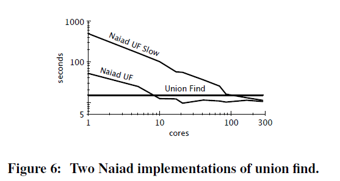

## [Scalability! But at what COST?](./pdfs/2015-Scalability! But at what COST.pdf)

> 分布式系统的评价指标：可扩展性 VS 性能 

## 问题

大多分布式大数据处理系统的工作过分**沉迷于系统的扩展性**，却很少甚至**忽略了系统的处理效率与绝对性能**。

- 单机算法考虑的是效率，有很多种优化手段，但这些方法不一定能并行（即扩展性不好）

图数据

| name  | twitter rv    | uk-2007-05    |
| ----- | ------------- | ------------- |
| nodes | 41,652,230    | 105,896,555   |
| edges | 1,468,365,182 | 3,738,733,648 |
| size  | 5.76GB        | 14.72GB       |

分布式系统的性能跟单机算法的性能对比：（20次 PageRank 迭代的性能）

| scalable system     | cores | twitter | uk-2007-05 |
| ------------------- | ----- | ------- | ---------- |
| Spark               | 128   | 857s    | 1759s      |
| Giraph              | 128   | 596s    | 1235s      |
| GraphLab            | 128   | 249s    | 833s       |
| GraphX              | 128   | 419s    | 462s       |
| Single thread (SSD) | 1     | 300s    | 651s       |
| Single thread (RAM) | 1     | 275s    | -          |

## 方案

衡量指标——**COST**（the **C**onfiguration that **O**utperforms a **S**ingle **T**hread），超过单线程的性能所需要的配置。

- 衡量分布式系统的可扩展性与系统引入的开销，不奖励带来大量但可并行开销的系统；

下图是单机的图连通分量算法（union find）和分布式图算法（Naida UF/ Slow）

- 快的分布式算法性能的 COST 值为 10 cores；慢的分布式算法的 COST 值为 100 cores.

## 文献

1. Mcsherry F , Isard M , Murray D G .Scalability! but at what cost?[C]//Workshop on Hot Topics in Operating Systems.USENIX Association, 2015.