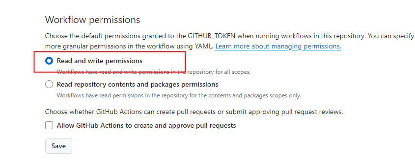
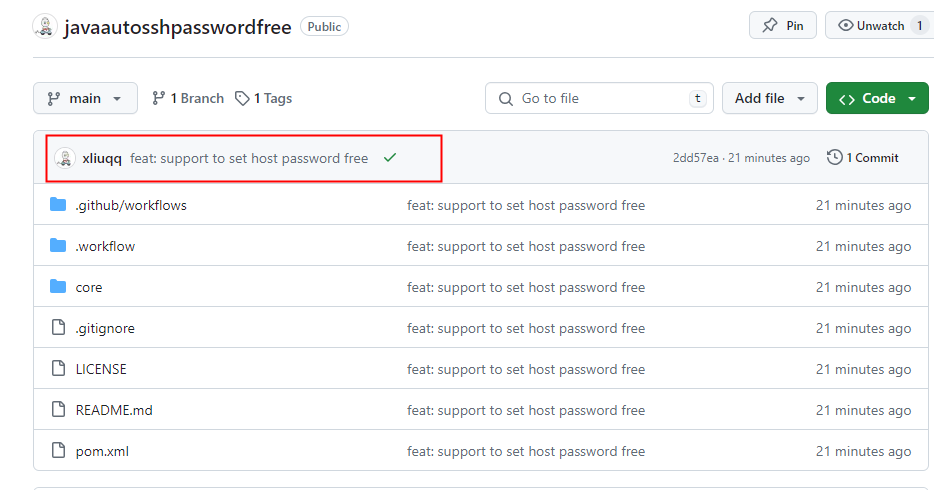

# 基于Tag自动发布Github Release


在 Github 上发布 Release 时，默认只会发布源码的zip包，但是有时候会想要将一些编译出来的文件也放在 Release 中。虽然可以在本地编译，然后通过界面手动上传。但是可以基于 Github Action 实现自动发布。


<!-- more -->


## 示例

> [xliuqq/javaautosshpasswordfree: Java 自动配置免密登录 ](https://github.com/xliuqq/javaautosshpasswordfree) 使用 [softprops/action-gh-release: GitHub Action for creating GitHub Releases](https://github.com/softprops/action-gh-release)

Java 项目为例，Release 时发布 fat jar。


### 配置 Action Yaml

`.github/workflows/release.yaml`

- 当推送 tag 时，进行编译，生成jar包，并新建 Release；
- 默认生成的 Release Notes（Body）仅包含 Commit 信息；
  - 可以通过其它工具，生成 ChangeLog，并指定该文件为 Release Notes。


```yaml
name: Release
on:
  push:
    tags:
    # tag 格式为 vA.B.C
      - 'v*.*.*'

jobs:
  publishGitRelease:
    runs-on: ubuntu-latest
    steps:
      - name: Checkout
        uses: actions/checkout@v4
      - name: Setup JDK
        uses: actions/setup-java@v3
        with:
          java-version: '8'
          distribution: 'temurin'
          cache: maven
      - name: Build
        run: mvn -B package --file pom.xml
      - name: Release
        uses: softprops/action-gh-release@v2
        with:
          # name: Name of the release. defaults to tag name
          # body_path: Path to load text communicating notable changes in this release
          # target_commitish: Commitish value that determines where the Git tag is created from. Can be any branch or commit SHA. Defaults to repository default branch.
          # Newline-delimited globs of paths to assets to upload for release
          files: core/target/java-auto-ssh-password-free*.jar
          fail_on_unmatched_files: true
          # note you'll typically need to create a personal access token
          # with permissions to create releases in the other repo.
          # token: ${{ secrets.CUSTOM_GITHUB_TOKEN }}
          # Name of a target repository in <owner>/<repo> format. Defaults to GITHUB_REPOSITORY env variable
          # repository: <another_owner>/<another_repo>
```


### 配置权限

在项目`Settings->Action->General`中，配置 Workflow 的权限（如下），这样默认的`GITHUB_TOKEN`就具备创建 Release 的权限。




### 打Tag并推送

> 可以使用 GUI（如 Github Desktop）对 Commit 打 tag，并推送。

```shell
git tag v1.0.0
git push origin v1.0.0
```


### 查看版本发布

被标记为 v1.0.0 的 tag 的 commit 有 Action 的运行结果图标。



查看 Release，可以看到相应的 fat jar 和 Release note.

