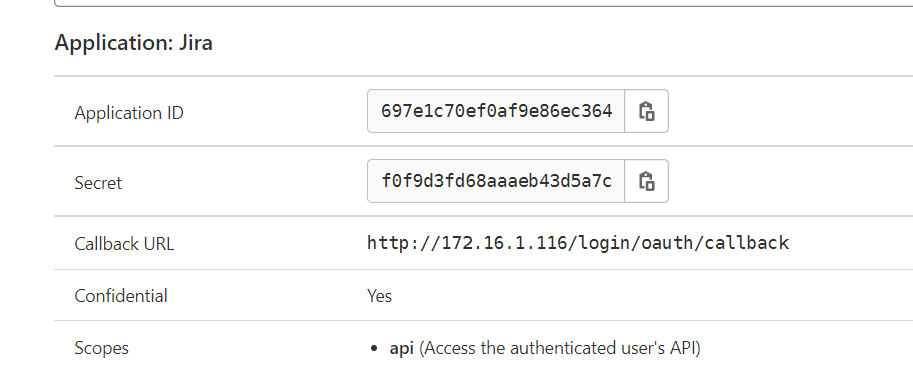
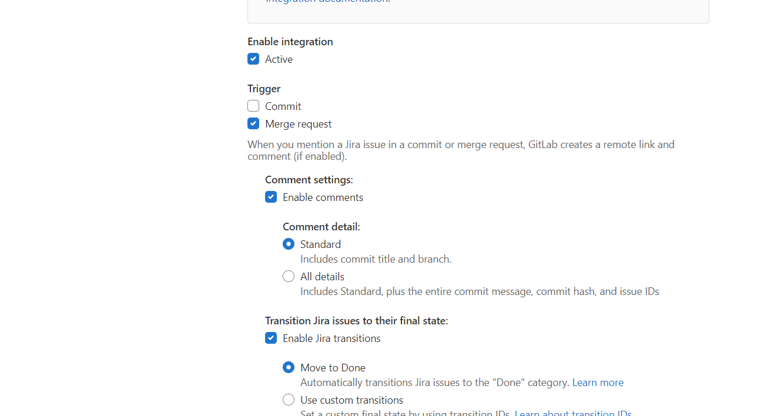
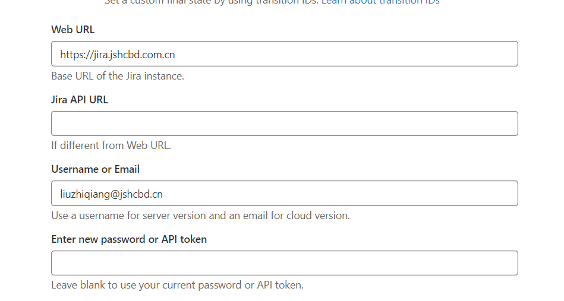
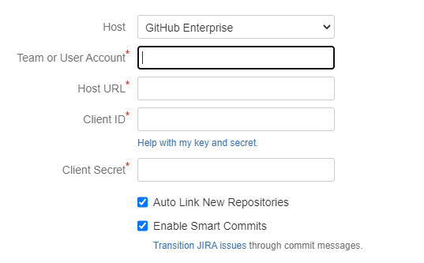
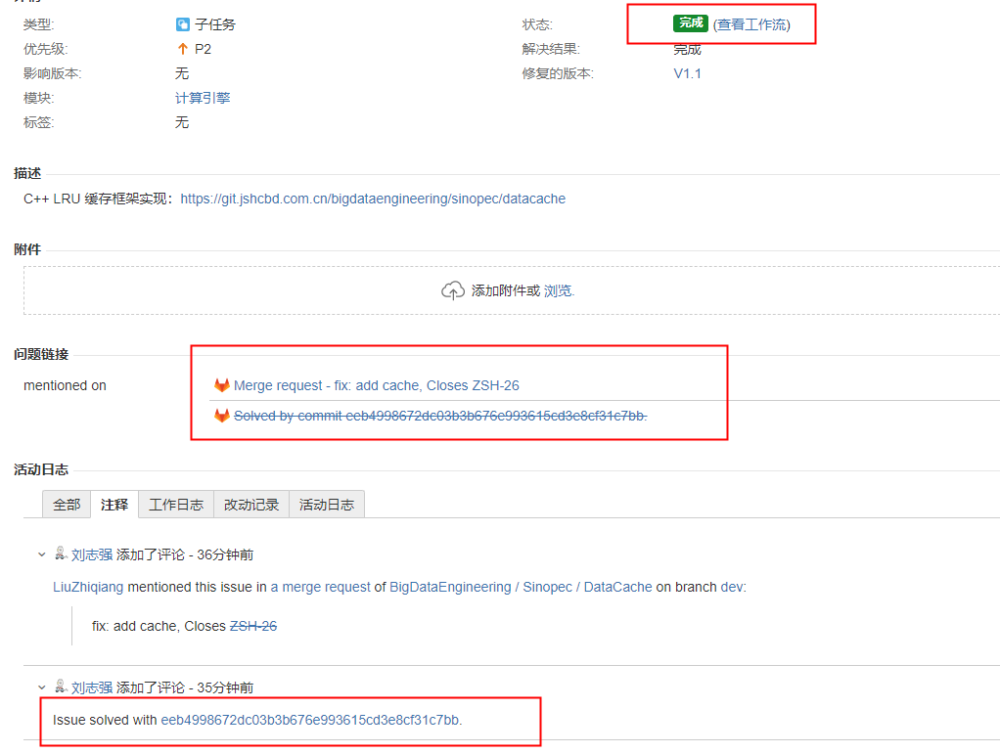

# Gitlab 集成 Jira

想要解决的问题：

- **代码推送到 gitlab 时，自动在 jira 上添加评论信息；**
- **代码合并时，自动将 Jira 的 issue 关闭；**


<!-- more -->


## 配置

> 参考 https://docs.gitlab.com/ee/integration/jira/index.html

### Gitlab的配置

新增Gitlab Application，如下



**配置 jira Integration**

- 配置仅 Merge Request 才会触发；

- 允许Jira的状态转换，自动转换为Done；





### Jira配置

> Jira DVCS connector

- **Team or User Account** 填写 Gitlab User 能够访问的最顶层的 Group；
- **Host URL** 填写 Gitlab 的地址；

- **Client ID** 对应 Gitlab Application  的 Application ID；
- **Client Secret** 对应 Gitlab Application 的 Secret ；



## 使用说明

> 1. 只**有默认分支（可以在 GitLab -> Settings 中配置默认分支）的 commit and merge 会触发关闭 JIRA issue**
> 2. 已有解决方案的 JIRA issue 则不会发生状态流转（就是我之前说的：只会对 JIRA.issue.status.resolution = unresolved 的 issues 生效）

Gitlab 自动触发状态流转的关键字有以下 3 个：

- Resolvers Issue-1
- Closes Issue-1
- Fixed Issue-1

### Feature 分支

> Feature 分支通过本地 commit -m 'Closes issue id' 然后合并到默认分支实现（master）

这种操作实现起来对**开发人员要求会高一些**，要求开发人员遵循规范，在完成 Feature 分支功能开发后，按照规范提交 commit 关键字来触发工作流，具体如下：

```shell
git checkout phoenix/feature/TEST-223 
git commit -m 'feat: add cache support, Closes TEST-223' 
```

这种方式的好处是项目负责人不需要提前收集和整理 issue，也**不需要在 Release 进行 Merge Request 的时候在合并描述 Description 添加触发关键字**，直接提交 Release 分支合并即可，

## 效果



