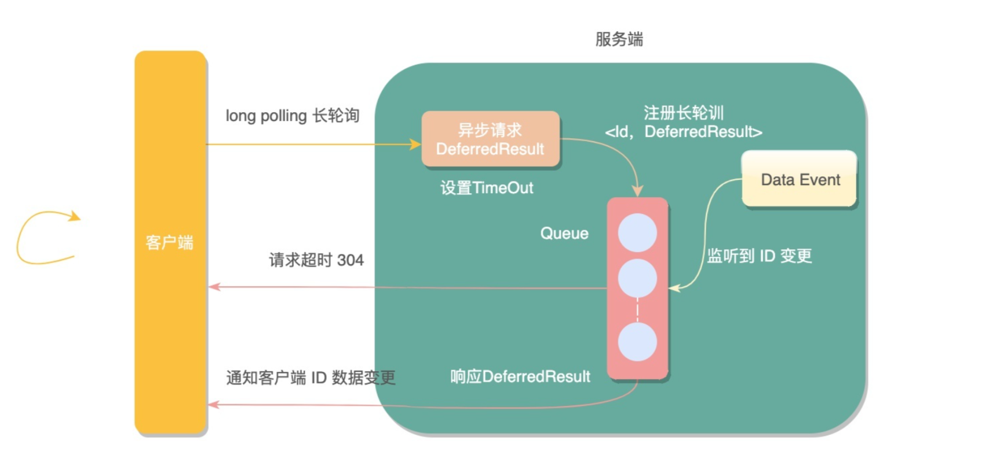
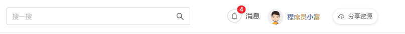

# 消息实时推送方案

> 需求：客户端及时收到服务端的消息通知
>
> - 对于 Gitee 等网站，其消息都是界面刷新时才通知，注意实时的性价比


## 短轮询

**短轮询**：指定的时间间隔，由浏览器向服务器发出`HTTP`请求，服务器实时返回未读消息数据给客户端，浏览器再做渲染显示。

- 实现：JS定时器；
- 缺点：推送数据并不会频繁变更，无论后端此时是否有新的消息产生，客户端都会进行请求，势必会对服务端造成很大压力，浪费带宽和服务器资源。


## 长轮询(Comet)

> 示例代码见：[LongPullingCode](https://gitee.com/oscsc/web-tech/tree/master/message_notify/LongPulling)

客户端主动拉`pull`模型，应用长轮询（`Long Polling`）

- 由服务端控制响应客户端请求的返回时间，来减少客户端无效请求的一种优化手段；

- 客户端发起请求后，服务端不会立即返回请求结果，而是将请求挂起等待一段时间，如果此段时间内服务端数据变更，立即响应客户端请求，若是一直无变化则等到指定的**超时时间后响应请求，客户端重新发起长链接**；

  

### 实现

- `DeferredResult` 在`servelet3.0`后经过Spring封装提供的一种**异步请求机制**

  - 允许容器线程快速释放占用的资源，不阻塞请求线程，以此接受更多的请求提升系统的吞吐量。
  - 启动**异步**工作线程处理真正的业务逻辑，处理完成调用`DeferredResult.setResult(200)`提交响应结果。

- **一个ID可能会被多个长轮询请求监听**，使用`guava`包的`Multimap`结构，一个key对应多个value。一旦监听到key变化，对应的所有长轮询都会响应；

- 请求超过设置的超时时间，会抛出`AsyncRequestTimeoutException`异常，全局捕获统一返回，前端获取约定好的状态码后再次发起长轮询请求。

- 前端得到**非请求超时的状态码**，知晓数据变更，**主动查询未读消息数接口**，更新页面数据；

  **注意**：

- **竞态分析**：如果在前端重新建立连接时，后端接收到新消息，此时前端还没有建立连接，该消息会丢失，**需要根据业务设计相应方案；**

### 缺点

长轮询相比于短轮询在性能上提升了很多，但依然会产生较多的请求，在响应之后，会引起请求突然激增。


## SSE

> 不应该设置 WriteTimeOut，示例代码见：[SSE 代码](https://gitee.com/oscsc/web-tech/sse)

服务器发送事件(`Server-sent events`)，简称`SSE`。

SSE在服务器和客户端之间打开一个单向通道，服务端响应的不再是一次性的数据包而**是`text/event-stream`类型的数据流信息**，在有数据变更时从服务器流式传输到客户端。

注：SSE不支持`IE`浏览器，对其他主流浏览器兼容性做的还不错。

### SSE与Websocket的区别

| WebSocket                      | SSE                                          |
| ------------------------------ | -------------------------------------------- |
| 全双工，可以同时发送和接收消息 | 单工，只能服务端单向发送消息                 |
| 独立的协议                     | **基于HTTP协议**                             |
| 需要代理服务器单独支持         | 代理服务器直接支持                           |
| 协议相对复杂                   | **协议相对简单，易于理解和使用**             |
| 默认不支持断线重连             | **默认支持断线重连**                         |
| 默认支持传送二进制数据         | 一般只用来传送文本，二进制数据需要编码后传送 |
| 不支持自定义发送的数据类型     | **支持自定义发送的数据类型**                 |
| 支持CORS                       | 不支持CORS，协议和端口都必须相同             |

- 以1次/秒或者更快的频率向服务端传输数据，那应该用WebSocket；
- 客户端和服务端脚本之间具有网络服务器情况时，一个SSE连接不仅使用一个套接字，还会占用一个Apache线程或进程；

### 实现

客户端：通过 `EventSource`建立连接；

- 会自动断线重连（如超时重连），并且会发送`Last-Event-ID` header

  服务端：Springboot 通过 `SseEmitter`实现；

- SSE消息的格式为`field:value\nfield:value\n\n`， field 支持如下

  ```java
  空: 即以:开头，表示注释，可以理解为服务端向客户端发送的心跳，确保连接不中断
  data：数据
  event: 事件，默认值为 message，如果是其它事件，前端可以通过 addEventListener 监听不同的事件
  id: 数据标识符用 id 字段表示，相当于每一条数据的编号
  retry: 重连时间
  ```


### Nginx 转发 SSE

- nginx upstream 超时连接关闭（upstream timeout）时，前端会自动进行重连；

```conf
proxy_set_header Upgrade $http_upgrade;
proxy_set_header Connection "upgrade";
proxy_http_version 1.1;

# Nginx 默认 OFF
proxy_cache off;

# 应该由 server 端发送 X-Accel-Buffering: no; 
# 针对 proxy_pass 的后端配置，好像不需要配置，即使开启前端也会实时响应
# proxy_buffering off;

# 该配置对于SSE不需要
# chunked_transfer_encoding off;
```


## MQTT

`MQTT` 全称(Message Queue Telemetry Transport)：一种基于发布/订阅（`publish`/`subscribe`）模式的`轻量级`通讯协议，通过订阅相应的主题来获取消息，是**物联网**（`Internet of Thing`）中的一个标准传输协议。

将消息的发布者（`publisher`）与订阅者（`subscriber`）进行分离，因此可以在不可靠的网络环境中，为远程连接的设备提供可靠的消息服务，使用方式与传统的MQ有点类似。

### 实现

https://mp.weixin.qq.com/s/U-fUGr9i1MVa4PoVyiDFCg


## WebSocket

在`TCP`连接上进行全双工通信的协议

### SOCKJS

> 当今主流浏览器都支持 Websocket，因此 [SOCKJS 不再需要](https://stomp-js.github.io/guide/stompjs/rx-stomp/using-stomp-with-sockjs.html)
>
> - 除非反向代理（如Nginx）的配置不支持WebSocket.

使用 SOCKJS （模拟 Websocket 协议）

- [sockjs-client](https://github.com/sockjs/sockjs-client) 提供**浏览器兼容性**，优先使用原生的WebSocket，如果某个浏览器不支持WebSocket，SockJS会自动降级为SSE 或者 长轮询；

  **心跳**

- SockJS 协议要求 servers 发送心跳消息，排除代理导致的连接挂起。（Spring SockJS 默认 `heartbeatTime` 为 25s）；

- When using STOMP over WebSocket and SockJS, if the STOMP client and server negotiate heartbeats to be exchanged, the SockJS heartbeats are disabled.

### [STOMP](../data_system/messagequeue/STOMP.md)

使用 STOMP（定义Websocket的数据格式），消息的订阅和发送。

- STOMP即Simple Text Orientated Messaging Protocol，简单文本定向消息协议；
- [stompjs](https://github.com/stomp-js/stompjs) 客户端，1.1 版本提供心跳机制（默认10s，但会跟 broker 连接时协调出最终的in/out心跳）；
  - 连接稳定性，支持自动重连；


**事务支持**

```javascript
// start the transaction
const tx = client.begin();
// send the message in a transaction
client.publish({
  destination: '/queue/test',
  headers: { transaction: tx.id },
  body: 'message in a transaction',
});
// commit the transaction to effectively send the message
tx.commit();
```

### Spring

> https://docs.spring.io/spring-framework/docs/current/reference/html/web.html#websocket-server
>
> On the Servlet stack, the Spring Framework provides both server (and also client) support for the SockJS protocol；

- 跨域问题，the default behavior for WebSocket and SockJS is to accept **only same-origin requests**. ；
  - nginx 配置 `proxy_set_header Host $host;`
  - 或者 spring 配置 `setAllowedOriginPatterns("*")`；

- 事件问题：
  - `SessionDisconnectEvent`需要幂等处理，一个WS连接(Session)可能会被发送多次；

#### Simple Broker

> The built-in simple message broker handles subscription requests from clients, stores them in memory, and broadcasts messages to connected clients that have matching destinations. 

纯 WebSocket 的心跳问题（不使用 SockJS）：

- [显式定义Client/Server的心跳](https://docs.spring.io/spring-framework/docs/current/reference/html/web.html#websocket-stomp-handle-simple-broker)

#### 外部 Broker

> [支持 RabbitMQ, ActiveMQ 等](https://docs.spring.io/spring-framework/docs/current/reference/html/web.html#websocket-stomp-handle-broker-relay)

#### 认证

通过[`configureClientInboundChannel()`注册消息处理](https://docs.spring.io/spring-framework/docs/current/reference/html/web.html#websocket-stomp-authentication-token-based)，进行验证。


### nginx 转发 Websocket

```conf
proxy_set_header Upgrade $http_upgrade;
proxy_set_header Connection "upgrade";
proxy_http_version 1.1;
```

proxied server 端需要定时发送 PING 消息保证 nginx 不会关闭连接。


## 站内信设计

实现一个站内信web消息推送的功能



消息推送(`push`) 通常是指网站的运营工作等人员，通过某种工具对用户当前网页或移动设备APP进行的主动消息推送。

消息推送一般又分为**`web端消息推送`**和**`移动端消息推送`**。

web端消息推送常见的诸如**站内信、未读邮件数量、监控报警数量**等，应用的也非常广泛。

需求：站内信

- 管理员可以发布多种不同的消息，用户在界面可以及时收到通知；

- 每个 client，需要有自己的唯一标识，防止用户对一个界面同时多开，此时每个界面都会有一个独立的连接；
  - 即仅用用户ID作为 ClientId 不行，因为 Server 端对同一个ID，只会保留一个连接，但是对应多个前端页面连接，会出错；

### 非实时方案

类似 Gitee，其站内信是非实时的，需要界面刷新才可以获取。

- `unread`接口，获取未读消息；


### 实时方案

触发某个事件（主动分享了资源或者后台主动推送消息），web页面的通知小红点就会实时的`+1`。

在服务端会有**若干张消息推送表**，用来记录用户触发**不同事件所推送不同类型的消息**，前端**主动查询（拉）或者被动接收（推）用户所有未读的消息数**。

- - 