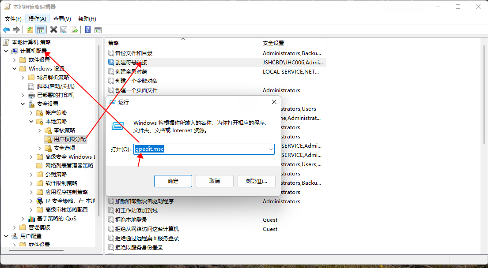

# Hadoop Yarn Mock 测试

当系统与 Yarn 集成时，一般会通过 YarnClient / AdminProtocol 以及 Restful 接口等方式跟 Yarn 通信。

那么，当系统在进行单元测试时，就需要对 Yarn 进行 Mock，来验证系统的正确性。

Yarn 提供了 MiniYarnCluster 来建立内存级的集群进行测试，但其也有一些局限性。


<!-- more -->

## YarnClient / AdminProtocol 接口测试

创建 `MiniYARNCluster`，并通过其 config 创建 YarnClient 或者 AdminProtocol

```java
 YarnConfiguration configuration = new YarnConfiguration();

// start mini yarn cluster in localhost:9188
MiniYARNCluster miniYARNCluster = new MiniYARNCluster("TestCluster", 1, 1, 1);
miniYARNCluster.init(configuration);
miniYARNCluster.start();

YarnClient yarnClient = YarnClientFactory.initYarnClient(miniYARNCluster.getConfig());
// ClientRMProxy.createRMProxy(miniYARNCluster.getConfig(), ResourceManagerAdministrationProtocol.class)

List<NodeReport> nodeReports = yarnClient.getNodeReports();

assertEquals(1, nodeReports.size());

miniYARNCluster.close();
```


## Restful 接口测试

当前存在问题，接口无法访问，404，可见 [JIRA: Yarn-8764](https://issues.apache.org/jira/browse/YARN-8674)

- 在同一个进程启动 Node Manager 时，会将 ResourceManager 的 路由覆盖掉；


## Windows 环境配置

### Hadoop on windows

将 https://github.com/cdarlint/winutils 中对应hadoop版本中的bin下的winutils下载到本地

- 配置HADOOP_HOME
- `path`环境变量添加 Hadoop 目录的 `bin/`；


### 符号链接权限配置

通过 `MiniYarnCluster` 运行测试时，出现以下错误：

```
CreateSymbolicLink error (1314): ?????
```

错误码（Error Code）是**1314**，通过查询文档，这个Error Code的意思是：**ERROR_PRIVILEGE_NOT_HELD**，缺少权限。

- `gpedit.msc` -> 计算机配置 -> Windows 设置 -> 安全设置 -> 本地策略 -> 用户权限分配 -> 创建符号链接
- 修改后，需要重启电脑，才会生效；


