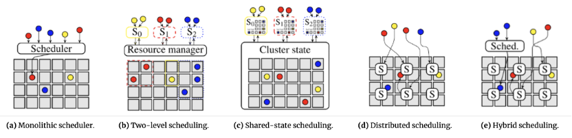
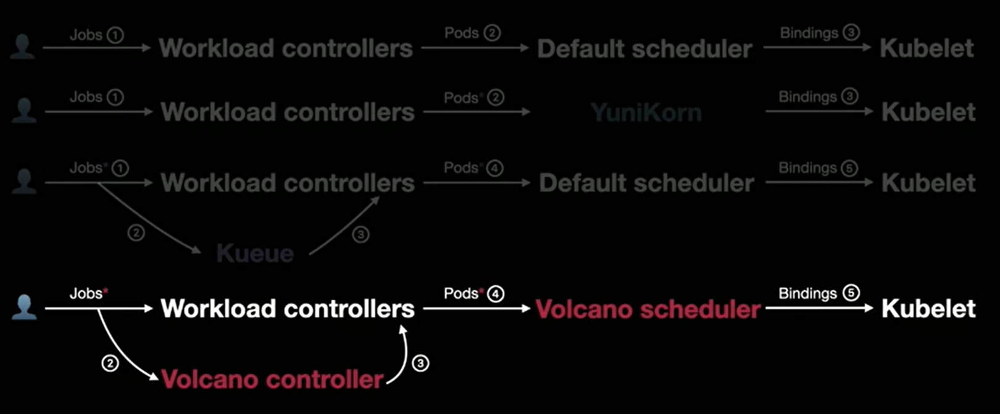

# 调度系统

## 工作流调度

- **DolphinScheduler（DS）：工作流任务调度引擎**，支持多种任务类型；
- **Argo Workflow**：**工作流编排调度引擎**，只运行在 K8s 集群，不支持 YARN、物理机、本地 Worker；
- [**Apache Airflow**](https://airflow.apache.org/docs/apache-airflow/stable/) ：是一个**以代码方式编写、调度和监控工作流**的平台。

## 资源调度

业内的集群调度系统按照架构区分，可以分为**单体式调度器、两级调度器、共享状态调度器、分布式调度器和混合调度器**这五种不同架构（见下图）

- **单体式调度器**：使用复杂的调度算法结合集群的全局信息，计算出高质量的放置点，不过延迟较高。如Google的Borg系统、开源的Kubernetes系统。
- **两级调度器：**通过将**资源调度和作业调度分离**，解决单体式调度器的局限性。两级调度器允许根据特定的应用做不同的作业调度逻辑，且同时保持了不同作业之间共享集群资源的特性，可是无法实现高优先级应用的抢占。具有代表性的系统是Apache Mesos和Hadoop YARN。
- **共享状态调度器**：通过半分布式的方式来解决两级调度器的局限性，共享状态下的每个调度器都拥有一份集群状态的副本，且调度器独立对集群状态副本进行更新。一旦本地的状态副本发生变化，整个集群的状态信息就会被更新，但持续资源争抢会导致调度器性能下降。具有代表性的系统是Google的Omega和微软的Apollo。
- **分布式调度器**：使用较为简单的调度算法以实现针对大规模的高吞吐、低延迟并行任务放置，但由于调度算法较为简单并缺乏全局的资源使用视角，很难达到高质量的作业放置效果，代表性系统如加州大学的Sparrow。
- **混合调度器**将工作负载分散到集中式和分布式组件上，对长时间运行的任务使用复杂算法，对短时间运行的任务则依赖于分布式布局。微软Mercury就采取了这种这种方案。

### SLURM（超算）

### YARN（大数据）

**YARN：大数据资源调度框架**，管**集群计算资源分配、容器资源隔离**，大数据层资源调度；

### K8S（云原生）

**K8s：容器编排资源调度平台**，管**容器生命周期、机器资源、服务编排**，底层基础设施调度。

Yunikorn：YARN 风格**无限层级树形队列**。替换 `Default scheduler` 的**底层节点调度器，不改变上层 Job/Pod 定义**。

Kueue：**作业准入 / 配额排队层**，复用 `Default scheduler`，不做节点分配。

**Volcano**：调度器 + 作业控制器（PodGroup/Gang） 一体化，完全替换默认调度器

