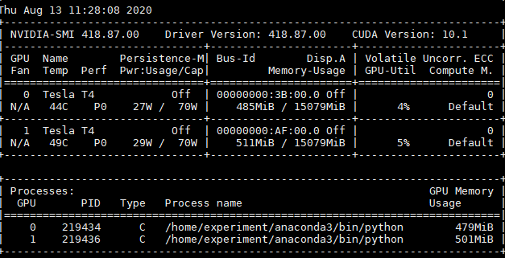
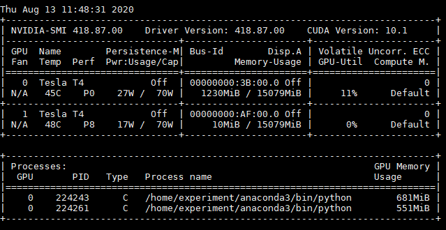

# Yarn GPU

> https://hadoop.apache.org/docs/stable/hadoop-yarn/hadoop-yarn-site/UsingGpus.html

## 前提

- 只支持Nvidia的GPUs调度（可以自定义插件支持Rocm GPU）；
- YARN NodeManager 所在机器必须预先安装了 Nvidia Driver；
- 如果使用 Docker 作为容器的运行时上下文，需要安装 nvidia-docker 1.0。

注：**GPU资源的隔离，需要使用 LinuxContainerExecutor** (YARN-9419)，

本节只关注 非 docker 的配置。

## 配置

> 以 hadoop 用户启动

### capacity-scheduler.xml 

```xml
<!-- For Capacity Scheduler capacity-scheduler.xml -->
<property>
  <name>yarn.scheduler.capacity.resource-calculator</name> <value>org.apache.hadoop.yarn.util.resource.DominantResourceCalculator</value>
</property>
```

### resource-types.xml

```xml
<configuration>
  <property>
     <name>yarn.resource-types</name>
     <value>yarn.io/gpu</value>
  </property>
</configuration>
```

`yarn-site.xml`中必须配置 `yarn.scheduler.capacity.resource-calculator`为`org.apache.hadoop.yarn.util.resource.DominantResourceCalculator`。

### yarn-site.xml

在NodeManager端启用GPU隔离模块，配置 CGroup。

```xml
<property>
    <name>yarn.nodemanager.resource-plugins</name>
    <value>yarn.io/gpu</value>
</property>
<!-- cgroup 配置 -->
<property>
    <name>yarn.nodemanager.container-executor.class</name>
    <value>org.apache.hadoop.yarn.server.nodemanager.LinuxContainerExecutor</value>
</property>
<!-- 使用LinuxContainerExecutor不会强制使用CGroups。如果希望使用CGroups，则必须将resource-handler-class设置为CGroupsLCEResourceHandler-->
<property>
    <name>yarn.nodemanager.linux-container-executor.resources-handler.class</name>
    <value>org.apache.hadoop.yarn.server.nodemanager.util.CgroupsLCEResourcesHandler</value>
</property>
<!-- 默认为false，挂载cgroup的路径，当通过df命令查看，/sys/fs/cgroup目录没有被挂载时，将其设置为true可以自动挂载 -->
<property>
    <name>yarn.nodemanager.linux-container-executor.cgroups.mount</name>
    <value>false</value>
</property>
<!-- Cgroup的所在路径 -->
<property>
    <name>yarn.nodemanager.linux-container-executor.cgroups.mount-path</name>
    <value>/sys/fs/cgroup</value>
</property>
<!-- Nodemanager用户的所属主组，与container-executor.cfg中的配置保持一致，用于验证权限 -->
<property>
    <name>yarn.nodemanager.linux-container-executor.group</name>
    <value>hadoop</value>
</property>
<!-- NM进程会自动生成该目录，与container-executor.cfg中的配置保持一致 -->
<property>
    <name>yarn.nodemanager.linux-container-executor.cgroups.hierarchy</name>
    <value>/hadoop-yarn</value>
</property>
```

默认情况下，当设置了上面的配置时，YARN会自动检测并配置gpu。

只有当管理员有特殊要求时，才需要在`yarn-site.xml`配置以下配置。

#### 管理的GPU设备

`yarn.nodemanager.resource-plugins.gpu.allowed-gpu-devices`：默认auto。

- 指定NM管理的GPU设备，逗号分隔；GPU设备的数量会上报给NM进行调度决策；
- GPU设备是通过它们的副设备号和索引来识别
  - 获取gpu minor设备号的一种常用方法是使用`nvidia-smi -q`并搜索*Minor Number*输出；
  - GPU的索引格式为`index:minor_number[,index:minor_number...]`；
  - 示例"0:0,1:1,2:2,3:4"，管理的GPU为MinorNumber为0,1,2,4，其索引为0,1,2,3

#### 发现GPU的命令

`yarn.nodemanager.resource-plugins.gpu.path-to-discovery-executables`：auto模式，指定 **nvidia-smi** 命令的绝对路径

### container-executor.cfg

**添加**以下内容

```ini
# NM 的 Unix 用户组，跟 yarn-site 中保持一致
yarn.nodemanager.linux-container-executor.group=hadoop
# 允许使用的用户的 uid 最小值，防止有其他超级用户
min.user.id=10
[gpu]
module.enabled=true
[cgroups]
# This should be same as yarn.nodemanager.linux-container-executor.cgroups.mount-path inside yarn-site.xml
root=/sys/fs/cgroup
# This should be same as yarn.nodemanager.linux-container-executor.cgroups.hierarchy inside yarn-site.xml
yarn-hierarchy=/hadoop-yarn
```

注意权限问题

- **该文件container-executor.cfg 及其的所有父目录(一直到/ 目录) owner** 都为 root；
  - 二进制的 owner 必须是 root，属组必须与 NM 属组相同 (hadoop)，权限 0400；

- `bin/container-executor`的权限必须单独配置
  - 二进制的 owner 必须是 root，属组必须与 NM 属组相同 (hadoop)，权限 6050；
  - `chown root:hadoop bin/container-executor && chmod 6050 bin/container-executor`

或者可以通过`yarn.nodemanager.linux-container-executor.path`重新指定 container-executor目录

- `container-executor`是根据相对路径搜索`container-executor.cfg`
- 这样相关的递归权限就容易设置；

```xml
<!-- yarn-site.xml --> 
<property>
    <name>yarn.nodemanager.linux-container-executor.path</name>
    <value>/hadoop/bin/container-executor</value>
</property>

<!-- 
/hadoop
  - /bin
	- container-executor
  - /etc
	- /hadoop
      - container-executor.cfg
-->
```

### 检查

`container-executor --checksetup`，没有任何提示表示配置成功，可以正常启动集群使用

## 使用

### Distributed-shell + GPU

分布式shell目前支持指定内存和vcore之外的其他资源类型。

#### Distributed-shell + GPU without Docker

不使用docker容器运行分布式shell(要求2个任务，每个任务有3GB内存，1个vcore，2个GPU设备资源):

```shell
yarn jar <path/to/hadoop-yarn-applications-distributedshell.jar> \
  -jar <path/to/hadoop-yarn-applications-distributedshell.jar> \
  -shell_command /bin/nvidia-smi \
  -container_resources memory-mb=3072,vcores=1,yarn.io/gpu=2 \
  -num_containers 2
```

对于启动的Container任务可以看到如下信息（**如果节点有两个GPU，申请两个Container，每个Container一个GPU，则每个Container只打印一个GPU信息**）

```
Tue Dec  5 22:21:47 2017
+-----------------------------------------------------------------------------+
| NVIDIA-SMI 375.66                 Driver Version: 375.66                    |
|-------------------------------+----------------------+----------------------+
| GPU  Name        Persistence-M| Bus-Id        Disp.A | Volatile Uncorr. ECC |
| Fan  Temp  Perf  Pwr:Usage/Cap|         Memory-Usage | GPU-Util  Compute M. |
|===============================+======================+======================|
|   0  Tesla P100-PCIE...  Off  | 0000:04:00.0     Off |                    0 |
| N/A   30C    P0    24W / 250W |      0MiB / 12193MiB |      0%      Default |
+-------------------------------+----------------------+----------------------+
|   1  Tesla P100-PCIE...  Off  | 0000:82:00.0     Off |                    0 |
| N/A   34C    P0    25W / 250W |      0MiB / 12193MiB |      0%      Default |
+-------------------------------+----------------------+----------------------+

+-----------------------------------------------------------------------------+
| Processes:                                                       GPU Memory |
|  GPU       PID  Type  Process name                               Usage      |
|=============================================================================|
|  No running processes found                                                 |
+-----------------------------------------------------------------------------+
```

#### Distributed-shell + GPU with Docker

使用Docker容器运行分布式shell。

必须指定**YARN_CONTAINER_RUNTIME_TYPE**/**YARN_CONTAINER_RUNTIME_DOCKER_IMAGE**才能使用docker容器。

```shell
yarn jar <path/to/hadoop-yarn-applications-distributedshell.jar> \
       -jar <path/to/hadoop-yarn-applications-distributedshell.jar> \
       -shell_env YARN_CONTAINER_RUNTIME_TYPE=docker \
       -shell_env YARN_CONTAINER_RUNTIME_DOCKER_IMAGE=<docker-image-name> \
       -shell_command nvidia-smi \
       -container_resources memory-mb=3072,vcores=1,yarn.io/gpu=2 \
       -num_containers 2
```

### 效果

Yarn是没有通知container，可用的GPU卡号，而是通过cgroup device隔离，限定Container可以使用的卡号。

```shell
./bin/yarn jar share/hadoop/yarn/hadoop-yarn-applications-distributedshell-3.2.1.jar -jar share/hadoop/yarn/hadoop-yarn-applications-distributedshell-3.2.1.jar -shell_command '/home/experiment/anaconda3/bin/python /home/experiment/pytorch.py' -container_resources memory-mb=1024,vcores=1,yarn.io/gpu=1 -num_containers 2
```

python.sh

```python
# encoding: utf-8
import torch
from torch import nn

is_gpu = torch.cuda.is_available()
print("gpu是否可用：",is_gpu)

gpu_nums = torch.cuda.device_count()
print("gpu的数量：",gpu_nums)

x=torch.Tensor([1,2,3])
print(x)

# 指定第0号GPU
x=x.cuda(0)
print(x)
```

从结果中可以看出，两个Container，各申请一个GPU，但是分配在两个GPU设备中，即使在代码中指定cuda(0)。



如果没有配置LinuxContainerExecutor，则运行结果如下，都跑在一个GPU卡上。



