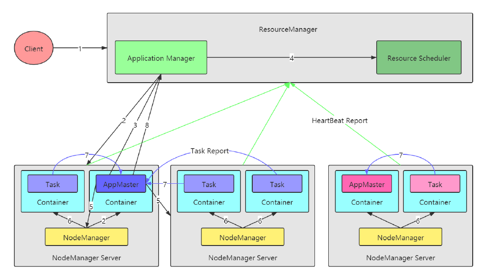
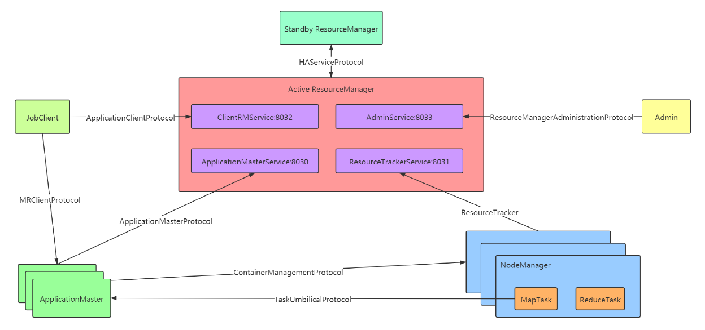
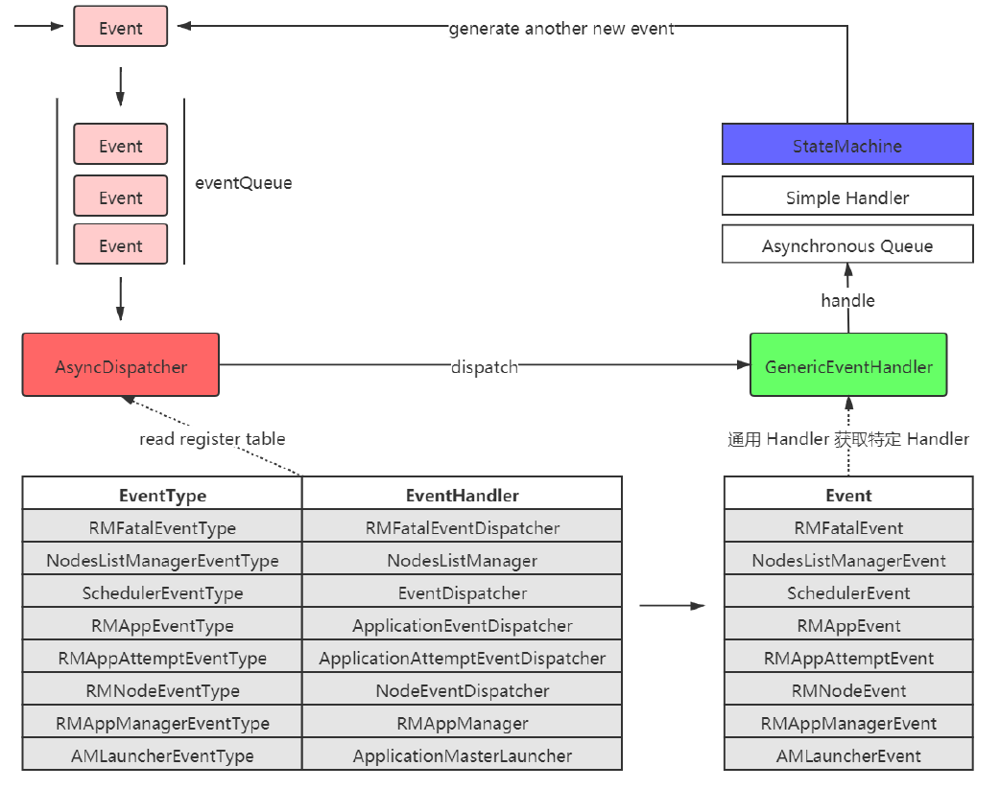
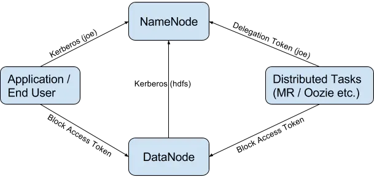
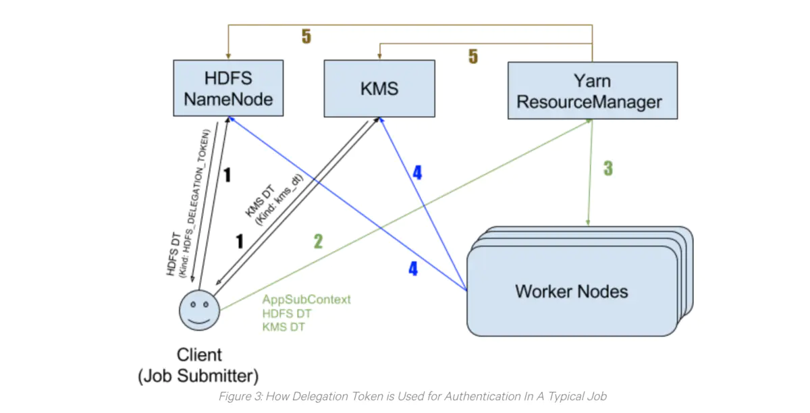

# Apache Hadoop Yarn

服务化（Service）+ 事件驱动（Event/Dispatcher），模块间通过事件联系，异步、并发，更适合大型分布式系统。

## 架构



## 组件

### Resource Manager

- 处理客户端请求
- 启动/监控ApplicationMaster
- 监控NodeManager
- 资源分配与调度

### Node Manager

- 单个节点上的资源管理
- 处理来自ResourceManger的命令
- 处理来自ApplicationMaster的命令

#### Yarn Shuffle Service

Yarn Shuffle Service作为线程运行在`NodeManager`进程中。


### Application Master

- 为应用程序申请资源，并分配给内部任务
- 任务调度、监控与容错


## 通信



### Yarn间通信

AM，RM，NM，Admin四个服务

- **ApplicationClientProtocol**（Client -> RM） **clients 与 RM 之间的协议**，如MR JobClient 通过该 RPC 协议提交应用程序、 查询应用程序状态等；
- **ResourceTracker**（NM -> RM）NM 与 RM 之间的协议， NM 通过该 RPC 协议向 RM 注册， 并定时发送心跳信息汇报当前节点的资源使用情况和
  Container运行情况。

- **ApplicationMasterProtocol**（AM -> RM）AM 与 RM 之间的协议， AM 通过该 RPC 协议向 RM 注册和撤销自己， 并为各个任务申请资源。
- **ContainerManagementProtocol**（AM -> NM）AM 与 NM 之间的协议， AM 通过该 RPC 要求 NM 启动或者停止 Container， 获取各个
  Container 的使用状态等信息。
- **ResourceManagerAdministrationProtocol**（RM Admin -> RM）Admin 与 RM 之间的通信协议， Admin 通过该 RPC 协议更新系统配置文件，
  例如节点黑白名单等。
- **HAServiceProtocol**（Active RM HA Framework Standby RM）Active RM 和 Standby RM 之间的通信协议，提供状态监控和 fail over 的 HA 服
  务；

### MapReduce间通信

- **TaskUmbilicalProtocol**（YarnChild -> MRAppMaster）YarnChild 和 MRAppMaster 之间的通信协议，用于 MRAppMaster 监控跟踪
  YarnChild 的运行状态，YarnChild 向 MRAppMaster 拉取 Task 任务信息。
- **MRClientProtocol**（JobClient -> ApplicationMaster）JobClient 和 ApplicationMaster 之间的通信协议。用于客户端拉取 Application 的执行状
  态，以及 Application 返回执行结果给 客户端。


## 事件

YARN 将各种处理逻辑抽象成事件和对应事件调度器，并将每类事件的处理过程分割成多个步骤，用有限状态机表示。AsycDispatcher 是 YARN 的中央异步调度器。在 ResourceManager中，几乎所有的事件都通过 **AsyncDispatcher** 进行事件的派发。



## 状态机

在 YARN 中，每种状态转换（doTransition 方法去执行状态转换，addTransition 注册状态转换）由一个四元组表示，分别是**转换前状态（preState）、**
**转换后状态（postState）、事件（event）和回调函数/转换器（hook = Transition）**。

YARN 定义了三种状态转换方式，具体如下：

- 一个初始状态、一个最终状态、一种事件：经过处理之后，无论如何，进入到一个唯一状态；
- 一个初始状态、多个最终状态、一种事件：不同的逻辑处理结果，可能导致进入不同的状态；
- 一个初始状态、一个最终状态、多种事件：多个不用的事件，可能触发到多个不同状态的转换；


为了便于用户查看这些状态机的状态变化以及相关事件，YARN 提供了一个状态机可视化工具，具体操作步骤如下。

1. 将状态机转化为 graphviz(.gv) 格式的文件，在源代码根目录下执行编译命令如下：

   `mvn compile -Pvisualize`

2. 使用可视化包 graphviz 中的相关命令生成状态机图，Shell 命令具体如下：

   ```shell
   # 需要先安装graphviz
   # yum install graphviz
   dot -Tpng ResourceManager.gv > ResourceManager.png
   dot -Tpng NodeManager.gv > NodeManager.png
   dot -Tpng MapReduce.gv > MapReduce.png
   ```

   

## 调度

心跳驱动调度（Heartbeat-Driven Scheduler）：RM管控的节点数量超过4000，无法将集群的利用率持续打满。


## IPC

IPC：进程间通信，Inter-Process Communication。

RPC：远程过程调用，Remote Procedure Call，实现 IPC。

### Engine

> Client 端 Socket，阻塞性；
>
> Server 端 Connection 使用 NIO；

Hadoop有两个`RPCEngine`实现：

- `WritableRpcEngine`：将请求序列化发送到Server端，通过反射查找匹配的方法，执行并返回结果；
- `ProtobufRpcEngine`：基于 protobuf 2版本；

**如何决定是WritableEngine还是ProtobufEngine**

- 通过`RPC.setProtocolEngine()`注册某个接口的Engine类型，如果没有注册，`RPC.getProtocolEngine`默认逻辑会走`WritableRpcEngine`；

### Server（服务端）

```java
RPC.Builder builder = new RPC.Builder(conf);
builder.setProtocol(MPDProtocol.class);
builder.setInstance(this);
builder.setBindAddress("0.0.0.0");
builder.setPort(0);
Server server = builder.build();
```


### Proxy(客户端)

```java
// addr是重点
RPC.getProxy(MPDProtocol.class, MPDProtocol.versionID, addr, conf);
```

YarnClient 获取 ApplicationReport # getRpcPort 获取 Application 的 Rpc端口，Client可以通过这个端口连接AM RPC；

AM 启动 Container时，通过将AM的Rpc端口设置Container的环境变量；


### 版本号

Client端依赖的Protocol的版本号，跟Server端的Protocol可能不一样。

- 接口中定义`long versionID = 234234L`的字段

- 或接口实现`VersionedProtocol`的接口


## 认证

Hadoop Auth是一个Java库，它由一个客户机和一个服务器组件组成，用于为HTTP启用Kerberos SPNEGO身份验证。

Hadoop默认支持的身份验证机制包括Simple验证(也称为伪身份验证)和Kerberos SPNEGO身份验证，还有其他的验证方式（LDAP等）。

默认的 Simple Auth 机制下，Client端提取本地OS login username发送给Server，Server毫无保留地接受username，并以此身份运行Job。

在2010年，安全特性被加入Hadoop（[HADOOP-4487](https://issues.apache.org/jira/browse/HADOOP-4487)），主要实现下面两个目标：

1. 拒绝未授权的操作访问HDFS中的数据。

2. 在实现1的基础上，避免太大的性能损耗。

   为了实现第一个目标，我们需要保证：

3. 任何一个客户端要访问集群必须要经过认证，以确保它就是自己声称的身份。

4. 集群中任何服务器，需要被认证为集群中的一部分。

   Kerberos被选作基础的认证服务。其它的机制，如：Delegation Token, Block Access Token, Trust等被加入当做Kerberos的补充。特别是Delegation Token机制被引入，其主要用以实现第二个目标（详情见下一节）。

Kerberos被选作基础的认证服务。其它的机制，如：Delegation Token, Block Access Token, Trust等被加入当做Kerberos的补充。特别是Delegation Token机制被引入，其主要用以实现第二个目标（详情见下一节）。



### RPC

Hadoop RPC中采用**SASL**（Simple Authentication and Security Layer，简单认证和安全层）进行安全认证，具体认证方法涉及Kerberos和DIGEST-MD5两种。

- **Kerberos**用于在客户端和服务器端之间建立一条安全的网络连接，之后客户端可通过该连接从服务器端获取一个密钥。由于该密钥仅有客户端和服务器端知道，因此，接下来客户端可使用该共享密钥获取服务的认证。
- 共享密钥进行安全认证（使用**DIGEST-MD5**协议），它只涉及认证双方而不必涉及第三方应用（比如Kerberos中的KDC），将基于共享密钥生成的安全认证凭证称为令牌（Token）。

### Hadoop中**Token**

在Hadoop中，令牌与Kerberos之间没有任何依赖关系，Kerberos仅仅是进行用户身份验证的第一道防线，**用户完全可以采用其他安全认证机制替换Kerberos**。因此，基于令牌的安全机制具有更好的灵活性和扩展性。

- Delegation Tokens在其它服务中的应用，如：Apache Oozie, Apache Hive, and **Apache Hadoop’s YARN RM**，这些服务都是用Delegation Tokens认证机制。
- Block Access Token：client在访问HDFS上的文件时，首先需要和NameNode通信，获取该文件的Block位置信息。然后直接和DataNode通信访问这些Blocks。访问权限的检查是在NameNode端完成。但是，**client直接访问DataNode中的Block数据，这也需要做权限认证**。Block Access Tokens就是用来解决这一问题。Block Access Tokens是由NameNode发布给Client，然后由Client发送给DataNode。Block Access Tokens的生命周期很短（默认10小时），并且不能更新。也就意味着如果一个Block Access Token过期，那么client必须重新获取一个新的token。
- Authentication Token：Hadoop中还有一种机制称为：Authentication Token，主要目的是实现一种更轻量级、高可扩展的认证方案。类似于client和server端的cookie。Authentication Tokens由server端授权，且无法更新以及仿冒他人。和Delegation Tokens不同的是，server端不需要单独存储Authentication Tokens.


#### Delegation Token

只使用Kerberos实现认证机制，但会有一定问题，尤其是应用在像Hadoop这样的分布式系统中。想像一下，对于每个MapReduce任务，如果所有的任务都需要使用TGT (Ticket Granting Ticket)通过Kerberos来进行认证，KDC（Kerberos Key Distribution Center）将很快成为系统瓶颈。


Delegation Tokens作为Kerberos的一个补充，实现了一种轻量级的认证机制。Kerberos是三方认证协议，而Delegation Tokens只涉及到两方。

Delegation Tokens的认证过程如下：

1. client通过Kerberos与Server完成认证，并从server获取相应的Delegation Tokens。

2. client与server之间后续的认证都是通过Delegation Tokens，而不进过Kerberos。  

考虑到高可用性，Delegation Tokens会被server进行持久化。HDFS NameNode将Delegation Tokens持久化到元数据中（又称为：fsimage and edit logs），KMS会将其以ZNodes形式持久化到ZooKeeper中。即使服务重启或故障切换，Delegation Tokens也会一直可用。

#### server端的Delegation Tokens

server端（HDFS NN和KMS）主要负责：

1. 发布Delegation Tokens，并保存用以验证。

2. 响应更新Delegation Tokens请求。

3. 当client端执行删除操作或token过期时，移除Token。

4. 通过验证client提供的Tokens和server端存储的token是否一致，来对client进行认证。

   Delegation Token主要由两部分组成：**public部分和private部分**，在Server端以<key，value>形式存储在hashmap中，其中public部分作为key，private部分作为value。

   只有Delegation Token的renewer(renew-interval，默认24小时）可以在token过期前进行更新操作。每次更新过后，token的过期时间会延长一个更新周期（renew-interval），直到**token达到最大生命周期**（默认7天）。

#### client端的Delegation tokens

client主要负责：

1. 从server端请求一个新的Delegation Tokens，请求同时可以指定token的更新者（renewer）。
2. 更新Delegation Tokens（如果client将自己指定为renewer），亦或请求别的组件更新token（指定的renewer）
3. 向server发送取消Delegation Tokens的请求。
4. 提供Delegation Tokens供server进行认证。


#### Example: Delegation Tokens的生命周期



图中通常有5个步骤：

1. client希望在集群中运行一个job，它分别从NameNode和KMS获取HDFS Delegation Token和KMS Delegation Token。
2. client将作业提交到YARN资源管理器（RM），同时提交的还有step1中获取的Delegation Token以及[ApplicationSubmissionContext](https://github.com/cloudera/hadoop-common/blob/cdh5-2.6.0_5.13.0/hadoop-yarn-project/hadoop-yarn/hadoop-yarn-api/src/main/java/org/apache/hadoop/yarn/api/records/ApplicationSubmissionContext.java#L38)。
3. YARN RM通过更新操作来核实接收的Token，随后，YARN启动job，并将其和Delegation Tokens一同分发到各个worker节点上。
4. 每个工作节点中的Task利用这些Token来进行认证，比如：需要访问HDFS上数据时，使用HDFS Delegation Token进行认证。需要解密HDFS加密区的文件时，使用KMS Delegation Token。
5. job结束后，RM则取消该job的Delegation Tokens。

#### 长时间运行的应用

Delegations Tokens超过其最大生命周期后无法被更新，那么如果一个任务需要运行时间比token的最大生命周期还要长怎么办？

- Hadoop无法通过现有的配置解决这一问题；

- 对于spark-submit提交的任务，Spark已经实现一些"神奇"的参数，Spark获取Delegation Tokens，并用它做认证，但Spark在token将要过期时并不会更新tokens，而是获取一个新的token。这就可以让应用永远地运行下去。**需要为spark应用生成Kerberos keytab文件。**

- 长耗时作业，你应该考虑利用[YARN documentation about long-lived services](https://hadoop.apache.org/docs/stable/hadoop-yarn/hadoop-yarn-site/YarnApplicationSecurity.html#Securing_Long-lived_YARN_Services)中描述的机制，或者为token更新者增加一些自定义逻辑，用来在现有tokens即将过期时，重新获取delegation tokens。

  