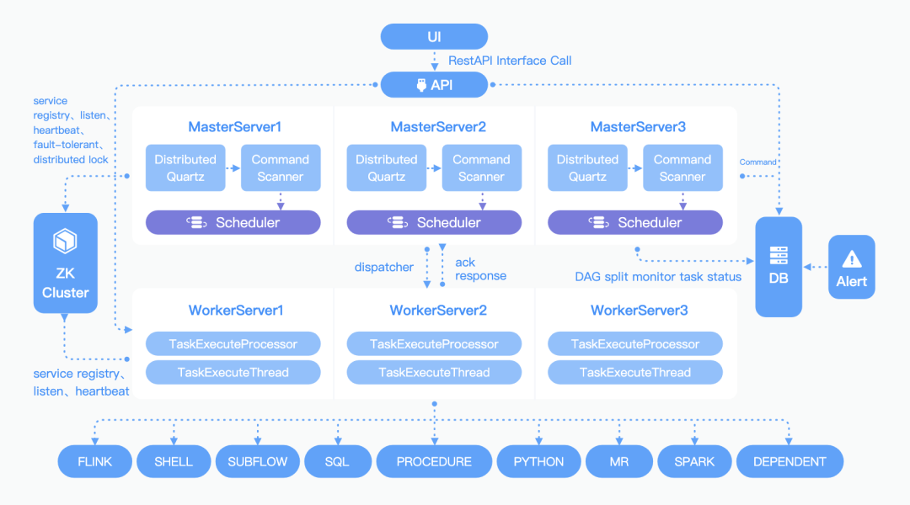

# Apache Dolphin Scheduler

DolphinScheduler 以 DAG（Directed Acyclic Graph，DAG）流式方式组装任务，可以及时监控任务的执行状态，支持重试、指定节点恢复失败、暂停、恢复、终止任务等操作。 解决数据研发ETL依赖错综复杂，无法监控任务健康状态的问题。

## 特性

- 可视化DAG，简单操作、实时查看，支持数万任务运行；
- 调用高可用，流程容错、失败重试、回滚、转移等；
- 丰富的任务类型，跨语言，自定义插件；
- 任务依赖，流程依赖；
- 任务日志/告警机制；

## 架构

## 概念

工作组（Worker组）：工作流运行时需要选定工作组，

- 可用于对不同的节点进行分类，比如某个节点具备大数据环境，必须运行在该节点上；

环境：绑定在 Worker 组，配置不同的环境变量信息；

## 调度

Master 分配任务至同一 worker 组的不同机器上，默认提供了四种算法：

- 随机（RANDOM）、轮询（ROUND_ROBIN）
- 平滑轮询（FIXED_WEIGHTED_ROUND_ROBIN）
- 动态平滑轮询 (DYNAMIC_WEIGHTED_ROUND_ROBIN) - 默认算法

同时 worker 配置了任务的最大并发数，以及 CPU/Memory 等上限控制新任务是否执行。