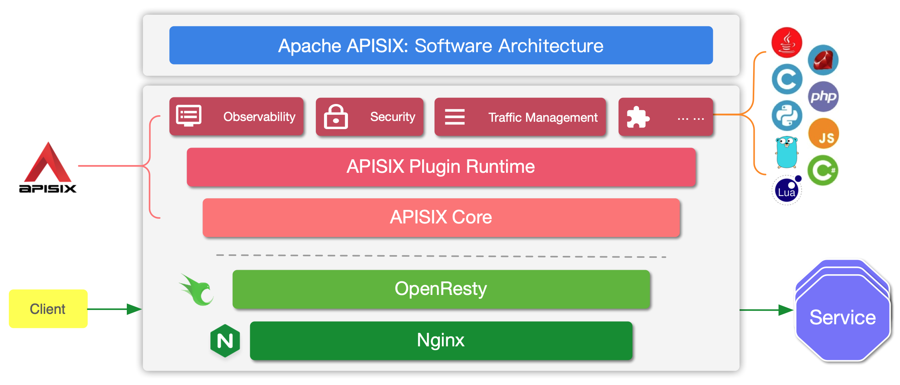

# Nginx 体系

## Nginx

 配置 只支持 websocket

```conf
location /websocket/ {
        proxy_pass http://myserver;
        proxy_read_timeout 360s;   
        proxy_redirect off;   
        # 核心配置三行：配置连接为升级连接
        proxy_http_version 1.1;
        proxy_set_header Upgrade $http_upgrade; 
        proxy_set_header Connection "upgrade";    
        
        proxy_set_header Host $host:$server_port;
        proxy_set_header X-Real-IP $remote_addr;
        proxy_set_header REMOTE-HOST $remote_addr;
        proxy_set_header X-Forwarded-For $proxy_add_x_forwarded_for;
}
```

支持http又支持 ws（可以见 [jupyterhub 的反向代理配置](https://jupyterhub.readthedocs.io/en/latest/reference/config-proxy.html)）

```conf
	#自定义变量 $connection_upgrade
    map $http_upgrade $connection_upgrade { 
        default          keep-alive;  #默认为keep-alive 可以支持一般http请求
        'websocket'      upgrade;     #如果为websocket 则为 upgrade 可升级的。
    }
 
    server {
        ...
 
        location /chat/ {
            proxy_pass http://backend;
            proxy_http_version 1.1;
            proxy_set_header Upgrade $http_upgrade; 
            # 此处配置上面定义的变量
            proxy_set_header Connection $connection_upgrade;
        }
    }
```

## [OpenResty](http://openresty.org/cn/installation.html)

是一款基于 NGINX 和 LuaJIT 的 Web 平台，提供[丰富的插件](http://openresty.org/cn/components.html)。

源码安装：参考官网 

**依赖**

```bash
yum install pcre-devel openssl-devel gcc curl
```

**编译**

```
./configure --prefix=/opt/openresty \
--with-luajit \
--with-http_iconv_module 
```

--with-http_postgres_module 需要安装 libpq

**安装**

```
make -j4
make install
```


## [Apache APISix](https://github.com/apache/apisix)

> APISIX is built on top of NGINX and LuaJIT (via OpenResty)

基于Etcd的watch机制，更新在毫秒级（推送的形式），而其他（如Kong）在5秒级别，且是拉取的形式。



APISIX has two main parts:

1. APISIX core, Lua plugin, multi-language Plugin runtime, and the WASM plugin runtime.
2. Built-in Plugins that adds features for observability, security, traffic control, etc.


